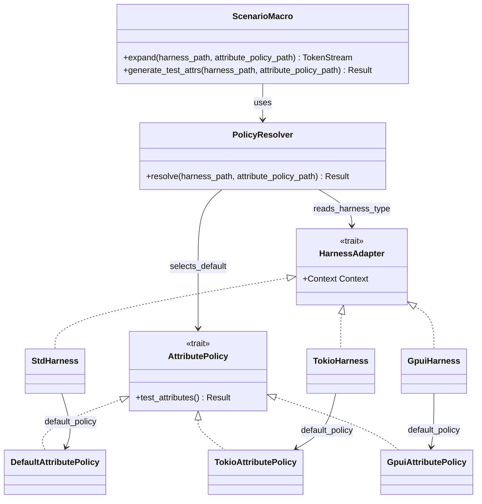

# Architectural decision record (ADR) 008: harness-led integration defaults

## Status

Proposed.

## Date

2026-03-26.

## Context and problem statement

`#[scenario]` and `scenarios!` currently expose two separate integration
parameters:

- `harness = path::ToHarness`
- `attributes = path::ToPolicy`

This split is architecturally coherent because the parameters control distinct
concerns. `harness` selects the runtime delegation boundary and any
harness-provided context injection. `attributes` selects the test attributes
emitted on the generated test function.

In practice, first-party integrations are usually configured in matched pairs:

- `TokioHarness` with `TokioAttributePolicy`
- `GpuiHarness` with `GpuiAttributePolicy`

Requiring both parameters at each call site is repetitive and invites drift
between the runtime behaviour and the emitted test attributes. At the same
time, the concepts are not fully interchangeable:

- `harness` without `attributes` is a valid and tested configuration,
- `attributes` without `harness` is also valid and tested, and
- procedural macros cannot evaluate arbitrary user-defined
  `AttributePolicy::test_attributes()` implementations at expansion time.

The decision is whether to keep the current fully explicit model, to make one
parameter subordinate to the other, or to replace both with a crate-level or
profile-level selector.

## Decision drivers

- Reduce repetition in the common first-party harness configuration path.
- Keep runtime behaviour and generated test attributes aligned by default.
- Preserve the architectural separation introduced by ADR-005.
- Retain support for valid `attributes`-only and `harness`-only use cases.
- Avoid relying on compile-time reflection that Rust procedural macros do not
  provide.
- Keep the extension model understandable for third-party harness authors.

## Options considered

### Option A: keep both parameters fully explicit

Retain the current surface as the canonical model and require users to spell
both parameters whenever they want both behaviours.

Pros:

- Maximum explicitness at call sites.
- No new inference rules or precedence questions.
- Keeps the current proc-macro implementation model unchanged.

Cons:

- Repetitive for first-party harnesses.
- Easy to specify a mismatched pair accidentally.
- Makes the common case feel heavier than it needs to be.

### Option B: make `harness` the lead parameter (proposed)

Keep the concepts separate internally, but when `harness = ...` is present and
`attributes = ...` is omitted, resolve a default attribute policy from the
selected harness. An explicit `attributes = ...` continues to override the
default.

Pros:

- Reduces boilerplate in the common case.
- Treats runtime selection as the primary user decision.
- Preserves independent `attributes`-only configuration where it is useful.
- Avoids crate-level ambiguity by continuing to reference concrete Rust types.

Cons:

- Introduces inference and precedence rules that must be documented clearly.
- Default inference can only be principled for known first-party harnesses
  unless a stronger compile-time metadata mechanism is added later.
- Users may assume all third-party harnesses automatically imply attributes,
  which is not true under current proc-macro constraints.

### Option C: replace both parameters with one integration selector

Replace `harness = ...` and `attributes = ...` with a single selector such as
`integration = rstest_bdd_harness_tokio` or a marker type exported by that
crate.

Pros:

- Potentially the shortest user-facing syntax.
- Presents integrations as cohesive packages.

Cons:

- A crate name is too coarse and becomes ambiguous once a crate exports more
  than one harness or policy.
- Rust macros cannot discover “the default harness” or “the default policy”
  from an arbitrary crate without an additional explicit contract.
- Obscures the fact that harness delegation and emitted test attributes are
  still separate architectural concerns.

| Topic                           | Option A | Option B | Option C |
| ------------------------------- | -------- | -------- | -------- |
| Common-case ergonomics          | Low      | High     | Medium   |
| Explicitness                    | High     | High     | Medium   |
| Supports `attributes`-only use  | High     | High     | Low      |
| Supports third-party extensions | High     | Medium   | Low      |
| Proc-macro feasibility today    | High     | High     | Low      |
| Risk of user confusion          | Medium   | Medium   | High     |
| Alignment of runtime and attrs  | Medium   | High     | Medium   |
| Long-term API clarity           | High     | High     | Medium   |

_Table 1: Trade-offs between configuration models for harness integrations._

## Decision outcome / proposed direction

Adopt Option B.

The architectural model remains two concepts:

- `HarnessAdapter` governs runtime delegation and harness-provided context.
- `AttributePolicy` governs emitted test attributes.

The user-facing configuration model changes to make `harness` the lead
parameter:

1. If neither parameter is specified, preserve existing default behaviour.
2. If `harness = ...` is specified and `attributes = ...` is omitted, infer the
   default attribute policy for that harness when one is known.
3. If `attributes = ...` is specified explicitly, it overrides any harness-led
   default.
4. If `attributes = ...` is specified without `harness = ...`, preserve that
   configuration as a supported escape hatch.

The exact precedence rules are:

1. An explicit `attributes = ...` selection always wins.
2. Otherwise, if an explicit `harness = ...` selection resolves to a known
   first-party harness mapping, use that harness-led default policy.
3. Otherwise, if the deprecated `runtime = "tokio-current-thread"`
   compatibility alias is active, use its Tokio current-thread hint.
4. Otherwise, fall back to the existing runtime-mode or synchronous default
   behaviour.

If both an explicit harness and the deprecated runtime alias are present, the
explicit harness remains authoritative; the runtime alias contributes only its
deprecation signal and does not change attribute selection.

For first-party harnesses, the intended defaults are:

- `StdHarness` -> `DefaultAttributePolicy`
- `TokioHarness` -> `TokioAttributePolicy`
- `GpuiHarness` -> `GpuiAttributePolicy`

For screen readers: The following class diagram shows the separation between
the `HarnessAdapter` and `AttributePolicy` traits, the first-party harness and
policy implementations, and the way `ScenarioMacro` delegates default-policy
selection to `PolicyResolver`.



_Figure 1: Harness-led default policy resolution between the macro layer,
resolver, harness types, and attribute-policy types._

This means the common Tokio and GPUI configuration can become:

```rust,no_run
use rstest_bdd_macros::scenario;

#[scenario(
    path = "tests/features/my_async.feature",
    harness = rstest_bdd_harness_tokio::TokioHarness,
)]
fn my_tokio_scenario() {}
```

while still allowing an explicit override:

```rust,no_run
use rstest_bdd_macros::scenario;

#[scenario(
    path = "tests/features/my_async.feature",
    harness = rstest_bdd_harness_tokio::TokioHarness,
    attributes = rstest_bdd_harness::DefaultAttributePolicy,
)]
fn my_customized_tokio_scenario() {}
```

This ADR does not recommend crate-name-only autodiscovery. If the project wants
a future single-knob abstraction, it should use an explicit marker type or
profile type rather than a bare crate name.

## Goals and non-goals

### Goals

- Make the common first-party harness path less repetitive.
- Treat runtime selection as the primary integration choice.
- Preserve explicit override capability for advanced cases.
- Keep the public model understandable to third-party harness authors.

### Non-goals

- Introduce dynamic plug-in discovery from dependency metadata.
- Infer arbitrary third-party attribute policies from trait methods at macro
  expansion time.
- Remove support for `attributes`-only configuration.
- Collapse `HarnessAdapter` and `AttributePolicy` into one trait.

## Migration plan

1. Extend policy-resolution support with harness-to-policy hints.
   Goal: provide one canonical place for first-party harness defaults.
   Deliverables:
   - Add harness-path hint resolution alongside existing policy-path hint
     resolution.
   - Document precedence between explicit `attributes`, inferred harness
     defaults, and legacy runtime compatibility behaviour.

2. Update macro code generation.
   Goal: let `generate_test_attrs` resolve policy hints from the selected
   harness when `attributes` is omitted. Deliverables:
   - Resolve a first-party default policy hint from known harness paths.
   - Keep explicit `attributes = ...` authoritative.
   - Preserve current deduplication rules for emitted test attributes.

3. Update user-facing documentation and behavioural coverage.
   Goal: make the preferred configuration obvious and verify it end to end.
   Deliverables:
   - Update the user guide and design document examples to lead with
     harness-only configuration for first-party integrations.
   - Add tests covering harness-led default attribute resolution and explicit
     override behaviour.

## Known risks and limitations

- Default inference is only robust for known first-party harness paths under
  the current proc-macro trust model.
- Third-party harness authors may expect inference to work automatically; the
  documentation must state clearly when explicit `attributes = ...` is still
  required.
- If a harness crate later exposes multiple harness types with different
  policies, the mapping must remain type-specific rather than crate-wide.
- The legacy `runtime = "tokio-current-thread"` compatibility path must retain
  a clear precedence relationship with harness-led defaults.

## Outstanding decisions

- Whether harness-to-policy mapping should live in `rstest-bdd-policy` beside
  policy-path hints, or in a dedicated helper module.
- Whether future third-party integrations should opt into inference through a
  marker type path, a registration macro, or remain explicit-only.
- Whether a later “integration profile” syntax is worth adding once the
  harness-led default model has settled.

## Architectural rationale

This direction keeps the clean boundary introduced by ADR-005: runtime
delegation and emitted test attributes remain separate responsibilities. It
improves ergonomics by defaulting the secondary concern from the primary one,
which is usually what users mean when they choose a harness.

Using `harness` as the lead parameter is also the better fit for Rust’s
proc-macro constraints. The macro can validate trait bounds for arbitrary
types, but it cannot evaluate arbitrary trait methods at expansion time. Known
first-party harness mappings are therefore a pragmatic middle ground: they
reduce repetition without pretending that macros can auto-discover semantic
defaults from arbitrary crates.
