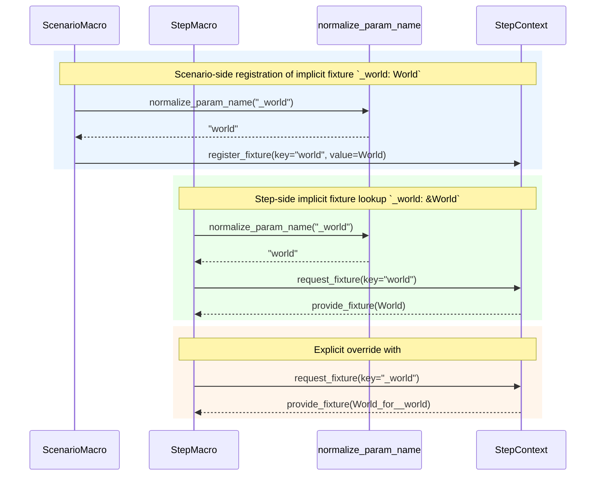

# Architectural decision record (ADR) 009: consistent implicit fixture-name normalization

## Status

Proposed

## Date

2026-04-11

## Context and problem statement

`rstest-bdd` already supports a single leading-underscore normalization rule in
some places:

- Step placeholder and scenario-outline header matching use
  `normalize_param_name()`.
- Scenario fixture registration now uses the same helper after `acd0f9a`, so a
  scenario parameter such as `_world: World` is registered in `StepContext`
  under the key `world`.

However, implicit fixture lookup is still inconsistent. When a step parameter
does not match a placeholder, wrapper generation records the raw fixture name
unless `#[from(...)]` is present. That means a step parameter such as
`_world: &World` still requires the fixture key `_world`, even when the
matching scenario-side implicit fixture is registered as `world`.

The result is an avoidable mismatch:

- Scenario registration normalizes `_world` to `world`.
- Step fixture lookup still treats `_world` and `world` as different names.
- Runtime validation then reports a missing fixture even though both macro
  layers started from the same Rust identifier with only a leading underscore
  difference.

The decision is whether to keep the current split behaviour, normalize
implicitly derived fixture names consistently at macro-expansion time, or add a
runtime fuzzy-matching rule.

## Decision drivers

- Make implicit fixture injection follow one predictable rule.
- Preserve `#[from(...)]` as the explicit, authoritative rename mechanism.
- Reuse the existing normalization helper and avoid duplicate logic.
- Keep runtime diagnostics deterministic and easy to reason about.
- Preserve the current double-underscore convention (`__world` means
  `_world`).

## Options considered

### Option A: keep the current split behaviour

Retain the current model where scenario fixture registration normalizes a
single leading underscore but step implicit fixture lookup does not.

Pros:

- No implementation work.
- Keeps current step-fixture naming fully explicit unless `#[from(...)]` is
  used.

Cons:

- Same implicit fixture name behaves differently in scenario and step paths.
- Produces surprising runtime missing-fixture errors.
- Requires users to learn an implementation detail rather than one coherent
  rule.

### Option B: normalize implicitly derived fixture names consistently at macro expansion time (selected)

Whenever a fixture key is derived implicitly from a Rust parameter name, apply
`normalize_param_name()`. Keep explicit `#[from(...)]` selections unchanged.

Pros:

- Reuses existing infrastructure and the rule already applied in
  `resolve_fixture_name()`.
- Keeps behaviour deterministic because names are normalized before runtime.
- Preserves `#[from(...)]` as the explicit escape hatch.
- Aligns step and scenario fixture plumbing without changing `StepContext`'s
  runtime contract.

Cons:

- Slightly broadens the meaning of implicit fixture injection.
- Requires documentation so users understand the single-underscore rule.

### Option C: add runtime fuzzy matching in `StepContext` or fixture validation

Keep macro output unchanged and teach runtime lookup to treat `_world` and
`world` as equivalent.

Pros:

- Fixes mismatches regardless of how macros recorded the fixture key.

Cons:

- Hides naming policy inside runtime lookup.
- Makes diagnostics and key enumeration less exact.
- Risks future ambiguity if more than one normalization rule is introduced.
- Duplicates policy that already exists in macro code.

| Topic                                | Option A | Option B | Option C |
| ------------------------------------ | -------- | -------- | -------- |
| Behavioural consistency              | Low      | High     | Medium   |
| Reuse of existing infrastructure     | Low      | High     | Low      |
| Runtime determinism                  | High     | High     | Medium   |
| Diagnostic clarity                   | Low      | High     | Medium   |
| Implementation complexity            | Low      | Medium   | Medium   |
| `#[from(...)]` remains authoritative | High     | High     | Medium   |

_Table 1: Trade-offs for implicit fixture-name normalization._

## Decision outcome / proposed direction

Adopt Option B.

The normalization rule becomes:

1. If a fixture key is derived implicitly from a Rust parameter name, apply
   `normalize_param_name()`.
2. If a fixture key is specified explicitly with `#[from(...)]`, use that name
   exactly as written.
3. Strip at most one leading underscore, so `__world` still maps to `_world`.

In practical terms:

- `#[scenario] fn case(_world: World) {}` should register `world`.
- `fn step(_world: &World) {}` should request `world` when `_world` is being
  treated as an implicit fixture rather than as a placeholder.
- `fn step(#[from(_world)] state: &World) {}` should continue to request
  `_world` exactly, because the user made an explicit naming choice.

This keeps the naming policy in macro expansion, where fixture keys are already
derived, and leaves runtime validation as an exact match over the generated
keys.

For screen readers: The following sequence diagram shows the proposed fixture
key flow for three cases: scenario-side implicit fixture registration,
step-side implicit fixture lookup, and an explicit `#[from(_world)]` override.
In the first two cases, both macro paths call `normalize_param_name()` and use
the normalized key `world` when interacting with `StepContext`. In the explicit
override case, the step macro skips normalization and requests `_world` exactly.

_Figure 1: Proposed fixture-key flow for implicit normalization and explicit
override handling across scenario and step macro paths._

## Implementation guidance

- Reuse `crate::utils::pattern::normalize_param_name()` rather than creating a
  second helper.
- Keep `resolve_fixture_name()` as the scenario-side implementation model.
- Apply the same helper when step wrapper extraction decides that an argument
  is a fixture and no `#[from(...)]` override is present.
- Do not normalize names carried by `#[from(...)]`.
- Preserve existing placeholder-matching behaviour, which already uses the same
  helper.

## Goals and non-goals

### Goals

- Make implicit fixture naming consistent between scenario and step macro
  layers.
- Remove the need for `let _ = value;` plus renaming solely to work around the
  split underscore behaviour.
- Keep runtime fixture validation simple and exact.

### Non-goals

- Change the meaning of explicit `#[from(...)]` annotations.
- Introduce broader name canonicalization beyond a single leading underscore.
- Add automatic renaming for arbitrary third-party naming conventions.

## Migration plan

1. Extend step wrapper extraction so implicit fixture names use
   `normalize_param_name()` when no explicit `#[from(...)]` is present.
2. Add unit and behavioural tests covering:
   - step implicit fixture lookup with `_world`,
   - scenario implicit fixture lookup with `_world`,
   - double-underscore preservation, and
   - explicit `#[from(...)]` precedence.
3. Update the user guide and design document so implicit fixture injection
   documents the single-underscore rule and its limits.

## Outstanding decisions

- Should single-underscore normalization apply to every implicit fixture
  context, or only to scenario and step parameter names?
- Is preserving `__world` as `_world` sufficient, or do any prefix edge cases
  need a stricter rule?
- Should any runtime-facing exceptions or diagnostics be documented alongside
  the compile-time normalization rule?

## Known risks and limitations

- Users who intentionally depended on the old mismatch for implicit step
  fixtures may see behaviour change, although explicit `#[from(...)]` remains
  available to preserve exact names.
- Documentation must be kept precise so users do not assume that all forms of
  punctuation or arbitrary prefixes are normalized.

## Architectural rationale

The project already has a dedicated helper for single-underscore normalization
and already uses it in placeholder matching and scenario fixture registration.
Extending the same rule to implicit step fixture lookup keeps the policy in one
place, preserves explicit overrides, and avoids smuggling fuzzy naming rules
into the runtime layer.
