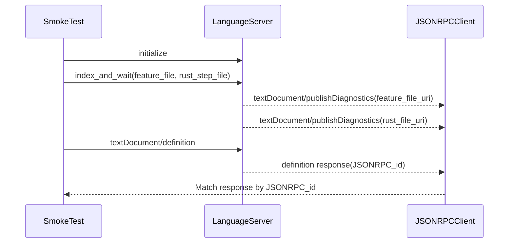

# Developer guide

For engineers and contributors working on the rstest-bdd codebase.  This guide
covers workspace tooling, test infrastructure, macro internals, and the
patterns used across crates — it is not a user-facing tutorial.

## GitHub Actions runner placement

Repository-owned Linux build-matrix jobs run on Ubicloud managed runners.
Windows jobs, the delayed-comment workflow, and every scheduled or
administrative job stay on GitHub-hosted runners. Ubicloud offers Linux runners
only, and the GitHub-hosted Windows queue has not been the contention problem
this migration targets.

| Workflow label        | Provider      | Operating system | Machine shape | Intended workload                  |
| --------------------- | ------------- | ---------------- | ------------- | ---------------------------------- |
| `ubicloud-standard-2` | Ubicloud      | Ubuntu 24.04     | 2 vCPU, 8 GB  | Linux build-and-coverage matrix    |
| `windows-latest`      | GitHub-hosted | Windows Server   | 4 vCPU, 16 GB | Windows build-and-coverage matrix  |
| `ubuntu-latest`       | GitHub-hosted | Ubuntu           | 2 vCPU, 7 GB  | Delayed comment and API-bound work |

*Table: runner labels used directly by rstest-bdd workflows.*

The `build-test` matrix resolves `runs-on` from `matrix.os`. Both Linux feature
lane uses `ubicloud-standard-2`; both Windows feature lanes use
`windows-latest`. The feature sets, default-feature policy, coverage behaviour,
and Windows `use-nextest: false` deadlock mitigation stay unchanged. The
CodeScene and coverage-ratchet conditions identify the Linux label explicitly,
so a runner reassignment must update those conditions and the workflow
contracts together.

The Linux lane sits on `ubicloud-standard-2`, the recipe's starting shape. The
constraint that shape imposes is disk, not memory or vCPUs: it offers 72 GB
against 145 GB on `ubicloud-standard-4`, and after the runner image and the
reclaim step about 31 GB remains against 104 GB.

Two silent job deaths were traced to that limit. `Publish dry run` produced no
output for roughly fifteen minutes and the step then failed with no error text
and no annotation, twice, both times on `ubicloud-standard-2`. The same
workload passed on `ubicloud-standard-4`. Three runs separate the variables:
the smaller shape failed both with sccache broken and with it working at a 94
percent hit rate, and the larger shape passed. Peak memory was 2,841 MiB and
3,294 MiB, so memory was never close to pressure on either.

The cause is several full build trees held at once. The lint step leaves a
debug tree, the two published-GPUI fixtures leave one each, the coverage run
builds an instrumented tree, and `make publish-check` then compiles the
workspace again into `target/package`. None of the first four has a consumer
once the coverage report exists, so the lane discards all of them before the
publish build starts, printing the disk before and after so the saving is
measured. sccache holds every object the publish build could have reused from
them, so nothing is recompiled that would not have been.

Every Linux job samples memory and disk every fifteen seconds from just after
checkout and reports the peak used memory, the peak used disk, and the least
free disk to both the job log and the job summary, even when the job fails.
Escalate to `ubicloud-standard-4`, and set the vCPU constant to 4, only if the
sampler shows the reclaimed shape still peaking within 5 GB of a full disk.

The reclaimed lane has never come close to that. Five consecutive runs on
2026-09-04, three on the pull request and two dispatched on trunk, measured:

| Run | Peak used disk | Least free disk | Peak memory |
| --- | --- | --- | --- |
| 33853939331 | 60,315 MiB | 12,995 MiB | 1,911 MiB |
| 33862077644 | 60,312 MiB | 12,998 MiB | 1,789 MiB |
| 33866984348 | 60,244 MiB | 13,066 MiB | 2,007 MiB |
| 33884577115 | 60,875 MiB | 12,435 MiB | 1,932 MiB |
| 33888769029 | 60,875 MiB | 12,435 MiB | 1,975 MiB |

*Table: sampler peaks on `ubicloud-standard-2` after the discard step landed.*

Each of those runs reclaimed about 10 GB, taking the root filesystem from
83 percent to 69 percent full immediately before the publish build. The trees
measured 5.7 GB for the instrumented coverage tree, 1.9 GB for the
published-GPUI end-to-end fixture, 1.6 GB for `target/debug`, and 993 MB for
the 0.2.2 fixture. Discarding the coverage tree alone would have left most of
the pressure in place.

`ubicloud-standard-2` is registered in `.github/actionlint.yaml` under
`self-hosted-runner.labels`. GitHub-hosted labels need no registration, and the
contracts require the registered set to match the labels the matrix names.

### Cache ownership

Ubicloud destroys each runner's disk at the end of the job, so there is no
persistent volume and every cache is an archive. Each mutable path therefore
has exactly one owner and one explainable key. Every key carries a `v1` schema
generation plus the operating system, architecture, and `runner.environment`,
so a self-hosted Ubicloud archive can never be restored onto a GitHub-hosted
image with a different GNU C Library baseline.

| Cache            | Paths                                                                                                             | Key inputs                       |
| ---------------- | ----------------------------------------------------------------------------------------------------------------- | -------------------------------- |
| Cargo registry   | `~/.cargo/registry`, `~/.cargo/git`                                                                               | toolchain, `Cargo.lock`, scope   |
| CI tool binaries | `~/.cargo/bin`, `~/.local/bin`, `~/.cache/uv`, `~/.local/share/uv`, Bun stores, `~/.cache/puppeteer`, `.ci-tools` | every tool version pin, scope    |
| Whitaker suite   | `~/.local/share/whitaker`                                                                                         | installer version, `dylint.toml` |
| Compiler cache   | `.sccache`                                                                                                        | toolchain, `Cargo.lock`, scope   |

Every lane uses `actions/cache/restore` and `actions/cache/save` pinned to
v6.1.0. Ubicloud's transparent cache intercepts that revision: the Ubicloud
cache listing on 2026-09-03 showed Linux keys from it reaching Ubicloud
storage, while v4.3.0 left nothing there and Windows keys land on GitHub as
expected. The deprecated `ubicloud/cache` fork is therefore unused, and one
action with one pin serves both providers.

uv reports a tool as installed from its environment store alone, so the
download store, the environment store, and the shim directory are restored
together by one owner rather than as three independent caches. The Whitaker
cache mounts only the installer-managed suite directory; the installer binary
itself lives in `~/.cargo/bin`, which the tool cache owns, and the tool key
includes the installer version so the two cannot disagree.

Caches are restored on every run. They are saved only by the default-features
lane on a `push` to `main`, and only when the restore missed. Every key carries
`runner.os`, so that gives one writer per key: the Linux build-test lane owns
the Linux keys and the Windows lane owns the Windows keys. Pull-request runs
therefore waste no time uploading archives they are not allowed to publish, and
`Unable to reserve cache` stampedes cannot occur. `ci.yml` triggers on `push` to
`main` for this reason: while it ran only on pull requests and manual
dispatch, nothing could ever populate a trusted generation, so every lane was
legitimately cold.

### One test execution per platform

The coverage job is the only test execution on Linux. It runs
`cargo llvm-cov nextest --workspace --all-targets --all-features` under
`RUSTFLAGS=-D warnings`, followed by one cheap
`cargo test --doc --workspace --all-features` step, because
`cargo llvm-cov nextest` does not run doctests and nothing else in CI did.
There is no uninstrumented workspace test run beside it, and a contract rejects
one.

| Lane                        | Platform | Executed set                                                                                                                     |
| --------------------------- | -------- | -------------------------------------------------------------------------------------------------------------------------------- |
| build-test, Linux           | Linux    | `llvm-cov nextest --workspace --all-targets --all-features`; doctests; Python suite; workflow contracts; published-GPUI scenario |
| build-test, Windows default | Windows  | `llvm-cov` without nextest, default features plus the diagnostics set                                                            |
| build-test, Windows strict  | Windows  | `llvm-cov` without nextest, `--no-default-features` plus strict validation                                                       |

*Table: what each surviving lane executes.*

There is no longer a Linux `strict-compile-time-validation` lane.
`strict-compile-time-validation = ["compile-time-validation"]` is purely
additive: it implies `compile-time-validation` and makes macro-expansion
warnings hard errors. It conflicts with no other feature, so `--all-features`
already enables it and a separate Linux lane executed nothing new. The Windows
lanes keep their split, because Windows uses a different driver and is not
covered by the Linux run.

A former `coverage-main.yml` ran a fifth job whose platform, feature set, and
driver matched the Linux lane. Once `ci.yml` gained its `push` trigger the two
executed the same suite on every merge, so that workflow is gone and its two
distinct behaviours moved into the surviving lane: it writes the ratchet
baseline, and it uploads to CodeScene on trunk while pull requests run the
changed-line check. CodeScene accepts an upload only for an analysed branch,
which is why the two modes are separate steps.

The baseline is written only on a push to `main`. Every run restores it and
measures against it, but a pull request, and a manual dispatch, publish
nothing. That guard lives in the pinned shared action rather than in this
workflow. Before it, each pull request advanced the baseline it was then
measured against, which a green run cannot show: a ratchet comparing a branch
against itself passes while coverage falls.

Two Linux steps look like test runs but are not part of the workspace suite and
stay. `make test-workflow-contracts` exercises the Python contracts in this
directory, and `make e2e-published-gpui` builds a standalone fixture workspace
from packaged crates to prove the published surface; neither is reachable from
`--workspace`.

The Linux step sets the coverage action's `all-features`, `all-targets`, and
`doctests` inputs. The action's own documentation gives `doctests` exactly this
purpose: it runs the uninstrumented doc-test pass with the same feature
selection so one coverage job can be a repository's only test execution. Passing
`all-features` together with a `features` list is rejected by the action, so
the Linux step names neither `features` nor `with-default-features`.

### Compiler cache

`sccache` writes to `SCCACHE_DIR`, which every workflow pins to
`${{ github.workspace }}/.sccache`, because the default location differs per
platform and is awkward to cache.

The Linux lanes use `sccache`'s GitHub Actions cache backend, pointed at
Ubicloud's runner-local cache proxy. A plain `run:` step never sees the Actions
cache credentials, because the runner exposes them to JavaScript actions only,
so a pinned `actions/github-script` step re-exports `ACTIONS_CACHE_URL` and
`ACTIONS_RUNTIME_TOKEN` and clears `ACTIONS_CACHE_SERVICE_V2` before the
workflow's own checksum-verified `sccache` binary starts. The re-export must
precede the installation step, which starts the `sccache` server when it zeroes
the counters.

Exporting `ACTIONS_RESULTS_URL` instead does not work, and the workflow must
not: that variable addresses GitHub's own results service rather than the
proxy, and every `sccache` write failed against it. Clearing
`ACTIONS_CACHE_SERVICE_V2` selects the v1 API that the proxy serves. The proof
that this reaches Ubicloud is `sccache/*` entries under the branch scope in
`ubi gh leynos/rstest-bdd list-cache-entries`.

The shared Rust setup is called with `use-sccache: false` on every lane, and
on the Linux lanes that is load-bearing rather than incidental. Measured on
`ubicloud-standard-2`, a later `run:` step does see the credentials the
re-export publishes; what breaks the backend is the shared action's own
`sccache` wiring. Its last act re-exports `ACTIONS_CACHE_SERVICE_V2=on`
together with GitHub's results URL and token to `GITHUB_ENV`, which clobbers
the re-export for every step that follows, so the `sccache` server then
addresses GitHub's results service and its writes fail. Keeping that step out
of the job is what makes the backend reach Ubicloud. Do not set
`use-sccache: true` here on the assumption that the workflow's own installer
is merely a duplicate.

The Windows lane has no backend of that kind because nothing else wires one. It
uses the workspace directory, restored and saved by the cache action with a
`restore-keys` prefix.
Setting the `RSTEST_BDD_SCCACHE_LOCAL` repository variable moves the Linux
lanes onto that same local directory, which is the documented fallback if the
backend ever stops reaching Ubicloud. The compiler-cache step is guarded so
that exactly one mechanism owns the directory on any given lane.

`SCCACHE_CACHE_SIZE` is 4 GB, sized for two build shapes while leaving room in
Ubicloud's 30 GB weekly per-repository quota for the registry, the tool
directory, and the Whitaker suite. Each lane zeroes the counters immediately
after installing `sccache`, and the final step publishes `sccache --show-stats`
in text and JSON to the job summary alongside every cache key, hit result, and
the backend in use.

Check each `main` run with `ubi gh leynos/rstest-bdd list-cache-entries`. It
must show the archive keys and the `sccache` objects on Ubicloud's side before
any warm-cache measurement is trustworthy. That was verified on 2026-09-03 at
23:15 UTC: 385 `sccache/*` objects sat under this branch's scope, and the same
run reported 2,372 hits, a 34 percent hit rate, and 5 write errors in 4,601.
The preceding run, which exported `ACTIONS_RESULTS_URL`, had failed all 6,934
of its writes and left nothing in either store.

### Parallelism and prerequisites

The workflow declares named vCPU constants for both shapes,
`UBICLOUD_LINUX_VCPUS` and `GITHUB_WINDOWS_VCPUS`, and derives
`CARGO_BUILD_JOBS` and `NEXTEST_TEST_THREADS` from the constant matching the
current runner. Nothing uses an unconstrained `-j auto`. The Python coverage
suite remains serial because its Whitaker integration invokes Cargo and would
otherwise contend on Cargo's package-cache lock. Ubicloud jobs declare
`timeout-minutes` because they register as just-in-time self-hosted runners, to
which GitHub's six-hour hosted limit does not apply.

Both runner images derive from GitHub's `actions/runner-images` templates, so
the tool inventory is close to identical, but neither ships `uv`, `sccache`,
`cargo-binstall`, or Bun. The pinned setup actions install Rust, `uv`, and
`cargo-binstall`; the workflow installs Bun and its own checksum-verified
`sccache`; and the published-GPUI step installs its development libraries
explicitly. The GitHub-hosted Windows image ships Git, Git Bash, and Chocolatey
but not GNU Make, which `make publish-check` needs on every lane, so the
Windows lane installs it before anything else. The matrix pins
`stable-x86_64-pc-windows-msvc`; relying on the runner's default Rust host can
select the GNU toolchain, whose distribution lacks the profiler runtime
required by coverage.

The Linux tools lanes install Merman 0.7.0 from its upstream release archive,
verify the pinned SHA-256 before extraction, and retain the verified binary in
the workspace tool directory. Cargo Binstall's quick-install mirror does not
publish a signature for that archive, so a signed-only Binstall command cannot
provide it without falling back to a forbidden source build.

The Ubicloud GitHub App is granted for every repository in the account, so no
per-repository provisioning step precedes a migration. The Ubicloud console
lists only repositories that have already run a job, so an absent entry means
this repository has not run one yet, not that the grant is missing. Do not
treat a missing entry as a configuration fault.

The job log header of an Ubicloud run prints `Ubicloud Managed Runner`, the
label, the image release, and the console URL, which is the admission evidence.
Correlate it with the GitHub jobs API for queue and execution timing, and with
the Ubicloud cache-entries listing to prove that an archive reached Ubicloud
storage rather than GitHub's. If a job on a `ubicloud-*` label has still not
picked up a runner after about five minutes, stop and investigate rather than
retrying: check the label spelling, the repository's self-hosted runner
settings, and the project's concurrency quota, because an over-quota job waits
silently and looks like an ordinary GitHub queue.

The mutation-testing and Dependabot auto-merge jobs call SHA-pinned reusable
workflows in `leynos/shared-actions`. Their callees continue to own runner
selection; callers must not add `runs-on`. The workflow contract suite protects
that ownership boundary alongside the matrix assignments, cache ownership, and
prerequisite ordering.

The Linux tools lanes also call the SHA-pinned shared `install-whitaker`
action. That action owns installer download and verification, validates and
normalizes the Cargo home, and invokes the installer by its absolute path. Keep
this boundary rather than recreating the install script inline: it makes the
tool location explicit across runner images and preserves the shared failure
metrics. The current Whitaker dependency releases require the GNU C Library
baseline supplied by Ubuntu 24.04, which is `ubicloud-standard-2`'s default
image. An Ubuntu 22.04 shape cannot execute those release binaries, and adding
the XDG user binary directory to `PATH` would only make an incompatible binary
shadow Whitaker's Cargo fallback.

## Workspace dependency policy

Keep workspace-local development and crates.io publication on the same manifest
surface by declaring shared dependencies in the root `[workspace.dependencies]`
table. First-party crates must use both `version` and `path` there, then
consume the dependency with `.workspace = true` from member manifests. The
`path` keeps local builds on the current checkout after a version has been
published, while the `version` gives Cargo the crates.io requirement it needs
when packaging a crate.

Publishable first-party crates must keep their package-time dependency graph
acyclic across normal, build, and development dependencies. `cargo package`
resolves development dependencies while preparing a crate, so a dev-dependency
cycle can block a live release even when the runtime dependency graph is
acyclic. When cross-crate tests need both the runtime API and procedural
macros, place those tests in the crate that already depends downstream, or in
an existing non-publishable example/test harness. Do not add a reverse
dev-dependency to a lower-level crate to host integration coverage.

Use the existing dependency-load-bearing crates before introducing or widening
edges. `rstest-bdd-patterns` owns shared pattern parsing, `rstest-bdd-policy`
owns shared runtime and attribute-policy classification, and
`rstest-bdd-harness` owns adapter contracts and test-staging helpers. The
procedural macro crate may depend on those shared crates, but it must not
depend on `rstest-bdd`; macro/runtime integration tests live under `rstest-bdd`
instead.

Do not restore root-level `[patch.crates-io]` entries for normal development.
Patches make local resolution differ from publish-time resolution and can hide
registry-only failures. If a temporary patch is required for a one-off
diagnostic, remove it before committing or configure `lading.toml` so
`lading publish` strips it from staged release workspaces.

The GPUI test shim follows the same pattern. The workspace dependency for
`gpui` points at `vendor/gpui` with a matching crates.io version, so local
tests use the stable-compatible shim. `lading publish` stages the workspace and
strips local patch entries before packaging, so the staged release surface uses
the upstream `gpui` dependency declaration before publication.

## Staging fixtures for trybuild tests

The `rstest-bdd-harness` crate exposes a `#[doc(hidden)]` module
`trybuild_staging` with two public helpers:

- `copy_file(source, destination)` — copies a single file, creating parent
  directories as needed.
- `copy_dir_tree(source, destination)` — recursively copies a directory tree,
  replacing `destination` if it already exists. Symlinks under `source` are
  rejected with an `InvalidInput` error to prevent escape or copy loops.

Both helpers are intended for use by `macro_compile` integration tests in the
Tokio and GPUI harness crates to stage `.feature` files into the trybuild
scratch directory before `TestCases::pass` / `compile_fail` are called. Do not
use these helpers outside test code.

`copy_dir_tree` rejects overlapping source and destination trees before it
removes or creates the destination. The overlap check canonicalizes
destinations whose final path does not exist yet by walking to the nearest
existing ancestor and replaying the missing tail. Missing parent chains and
parent-directory components such as `missing/../dst` must therefore preserve
their logical meaning, so a destination that resolves back to the source tree
is rejected even when part of the destination path is not yet present.

## Macro expansion snapshot helpers (`macrotest_support`)

The `rstest-bdd-harness` crate exposes a `#[doc(hidden)]` module
`macrotest_support` that provides shared helpers for the `macro_compile`
integration suites in the Tokio and GPUI harness crates. Both suites run
`macrotest` against committed `.expanded.rs` snapshots and need a common way to
gate snapshot refresh, perform substring assertions over snapshot contents, and
resolve per-crate trybuild scratch directories. The module is not part of the
supported public surface of `rstest-bdd-harness`.

### Snapshot refresh gating

`snapshot_refresh_is_enabled()` returns `true` only when the
`RSTEST_BDD_RUN_MACROTEST` environment variable is set and the `cargo expand`
subcommand is available on `PATH`. It gates `macrotest::expand_without_refresh`
calls so snapshot comparisons are skipped in ordinary CI and local development,
and only exercised during deliberate snapshot-refresh workflows.

### Snapshot substring assertions

- `assert_snapshot_contains(path, needles)` — asserts that each needle
  substring appears at least once in the snapshot file at `path`. Panics on I/O
  failure or when any needle is absent from the snapshot contents.
- `assert_snapshot_omits(path, needle)` — asserts that `needle` does not
  appear anywhere in the snapshot file at `path`. Panics on I/O failure or when
  the needle is found in the snapshot contents.

Both functions read the full snapshot into memory and use substring matching,
so they are intended for small, human-readable `.expanded.rs` snapshots.

### Trybuild crate root resolution

`trybuild_crate_root(manifest_path, target_subdir)` resolves the per-crate
trybuild scratch directory by querying `cargo metadata` for the workspace
`target` directory and appending `tests/trybuild/<target_subdir>`. It returns
`Result<PathBuf, Box<dyn Error>>` and is consumed by
`stage_trybuild_support_files` in each harness crate's `macro_compile.rs` test.

## Rust documentation policy and gates

The workspace denies missing documentation on Rust items and crate roots. It
also denies broken or private intra-doc links, bare URLs, invalid HTML tags,
invalid code-block attributes, and unescaped backticks through the
`[workspace.lints.rust]` and `[workspace.lints.rustdoc]` tables in
`Cargo.toml`. Workspace crates inherit these lints with
`lints.workspace = true`; keep new modules and public APIs documented instead
of suppressing a lint.

`make lint` builds the workspace documentation after Clippy with:

```makefile
RUSTDOCFLAGS="$(RUSTDOC_FLAGS)" $(CARGO) doc --workspace --no-deps
```

The Makefile exposes the flag value as
`RUSTDOC_FLAGS ?= --cfg docsrs -D warnings`, so callers may override it for
diagnostics. The committed default enables `docsrs`-conditional documentation
and promotes every Rustdoc warning to an error. `--workspace` checks every
member crate, while `--no-deps` keeps the gate focused on documentation owned
by this repository.

## Rust formatting and workspace lints (ADR-016)

The repository's formatter configuration is the root
[`.rustfmt.toml`](../.rustfmt.toml). It enables unstable options, including
`unstable_features`, import grouping, comment wrapping, and single-line
function formatting. Stable `rustfmt` ignores those options and can propose a
different workspace-wide reformat, so it must not be used for repository
formatting.

Install the pinned formatter toolchain before running formatting commands:

```bash
rustup toolchain install nightly-2026-08-07 --profile minimal --component rustfmt
```

The Makefile sets `FMT_TOOLCHAIN` to `nightly-2026-08-07` and runs
`$(CARGO) +$(FMT_TOOLCHAIN) fmt`. Use `make fmt` to apply formatting and
`make check-fmt` to verify it. Editor integrations and format-on-save must
invoke the same dated nightly `rustfmt`, rather than the stable formatter
selected by `rust-toolchain.toml`.

CI installs this toolchain explicitly and runs `make check-fmt` in the tools
lane. Keep the installation command, `FMT_TOOLCHAIN`, and editor configuration
in sync when changing the pinned date. This policy is recorded in
[ADR-016](adr-016-pinned-nightly-rustfmt.md).

The root `Cargo.toml` owns the workspace Clippy, Rust, and Rustdoc lint policy.
Every workspace member, including each example, must inherit it by declaring
the following in its `Cargo.toml`:

```toml
[lints]
workspace = true
```

Do not replace workspace inheritance with a copied lint table. New lint
exceptions must be narrow, justified, and kept in the appropriate source or
workspace configuration so that `make lint` and `make typecheck` exercise the
same policy across libraries, test-support crates, and examples.

`make test` separately compiles and runs documentation examples for every
workspace crate with all features enabled:

```makefile
RUSTFLAGS="$(RUST_FLAGS)" $(CARGO) test --doc --workspace --all-features $(BUILD_JOBS)
```

Keep the documentation build and all-feature doctest commands distinct: the
former validates generated documentation and links under the docs.rs
configuration, while the latter verifies that executable examples compile and
behave as documented.

For documentation changes, run `make fmt`, `make markdownlint`,
`make spellcheck`, and `make nixie`. `make markdownlint` also runs the spelling
gate.

## Fast development builds

Use `make dev-build` to compile debug binaries and `make dev-test` to run the
workspace tests with the opt-in Cranelift backend. Both targets pass
`tools/dev-fast/config.toml` explicitly to Cargo with `--config`; Cargo must
not discover this fragment through its automatic configuration paths.

The targets use the pinned `nightly-2026-08-16` toolchain and require the
`rustc-codegen-cranelift-preview` component. Install them with:

```sh
rustup toolchain install nightly-2026-08-16 \
  --component rustc-codegen-cranelift-preview
```

`DEV_FAST_CONFIG` overrides the configuration fragment path, and
`DEV_FAST_TOOLCHAIN` overrides the selected nightly when invoking either Make
target. On Linux, `mold` must also be available on `PATH`.

Cranelift is configured for debug development builds only. It trades runtime
performance for faster compilation; release, coverage, CI, and verification
builds continue to use the default LLVM backend and platform linker. Do not
copy this fragment into `.cargo/config.toml`, because Cargo applies that file
automatically to every build.

## nextest configuration (`.config/nextest.toml`)

cargo-nextest reads its configuration from `.config/nextest.toml` at the
workspace root; this is the only nextest configuration file the runner loads.
The file sets the timeout policy for the test suite:

- The default profile kills any test that runs past a 60 s `slow-timeout`
  (`terminate-after = 1`, 5 s grace period) and applies a 75 m `global-timeout`
  to the whole run. This allows the cargo-spawning group to run its bounded
  tests one at a time without exhausting the whole-suite budget. The global
  timeout must stay above the largest per-test budget below, or the run is
  killed before the test that budget exists for can finish;
  `trybuild_nextest_override_preserves_timeout_contract` enforces the
  ordering.
- A `[[profile.default.overrides]]` entry raises the `slow-timeout` to 180 s
  for `cargo-bdd::cli`, whose smoke tests spawn `cargo` to build fixture crates
  and can legitimately exceed 60 s on cold caches.
- A second override raises the `slow-timeout` further, to 20 minutes, for the
  trybuild-based compile-test binaries:
  `rstest-bdd-harness-tokio::macro_compile`,
  `rstest-bdd-harness-gpui::macro_compile`, `rstest-bdd::trybuild_macros`, and
  `rstest-bdd-server::workspace_discovery_compile`. These tests invoke
  `cargo build` against a large dependency tree, so their runtime tracks
  compiler-cache warmth rather than anything about the tests. Measured on
  `ubicloud-standard-2`, `step_macros_compile` exceeded the former 10-minute
  allowance with nothing in `sccache`, took 386.8 s with a partial cache, and
  about 190 s against a full one. The 20-minute allowance permits the full
  fixture set to rebuild on a cold cache without treating slow, healthy
  compiler work as a hung test. The strict 60 s default remains
  in force elsewhere.
- A third override raises the `slow-timeout` to 600 s for
  `rstest-bdd::feature_rebuild_invalidation`, whose three scenarios run nested
  `cargo` commands for dependency tracking, rebuilding, and file addition.
- All three overrides also place their binaries in a `cargo-spawning` test
  group (`max-threads = 1`), so `cargo-bdd::cli`, the four trybuild binaries,
  and `rstest-bdd::feature_rebuild_invalidation` run one at a time instead of
  contending for CPU with concurrent `cargo` builds. Their worst-case serial
  budget is 180 s + (20 m × 4) + (600 s × 3) = 6,180 s (103 m). That figure is
  a bound, not an expectation: it assumes every member of the group exhausts
  its own allowance in the same run, which has never happened. The 75 m
  `global-timeout` is deliberately below it, because a run that genuinely took
  103 minutes would be a fault worth failing rather than waiting out. The group
  bound only serializes execution; it does not cap it.

The feature-rebuild fixture-manifest rewriter is the sole owner of TOML
basic-string encoding for its rewritten absolute dependency paths. It must
escape backslashes and double quotes so the copied fixture remains valid on
Windows; use a TOML serializer for any broader configuration-writing need.

- A `long` profile (`--profile long`) relaxes the limits further (180 s
  `slow-timeout`, 30 m `global-timeout`) for deliberately slow local runs.

When adding a test binary that shells out to `cargo`, extend the relevant
override's `filter` expression rather than raising the default `slow-timeout`:
the tight default is what surfaces genuinely hung tests quickly.

## Test timeouts: four tiers, outermost last

Four independent timers can end a test run, and they are set in four different
places. A run that dies without an obvious cause is nearly always one of them,
so it is worth knowing which is which and in what order they can fire.

| Tier | What it bounds | Where it is set | Current value |
| --- | --- | --- | --- |
| Per-test `slow-timeout` | one test | `.config/nextest.toml` | 60 s default, 20 m for the trybuild binaries |
| nextest `global-timeout` | the whole test run | `.config/nextest.toml` | 75 m |
| Cargo watchdog | one `cargo` invocation, wall clock | `RUN_RUST_CARGO_WAIT_TIMEOUT` on the coverage steps in `ci.yml` | 5,400 s (90 m) |
| Job `timeout-minutes` | the whole job | `ci.yml`, job level | 150 m |

Each tier must sit above the one before it. If the watchdog sits below the
nextest global timeout, as it did until this was written, the run is killed
before the budget nextest was given can be used, and the failure looks like an
infrastructure problem rather than a slow test.

### The clocks do not start together

Comparing the configured numbers is not enough because two of the four timers
start at different moments and cover different work.

The watchdog starts when `cargo` starts, so it covers the build as well as the
test run. nextest's global timeout starts only once tests begin. A watchdog
merely larger than the global timeout is still pre-empting it whenever the build
takes longer than the difference between them. The watchdog is therefore sized
as the global timeout plus a cold-build allowance: 75 m + 15 m = 90 m. The
build phase inside `cargo` measured 3 m 31 s on run 33966769942 with a nearly
cold cache, so the 15 minutes is generous on purpose.

The job timer starts when the job starts, long before coverage and long after it
finishes. On the Linux lane, formatting, linting, type checking and the
published-GPUI end-to-end scenario run first, and the publish dry run follows.
Measured on run 33971821695: 14 m 03 s before coverage and 36 m 41 s after, so
just under 51 minutes of the job lies outside the watchdog's window. The job
ceiling is therefore 90 m + 55 m = 145 m, rounded to 150. A job ceiling merely
above the watchdog would cancel the run before the watchdog could report it, and
a cancellation discards the log that would have explained the overrun.

### The cargo watchdog is the tier nobody expects

The first three tiers are nextest's and the repository's. The watchdog belongs
to the shared `generate-coverage` action, which wraps the `cargo` invocation and
kills it after a wall-clock budget. It defaults to 1,800 s and it is easy to
forget, because nothing in `.config/nextest.toml` mentions it.

When it fires the step prints:

```text
::error::cargo did not exit within 5400s; killing. This is a budget, not a
detected hang: raise the cargo-wait-timeout input, or
RUN_RUST_CARGO_WAIT_TIMEOUT, if the build is legitimately slower. A cold
sccache store makes the first run on a branch compile everything inside this
budget.
```

The message is worth taking at its word. Nothing was detected as hung. A budget
expired, and on a cold compiler cache that is the expected outcome rather than a
symptom.

### What the current values are sized against

The Linux coverage step was measured on `ubicloud-standard-2`:

| Run | Step duration | Cache |
| --- | --- | --- |
| 33966133264 | 11 m 20 s | warm |
| 33975538044 | 22 m 16 s | typical |
| 33971821695 | 30 m 33 s | cold |

A dependabot bump to `syn` on 2026-09-05 served 9 % of Rust compile requests
from the cache and was killed by the watchdog at 1,800 s with 1,894 of 1,897
tests complete. The run immediately before it took 1,833 s and passed, because
the watchdog times `cargo` rather than the step. At 1,800 s the lane was not
close to its budget, it was straddling it, and whether a run survived was
decided by a few seconds of job setup.

`timeout_ordering_test.py` asserts the ordering by value, including the two
allowances above, so a change to any one tier that inverts it fails on the pull
request rather than in a run three weeks later. The job ceiling is compared per
job rather than against the tightest budget in the file, because an unrelated
job's ceiling has nothing to say about this one. It also requires every step that
invokes the shared coverage action to set the watchdog explicitly: a step that
loses its override inherits the action's 1,800 s default, which is how this went
wrong in the first place.

## `#[serial]`, `#[file_serial]`, and nextest test-groups

Stateful GPUI scenarios keep `#[serial]` even though this repository's
`make test` target runs under cargo-nextest. The annotation is required for
`cargo test`, where all tests in one binary share a process and the
`serial_test` mutex prevents stateful scenarios from interleaving on the same
test thread. Under nextest each test runs in its own process, so `#[serial]` is
redundant-but-harmless and exists for runner compatibility rather than nextest
scheduling.

Do not add a live test-group to `.config/nextest.toml` for the current stateful
GPUI suite. The repository has no shared cross-process resource that needs a
nextest-level mutex; process-per-test isolation is enough for the local
thread-local state. Add a test-group only when a new test resource is genuinely
global across processes or binaries, and keep the filter as narrow as the
resource allows.

Treat `#[file_serial]` as adopter guidance, not a repository dependency. It is
useful when a consuming workspace wants the exclusion to live on Rust tests
rather than in nextest configuration, but it requires `serial_test`'s
`file_locks` feature and does not mutually exclude `#[serial]` tests because
the two attributes use different lock mechanisms. If a future repository test
does need cross-process exclusion, choose one convention for that resource and
document the choice beside the test or nextest override.

## nextest on Windows: trybuild deadlock

nextest wraps test binaries in Windows Job Objects. Child `cargo` processes
spawned by `trybuild` and `cargo_metadata` inherit the write end of nextest's
capture pipe. Because Windows pipe semantics keep the read end open until all
holders of the write end have closed it, and because rustc spawns many
short-lived child processes that also inherit the handle, the pipe never closes
and nextest waits until its slow-timeout fires.

Mitigation:

- Continuous Integration (CI) sets `use-nextest: false` for all Windows
  matrix legs (see `.github/workflows/ci.yml`). Windows coverage runs use
  `cargo llvm-cov test` (libtest) instead.
- `step_macros_compile` (`crates/rstest-bdd/tests/trybuild_macros.rs`) guards
  its early return with `cfg!(windows) && env::var_os("NEXTEST_RUN_ID")`, so it
  only skips its trybuild and Clippy UI fixtures under nextest on Windows,
  where this deadlock applies. On Linux and macOS the fixtures run under
  nextest like any other test.
- `.config/nextest.toml` raises the `slow-timeout` for the trybuild
  compile-test binaries (including both `macro_compile` binaries,
  `rstest-bdd::trybuild_macros`, and
  `rstest-bdd-server::workspace_discovery_compile`) to 20 minutes as a
  local-development safety net. This does not fix the deadlock; it only delays
  termination to allow the build to complete on fast machines.
- `.config/nextest.toml` also places the `cargo-bdd::cli` and trybuild
  binaries in a `cargo-spawning` test group with `max-threads = 1`, so these
  cargo-spawning tests run one at a time rather than contending for the
  package-cache lock and build parallelism.
- Do not add `macro_compile`-style tests (tests that spawn `cargo` via
  `trybuild` or `cargo_metadata`) to nextest-managed binaries intended to run
  on Windows.

## Users-guide link validation (`scripts/check_users_guide_links.py`)

`docs/users-guide.md` is vendored into consumer projects, so its
cross-references to other documents in this repository use absolute GitHub URLs
(collected as reference-style definitions at the bottom of the file) rather
than relative paths. `scripts/check_users_guide_links.py`, run automatically by
`make lint`, keeps those URLs honest:

- Every repository reference must start with the canonical base URL recorded
  in the script's `BASE_URL` constant (currently
  `https://github.com/leynos/rstest-bdd/blob/main/docs/`). If the repository
  moves, the default branch is renamed, or the documents relocate, update that
  one constant and the reference block; the check pinpoints every definition
  that disagrees.
- Each link must resolve to an existing file under `docs/`, and any `#`
  fragment must match a heading anchor in the target document (the script
  derives anchors with GitHub's slug rules). Prefer heading fragments over
  `#L<n>` line anchors, which silently break on reflows.
- The check also fails if the guide contains no repository references at
  all, so a reformat cannot silently defang it.

Non-repository URLs (for example docs.rs links) are ignored. Unit tests live in
`scripts/tests/test_check_users_guide_links.py` and run with the Python suite in
`make test`. Issue #537 tracks generating the reference block from `BASE_URL`
so the base lives in exactly one place.

### Running the checker

Run it directly during development:

```bash
python3 scripts/check_users_guide_links.py [--root PATH]
```

Without `--root`, the checker derives the repository root relative to the
script itself, so it validates this checkout wherever it is invoked from.
`--root` exists to support the temporary-tree CLI integration tests and to
validate another checkout locally. `make lint` runs the checker using its
normal default root, so the gate always covers the working repository.

### Test split

- Unit and Hypothesis property tests live in
  `scripts/tests/test_check_users_guide_links.py`. Hypothesis exercises the
  slug-generation invariants (anchors stay lowercase, contain no spaces, use
  only word characters and hyphens, and are idempotent) and fenced-code heading
  handling, where generated headings expose parser edge cases that
  example-based cases miss.
- Cuprum subprocess/CLI integration tests live in
  `scripts/tests/test_check_users_guide_links_cli.py`. They verify
  process-level behaviour: exit status, stderr content, `--help` output,
  explicit `--root` against a temporary tree, and default-root execution.

The test-tooling rule for this script, and for scripts like it: use Hypothesis
for property and invariant coverage wherever generated inputs expose parser or
normalization edge cases, and use Cuprum for subprocess CLI behaviour rather
than Python's `subprocess` module.

### Intentional scope

The validator is deliberately retained and deliberately narrow. It is retained
because `docs/users-guide.md` is vendored into consumer projects, so a broken
absolute link can ship downstream undetected; manual review does not give
deterministic drift detection. Its scope is limited to repository-reference
link definitions in `docs/users-guide.md`, rather than expanding to every
documentation cross-reference in the repository. See
[ADR-014](adr-014-retain-users-guide-link-validator.md) for the decision record.

## GPUI mapping-table validation (`scripts/check_gpui_mapping_table.py`)

The vendored-to-published GPUI mapping table is duplicated in
`docs/users-guide.md` and `docs/rstest-bdd-design.md`. Update both copies
together whenever a GPUI test API shape changes. `make lint` runs
`scripts/check_gpui_mapping_table.py`, which anchors each table by its
surrounding heading and compares the four data rows after whitespace
normalization, so doc-vs-doc drift fails locally and in Continuous Integration
(CI).

This check does not prove the published column against crates.io. Local
workspace builds resolve `gpui` to `vendor/gpui`, while release validation now
runs through `lading publish`, which strips local patch entries in the staged
workspace. When the workspace bumps GPUI, re-verify the published column from
the published crate source before editing the table. One reproducible path is:

```bash
mkdir -p /tmp/rstest-bdd-gpui-check
curl -L https://static.crates.io/crates/gpui/gpui-${VERSION}.crate \
  -o /tmp/rstest-bdd-gpui-check/gpui-${VERSION}.crate
tar -xf /tmp/rstest-bdd-gpui-check/gpui-${VERSION}.crate \
  -C /tmp/rstest-bdd-gpui-check
sed -n '1,220p' \
  /tmp/rstest-bdd-gpui-check/gpui-${VERSION}/src/app/test_context.rs
```

If the crate's embedded repository commit is needed for cross-checking, inspect
the extracted manifest metadata and compare the relevant files against the Zed
repository with `git show <commit>:crates/gpui/src/app/test_context.rs`. Unit
tests for the table checker live in
`scripts/tests/test_check_gpui_mapping_table.py`.

## Published GPUI fixture check (`make check-published-gpui`)

`docs/users-guide.md` carries a "Published gpui 0.2.2 stateful step variants"
subsection whose snippets target the crates.io `gpui` crate rather than the
`vendor/gpui` shim. `tests/fixtures/published-gpui-0-2-2/` is a compile-checked
mirror of those snippets, so the published call shapes cannot silently drift
from the guide. Compare the vendored snippets, which are mirrored by the
executable regression suite
`crates/rstest-bdd-harness-gpui/tests/stateful_window.rs`.

Run the check with:

```bash
make check-published-gpui
```

which invokes:

```makefile
check-published-gpui: ## Compile the published gpui 0.2.2 documentation fixture
	# This nested workspace bypasses the root workspace's vendored gpui path.
	$(CARGO) check --locked --manifest-path \
		tests/fixtures/published-gpui-0-2-2/Cargo.toml
```

The fixture declares its own empty `[workspace]` table so that `gpui` resolves
from crates.io rather than inheriting the root workspace's path dependency. The
root `Cargo.toml` pins the shim:

```toml
gpui = { version = "0.2.2", path = "vendor/gpui", default-features = false, features = ["test-support"] }
```

so any crate inside the root workspace would otherwise pull it in. One
consequence: because `rstest-bdd-harness-gpui` depends on
`gpui.workspace = true` (the shim), the fixture cannot use `GpuiHarness`; it
declares bare `#[given]`/`#[when]`/`#[then]` steps that take
`#[from(rstest_bdd_harness_context)] context: &mut gpui::TestAppContext`
directly.

The fixture commits its own `tests/fixtures/published-gpui-0-2-2/Cargo.lock`,
separate from the root workspace lockfile, and the target passes `--locked`, so
the check is reproducible and a dependency bump has to be an explicit, reviewed
lockfile change rather than a silent resolution drift.

The check is deliberately `cargo check` only: the fixture is never executed, so
the `assert_eq!` calls inside its steps document the expected published
semantics but do not run. The real crates.io `gpui` pulls in the full graphics
and windowing stack (`blade-graphics`, Wayland and X11 client libraries,
`cosmic-text`, `bindgen`), none of which CI provisions; the `vendor/gpui` shim
exists exactly so the executable suite can run without them. Anyone changing
the fixture should treat compilation, not assertion, as the gate.

Unlike the GPUI mapping-table check described above, this is a dedicated CI
step invoked directly, not part of `make lint` or `make test`. It runs as a
standalone step in `.github/workflows/ci.yml`:

```yaml
- name: Check published GPUI documentation fixture
  if: ${{ matrix.tools && matrix.with-default-features }}
  run: make check-published-gpui
```

Consequently it does not run in a plain local `make lint`; developers touching
the published snippets should run it by hand.

## Published GPUI end-to-end scenario (`make e2e-published-gpui`)

`tests/fixtures/published-gpui-e2e/` executes the two scenarios from the
stateful GPUI playbook through `rstest_bdd_harness_gpui::GpuiHarness`. In
particular, `Reconstruct visual context from durable handles` opens a published
GPUI window, mutates its `Entity<CounterView>` through a reconstructed
`VisualTestContext`, and asserts both the incremented value and durable handle
identity. It therefore verifies the published `gpui 0.2.2` runtime behaviour,
rather than only compiling the documented call shapes.

Run the gate with:

```bash
make e2e-published-gpui
```

### Linux prerequisites

The published GPUI build requires these Linux development packages. Install
them before running the gate locally:

```text
libfontconfig1-dev
libwayland-dev
libx11-dev
libx11-xcb-dev
libxcb-render0-dev
libxcb-shape0-dev
libxcb-xfixes0-dev
libxkbcommon-dev
libxkbcommon-x11-dev
libxrandr-dev
pkg-config
```

Continuous Integration installs these packages only in the explicitly gated
`Run published GPUI end-to-end scenario` step; they are not prerequisites for
the ordinary stable-Rust workspace checks.

Its target first stages the packaged crates, then invokes the fixture from its
own directory:

```makefile
e2e-published-gpui: stage-published-gpui-e2e
	cd $(PUBLISHED_GPUI_E2E_DIR) && RUSTFLAGS="$(RUST_FLAGS)" $(CARGO) test --locked
```

The target packages `rstest-bdd-patterns`, `rstest-bdd-policy`,
`rstest-bdd-harness`, `rstest-bdd-macros`, `rstest-bdd`, and
`rstest-bdd-harness-gpui` in dependency order, then extracts their normalized
artefacts below `target/published-gpui-e2e/`. Cargo removes workspace path
dependencies when packaging, so the staged GPUI harness manifest keeps
`gpui = "0.2.2"` without the `vendor/gpui` path. The fixture's
`[patch.crates-io]` table points only the rstest-bdd crates at those extracted
artefacts; its own `gpui` dependency remains the crates.io package.

The fixture has an empty `[workspace]` table and a local `rust-toolchain.toml`
pinned to `nightly-2026-08-07`. The target changes into the fixture before
running `cargo test --locked`, allowing rustup to discover that local override.
This is deliberately separate from `make test`: the root workspace remains
stable-Rust compatible and continues to use the vendored shim for ordinary
runtime coverage. Continuous Integration installs the same nightly plus the
Wayland, X11, and xkbcommon development libraries only for the explicitly named
end-to-end step.

## `#[serial]`/nextest matrix validation (`scripts/check_serial_nextest_matrix.py`)

The runner matrix for `#[serial]`, cargo-nextest, `#[file_serial]`, and nextest
test-groups is duplicated in `docs/users-guide.md` and
`docs/rstest-bdd-design.md`. Update both copies together whenever the
repository changes its runner guidance. `make lint` runs
`scripts/check_serial_nextest_matrix.py`, which anchors both copies by the
"Test-runner parallelism and scenario state" heading and compares the two data
rows after whitespace normalization.

The check only enforces doc-vs-doc parity. It does not validate nextest or
`serial_test` behaviour directly; verify those facts from the upstream nextest
and docs.rs references before changing the matrix. Unit tests for the checker
live in `scripts/tests/test_check_serial_nextest_matrix.py`.

Link-checker and table-checker tests run with the Python suite in `make test`.
Issue #537 tracks generating the users-guide reference block from `BASE_URL` so
the base lives in exactly one place.

## Mutation-testing workflow contract tests

This repository runs scheduled, informational mutation testing through a thin
caller workflow, [`.github/workflows/mutation-testing.yml`][mutation-workflow],
which delegates to the shared reusable workflow
`leynos/shared-actions/.github/workflows/mutation-cargo.yml`. The heavy lifting
— running `cargo-mutants`, sharding, and summarizing survivors — lives in
`shared-actions`; this repository carries only declarative configuration. The
run is **informational only**: it never gates a pull request. Survivors are
reported through the job summary and downloadable artefacts so they can be
triaged into tests, not enforced as a blocking check.

This repository contains only the Cargo mutation-testing caller: no `mutmut`
caller or workflow exists, and neither `docs/roadmap.md` nor `docs/execplans/`
contains an applicable mutation-testing entry.

[mutation-workflow]: ../.github/workflows/mutation-testing.yml

The workflow runs in two modes. A **daily schedule** fires a change-scoped run
that mutates only the source files touched within the detection window, so
quiet days are cheap no-ops. A **manual dispatch** (the Actions "Run workflow"
control) mutates the whole workspace, fanned out across shards; select a branch
in that control to exercise a feature branch.

The caller passes a small set of configuration inputs, each carrying intent:

- `paths` — the change-detection globs (`crates/`) that decide whether a
  scheduled run has anything to mutate, bounding the scheduled run to the
  workspace's mutable source. The root `Cargo.toml` is a virtual manifest with
  no `src/`. Cargo metadata lists both `vendor/gpui` and `vendor/gpui-macros`
  as workspace members, but `paths: "crates/"` restricts scheduled change
  detection; because no `vendor/**` exclusion is configured, a manual
  whole-workspace run may process vendored code.
- `exclude-globs` — example applications, test-fixture crates
  (`cargo-bdd`'s minimal fixture workspace, and the trybuild/macrotest fixture
  and UI-expectation crates), and test-support modules compiled into `src/`,
  whose surviving mutants are noise rather than genuine test gaps. UI-test
  expectation crates must never be mutated.
- `extra-args` — `--all-features --test-workspace=true`, so feature-gated
  tests run against mutants and each mutant is tested with the whole
  workspace's suites, matching the repository's `make test` baseline
  (`--workspace --all-targets --all-features`). `--test-workspace=true` in
  particular avoids `cargo-mutants`' per-package default, which would miss
  coverage that the macro and policy crates receive only through dependent
  crates' trybuild and integration tests.

The `uses:` reference pins the shared workflow to a full 40-character commit
SHA rather than a branch or tag, so a force-push upstream cannot silently
change what runs here. The contract test checks the reusable-workflow path and
the full 40-hex SHA shape, without asserting a specific SHA value, so
Dependabot can update the pin without a lockstep test edit.

Because the caller is configuration rather than code, a contract test pins the
shape it must uphold, failing the pull request when the caller drifts —
repointing the pin at a branch, widening the token scope, or dropping a
configuration input — rather than letting the breakage surface only in a
scheduled run. Run it locally with `make test-workflow-contracts` (which invokes
`uv run --with 'pytest>=8' --with 'pyyaml>=6' pytest
tests/workflow_contracts -q`,
covering both this contract and the CodeScene coverage-caller contract in the
same directory). The test module
`tests/workflow_contracts/mutation_testing_test.py` validates:

- the `uses:` reference targets the correct `mutation-cargo.yml` path and has
  a full 40-character lowercase-hex commit SHA;
- job permissions are exactly least-privilege (`contents: read`,
  `id-token: write`);
- the workflow-level default token scope is an empty mapping;
- `concurrency` serializes runs per ref (`mutation-testing-${{ github.ref }}`)
  without cancelling one in progress;
- the triggers keep the daily 03:35 UTC schedule and a plain
  `workflow_dispatch` with no legacy branch input; and
- the `with:` block carries exactly the expected `paths`, `exclude-globs`,
  and `extra-args` shown above.

## Workflow pins and Dependabot

Dependabot owns the upgrade of GitHub Actions and reusable workflows, including
calls into `leynos/shared-actions`. Contract tests that assert a caller's exact
commit SHA create a lockstep dependency: every time Dependabot opens a bump PR,
the test fails until a human edits the pinned constant to match. That defeats
the purpose of automated dependency updates and turns a routine bump into a
manual chore.

Contract tests may still verify the *shape* of a reusable-workflow caller. They
must not verify the specific SHA value.

- Do assert the workflow references the correct reusable workflow path.
- Do assert the ref is pinned to a full 40-character commit SHA, not a
  mutable branch such as `main` or `rolling`.
- Do assert the expected `on:` triggers, least-privilege `permissions:`, and
  the inputs the caller relies on.
- Do not hard-code the current SHA value as an expected string. Match it with
  a pattern instead.
- Do not fail a test purely because Dependabot bumped the pinned SHA.

```python
import re

SHA_RE = re.compile(r"^[0-9a-f]{40}$")

def test_uses_pinned_full_sha(caller_step):
    ref = caller_step["uses"].split("@")[-1]
    assert SHA_RE.match(ref), f"expected a 40-hex commit SHA, got {ref!r}"
```

If a workflow's behaviour genuinely depends on a feature only present from a
particular commit onwards, express that as a comment or a changelog note, not
as a test assertion on the SHA string.

### Cargo update grouping

The Cargo Dependabot entry scans the workspace root and the standalone fixture
packages in `crates/cargo-bdd/tests/fixtures/minimal`,
`crates/rstest-bdd/tests/fixtures_macros`, `crates/rstest-bdd/tests/ui_macros`,
and `crates/rstest-bdd/tests/ui_lints`. Its `cargo-by-dependency` group uses
`group-by: dependency-name` so that, when Cargo can resolve one compatible
version, Dependabot updates that dependency across every scanned directory in a
single pull request.

Each standalone fixture manifest must declare the workspace MSRV with
`rust-version = "1.85"`. Keep these declarations synchronized with
`workspace.package.rust-version` when the repository MSRV changes; otherwise,
the fixture resolvers can accept different dependency versions and split a
cross-directory update.

## Spelling policy

`make spelling` enforces en-GB-oxendict spelling over tracked text with the
pinned Typos release. `make spellcheck` remains an alias for existing tooling,
and `make markdownlint` depends on the same gate, so prose checks cannot bypass
the repository-wide spelling policy.

The shared Markdown discovery used by `make markdownlint` and the spelling gate
excludes ignored `.vtcode` task metadata, keeping editor task files out of
project documentation validation.

The checked-in `typos.toml` is generated from the shared dictionary and the
repository overlay in `typos.local.toml`. Do not edit generated entries by
hand. Run `make spelling-config-write` after changing the overlay or after the
shared dictionary is updated, and use `make spelling-config` to verify that the
checked-in result is current. The builder keeps its downloaded shared base in
untracked cache files and refreshes the local copy only when the published
source is newer.

Repository exceptions must protect machine interfaces, formal upstream names,
foreign-language catalogues, or exact serialized fixtures. Use the narrowest
anchored pattern or path exclusion possible and explain why it is required. Do
not add broad word-level exceptions for prose. The consumer phrase checker also
rejects punctuation-sensitive shared corrections that single-token spelling
scans cannot enforce reliably.

## Test organization: harness-owned integration tests

Tokio and GPUI harness integration tests are co-located with their respective
harness crates:

Table: Test binaries for `rstest-bdd-harness-tokio` and
`rstest-bdd-harness-gpui`

| Crate                      | Test binary                  | What it tests                                                        |
| -------------------------- | ---------------------------- | -------------------------------------------------------------------- |
| `rstest-bdd-harness-tokio` | `harness_behaviour`          | Tokio harness adapter execution semantics                            |
| `rstest-bdd-harness-tokio` | `attribute_policy_behaviour` | Tokio attribute policy output                                        |
| `rstest-bdd-harness-tokio` | `scenario_macros`            | `#[scenario]` + Tokio adapter                                        |
| `rstest-bdd-harness-tokio` | `harness_led_defaults`       | harness-led default inference and runtime error paths                |
| `rstest-bdd-harness-tokio` | `macro_compile`              | trybuild compile-pass/fail for Tokio fixtures                        |
| `rstest-bdd-harness-gpui`  | `harness_behaviour`          | GPUI harness adapter execution semantics (feature-gated)             |
| `rstest-bdd-harness-gpui`  | `attribute_policy_behaviour` | GPUI attribute policy output (feature-gated)                         |
| `rstest-bdd-harness-gpui`  | `scenario_macros`            | `#[scenario]` + GPUI adapter (feature-gated)                         |
| `rstest-bdd-harness-gpui`  | `harness_led_defaults`       | harness-led default inference and runtime error paths                |
| `rstest-bdd-harness-gpui`  | `stateful_window`            | durable GPUI handles + visual context reconstruction (feature-gated) |
| `rstest-bdd-harness-gpui`  | `scenario_name_in_logs`      | GPUI step-panic diagnostics include scenario context (feature-gated) |
| `rstest-bdd-harness-gpui`  | `macro_compile`              | trybuild compile-pass for GPUI fixtures (feature-gated)              |

These tests were moved out of `rstest-bdd` in this release to decouple the core
crate from Tokio and GPUI dev-dependencies, making it publishable to crates.io
without carrying those dependencies.

The GPUI `harness_led_defaults` happy-path scenario is gated by
`native-gpui-tests` and uses `#[serial]`, matching the native GPUI runtime
suite. Its failing-harness error-path scenario does not require the native GPUI
runtime and runs without the feature gate.

The `Failing harness initialization propagates` scenario's panic assertion is
de-duplicated for harness integration coverage: the shared scenario assertion
macro lives under `crates/rstest-bdd-harness/tests/support/` and is included
from both `harness_led_defaults.rs` test binaries (Tokio and GPUI) to keep
runtime-error-path assertions aligned. The guard step remains local to each
test binary, so the `#[scenario]` macro can discover it from the test source.

`rstest-bdd-harness` exposes `FailingHarness` from its crate root when its
`testing` feature is enabled. This dependency-facing test API always returns a
synthetic `HarnessError::RuntimeBuildFailed`, allowing adapter crates to share
the generated scenario error-path assertions without duplicating a failing
adapter. `rstest-bdd-harness`'s own test targets (for example
`tests/harness_behaviour.rs`) reach it through a self dev-dependency in its
`Cargo.toml`:

```toml
[dev-dependencies]
rstest-bdd-harness = { path = ".", features = ["testing"] }
```

This keeps `FailingHarness` defined once, with no local duplicate in the test
binary, and works without requiring `--all-features`. Downstream crates enable
it only for tests:

```toml
[dev-dependencies]
rstest-bdd-harness = { workspace = true, features = ["testing"] }
```

The core macro trybuild test scopes `RUST_BACKTRACE` removal with
`temp_env::with_var_unset`. Trybuild compares compiler diagnostics verbatim,
and CI's inherited backtrace setting otherwise adds platform-specific output.
Keep `temp-env` available as a dev-dependency when building this test target;
direct environment mutation is unsafe under Rust 2024 and would violate the
workspace's unsafe-code policy.

### Fallible GPUI test boundaries

The `rstest-bdd-macros` scenario code generator owns the private
`adapt_fallible_gpui_boundary` helper. Its scope is limited to fallible
functions generated with the first-party GPUI test policy, for both regular
scenarios and outlines. It changes the generated signature to return `()` and
consumes the scenario result, panicking with a fixed message on `Err`. Unit
scenarios and std or Tokio boundaries must bypass the helper unchanged.

Scenario generators call `generate_test_attrs_with_boundary`, which owns
attribute-policy resolution and returns both the emitted attributes and whether
GPUI owns the outer test boundary. Keep policy resolution inside this helper so
regular and outline generation reuse one result rather than allocating path
segments twice. Callers outside scenario code generation should use the policy
interfaces instead of composing this private result.

The private `finalize_scenario_signature` helper is owned by regular and
outline scenario generation. It composes trait assertions, resolved test
attributes, GPUI boundary adaptation, and underscore-expect tokens while
leaving emission order under caller control. It clones signatures lazily, only
when adaptation requires mutation. Other code-generation paths must not reuse
it unless they share this complete boundary contract.

Compile-pass coverage belongs to the GPUI harness crate because it supplies the
`#[gpui::test]` boundary. Keep the synchronous, asynchronous, and outline
non-`Debug` error cases in the `tests/fixtures_macros` directory of
`rstest-bdd-harness-gpui`: `scenario_fallible_non_debug.rs` and
`scenario_fallible_outline_non_debug.rs`. Register them with that crate's
`macro_compile` test. Runtime coverage in `tests/scenario_macros.rs` must also
execute an `Err` result and assert the fixed boundary panic.

The boundary has a closed, branch-oriented state space: GPUI ownership,
fallible or unit return, synchronous or asynchronous execution, and regular or
outline generation, with direct, explicit-policy, and inferred-harness GPUI
selection. Maintain finite parameterized cases for each decision branch, plus
the compile and runtime fixtures above. Property testing and a full Cartesian
product are unnecessary because repeated combinations reach the same branches,
while randomized `syn` syntax adds no semantic states or useful shrinking
oracle.

### Bulk-migration cookbook reference suite

The user guide's "Bulk-migration cookbook" subsection is backed by a
harness-agnostic reference in the core `rstest-bdd` crate:
`tests/common/bulk_migration_steps.rs` is one shared durable-state step library
that `tests/bulk_migration_cookbook_a.rs` and `_b.rs` each include through a
`#[path]` module and bind to their own feature file under
`tests/features/bulk_migration/`. The binding files carry no step definitions;
that "zero steps in the binding" property is the reuse proof and must be
preserved. A trybuild compile-pass mirror,
`tests/fixtures_macros/scenario_bulk_migration_cookbook.rs`, compile-checks the
same shape and is registered in `run_passing_macro_tests`
(`tests/trybuild_macros.rs`). `step_macros_compile` runs this fixture under
nextest on Linux and macOS; it is skipped only under nextest on Windows, where
the Job Object capture-pipe deadlock applies (see "nextest on Windows: trybuild
deadlock" above), and must instead be validated with plain `cargo test` (or
`cargo llvm-cov test` for coverage).

Doc↔suite parity for this cookbook is guarded by prose, not a checker (the
subsection states "if a snippet drifts, the suite wins"), matching the
third-party harness cookbook convention rather than the doc↔doc parity scripts.
The GPUI durable-handle specialization of the pattern is documented in prose
and remains proven by the `stateful_window` binary above; keep the cookbook's
GPUI snippets bridged to published `gpui 0.2.2` through the
vendored-to-published mapping table, and keep edits near that table and the
`#[serial]`/nextest matrix green under `check_gpui_mapping_table.py` and
`check_serial_nextest_matrix.py`.

## First-party adapter dependency boundary

`rstest-bdd-harness` remains the owner of `HarnessAdapter`, `AttributePolicy`,
`ScenarioRunRequest`, and related base API types. The Tokio and GPUI adapter
crates re-export the subset of that API used by generated scenario code, so
downstream users of first-party adapters do not need to list
`rstest-bdd-harness` directly.

When updating macro code generation, keep this boundary intact:

- canonical Tokio harness and attribute policy paths should use the
  `rstest-bdd-harness-tokio` crate root for generated base API references;
- canonical GPUI harness and attribute policy paths should use the
  `rstest-bdd-harness-gpui` crate root for generated base API references;
- custom harnesses and custom attribute policies should continue to use the
  direct `rstest-bdd-harness` crate path and therefore require that dependency
  in the consuming crate.

## Fallback binary build in integration tests

`crates/cargo-bdd/tests/cli.rs` and `examples/todo-cli/tests/cli.rs` use a
two-phase strategy to locate test binaries, implemented by
`rstest_bdd_harness::binary_test_support::locate_or_build_binary`:

1. Try `assert_cmd::Command::cargo_bin("binary-name")`.
2. On failure, compute the expected debug binary path via
   `target_directory_for_manifest` and invoke `build_binary` if the binary is
   absent.

This pattern ensures tests run from a clean checkout without a separate
pre-build step in every CI job.

### `binary_test_support` API reference

```rust
use std::path::{Path, PathBuf};
use std::process::{Command, Output};

use rstest_bdd_harness::binary_test_support::BinaryLocateError;

/// Returns the expected debug binary path for `binary_name` given a target
/// directory root. Pure computation: no I/O.
pub fn binary_path_in_target_dir(
    target_directory: &Path,
    binary_name: &str,
) -> PathBuf;

/// Resolves the workspace target directory by running `cargo metadata`.
/// Performs I/O: spawns a `cargo metadata` subprocess.
pub fn target_directory_for_manifest(
    manifest_path: &Path,
) -> Result<PathBuf, cargo_metadata::Error>;

/// Locates `binary_name` or builds it if absent; returns a ready `Command`.
/// On failure, returns [`BinaryLocateError`] so callers can match on kind
/// (metadata, spawn, build output, or missing binary).
pub fn locate_or_build_binary(
    manifest_path: &Path,
    workspace_root: &Path,
    binary_name: &str,
) -> Result<Command, BinaryLocateError>;

/// Builds `binary_name` via `cargo build --bin <name>` in `workspace_root`.
/// Returns the captured `Output`; returns `Err` only when the subprocess
/// cannot be spawned.
pub fn build_binary(
    workspace_root: &Path,
    binary_name: &str,
) -> std::io::Result<Output>;
```

**Usage example** (from `examples/todo-cli/tests/cli.rs`):

```rust
use assert_cmd::Command;

fn locate_or_build_todo_cli_cmd() -> Result<Command, Box<dyn std::error::Error>> {
    let root = workspace_root();
    locate_or_build_binary(&root.join("Cargo.toml"), &root, "todo-cli")
        .map(Command::from_std)
        .map_err(|e| -> Box<dyn std::error::Error> { Box::new(e) })
}
```

The module is `#[doc(hidden)]` and is not part of the public crates.io API. Do
not use it outside test helpers.

## Macro implementation: fixture classification and normalization

Fixture name normalization happens during macro expansion, before generated
wrappers ask the runtime context for fixture values. This keeps scenario-side
fixture registration and step-side fixture lookup on the same key scheme, so an
implicit parameter such as `_world` registers and resolves as `world`, while
`__world` resolves as `_world`.

The helper `normalize_param_name()` owns that rule. Use it whenever macro code
derives a fixture key from a Rust parameter name without an explicit override.
Keeping the rule centralized avoids one side of macro expansion stripping a
leading underscore while another side keeps it.

Step wrapper argument classification enters through
`classify_fixture_or_step()`, the terminal classifier in the pipeline. It
strips any `#[from(...)]` attribute in place — rejecting a duplicate `#[from]`
and the `#[from = ...]` name-value form — and threads a `ClassificationContext`
(the mutable `extracted` results and remaining `placeholders` accumulators) into
`classify_by_placeholder_match()`. That helper first checks whether the
argument maps to a step placeholder. If it does not, the argument is classified
as a fixture. For implicit fixture arguments, it records the normalized fixture
name, so the generated wrapper asks for the same key that scenario fixture
registration produced.

Explicit `#[from(...)]` names are authoritative and bypass normalization. Use
that escape hatch when the intended fixture name starts with an underscore or
otherwise differs from the Rust parameter name. When the classifier must build
a new identifier for a normalized implicit fixture name, preserve the original
parameter span so diagnostics still point at the user-written parameter.

### Wrapper argument model

The wrapper generator keeps extracted parameters in the ordered `Arg` enum. Its
`as_fixture()` and `as_step()` methods expose borrowed, typed views without
requiring later stages to re-match the enum. `ExtractedArgs` provides the
corresponding iterators for fixture and step arguments.

Wrapper-local bindings pair those views with generated identifiers. In
particular, `BoundFixtureArg` carries a `FixtureArg` and its binding, while
`BoundStepArg` carries a `StepArg` and its binding. The same pattern is used
for struct, data-table, and doc-string arguments. Keeping the binding metadata
next to the typed view lets code generation pass the correct argument kind to
each declaration and parser.

The production `arguments::bind_arguments` helper owns the ordered traversal
that partitions extracted arguments and their generated bindings. Its tests
also use a private generic `bind_arguments` helper for the shared binding-count
check and zip, map, and collect sequence. The public test helpers remain
type-specific: `bind_args` calls `Arg::as_step()` and builds `BoundStepArg`,
while `bind_fixture_args` calls `Arg::as_fixture()` and builds
`BoundFixtureArg`. Their separate panic messages are part of the focused test
diagnostics and should remain at those type-specific boundaries.

Generated wrappers must also submit typed fixture requirement metadata for
runtime missing-fixture diagnostics. Keep `Step::fixtures` as the public
name-only compatibility field, and publish `FixtureRequirement { name, ty }`
through the hidden `StepFixtureRequirements` inventory sidecar whenever macro
code knows the requested Rust type. Manual `step!` registrations without that
sidecar remain valid and report `<unknown>` as the requested fixture type.

### Generated-wrapper Tokio bridge

`rstest-bdd` owns the hidden `__rstest_bdd_tokio` re-export of its Tokio
runtime dependency. Generated async step wrappers in `rstest-bdd-macros` are
its only permitted call-sites: they use the bridge to detect an active runtime,
build a current-thread fallback runtime, and create a `LocalSet`. Downstream
step code must not reference the bridge directly or depend on a particular
Tokio crate name.

The bridge composes only from macro-generated wrappers through the resolved
`rstest_bdd` crate path; it is not a general runtime facade and must not be
re-exported by harnesses or custom adapters. Keeping Tokio as an `rstest-bdd`
runtime dependency gives generated code one stable, hygienic source-level path
regardless of how a downstream crate names, re-exports, or otherwise obtains
Tokio. Although marked `#[doc(hidden)]`, changing or removing this bridge is a
breaking change for existing async-step macro expansions.

### Generated-wrapper step-return bridge

`rstest-bdd` owns the hidden `step_return` bridge that selects whether an
unhinted non-unit step return is a concrete `Result<T, E>` or an ordinary
payload. Generated wrappers in `rstest-bdd-macros` are its only permitted
call-sites: they probe the returned value, call the sealed normalizer by path,
and pass the original value exactly once. Downstream step code must not invoke,
implement, or re-export the bridge.

The bridge's regression coverage uses existing test-only development
dependencies: `anyhow` in `rstest-bdd` exercises the real `anyhow::Result`
surface, while `insta` in `rstest-bdd` and `rstest-bdd-macros` pins the emitted
dispatch tokens. Neither dependency is part of the production dependency graph.
Run the runtime dispatch table and emission snapshot with:

```bash
cargo test -p rstest-bdd --test step_return_dispatch
cargo test -p rstest-bdd-macros --lib \
  codegen::wrapper::emit::call_expr::tests
```

Refresh the macro snapshot deliberately by prefixing the second command with
`INSTA_UPDATE=always`, then review the changed snapshot before committing it.

The bridge composes only from macro-generated wrappers through the resolved
`rstest_bdd` crate path. The inherent `Result` selector and blanket value trait
must retain their shared by-value method name; that method-resolution
precedence is what recognizes aliases without caller-trait interference. Keep
wrappers around `Result` values opaque, and keep nested `Result` and
`impl Trait` returns on the explicit-hint path. Although marked
`#[doc(hidden)]`, changing or removing this bridge is a breaking change for
existing step macro expansions.

### Shared scenario-token assembly

The private `ScenarioTestConfig` trait in
`crates/rstest-bdd-macros/src/codegen/scenario/runtime/mod.rs` is the shared
pipeline for regular scenarios and scenario outlines. `TestTokensConfig` owns
one processed step set; `OutlineTestTokensConfig` owns the per-Examples-row
sets. Both implementations expose the common metadata and select their own
`CodeComponents` implementation.

`generate_test_tokens_for_config` owns the common assembly sequence: it
materializes the context iterators, creates scenario literals, wraps the user
block for its return and async semantics, and selects the harness or
non-harness assembly path. Keep behaviour shared here when it applies to both
scenario shapes.

`generate_test_tokens` and `generate_test_tokens_outline` remain intentionally
typed entry points. Keep outline-specific row substitution and case-index
handling in the outline path, and keep regular-step processing in the regular
path; do not widen the private trait into a public configuration API merely to
make those shapes look identical. The `reject_async_harness` check is applied
before both paths, so an `async fn` combined with `harness` is rejected for
regular scenarios and scenario outlines alike.

## Assertion vocabulary: `googletest`, `pretty_assertions`, and `insta`

This workspace's test suites use three assertion tools, each for a distinct
job. A failing assertion should say what property was being checked and what
was actually wrong, not merely that two opaque values differed.

`googletest` matchers are the default for structural assertions. Reach for
`assert_that!` (fatal), `expect_that!` (non-fatal; requires the test to be
marked `#[gtest]`), or `verify_that!` (returns `googletest::Result` and
composes with `?`). `matches_pattern!` asserts on an enum variant and its
fields at once, naming the variant and the offending field where
`assert!(matches!(...))` reports only `assertion failed`.
`err(displays_as(contains_substring(...)))` asserts that a `Result` is an `Err`
whose rendered message mentions a phrase, and prints the real diagnostic on
failure. `elements_are!` covers ordered container assertions,
`unordered_elements_are!` where order is not part of the contract, and `len`,
`is_empty`, `contains`, and `each` cover the obvious cases.

Composing with `rstest` requires the alias, not the primary attribute name:
`rstest` recognizes a following test attribute only when it is named `test`, so
write `#[googletest::test]` rather than `#[gtest]`, and put `#[rstest]` first.
Plain `#[gtest]` remains correct for tests that do not use `#[rstest]`.

`pretty_assertions::assert_eq!` is the tool for whole-value equality where a
structural diff is what the reader needs, such as comparing two argument
vectors or generated token streams. Import it per module with
`use pretty_assertions::assert_eq;`, which shadows the `std` macro for that
module only.

`insta` remains the tool for snapshot tests. `googletest` and
`pretty_assertions` are for in-body assertions; snapshots capture multivariant
output. These tools came in with the `#[harness_context]` classifier work
(roadmap 11.2.1); the fixtures there demonstrate the convention.

### The `#[harness_context]` classifier stage

The `#[harness_context]` marker (roadmap 11.2.1) requests the reserved harness
context fixture inside a step. `classify_harness_context()` runs first in the
per-parameter pipeline, before the placeholder short-circuit in `extract_args`,
for a specific reason: a parameter carrying the marker must bind the reserved
fixture key even if its name happens to match a step-pattern placeholder.
Running the classifier after the placeholder test would let the marker leak
into generated code as an unresolved attribute.

The classifier strips the marker, rejects combinations with `#[from]`,
`#[datatable]`, or `#[step_args]` (the `#[step_args]` guard lives in
`classify/step_struct.rs`), and synthesizes the fixture name from the shared
constant `rstest_bdd_policy::HARNESS_CONTEXT_FIXTURE` with the user's parameter
span preserved. The macro crate cannot import that constant from `rstest-bdd`
because the macro crate may not depend on the runtime crate (proc-macro
dependency cycle); `rstest-bdd-policy` exists to hold such cross-cutting
definitions for both sides. The runtime crate re-exports it as
`rstest_bdd::RSTEST_BDD_HARNESS_CONTEXT_FIXTURE`.

All three spellings — the `#[harness_context]` marker, the parameter named
`rstest_bdd_harness_context`, and `#[from(rstest_bdd_harness_context)]` — must
emerge from classification as the same `Arg::Fixture` under
`HARNESS_CONTEXT_FIXTURE`, so they generate byte-identical wrapper code. Both
the classifier unit tests and the wrapper equivalence tests in
`codegen/wrapper/equivalence_tests.rs` pin that identity, and an `insta`
snapshot trips if the emitted shape drifts.

## Shared policy crate (`rstest-bdd-policy`)

The workspace owns policy type definitions in `rstest-bdd-policy`.[^1] That
crate is the single source of truth for `RuntimeMode`, `TestAttributeHint`, and
their helper behaviour inside this workspace.

`rstest-bdd` re-exports both shared policy types from the runtime API to
preserve its public contract.[^2]

```rust
pub use rstest_bdd_policy::{RuntimeMode, TestAttributeHint};
```

The re-export lives in
[`crates/rstest-bdd/src/execution/mod.rs`](../crates/rstest-bdd/src/execution/mod.rs),
so downstream users can continue to depend on
`rstest_bdd::execution::{RuntimeMode, TestAttributeHint}` without importing the
policy crate directly.

The macro layer imports both policy types directly from
`rstest_bdd_policy`;[^3] it does not define local duplicates of those enums.
Keep this boundary intact to avoid drift between macro parsing decisions and
runtime execution behaviour.

Add new shared policy types in `rstest-bdd-policy` when a type must be used by
both the runtime and macro crates. Keep type definitions local to the crate
that uses them when sharing is not needed.

Regression tests enforce this boundary:

- Runtime re-export assertions.[^4]
- Macro import assertions.[^5]

Shared first-party path constants also live in `rstest-bdd-policy` so macro
parsing, harness adapters, and documentation can agree on canonical policy
locations:

- `STD_HARNESS_PATH`
- `TOKIO_HARNESS_PATH`
- `GPUI_HARNESS_PATH`
- `DEFAULT_ATTRIBUTE_POLICY_PATH`
- `TOKIO_ATTRIBUTE_POLICY_PATH`
- `GPUI_ATTRIBUTE_POLICY_PATH`

Use `resolve_test_attribute_hint_for_policy_path()` when macro arguments name
an attribute-policy plugin path directly. Use
`resolve_test_attribute_hint_for_harness_path()` when `attributes = …` is
omitted and a first-party harness path should imply its default
`TestAttributeHint`. Both helpers deliberately require exact first-party paths;
unknown third-party paths and paths with extra components return `None`, so
external harnesses must still opt in with an explicit attribute policy.

The architectural rationale explains this decision and its consequences.[^6]

[^1]: ../crates/rstest-bdd-policy
[^2]: ../crates/rstest-bdd/src/execution/mod.rs
[^3]: ../crates/rstest-bdd-macros/src/macros/scenarios/macro_args/mod.rs
[^4]: ../crates/rstest-bdd/src/execution/tests.rs
[^5]: ../crates/rstest-bdd-macros/src/macros/scenarios/macro_args/tests/mod.rs
[^6]: adr-004-policy-crate.md

## Internal test infrastructure

The async semantic behaviour tests use a shared support module at
`crates/rstest-bdd/tests/common/async_semantic_behaviour_support.rs`. Use the
helpers and types below when writing or extending semantic tests; do not access
`TEST_STATE` directly.

### Constants

Table: Async semantic behaviour support module constants

| Constant              | Value / purpose                                                                                                                                                    |
| --------------------- | ------------------------------------------------------------------------------------------------------------------------------------------------------------------ |
| `FEATURE_PATH`        | Relative path (from `CARGO_MANIFEST_DIR`) to the async semantic behaviour feature file. Pass to `assert_feature_path_suffix` and as `ScenarioRef::feature_suffix`. |
| `SKIP_SCENARIO_NAME`  | Canonical name of the skip-propagation scenario. Use wherever a scenario name is required for that scenario.                                                       |
| `ERROR_SCENARIO_NAME` | Canonical name of the error-propagation scenario. Use wherever a scenario name is required for that scenario.                                                      |

### Parameter structs

Prefer struct-literal syntax at call sites so that each field is labelled.

#### `ScenarioRef<'a>`

Bundles the two string fields that identify a scenario in assertion helpers.

```rust
ScenarioRef {
    name:           ERROR_SCENARIO_NAME,
    feature_suffix: FEATURE_PATH,
}
```

Fields: `name: &'a str`, `feature_suffix: &'a str`.

#### `StepRef<'a>`

Bundles the four string fields that identify a step in failure-context
assertions.

```rust
StepRef {
    keyword:       "When",
    text:          "a step fails with an error",
    function_name: "step_that_fails",
    handler_error: "deliberate failure",
}
```

Fields: `keyword: &'a str`, `text: &'a str`, `function_name: &'a str`,
`handler_error: &'a str`.

#### `BypassedStepQuery<'a>` *(requires `diagnostics` feature)*

Bundles the four fields needed to look up a bypassed-step record in the
diagnostics registry dump.

Fields: `scenario_name: &'a str`, `scenario_line: u32`, `step_pattern: &'a str`,
`reason: &'a str`.

### Helper types

#### `SemanticValue(i32)`

Newtype wrapper for an integer fixture value. Used to verify that async step
handlers can return a value that is injected as a fixture into subsequent steps.

#### `CleanupProbe`

A zero-size marker struct whose `Drop` implementation increments the per-thread
`cleanup_drops` counter. Inject it as a fixture and call
`reset_cleanup_drops()` before the scenario under test, then assert
`cleanup_drops() == 1` after it completes (or after `catch_unwind` returns for
failure paths).

### Assertion helpers

#### `assert_feature_path_suffix(actual, expected_suffix)`

Asserts that `actual` ends with `expected_suffix` using `Path::ends_with`.
Panics with a descriptive message on mismatch.

#### `assert_handler_failure_context(message, ScenarioRef, StepRef)`

Normalizes `message` (converts backslashes to forward slashes, strips Unicode
directional marks) and asserts it matches a regex covering the step keyword,
step text, function name, handler error, feature path suffix, and scenario
name. Panics on regex compile failure or mismatch.

#### `assert_bypassed_step_recorded(BypassedStepQuery)` *(requires `diagnostics` feature)*

Dumps the diagnostics registry, parses it as JSON, and asserts that
`bypassed_steps` contains an entry matching all four fields of the query.
Panics if no matching entry is found.

### Event utilities

Table: Per-thread event log helpers for semantic behaviour tests

| Function                           | Purpose                                                                           |
| ---------------------------------- | --------------------------------------------------------------------------------- |
| `clear_events()`                   | Resets the per-thread event log. Call at the start of any test that reads events. |
| `push_event(event)`                | Appends a string to the per-thread event log. Call from within step handlers.     |
| `snapshot_events() -> Vec<String>` | Returns a clone of the current event log without clearing it.                     |

### Cleanup utilities

Table: Per-thread cleanup-probe drop counter helpers

| Function                   | Purpose                                                                          |
| -------------------------- | -------------------------------------------------------------------------------- |
| `reset_cleanup_drops()`    | Resets the per-thread drop counter to zero. Call before the scenario under test. |
| `cleanup_drops() -> usize` | Returns the number of times `CleanupProbe` has been dropped in this thread.      |

### Line-number utility

#### `scenario_line(scenario_name) -> u32`

Reads `FEATURE_PATH` relative to `CARGO_MANIFEST_DIR`, scans for a `Scenario:`
or `Scenario Outline:` heading whose name matches `scenario_name`, and returns
the 1-based line number. Panics if the scenario is not found. Use this instead
of hard-coded line numbers so that tests remain valid when the feature file is
edited.

### Thread-local state and test isolation

All mutable state (`events`, `cleanup_drops`) is held in a single
`thread_local! { RefCell<TestState> }`. State is per-thread and does not leak
between concurrently running threads. Any test that reads from or writes to
shared state must:

1. Call `clear_events()` and/or `reset_cleanup_drops()` at the start.
2. Be annotated with `#[serial]` to prevent interleaving with other
   tests on the same thread pool.

## Implementing a HarnessAdapter

### Overview

`HarnessAdapter::run` returns `HarnessResult<T>`, which is an alias for
`Result<T, HarnessError>`. Earlier versions returned `T` directly. The new
return type is a breaking change that makes harness initialization failures
explicit instead of forcing harness implementations to panic. This closes issue
`#443`.

Custom harnesses should thread harness-specific state through
`HarnessAdapter::Context`. Use `()` when no context is needed; otherwise,
choose a concrete context type, construct it inside `run`, and pass it to
`ScenarioRunRequest::run(context)`. Step functions request the harness context
with the reserved fixture key `rstest_bdd_harness_context`, for example
`#[from(rstest_bdd_harness_context)] context: &MyHarnessContext`.
`rstest_bdd_harness_tokio::TokioTestContext` shows the first-party Tokio
pattern: `TokioHarness` sets `type Context = TokioTestContext`, captures the
active runtime handle, and passes that per-scenario context to the runner.

### Return-type contract

`Ok(value)` carries the scenario outcome produced by the runner. If the
scenario itself returns a `Result`, that scenario-level result is nested inside
the `Ok` arm:

```rust
HarnessResult<Result<(), StepError>>
```

`Err(HarnessError::RuntimeBuildFailed(_))` is reserved for harness
infrastructure failures, such as failing to construct a Tokio runtime before
the scenario can run.

### Migration guidance

Existing `HarnessAdapter` implementations should make the following changes:

- Change the `run` return type to `HarnessResult<T>`.
- Wrap previously direct return values in `Ok(...)`.
- Replace `panic!` on runtime-build failure with
  `Err(HarnessError::RuntimeBuildFailed(err))`. Prefer mapping the build error
  and using `?` where possible:

  ```rust
  let runtime = tokio::runtime::Builder::new_current_thread()
      .enable_all()
      .build()
      .map_err(HarnessError::RuntimeBuildFailed)?;
  ```

- For unit-context harnesses, switch from `request.run(())` to
  `request.run_without_context()`.

### Test-site guidance

Generated tests unwrap harness execution with:

```rust
unwrap_or_else(|err| panic!("harness failed to initialize scenario: {err}"))
```

Use the same pattern in handwritten tests instead of bare `.unwrap()`. This
keeps the concrete `HarnessError` visible in the panic message when a harness
cannot initialize its infrastructure.

### Staging: `copy_dir_tree` and missing destination parent chains

`trybuild_staging::copy_dir_tree(src, dst)` creates any missing parent
directories in the `dst` path before copying, so callers do not need to
pre-create the destination tree. For example, if `dst` is `tmp/a/b/c` and only
`tmp` exists, `copy_dir_tree` creates `tmp/a/b/c` and then copies the contents
of `src` into it.

To prevent accidental self-copies, `copy_dir_tree` resolves the canonical paths
of `src` and `dst` before copying and rejects any call where the resolved `src`
equals `dst`, `src` starts with `dst`, or `dst` starts with `src`. This check
is performed even when `dst` does not yet exist: the function walks up to the
nearest existing ancestor of `dst`, canonicalizes that ancestor, and re-appends
the missing tail components to obtain the resolved destination. This means that
paths such as `<src>/missing/../other` that traverse back into the source tree
through a not-yet-existing intermediate segment are still detected and rejected
with `io::ErrorKind::InvalidInput`.

### First-party policy path constants and resolver helpers

The `rstest-bdd-policy` crate exposes path constants and two resolver functions
that map a type-path to a `TestAttributeHint`.

#### Path constants

The following `&[&str]` constants identify the known first-party harness and
attribute-policy types:

Table: Path constants used for first-party policy and harness lookups

| Constant                        | Path segments                                          |
| ------------------------------- | ------------------------------------------------------ |
| `STD_HARNESS_PATH`              | `["rstest_bdd_harness", "StdHarness"]`                 |
| `TOKIO_HARNESS_PATH`            | `["rstest_bdd_harness_tokio", "TokioHarness"]`         |
| `GPUI_HARNESS_PATH`             | `["rstest_bdd_harness_gpui", "GpuiHarness"]`           |
| `DEFAULT_ATTRIBUTE_POLICY_PATH` | `["rstest_bdd_harness", "DefaultAttributePolicy"]`     |
| `TOKIO_ATTRIBUTE_POLICY_PATH`   | `["rstest_bdd_harness_tokio", "TokioAttributePolicy"]` |
| `GPUI_ATTRIBUTE_POLICY_PATH`    | `["rstest_bdd_harness_gpui", "GpuiAttributePolicy"]`   |

Use these constants wherever a first-party path must be compared or matched; do
not inline the string slices, as the constants are the canonical source of
truth and may be updated in future releases.

#### Resolver functions

Table: Resolver functions mapping a type path to a `TestAttributeHint`

| Function                                                                                   | Use                                                                                                                                                                                                                                          |
| ------------------------------------------------------------------------------------------ | -------------------------------------------------------------------------------------------------------------------------------------------------------------------------------------------------------------------------------------------- |
| `resolve_test_attribute_hint_for_policy_path(path: &[&str]) -> Option<TestAttributeHint>`  | Returns the hint for a known first-party attribute-policy type path. Returns `None` for any path that is not an exact match for a known first-party policy path. Do not use this function for harness paths.                                 |
| `resolve_test_attribute_hint_for_harness_path(path: &[&str]) -> Option<TestAttributeHint>` | Returns the hint for a known first-party harness type path, delegating to the policy-path resolver for the corresponding attribute-policy type. Returns `None` for any path that is not an exact match for a known first-party harness path. |

Both functions require exact matches against first-party paths. Paths with
wrong prefixes, extra segments, or partial matches all return `None`. Use
`resolve_test_attribute_hint_for_harness_path` when the call site has a harness
type path; use `resolve_test_attribute_hint_for_policy_path` when it has an
attribute-policy type path.

#### Adapter fallback diagnostics

The accepted toolchain and ownership contract for this boundary is recorded in
[ADR-017](adr-017-toolchain-aware-adapter-fallback-diagnostics.md).

The macro code-generation layer owns first-party adapter fallback diagnostics in
`codegen::adapter_fallback`. An unresolved path qualifies only when the
segment immediately before the adapter type is the canonical Tokio or GPUI
crate identifier. A path such as
`alias::rstest_bdd_harness_tokio::TokioHarness` qualifies, while
`custom::TokioHarness` must remain warning-free even when the Tokio adapter
crate is present.

Fallback resolution is pure: one resolution value holds the selected base API
crate path and optional first-party fallback metadata. Each macro expansion
resolves the supplied `harness` and `attributes` paths once at its own
boundary, then reuses that decision for runtime generation, trait assertions,
and diagnostic emission. The two supplied paths remain independent, so each
qualifying fallback reports exactly one diagnostic.

`#[scenario]` and `scenarios!` are separate boundaries.
`SharedAdapterResolutions` carries the resolved pair, and only the owning
boundary calls `emit_diagnostics`. `scenarios!` resolves before iterating the
discovered scenarios and threads the result through `ScenarioConfig`, so a
feature directory holding many scenarios still reports one diagnostic per
supplied path rather than one per generated test. Scenario generation beneath a
boundary must never re-resolve or re-emit: on nightly the emission is a
side-effecting `.emit()` call, so a second one would duplicate the warning
rather than be collapsed.

On nightly, the expansion boundary calls `proc_macro::Diagnostic::spanned` with
`proc_macro::Level::Warning`, then calls `.emit()`. Stable toolchains receive
the same message through a generated deprecated item because procedural-macro
warnings are not available there. The stable diagnostic is a warning by
default, while `#![deny(deprecated)]` escalates it to an error. Keep the
diagnostic text and the stable warning, stable error, and nightly warning
user-interface tests synchronized when changing this path.

`crates/rstest-bdd-macros/build.rs` calls `rustc_version::version_meta()` and
compares its channel with `rustc_version::Channel::Nightly` before setting
`rstest_bdd_nightly`. `crates/rstest-bdd-macros/src/lib.rs` enables
`proc_macro_diagnostic` only for non-test nightly builds. The Tokio fixture
runner uses `rustversion` attributes in
`crates/rstest-bdd-harness-tokio/tests/macro_compile.rs` to register stable and
nightly `trybuild` cases separately.

`utils::warnings::emit_warning` is the single internal warning boundary for
runtime-deprecation and registry diagnostics. It uses native
`proc_macro::Diagnostic` emission on nightly toolchains and is deliberately a
no-op on stable toolchains and in tests. Keep those call sites behind this
wrapper; adapter fallback diagnostics retain their separate generated
deprecated-item path on stable toolchains. `proc-macro-error3` supports other
fatal macro errors through `abort!`, `entry_point`, and `proc_macro_error`; it
does not emit adapter fallback warnings. ADR-017 records why
`proc-macro-error2` is not reintroduced: review identified it as unmaintained,
and it cannot provide the stable warning channel that the generated deprecation
diagnostic supplies.

### Third-party adapter crates

Third-party harness crates outside this workspace implement the same
`HarnessAdapter` and `AttributePolicy` contracts described here. The worked
example in the
[third-party harness adapter cookbook](users-guide.md#third-party-harness-adapter-cookbook)
shows the user-facing crate shape. Such crates should depend on
`rstest-bdd-harness` for the adapter contracts, keeping framework integration
decoupled from `rstest-bdd` and `rstest-bdd-macros`.

### Observability guidance

Harness implementations should emit a `tracing::error!` event before returning
`Err` from `HarnessAdapter::run`. Use structured fields so downstream test
runners and CI logs can filter by harness and scenario:

- `harness_type`: `std::any::type_name::<H>()` for the harness adapter type.
- `feature_path`: `request.metadata().feature_path()`.
- `scenario_name`: `request.metadata().scenario_name()`.
- `err`: the concrete `HarnessError`, formatted with `%err`.

Generated scenario delegation emits the same event and attaches scenario
context to the displayed error before panicking, so custom harnesses should use
matching field names for consistency.

### HarnessError extension

`HarnessError` is marked `#[non_exhaustive]`, so downstream code that matches
on it must include a `_` fallback arm. New variants may be added in minor
releases as more harness infrastructure failures become typed and inspectable.

## GpuiHarness panic-handling internals

The `rstest-bdd-harness-gpui` adapter wraps `gpui::run_test` in a thin
panic-aware envelope so that failing scenarios surface the originating feature
path, scenario name, and feature-file line in both the resumed panic payload
and observability sinks. The internals are intentionally private but worth
understanding when modifying the harness:

- `GpuiHarness::run_request_once` is the single entry point that drives
  `gpui::run_test`. It builds the per-scenario `TestAppContext`, constructs a
  `ContextCleanup` RAII guard, and wraps the runner closure in a
  `panic::catch_unwind(AssertUnwindSafe(..))` boundary. On the success path the
  result is stored in an output mutex; on the panic path the boxed `Any + Send`
  payload is rendered through `augmented_panic_message`, recorded via
  `record_and_write_panic_diagnostic`, leaked with `std::mem::forget` to
  neutralize any user-defined `Drop` that could double-panic, and finally
  re-raised as `Box<String>` through `panic::resume_unwind`. The caller injects
  the stderr writer (`AssertUnwindSafe<RefCell<W>>`) so I/O routing stays
  visible at the call site rather than hidden behind a no-argument default.
- `ContextCleanup` is an RAII guard that calls `finish_context` from
  its `Drop` impl. It is constructed immediately after the `TestAppContext` is
  built so the cleanup contract is honoured on both the success and the panic
  paths. `finish_context` drains the dispatcher with `run_until_parked`, calls
  `forbid_parking` on the executor, and quits the context, so parked timers or
  background work cannot leak into the next scenario.
- `augmented_panic_message` renders the boxed `Any + Send` payload via
  the workspace-shared `rstest_bdd::panic_message` downcast ladder (handles
  `&str`, `String`, common scalars, and falls back to an opaque
  `TypeId`-bearing description), then prepends the feature path, scenario name,
  and line drawn from `ScenarioMetadata`.
- `record_and_write_panic_diagnostic` calls `record_panic_event` to
  emit a `tracing::error!` record (with the harness, feature path, scenario
  name, scenario line, and rendered error as structured fields) and then writes
  the same message to the injected writer via `write_stderr_diagnostic_to`.
  Write errors are downgraded to `tracing::debug!` so an uncooperative stderr
  never escalates into a double panic.

Because the runtime mutates an `Rc`-backed `TestAppContext`, every test that
drives `GpuiHarness::run` from within the same process must be serialized under
`#[serial_test::serial]`. The harness exposes that constraint in its
module-level docs; both the in-module unit tests in
`crates/rstest-bdd-harness-gpui/src/gpui_harness/tests.rs` and the
feature-gated regression suite in
`crates/rstest-bdd-harness-gpui/tests/scenario_name_in_logs.rs` apply the
attribute to every `GpuiHarness::run`-driving test.

## Fallible feature-file discovery

`rstest_bdd_server::discovery::find_feature_files` is the public entry point
for collecting `.feature` paths under a workspace. It returns
`Result<Vec<PathBuf>, ServerError>` and propagates `ServerError::Io` from the
workspace and feature-directory traversal, including failures while reading
directory entries.

Callers must preserve this fallible boundary. Propagate the result with `?`
when the enclosing operation is fallible. At an error-reporting boundary, match
`ServerError::Io` when filesystem failures need distinct diagnostics, then
preserve or return the error. Do not convert an error to an empty list or
discard failed entries while retaining successful paths: that makes discovery
appear successful with an incomplete result.

Any directory-reader seam used to make metadata and iterator failures
deterministic in unit tests is private to workspace discovery; callers use
`find_feature_files` rather than that abstraction.

## Canonical diagnostic publish path

All Language Server Protocol (LSP) diagnostic publishing in `rstest-bdd-server`
flows through the canonical `publish_with` helper in
`crates/rstest-bdd-server/src/handlers/diagnostics/publish.rs`. It owns the
publish boundary exactly once: the client-socket guard, the path-to-URI guard,
`PublishDiagnosticsParams` construction, the `textDocument/publishDiagnostics`
notification, and failure logging.

- **Ownership:** the diagnostics handler layer owns the helper; its
  `pub(super)` visibility from the `diagnostics` parent module lets sibling
  publishers such as `diagnostics::rust_index` reuse it while keeping it
  internal to the diagnostics tree.
- **Permitted call-sites:** `publish_feature_diagnostics` and the save-pipeline
  `publish_rust_index_result_diagnostics` helper. New diagnostic publishers
  must delegate to `publish_with` with a compute closure rather than
  re-implementing the guards or notify call.
- **Composition rules:** the compute closure returns
  `Option<Vec<Diagnostic>>` — `None` skips publishing entirely (used when a
  feature file has no index, preserving previously published diagnostics), while
  `Some(vec![])` still publishes, so stale diagnostics are cleared.
  `prepare_publish` separates parameter construction from the notify side
  effect, so tests can pin payloads without a client socket.

The published payloads for representative feature and Rust files are pinned by
`insta` snapshots, and the publish invariants (count preserved, empty vector
still published) by a property test, both in `handlers/diagnostics/publish.rs`.
The boundary itself — that `publish_with` actually reaches (or, for a skip,
never reaches) `ClientSocket::notify` — is proven through a real client socket,
which `prepare_publish`-only tests cannot observe:

- **Missing-index skip** is a transport-backed unit test in
  `handlers/diagnostics/publish.rs`: a real `async_lsp` main loop supplies the
  `ClientSocket`, `publish_feature_diagnostics` is called for a path with no
  feature index, and the captured outgoing traffic contains a sentinel
  notification but no `publishDiagnostics` — so the absent index skips the
  whole boundary rather than clearing prior client diagnostics.
- **Emission and empty-vector clearing** for both feature and Rust files are
  exercised end-to-end against a live server by the `smoke_lsp` integration
  suite: an unimplemented/unused step yields a non-empty `publishDiagnostics`,
  and resolving it re-publishes an empty array for the same URI.

## Smoke LSP definition indexing sequence

The definition-location smoke test must complete workspace indexing before it
sends `textDocument/definition`. `index_and_wait` saves the feature file, then
waits for a `textDocument/publishDiagnostics` notification whose URI matches the
feature document just saved. It then saves the Rust step file and waits for a
second notification whose URI matches that Rust document. These ordered,
URI-specific acknowledgements establish that both indexing phases have
completed; the client then matches the resulting JSON-RPC response by request
identifier.

For screen readers: The smoke test initializes the language server, waits for
the feature and Rust step files to be indexed, requests a definition, and
receives the matching definition response through the JSON-RPC client.



*Figure 1: Definition-location smoke-test indexing and response sequence.*

## Bypassed-step recording contract

The runtime records steps that were not executed after a scenario requested a
skip through the public `BypassedScenario` descriptor and
`record_bypassed_steps` function. `BypassedScenario::new()` captures the
feature path, scenario name, and one-based scenario line. Callers can then
attach borrowed tags with `with_tags()` and an optional skip message with
`with_reason()` before passing the descriptor and the bypassed
`(StepKeyword, &str)` items to `record_bypassed_steps`.

The descriptor deliberately groups scenario identity and reporting metadata, so
the recording function has one scenario argument and one step iterator. The
former six-argument API and the separate `record_bypassed_steps_with_tags`
entry point were removed; generated code and manual callers must use the
descriptor form. With the `diagnostics` feature disabled, the function remains
callable and drops the iterator without iterating it, keeping generated
wrappers feature-independent.

## cargo-bdd scenario output formatting

`crates/cargo-bdd/src/output.rs` owns the rendering of skipped-scenario and
bypassed-step listings.

- **Options:** construct `ScenarioDisplayOptions` via the named constructors —
  `compact()` (`cargo bdd skipped`), `with_reasons()`
  (`cargo bdd skipped --reasons`), or `step_listing_appendix()`
  (`cargo bdd steps`). Do not build the struct with positional booleans at
  call-sites; add a new constructor when a new mode is needed.
- **Canonical formatter:** `format_scenario_line` renders one scenario line.
  The location, tag, and reason fragments come from the shared
  `format_location`, `append_tags`, and `append_reason` helpers — also used by
  `write_bypassed_steps` — gated by the display options. There are no per-mode
  `*_scenario_*` duplicates; new fragments belong in the shared helpers, gated
  in `format_scenario_line`.
- Rendered output per mode is pinned by `insta` snapshots, and the structural
  invariants (empty tag list emits no `[tags: …]` fragment; `:line` suffix
  appears only when requested and known; the leading separator newline requires
  both that it was requested and that at least one skipped scenario is
  rendered) by property tests, both in the `output::tests` module at
  `crates/cargo-bdd/src/output/tests.rs`. `write_scenarios` filters out
  scenarios that are not `Skipped` and returns early when none remain, so
  filtering out every skipped scenario suppresses the separator along with the
  listing.

## Attribute-policy conformance check

The canonical conformance test for `AttributePolicy` implementations —
`assert_attribute_policy_conformance::<P>(expected_rendered)`, in the
`rstest_bdd_harness::policy_conformance` module — pins three invariants for any
policy `P`:

1. **Emit** — the policy emits exactly the expected number of attributes.
2. **Render** — each attribute renders to the corresponding expected string,
   in order.
3. **rstest is first** — the first attribute path is `rstest::rstest`, so
   fixture expansion precedes the runtime-specific test macro.

Harness adapter crates (`rstest-bdd-harness-tokio`, `rstest-bdd-harness-gpui`,
and any future adapter) must exercise their policy through this helper,
supplying only the crate-specific expected rendered attributes; do not
re-implement the emit/render/ordering assertions per crate. New harness crates
get the policy contract for free by calling the helper from one `#[test]`.

The GPUI adapter's library target sets `test = false`, so an in-module
`#[cfg(test)]` block there would never be compiled or run. Its conformance test
therefore lives in the `tests/attribute_policy_behaviour.rs` integration
target, exercised under `--all-features` (which enables the crate's
`native-gpui-tests` feature) — the arrangement `make test` uses.

## Canonical step-keyword table

`crates/rstest-bdd-patterns/src/keyword.rs` drives the string ↔ `StepKeyword`
correspondence from a single `keyword_table![...]` invocation — the list of
`(rendering, variant)` pairs and the true source of truth. That macro generates
the `KEYWORDS` const table consumed by `StepKeyword::from_str`
(case-insensitive, whitespace-trimming parsing) and the match inside
`StepKeyword::as_str` (rendering), so neither side carries its own literal list.

- **Adding or renaming a keyword:** edit the `keyword_table![...]` invocation
  (and the enum variant) only — not the generated `KEYWORDS` const. Do not add
  parallel literals to `as_str`, `from_str`, or call-sites.
- **Round-trip contract:** for every variant `kw`,
  `StepKeyword::from_str(kw.as_str()) == Ok(kw)`; parsing accepts any ASCII
  case permutation and surrounding whitespace. The contract is pinned by the
  property suite in `crates/rstest-bdd-patterns/tests/keyword_props.rs`.
- Entries store the canonical title-case rendering used in generated output
  and diagnostics.

## Registry lookup usage-marking invariant

Every public step-lookup function in `crates/rstest-bdd/src/registry/`
(`lookup_step`, `find_step`, `lookup_step_async`, `find_step_async`,
`lookup_step_async_with_mode`, `find_step_async_with_mode`, and
`find_step_with_metadata`) funnels through the canonical private helper
`mark_and_project` in `registry/mod.rs`. The helper performs the `mark_used`
bookkeeping exactly once and applies the caller's projection to the resolved
`Step`.

- **Invariant:** every lookup that returns `Some` marks exactly the resolved
  step as used (feeding the unused-step diagnostics behind `cargo bdd`); a
  lookup that returns `None` marks nothing.
- **Permitted call-sites:** the public lookup wrappers in `registry/mod.rs`
  and `registry/async_lookup.rs`. New lookup variants must resolve a step (via
  `resolve_exact_step` / `resolve_step`) and pass it through
  `mark_and_project`; calling `mark_used` directly from a lookup is a bug.
- The invariant is pinned across all variants by the property suite in
  `crates/rstest-bdd/tests/registry_mark_used_props.rs`. A `kani` harness was
  considered and omitted: the registry is backed by link-time `inventory`
  registration and a lazily built hash map, which a bounded harness cannot
  model cheaply, and the property suite already exercises every variant against
  hit and miss lookups.

## Internal APIs and tooling (ADR-010 to ADR-013)

ADR-010 is accepted and implemented build-tooling work. ADR-011 records
historical scenario-state work that did not ship. ADR-012 is accepted and
implemented in v0.7.0, while ADR-013 is accepted and governs the current
Whitaker lint gate. They are summarized here so the decisions are discoverable
from the developer guide; the ADRs remain the authoritative source, and the
planning rationale lives in
[`docs/execplans/adopt-v0-6-0-beta2-feedback.md`](execplans/adopt-v0-6-0-beta2-feedback.md).

### Historical scenario-state helper proposal (ADR-011)

[ADR-011](adr-011-first-party-scenario-state-and-cleanup.md) proposed a
first-party replacement for the hand-rolled thread-local `RefCell` plus `Drop`
cleanup guard used by stateful GPUI scenarios under v0.6.x. The proposal did
not ship and was superseded by ADR-012 before implementation:

- A generic `ScenarioStore<T>` core would have lived in `rstest-bdd`, exposing
  `set`/`with`/`with_mut`/`take`/`reset` and wrapping the two-sided reset
  protocol. It is named to avoid colliding with the already-shipped
  `pub trait ScenarioState` and `pub struct Slot<T>` in
  `crates/rstest-bdd/src/state.rs`; it composes with `Slot<T>` rather than
  shadowing it.
- A `GpuiScenarioStore` specialization plus a cleanup-guard fixture macro would
  have shipped from `rstest-bdd-harness-gpui`. The proposed layering was
  acyclic: the harness crate already depends on `rstest-bdd`, and the core
  would not import the harness.
- The proposal required reset before assignment and `Drop` cleanup on success,
  assertion failure, and skip, covered by unit, property-based (`proptest`), and
  `serial_test`-guarded thread-isolation tests — see the ADR's *Testing
  strategy*.

Roadmap items 10.3.1 and 10.3.2 retain this proposal as an explicitly
superseded historical record; design coverage is in `rstest-bdd-design.md`
§2.7.6.4.

### Guard-based `StepContext` borrowing and `FixtureBorrowError` (ADR-012)

[ADR-012](adr-012-guard-based-stepcontext-borrowing.md) records the accepted
and implemented v0.7.0 redesign. Contributors touching the borrow machinery
should preserve these contracts:

- `StepContext::try_borrow` and `try_borrow_mut` take `&self` and return opaque
  `FixtureRef` and `FixtureRefMut` guards. Guards for distinct mutable fixtures
  can coexist (for example `&mut TestAppContext` alongside `&mut World`), while
  conflicting guards for the same key fail.
- The `try_*` APIs return `Result` with `FixtureBorrowError::NotFound`,
  `TypeMismatch`, `AlreadyBorrowed`, or `NotMutable`. The `borrow_ref` and
  `borrow_mut` methods remain `Option`-returning conveniences over those APIs.
- Step-returned overrides take precedence for guard-based access. `get::<T>`
  serves shared fixture storage only and deliberately ignores overrides.
- `FixtureRef` and `FixtureRefMut` expose stable opaque accessor and trait
  surfaces. The framework creates a fresh context and fresh framework-owned
  fixture cells per scenario, then enforces their cleanup at the scenario
  boundary on success, failure (unwinding), and skip. The `rstest` fixture
  scopes, including intentional `#[once]` sharing, remain unchanged; the v0.6
  thread-local reset protocol is historical.
- Borrow-state invariants are the highest-risk part of the surface and must be
  covered by generated-wrapper, property-based (`proptest`), and lifecycle
  tests — see the ADR's *Testing strategy*.

Tracked by roadmap items 12.1.1–12.1.3; design coverage is in
`rstest-bdd-design.md` §2.7.6.5.

### Feature-file rebuild invalidation (ADR-010)

[ADR-010](adr-010-feature-file-change-detection.md) closes a build-tooling
foot-gun: `#[scenario(path = …)]` and `scenarios!` read `.feature` files with
`std::fs` at macro-expansion time, so Cargo never sees them as inputs and a
`.feature`-only edit would otherwise leave a stale binary. The implemented
mechanism emits an item-scope anonymous binding for every bound feature file:

```rust
const _: &[u8] = include_bytes!(concat!(env!("CARGO_MANIFEST_DIR"), "/", REL));
```

The deferred manifest-relative path lets rustc register the file in dep-info
without retaining either the feature contents or an absolute build path in the
artefact. `scenarios!` emits one sibling binding for every discovered file,
including a file from which a `tags =` filter generates no test. The documented
`build.rs` recipe remains responsible for detecting feature files added after
macro expansion.

`proc_macro::tracked_path` remains unstable and is not enabled behind a
`nightly` feature because the repository's all-features gates must stay stable.
The implementation and its compile-time and nested-Cargo regressions are
described in [Feature-file rebuild invalidation conventions]
(#feature-file-rebuild-invalidation-conventions-roadmap-1033). Design coverage
is in `rstest-bdd-design.md` §2.7.6.6 and migration guidance is in
`v0-6-0-migration-guide.md`.

### Whitaker Dylint suite lint gate (ADR-013)

[ADR-013](adr-013-adopt-whitaker-no-unwrap-or-else-panic.md) introduced the
first Whitaker lint; the repository now runs the full Whitaker Dylint suite as
part of `make lint`, matching the estate-wide rollout that began with
leynos/netsuke#410.

Local setup installs the `whitaker` wrapper and its pinned Dylint driver
toolchain via the installer:

```bash
cargo install --locked whitaker-installer --version 0.2.7
whitaker-installer
```

`make lint` then runs `make lint-whitaker` after Clippy, which invokes:

```bash
RUSTFLAGS="-D warnings" whitaker --all -- --workspace --all-targets --all-features
```

The repository's ordinary build, test, and Clippy commands remain on the stable
toolchain. The pinned nightly used by the Dylint driver is managed by
`whitaker-installer` and scoped to lint runs.

Per-lint configuration lives in the root `dylint.toml`. Every `excluded_crates`
entry carries a rationale comment; keep that discipline when adding entries.
In-source `allow`/`expect` attributes do not suppress `no_std_fs_operations`
findings, so exclusions are the only sanctioned escape hatch for
legitimately-ambient code such as test-support crates and integration test
crates.

#### Fixture-expansion lint allowance

`crates/rstest-bdd-test-macros` owns the narrow `unused_braces` allowance
needed for `rstest` fixture expansion. Apply its
`#[rstest_bdd_test_macros::allow_fixture_expansion_lints]` attribute
immediately above `#[fixture]` in workspace test code. It emits the allowance
only for that fixture and pairs it with Clippy's conditional `allow_attributes`
expectation.

The crate is a test-only development dependency: production crates and
non-fixture test helpers must not depend on it. Do not extend the attribute to
other lints or apply it to arbitrary functions; add a separately justified,
scoped mechanism if another macro expansion needs one.

When maintaining the pin:

1. Update `WHITAKER_INSTALLER_VERSION` in `.github/workflows/ci.yml`; the
   SHA-pinned shared `install-whitaker` action consumes that value. The suite
   itself is rolling and updated by rerunning `whitaker-installer`.
2. Re-run `make lint-whitaker`, then the full `make lint` gate.
3. Update ADR-013 only if the mechanism or adopted lint set changes.

The root `clippy.toml` sets `allow-expect-in-tests = true` and
`allow-panic-in-tests = true`. These keys are narrowly scoped: recognized
built-in `#[test]` and `rstest` cases may use `.expect(...)` and `panic!(...)`
at their test boundary; they do not permit `.unwrap()` or use in shared helpers.

Outside recognized test cases, do not replace invariant checks with
`.expect(...)`, `.unwrap()`, or `unwrap_or_else(|| panic!(...))`. Use a
copyable invariant check such as
`let Some(value) = value else { panic!("expected value to be present"); };`, or
return `Result` and use `?` when an operation is fallible. Recognized built-in
`#[test]` and `rstest` cases may use `.expect(...)` or `panic!(...)` for
unexpected setup failures, aligned with ADR-013; `.unwrap()` and
`unwrap_or_else(|| panic!(...))` remain disallowed. Their signatures need not
return `Result` simply to propagate fixture errors. Reusable fixture functions
and shared helpers should still return `Result` rather than panic. Shared
assertion shapes belong in macros so panic line numbers point at the calling
test.

## Step-return overrides and `InsertOutcome` (ADR-015)

[ADR-015](adr-015-insert-outcome-for-step-return-overrides.md) records why
`StepContext::insert_value` returns `InsertOutcome` rather than
`Option<Box<dyn Any>>`. When a step function returns a value, the runner offers
it as an override for the fixture of the same type; `insert_value` reports what
became of it:

- `Inserted(previous)` — a fixture uniquely matched the value's type and the
  override was recorded. `previous` carries the displaced override, or `None`
  when it displaced nothing.
- `NoMatch` — no fixture has the value's type, so the value was dropped.
- `AmbiguousIgnored` — several fixtures match, so the value was dropped rather
  than bound to an arbitrary one.

The old `Option` return collapsed the last two into the same `None` as a
successful insert that displaced nothing, which is why a silently discarded
step return was invisible at the call site.

Two points matter when touching this code:

- `InsertOutcome` is `#[must_use]`. The generated scenario runner is the one
  place where dropping the outcome is correct, and it says so explicitly with
  `let _ = ctx.insert_value(…)` rather than relying on an implicit discard.
  Suppressing the warning anywhere else should be justified in review.
- Prefer the accessors over matching where the distinction does not matter.
  `into_previous()` consumes the outcome and yields the displaced override —
  the old `Option` result exactly — and `is_inserted()` answers the boolean
  question without consuming it.

The dropped cases remain dropped: the ADR changed what a caller can observe,
not the runtime policy for unmatched or ambiguous types. Caller-facing upgrade
steps are in the [v0.6.0 migration guide](v0-6-0-migration-guide.md).

## Language-server handler conventions

### Canonical extension predicate: `has_extension`

`rstest_bdd_server::handlers::util::has_extension(path, ext)` is the single
canonical predicate for testing a path's file extension in handler code. It
compares the path's final extension against `ext` (supplied without a leading
dot) using ASCII case-insensitive equality, and returns `false` for paths with
no extension.

- **Ownership:** the helper lives in `handlers/util.rs` and is owned by the
  language-server handler layer.
- **Permitted call-sites:** any LSP handler that needs to distinguish `.rs`
  from `.feature` paths (definition, implementation, text-document save, and
  future handlers). Code outside the server crate should not depend on it.
- **Composition rules:** call it directly with a literal extension
  (`has_extension(&path, "rs")`); do not wrap it in per-handler `is_*_file`
  aliases, because such wrappers reintroduce the duplication this helper
  removed. If a handler needs a new file kind, pass the new literal at the
  call-site.

Invariants (ASCII-case insensitivity, rejection of differing extensions, and
behaviour for missing, repeated, and trailing dots) are pinned by the property
suite in `crates/rstest-bdd-server/tests/has_extension_props.rs`.

## Feature-file rebuild invalidation conventions (roadmap 10.3.3)

Four internal conventions from the 10.3.3 rebuild-invalidation work, so the
next person does not rediscover them.

### The cargo-spawning fixture-crate pattern

Tests that shell out to `cargo` against a copy of a fixture crate follow the
pattern in `crates/rstest-bdd/tests/feature_rebuild_invalidation/`:

- The checked-in fixture (for example
  `tests/fixtures/rebuild_invalidation/`) is a non-workspace crate with a
  trailing `[workspace]` stanza, a committed `Cargo.lock`, and dependencies
  byte-identical to `tests/fixtures/minimal/`'s, so the two fixtures share
  compiled units.
- Refresh the two feature-rebuild fixture lockfiles together with
  `make update-feature-rebuild-fixtures-lock`. The target seeds both locks from
  `tests/fixtures/minimal/Cargo.lock` before Cargo resolves the
  fixture-specific root and `rstest 0.26.1` closure required by `#[scenario]`.
  This keeps nested `--offline` runs on the dependency resolution already
  populated by CI.
- The test copies the fixture into `target/tests/<name>/` under the shared
  workspace `target/`, rewrites the copied manifest's relative `path = "…"`
  values to absolute paths (resolving against the *source* directory, whose
  depth the `..` counts match), and mutates only the copy.
- A versioned stamp file (a hash of the source tree, written last) makes the
  copy idempotent; stale scratch trees are always re-copied.
- Every nested `cargo` invocation uses a controlled child environment:
  `.env_clear()` plus a captured snapshot of the parent, with `CARGO_MAKEFLAGS`,
  `CARGO_PKG_*`, and `CARGO_LLVM_COV*` stripped, `CARGO_TARGET_DIR` inherited
  or defaulted to the workspace `target/`, and `LLVM_PROFILE_FILE` redirected
  under the scratch so nested coverage never merges into the parent's gated
  profile.
- The child runs under the harness's own wall-clock bound via
  `env!("CARGO")`, and its stdout/stderr pipes are drained by reader threads
  while the run polls for exit — a voluminous `--message-format=json` build
  would otherwise deadlock on the pipe buffer.
- The binary is registered in the `cargo-spawning` nextest group
  (`max-threads = 1`); when adding another such test, update the worst-case
  arithmetic comment in `.config/nextest.toml`.

### Macro-emitted token streams carry no absolute path literal

The `#[scenario]` and `scenarios!` expansions must not embed an absolute
`CARGO_MANIFEST_DIR` path as a literal. The tracking binding (an anonymous
`include_bytes!` const, one per bound file, emitted at item scope) constructs
its path with `concat!(env!("CARGO_MANIFEST_DIR"), "/", <relative literal>)`,
and the embedded `__RSTEST_BDD_FEATURE_PATH` constant is manifest-relative
(absolute only when the file lies outside the manifest directory). The property
is pinned by the token-shape tests in
`crates/rstest-bdd-macros/src/codegen/tracking/` and the metadata-literal test
in `codegen/scenario/runtime/tests/` — keep those in mind before touching the
path plumbing in `macros/scenario/paths.rs` or
`macros/scenarios/test_generation/`.

### `googletest` and `pretty_assertions` house style

The repository's first adoption of `googletest` (ExecPlan Decision D1). Use
`assert_that!` / `expect_that!` and matchers (`eq`, `is_true`,
`contains_substring`, …) where an assertion expresses a *property* rather than
raw equality, and `pretty_assertions` for the structural-equality diffs. Inside
`#[scenario]`-generated bodies there is no `#[gtest]` test context, so step
functions must use the panic-mode `assert_that!`; `expect_that!` and its
deferred multi-failure reporting require the `#[gtest]` attribute, which plain
(non-scenario) tests attach as `#[rstest]` then `#[gtest]` — both attribute
orders work, and a `-> Result<()>` body's assertion results are panics, not
errors to propagate.

### Tested living documentation

`docs/users-guide.md` (and any future user-facing document) can carry fenced
examples that the test suite executes. Each executed example is introduced by
an HTML-comment marker that must immediately precede the fence, ignoring blank
lines:

```text
<!-- tested-example: scenarios-build-script -->
```

The extractor lives in `crates/rstest-bdd/tests/documentation_examples/` and
enforces the rules regionally — the regions under enforcement are a small
explicit list of `(document, section-heading)` pairs, currently only the
guide's "Feature file rebuild invalidation" section. Inside an enforced region
every fence must be marked; duplicate or empty identifiers and language-less or
unterminated fences are hard errors. The `scenarios-build-script` example is
the recipe currently executed: the suite writes it into a fixture crate's
`build.rs`, adds the `build` key, and proves a newly added `.feature` file is
compiled and run by the next `cargo test`. To add a new executable example, add
the marker + fence in an enforced region and consume it with
`documented_example("id")` from a test.

### Rust indexing results and recoverable diagnostics

`index_rust_source` and `index_rust_file` return
`Result<RustStepIndexResult, RustStepIndexError>`. A successful
`RustStepIndexResult` owns both the `RustStepFileIndex` and the per-function
`RustStepIndexDiagnostic` values. A whole-file read failure or `syn` parse
failure is fatal; the handler logs it and retains the previous file index.

Invalid step attributes on one function are recoverable. The collector keeps
valid neighbouring definitions and reports `MultipleStepAttributes` or
`InvalidStepAttributeArguments` for the affected function. The save handler
stores the valid index, publishes those diagnostics, and republishes feature
diagnostics so a partially valid Rust file remains useful for navigation.

### Workspace-root capability and feature-source boundary

`WorkspaceRoot` is the server-side capability for disk-backed feature reads. It
validates that a requested path is beneath the retained root, rejects
parent-directory traversal and non-UTF-8 relative paths, and reads through the
capability-scoped directory. Opening the capability is blocking. The
`initialize_async` lifecycle handler backgrounds discovery and root opening in
`spawn_blocking`, emits `WorkspaceReadyEvent` when preparation completes, and
lets the router install the prepared capability. Discovery and root-opening
failures are logged and remain non-fatal, so initialization still returns its
normal result. Did-save notifications received while the workspace capability
is being prepared are replayed in arrival order on the router task after
`WorkspaceReadyEvent` installs the capability. The pending queue coalesces
newer saves for the same URI and is bounded to 128 distinct notifications and 4
MiB of combined URI and source text. A save that would exceed either limit is
dropped and recorded as a deferred-save outcome; the queue therefore cannot
retain unbounded editor input while preparation is blocked.

`ServerState::index_feature_file` owns the disk boundary: it reads through
`WorkspaceRoot` and then passes the resulting text to `index_feature_source`.
The feature indexer therefore parses source text and does not perform
filesystem access. A save notification that includes source text goes directly
to `index_feature_source`, avoiding a second read and a race with the editor's
on-disk write. `index_feature_source` applies the canonical trailing-newline
normalization before parsing.

### Bounded indexing metrics

The on-save handlers record the counter `rstest_bdd_server_indexing_total` with
exactly two labels: `operation` and `outcome`. Both label values come from fixed
`&'static str` match arms; paths, error messages, and other unbounded input
must not become metric labels.

`operation` is `feature` or `rust`. A successful save records `success`; a Rust
result also records one `recoverable-diagnostic` outcome per diagnostic.
Feature failures use `workspace-root-unavailable`, `workspace-boundary-failure`,
`non-utf8-path`, `read-failure`, `parse-failure`, or `docstring-span-failure`.
Rust failures use `read-failure` or `parse-failure`. Keep new outcomes in the
corresponding exhaustive mapping and preserve the two-label shape.
Recorder-backed tests in `handlers/text_document.rs` pin the metric name,
labels, and representative outcomes.

Workspace preparation and deferred-save lifecycle events use
`rstest_bdd_server_workspace_preparation_total`, with fixed `operation` and
`outcome` labels. `rstest_bdd_server_deferred_document_saves` reports the
current bounded queue depth, and
`rstest_bdd_server_workspace_preparation_duration_seconds` records preparation
time. Do not add paths, package names, source text, diagnostic text, or other
unbounded values to any metric label.
