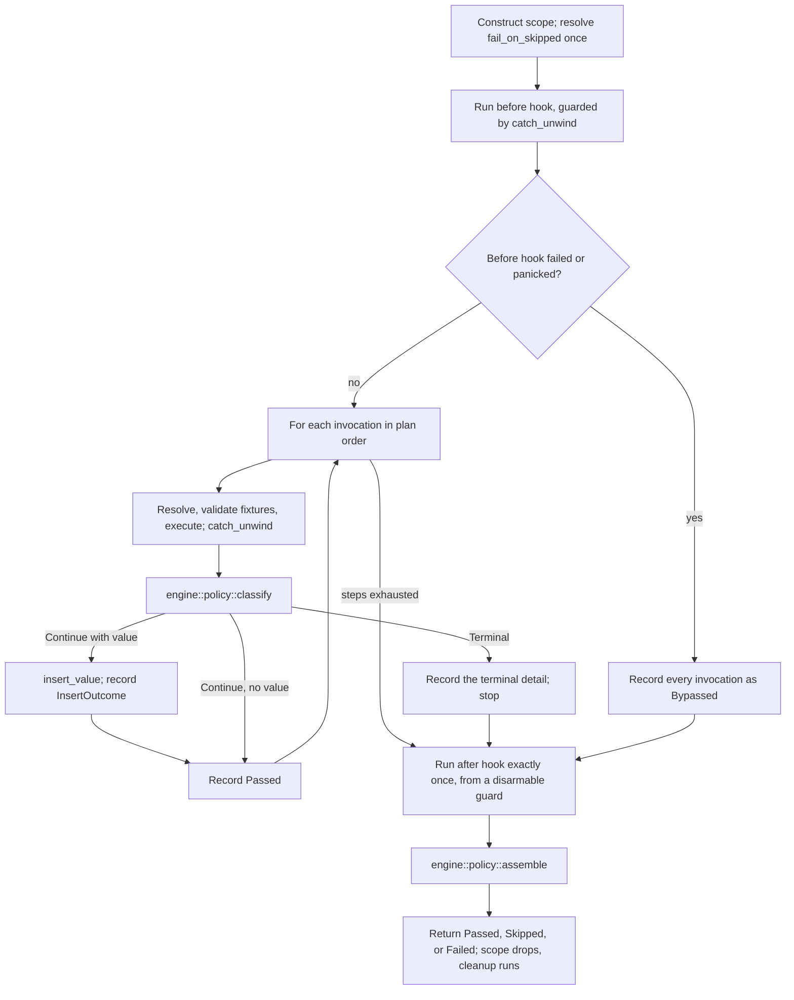

# Add parser-neutral scenario plan, outcome, and runner types (13.1.1)

This ExecPlan (execution plan) is a living document. The sections `Constraints`,
`Tolerances (exception triggers)`, `Risks`, `Progress`,
`Surprises & discoveries`, `Decision log`, `Outcomes & retrospective`,
`Conformance basis`, and `Verification plan` must be kept up to date as work
proceeds.

Status: IN PROGRESS — Stage A closed on 2026-09-19; D2 option (ii), D3, and D10
recorded as approved. Implementation begins at EP-M1.

## Purpose / big picture

Today the only way to run an `rstest-bdd` scenario is to let the `#[scenario]`
or `scenarios!` procedural macro generate a Rust test whose body contains a
hand-rolled step loop. That loop — not the runtime crate — decides what happens
when a step is skipped, when a step fails, where a returned value goes, and
which steps are reported as bypassed. The policy lives in quoted token streams,
so it cannot be unit-tested directly and cannot be reused by any caller that
did not start from a `.feature` file.

After this change the runtime crate `rstest-bdd` owns that policy in ordinary,
directly testable Rust. A caller builds a **scenario plan** — a name, tags, a
source identity, and an ordered list of step invocations — hands it to
`run_scenario` or `run_scenario_async`, and receives a **structured terminal
outcome** describing what every single invocation did, including the ones that
never ran.

Concretely, after this change a developer can write this, with no `.feature`
file, no procedural macro, and no panic on failure:

```rust,ignore
use rstest_bdd::runner::{
    ScenarioPlanBuilder, ScenarioScope, ScenarioStatus, StepStatus, run_scenario,
};
use rstest_bdd::{StepContext, StepKeyword};

let plan = ScenarioPlanBuilder::new("Add two numbers", "notes/arithmetic.md")
    .at_line(42)
    .step_at(StepKeyword::Given, "a calculator", 43)
    .step_at(StepKeyword::When, "I add 2 and 2", 44)
    .step_at(StepKeyword::Then, "the result is 4", 45)
    .build();

let mut ctx = StepContext::default();
let outcome = run_scenario(&plan, ScenarioScope::new(&mut ctx));

assert_eq!(outcome.status(), ScenarioStatus::Passed);
assert_eq!(outcome.steps().len(), 3);
let first = outcome.steps().first().expect("three steps produce three outcomes");
assert_eq!(first.status(), StepStatus::Passed);
assert_eq!(first.source().map(|s| s.line()), Some(43));
```

Every line of that example compiles against the API specified in
`Interfaces and dependencies`; a spike proving so is transcribed in
`Artefacts and notes`.

The observable wins are:

- A non-Gherkin frontend can execute the same registered steps that
  `#[scenario]` executes, keeping its own `.md`, `.txt`, or `.toml` source
  paths and line numbers in the outcome.
- A failed scenario returns data instead of panicking, so a caller chooses its
  own reporting and exit-code policy — while `#[must_use]` and a single
  canonical fold stop "returns data" from degrading into "fails silently".
- The `steps()` sequence is always complete and in plan order: after a terminal
  skip or failure, every remaining invocation appears as `Bypassed`, whether or
  not the `diagnostics` Cargo feature is enabled.

This step does **not** change the Gherkin macros. Migrating them is roadmap
13.2.1; proving an external frontend end to end is roadmap 13.3.1. This step
delivers the contract those two rely on.

## Definitions

Every term of art this plan uses, defined once. A reader who knows none of them
can still follow the rest of the document.

- **Step** — one `Given`/`When`/`Then` line. A **step definition** is the Rust
  function registered for it by `#[given]`/`#[when]`/`#[then]`. A **step
  invocation** is one occurrence of a step inside a scenario.
- **Registry** — the process-global `inventory`-populated map from
  `(keyword, pattern)` to step definition, in
  `crates/rstest-bdd/src/registry/mod.rs`. It is populated at link time; this
  plan adds no runtime registration.
- **Step wrapper** — the hidden function the `#[given]`/`#[when]`/`#[then]`
  macros generate around a user's step body. It performs argument extraction
  and, importantly here, `catch_unwind`.
- **Fixture** — a value supplied by `rstest` and made available to steps
  through `StepContext`.
- **`StepContext`** — `crates/rstest-bdd/src/context/mod.rs`. A per-scenario
  map from fixture name to either a borrowed reference or an owned
  `RefCell<Box<dyn Any>>` cell, plus a second map of **step-returned override
  values**. Since ADR-012 its borrow methods take `&self` and return guards,
  while its insert methods still take `&mut self`.
- **Unique-type rule** — when a step function returns a value, the runtime
  offers it as an override for the one fixture whose type matches. Implemented
  by `StepContext::insert_value`, which returns `InsertOutcome::Inserted`,
  `NoMatch`, or `AmbiguousIgnored` (ADR-015).
- **Skip** — a step calls `rstest_bdd::skip!`, which panics with a
  `SkipRequest` payload. The step wrapper catches it and turns it into
  `StepExecution::Skipped`; `execute_step` then turns that into
  `ExecutionError::Skip`. A skip stops the scenario.
- **Bypassed** — a step that never ran because an earlier step skipped or
  failed. Today bypassed steps are only recorded into the diagnostics registry,
  and only when the `diagnostics` feature is on.
- **`allow_skipped`** — a compile-time boolean, `true` when the scenario or its
  feature carries the `@allow_skipped` tag.
- **`fail_on_skipped`** — a run-time boolean read by
  `rstest_bdd::config::fail_on_skipped()`. It resolves a process-local override
  (`config::set_fail_on_skipped`) first, then the `RSTEST_BDD_FAIL_ON_SKIPPED`
  environment variable, then `false`.
- **Forced failure** — `fail_on_skipped && !allow_skipped`. A skip that a
  caller is expected to treat as a failure.
- **False green** — a test that passes while failing to exercise what it was
  written to check. This repository has a whole roadmap step (11.3) devoted to
  eliminating a class of these, so it is treated here as the dominant failure
  mode, not a theoretical one.
- **AFIT** — `async fn` in a trait, stable since Rust 1.75 and therefore
  available at this workspace's minimum supported Rust version (MSRV) of 1.88.
  Its one limitation — no `dyn` compatibility without boxing — does not apply
  here, because hooks are dispatched statically.

## Signposted documentation and skills

Read these before starting, and return to them at the stages named.

### Signposted documentation

In reading order:

1. `docs/adr-018-parser-neutral-scenario-execution.md` — the contract. Read in
   full before Stage A.
2. `docs/adr-012-guard-based-stepcontext-borrowing.md` — the borrow and
   lifecycle model `ScenarioScope` builds on. Note what it does *not* define:
   lifecycle hooks.
3. `docs/adr-015-insert-outcome-for-step-return-overrides.md` — why
   `insert_value` returns `InsertOutcome`, and why discarding it is a defect.
4. `docs/rstest-bdd-design.md` §2.6 (runtime execution module), §3.11 (runtime
   module layout for contributors), and §2.7.6.5 (v0.7.0 redesign candidates).
5. `docs/testing-strategy.md` — especially *Invariants to prefer* and
   *Assertion posture*.
6. `docs/developers-guide.md` — *Assertion vocabulary*, *Bypassed-step
   recording contract*, *Step-return overrides and `InsertOutcome`*, *Test
   organization*, *nextest configuration*, and above all *`#[serial]`,
   `#[file_serial]`, and nextest test-groups*, which contradicts a naive
   reading of process isolation.
7. `docs/rust-testing-with-rstest-fixtures.md` and
   `docs/rust-doctest-dry-guide.md` — fixture and doctest conventions.
8. `docs/complexity-antipatterns-and-refactoring-strategies.md` — consult at
   Stage D before accepting the sync/async duplication shape.
9. `docs/users-guide.md` §*Skipping scenarios* and §*Asserting skipped
   outcomes* — the user-visible semantics that must not change.
10. `docs/gherkin-syntax.md` — only to confirm which concepts must **not** leak
    into the new types.
11. `docs/documentation-style-guide.md` — before writing any prose.
12. `clippy.toml`, the root `Cargo.toml` `[workspace.lints]` tables, and
    `dylint.toml` — the lint budget Constraint 8 summarizes.
13. `.config/nextest.toml` — timeouts and test groups, before adding any suite
    that could be slow.
14. `docs/adr-016-pinned-nightly-rustfmt.md` — `make fmt` and `make check-fmt`
    invoke a pinned nightly `rustfmt`.
15. `.github/workflows/mutation-testing.yml` — the `cargo-mutants` lane this
    plan leans on for negative controls.

### Signposted skills

With the stage at which each becomes relevant:

- `rust-router` — load first; it routes to the rest.
- `arch-crate-design` (Stage A) — module boundaries, public versus internal
  surface, and whether anything belongs in `rstest-bdd-policy`.
- `rust-types-and-apis` (Stage A and C) — opaque types, `#[non_exhaustive]`
  placement, builder ergonomics, and making illegal states unrepresentable.
- `rust-errors` (Stage C) — `ScenarioFailure` shape, `Display`/`Error`
  implementations, the no-panic boundary, and `catch_unwind` placement.
- `rust-memory-and-state` (Stage A) — `Cow<'static, str>` versus `Arc<str>`,
  and why the plan carries no lifetime.
- `rust-async-and-concurrency` (Stage C and D) — AFIT, the cancellation
  contract, and why the async runner takes `ScenarioScope` by value.
- `rust-unit-testing` (Stage B) — `rstest` fixtures, table tests, `#[serial]`,
  and `googletest`/`pretty_assertions`/`insta` selection.
- `proptest` (Stage B and D) — bounded step-sequence strategies and
  classification.
- `rust-verification` (Stage A) — confirm the method selection in *Verification
  plan*, including the decision not to reach for Kani or Verus.
- `nextest` (Stage B onwards) — test groups, `#[serial]` interaction,
  filtersets, and the 60-second slow timeout.
- `rust-unused-code` (Stage D) — if `dead_code` appears behind a feature gate.
- `addressing-whitaker-findings` (Stage D) — `make lint` runs the Whitaker
  Dylint suite; `no_expect_outside_tests` fires inside non-`#[cfg(test)]` test
  *helpers*, so use `let`-`else` and `panic!`, not `.expect()`.
- `arch-decision-records` (Stage D) — needed if D2 is *accepted*; see D7.
- `en-gb-oxendict` and `commit-message` (throughout).
- `codegraph-mcp` (Stage A) — prefer `codegraph_get_callers` and
  `codegraph_analyze_impact` over grep for structural questions.

## Constraints

These are hard invariants. Violating one requires escalation, not a workaround.

1. **Additive only.** `execute_step`, `execute_step_async`,
   `StepExecutionRequest`, `StepContext`, the `#[given]`, `#[when]`, `#[then]`,
   `#[scenario]`, and `scenarios!` macros, and every existing public item keep
   their current signatures and behaviour. `crates/rstest-bdd-macros` is not
   modified by this plan at all. One deliberate exception is permitted and
   named: adding `PartialEq`/`Eq` derives to `ExecutionError` and
   `MissingFixturesDetails`, which is additive on a `#[non_exhaustive]` type
   and is required so outcomes can be compared whole (see D9).
2. **No frontend *types* in the public runner surface.** No `gherkin`,
   Markdown, Trymark, process, snapshot, Clap, or reporter type may appear in
   the signature of any item under `rstest_bdd::runner`, whether directly, in a
   variant field, a bound, an associated type, or a re-export. Enforced by
   INV-11, not by review alone.
3. **The runner never panics, for any reason it can control.** An ordinary
   failure, a skip, a missing step, a missing fixture, a failing lifecycle
   hook, a *panicking* lifecycle hook, a panicking step registered without a
   wrapper, and a panicking value destructor during cleanup all produce a
   returned `ScenarioOutcome`. See D11.
4. **The outcome's step sequence is total and ordered.** For every plan,
   `outcome.steps().len() == plan.steps().len()`, entry `i` describes invocation
   `i`, and every entry after a terminal event is `Bypassed`. This holds
   identically with the `diagnostics` feature on and off, which requires a gate
   leg that does not exist today (see D4).
5. **No new dependency.** `proptest`, `googletest`, `pretty_assertions`,
   `insta`, `rstest`, `serial_test`, `temp-env`, `tracing`, and `tokio` are
   already available to `crates/rstest-bdd`; nothing else may be added without
   escalation. The `async-trait` crate is forbidden and `make lint` enforces
   its absence via `forbid-async-trait`. `metrics` is a workspace dependency
   but **not** a dependency of `rstest-bdd`, so metric emission is out of scope
   here and is deferred to 13.3.1.
6. **No runtime mutation of the global step registry.** Link-time `inventory`
   registration stays the only extension mechanism (ADR-018, *Extension
   boundary*).
7. **Source travels through the plan and the outcome, never out of an error.**
   The runner must not *add* source fields to `ExecutionError`, and must never
   infer a location by parsing an error string. It *does* populate the existing
   `StepExecutionRequest::feature_path` and `scenario_name`, from
   `plan.source()` and `plan.name()` respectively; ADR-018 *Source-neutral
   diagnostics* explicitly permits those legacy field names to remain during
   the additive migration. See D15 for the resulting wart and its follow-up.
8. **The workspace lint budget is not negotiable.** `make lint` runs Clippy
   with `-D warnings` over `--all-targets --all-features`, plus the Whitaker
   Dylint suite. The root `Cargo.toml` denies, among others, `unwrap_used`,
   `expect_used`, `indexing_slicing`, `missing_docs`,
   `missing_docs_in_private_items`, `missing_panics_doc`, and `unsafe_code`;
   `clippy.toml` sets `cognitive-complexity-threshold = 12`. Three consequences
   bind the implementation:
   - The engine may not index a slice. Use `.get(i)`, iterators, and `zip`.
   - No `.unwrap()` or `.expect()` outside `#[cfg(test)]`.
     `allow-expect-in-tests`
     does **not** cover helpers outside a `#[cfg(test)]` module or a `#[test]`
     function; use `let`-`else` with `panic!` there.
   - `unsafe_code` is denied, so the `ManuallyDrop` escape hatch is unavailable
     for the `ScenarioScope` destructor problem (see D2 and INV-14).
9. **No file over 400 lines.** `make lint` runs
   `scripts/check_rs_file_lengths.py`, whose exception list is
   `scripts/rs-length-allowlist.txt`. Do not add an entry for new code; split
   the file instead.
10. **Every module opens with a `//!` comment, and every item — public *and*
    private — carries a `///` doc comment**, because
    `missing_docs_in_private_items` is denied. `run_scenario` and
    `run_scenario_async` each carry a runnable rustdoc doctest; that is not
    optional, and a doctest must not touch process-global configuration (see
    AXIOM-7).
11. **en-GB-oxendict spelling** in all comments and prose, enforced by the
    `typos` gate. Never hand-edit `typos.toml`; edit
    `scripts/generate_typos_config.py` and regenerate. Note that `typos`
    rejects short capitalized tokens such as `AX`, which is why this plan's
    axioms are `AXIOM-n`.

## Tolerances (exception triggers)

Stop and escalate — do not improvise — when any of these is reached. These
figures were re-scoped after the design review pointed out that the first draft
would have tripped three of them before the second milestone, and a tolerance
that fires immediately trains its reader to ignore all of them.

- **Scope.** More than 36 files touched, or more than 4,500 net added lines
  across the whole plan. The expected shape is roughly 11 new source files, 9
  new test files, 1 feature file, snapshots, and 5 edited documents.
- **Public interface.** Any change to an *existing* public signature, other
  than the one named exception in Constraint 1.
- **Dependencies.** Any new entry in `[workspace.dependencies]` or in
  `crates/rstest-bdd/Cargo.toml`, including dev-dependencies.
- **Macro crate.** Any edit under `crates/rstest-bdd-macros/`.
- **Iterations.** A gate that still fails after 3 focused fix attempts.
- **Cancellation.** If the async cancellation contract cannot be observed
  deterministically without a new dependency or a timing-dependent test, stop
  and present options.
- **Time.** Any single milestone exceeding 8 hours of work.
- **Ambiguity.** Any point where ADR-018's binding text admits two readings
  producing materially different public types.

If the scope or time tolerance is approached rather than breached, the
preferred remedy is to split this item into **13.1.1a** (source, plan, outcome,
synchronous runner) and **13.1.1b** (skip parity, asynchronous runner,
cancellation, properties), which also gives the maintainer a decision point
between them. Raise that before spending the tolerance.

## Risks

- **Risk: the lifecycle-hook surface is a permanent public commitment made
  ahead of the ADR that should define it.** Severity: high. Likelihood: high
  (already observed). ADR-018 requires before- and after-scenario hooks
  "according to ADR 012"; ADR-012 defines none, and design document §2.7.6.5
  still lists "first-class world lifecycle hooks" as a *candidate*. Shipping
  `Lifecycle` now means reconciling a per-run `&mut self` trait with a future
  global registry — a change, not an extension. Mitigation: D2 presents three
  options including a third the review surfaced, under which
  `ScenarioScope<'ctx, H = NoHooks>` ships now with its defaulted type
  parameter and the traits are deferred. That is source-compatible for every
  caller writing `ScenarioScope::new(&mut ctx)`, so deferring costs almost
  nothing in forward compatibility.

- **Risk: a returned outcome is dropped and a failure becomes invisible.**
  Severity: high. Likelihood: medium. Today a failure panics, so a human always
  sees it. Constraint 3 removes that channel. Mitigation: `#[must_use]` on
  `ScenarioOutcome` itself (which covers the awaited async form, unlike
  `#[must_use]` on the function); exactly one canonical fold,
  `into_harness_result`, documented as the only sanctioned success test;
  `Display`; and `tracing` events on every terminal path. See D13 and D14.

- **Risk: a step-returned value silently fails to reach later steps.**
  Severity: high. Likelihood: medium. `insert_value` returns `InsertOutcome`,
  whose `NoMatch` variant emits no warning at all. The existing generated loop
  discards it with `let _ = ctx.insert_value(val)`, and a comment there wrongly
  claims both dropped cases are logged. Mitigation: INV-12 records the
  insertion outcome on `StepOutcome` and requires `NoMatch` to be generated and
  classified by the property suite.

- **Risk: the sync and async runners are not equivalent for `Async`-mode steps,
  and nothing says so.** Severity: medium. Likelihood: high (already true).
  `execute_step` calls `(step.run)` without consulting `execution_mode`. For an
  `Async`-registered step the generated wrapper's `run` either blocks on a
  fresh current-thread runtime or, if a runtime is already current, polls once
  and returns an error if the future is pending. Mitigation: AXIOM-2 is
  restated to its true scope; INV-15 documents and tests the
  `Async`-under-`run_scenario` behaviour, including from inside a live Tokio
  runtime.

- **Risk: `fail_on_skipped` tests interfere with each other, and doctests
  cannot be serialized at all.** Severity: medium. Likelihood: high. The
  override is a process-global `AtomicU8` with an environment fallback.
  `make test` runs nextest *and* `cargo test --doc --workspace`, and this is an
  edition-2024 workspace, where doctests are merged into one binary and run in
  parallel. `#[serial]` cannot be applied to a doctest. Mitigation: D10 moves
  the resolution into `ScenarioScope` construction, with an explicit
  `with_skip_policy` override. That makes INV-9 true by construction, removes
  `#[serial]` from most of the matrix, and makes doctests safe.

- **Risk: sync and async policy drift into two implementations.**
  Severity: medium. Likelihood: medium. Mitigation: `engine::classify` owns the
  stop decision so neither driver branches on a step result, `engine::assemble`
  owns everything else, and one `Lifecycle` trait whose async methods default
  to the sync ones makes hook drift impossible by construction. INV-5 pins the
  rest, with its known gap (async-only steps) recorded rather than glossed.

- **Risk: the new outcome types duplicate `rstest_bdd::reporting`.**
  Severity: medium. Likelihood: medium. There are in fact three overlapping
  models — the new one, `reporting`, and the `BypassedScenario` diagnostics
  registry — and only the new one can express failure at all:
  `reporting::ScenarioStatus` has exactly `Passed` and
  `Skipped(SkippedScenario)`. Mitigation: D5 names `runner` canonical, records
  the missing failure representation as a 13.2.1 obligation, and lands a
  test-gated conversion at EP-M2 as a structural smoke test.

- **Risk: a bounded property test passes vacuously.**
  Severity: medium. Likelihood: medium. A generator that rarely produces
  terminal events, or one whose shortest cases dominate, makes INV-1 and INV-2
  trivially true. Mitigation: every property test records `proptest`
  classification counters and asserts each material class was reached; INV-13
  forces the empty plan to have a defined, non-silently-passing outcome; and
  negative controls are provided by synthetic-input tests plus the repository's
  existing `cargo-mutants` lane rather than by fault injection in production
  code (D12).

- **Risk: outline code size regresses at 13.2.1.**
  Severity: low. Likelihood: medium. The macro currently emits a `'static` 2-D
  `const` table for outlines. A plan type containing `Vec` or `Arc` cannot
  appear in a `const`. Mitigation: `SourcePath::Static` and `Cow::Borrowed`
  keep every *string* in the plan const-constructible, so only the `Vec` spines
  cost anything; measure with `cargo llvm-lines` at 13.2.1 and net it against
  the shared `run_scenario` monomorphization, which should shrink per-test
  codegen.

- **Risk: suite concurrency is capped by a non-`Send` future.**
  Severity: low for 13.1.1, high for 13.3.1. Likelihood: certain.
  `StepScopeGuard` is `!Send`, so `run_scenario_async`'s future is not `Send`
  and cannot be `tokio::spawn`ed. A frontend must use a current-thread runtime
  or a thread-per-scenario runtime. Mitigation: document it here and add a note
  to roadmap 13.3.1 so it is not discovered empirically.

## Progress

- [x] (2026-09-14) Branch renamed to `13-1-1-add-parser-neutral-types` and
  pushed, tracking `origin/13-1-1-add-parser-neutral-types`.
- [x] (2026-09-14) Reconnaissance of the runtime crate, the macro-generated
  scenario loop, and the gate machinery completed.
- [x] (2026-09-14) Prior art reviewed: `cucumber-rs`'s `Parser`/`Runner`/
  `Writer` split, the Cucumber Messages status model, and Gauge's hook and
  pre/post-hook-failure model.
- [x] (2026-09-14) First draft written.
- [x] (2026-09-14) Six-lens design review completed; 8 design flaws and 20
  further findings folded in. See `Surprises & discoveries` and `Decision log`.
- [x] (2026-09-14) Four spikes compiled and run, validating the revised design.
  Transcripts in `Artefacts and notes`.
- [x] (2026-09-19) Stage A closed. The maintainer instructed that the
  preliminary decisions be recorded as approved, so **D2 option (ii)**, **D3**,
  and **D10** are approved as recommended. D2 option (ii) means EP-M4 is struck
  and ADR-018's lifecycle matrix is discharged only in part; that deviation is
  recorded under D2 and must be reflected in `docs/roadmap.md`.
- [x] (2026-09-19) EP-M1: source, plan, and outcome types. `runner/` exists
  with `source.rs`, `plan.rs`, `plan/builder.rs`, `outcome/mod.rs`,
  `outcome/step.rs`, `outcome/failure.rs`, and three test files under
  `runner/tests/`. Sixteen focused tests pass; scoped clippy is clean under
  `-D warnings`; the pinned nightly rustfmt reports no diff;
  `scripts/check_rs_file_lengths.py` exits 0 with no allowlist entry. Four
  public items were invented during implementation and are recorded in the
  Decision log: `ValueFate` (a projection of `InsertOutcome`, which cannot be
  `Clone`/`Eq` and so cannot sit inside `StepOutcome`), and the `EmptyPlan`/
  `ForcedSkip`/`EmptyPlan`-site trio that gives INV-13's fold an error to
  return. `LifecycleError` and `ScenarioOutcome::cleanup_error()` were dropped
  as corollaries of D2 option (ii).
- [x] (2026-09-19) EP-M1 gate closure: the full deterministic suite. The
  first `make lint` / `make test` / `make markdownlint` run failed on three
  unrelated-looking causes, all now resolved or explained; see
  `Surprises & discoveries`. In brief: (1) `make lint` failed with five Whitaker
  `no_std_fs_operations` findings in `runner/tests/surface.rs`, fixed by
  rewriting the scan onto `cap-std`'s `fs_utf8` API rather than by adding a
  `dylint.toml` exclusion; (2) `make markdownlint` failed on one `-ise`
  spelling in `outcome/failure.rs`, corrected to `-ize` per `typos.toml`; (3) a
  `cargo-bdd` timeout in `make test` was shown to be environmental by an
  isolated re-run (94s against a 180s budget), so no change was made. The
  `surface.rs` rewrite additionally repaired a non-vacuity guard that had been
  passing for the wrong reason, verified by mutation. Closed against commit
  `85b5fabe`. All five gates ran to completion and passed: `make check-fmt`
  (4s), `make lint` (17s), `make test` (611s), `make markdownlint` (12s),
  `make nixie` (<1s). `make test` reported
  `1944 tests run: 1944 passed, 7 skipped`, with 0 cancelled, 0 timed out and 0
  failed; the doctest pass reported 172 passed / 0 failed, and pytest 234
  passed. The `cargo-bdd::cli list_steps_runs` test that had previously been
  terminated at 180s now passed in 2.844s — a 63x margin, confirming the
  timeout was cold-cache and not a regression; the 78 tests it had cancelled
  executed here. This run also reached the whole of `make lint` for the first
  time: clippy, `cargo doc`, `lint-whitaker`, and the Python leg (ruff, PyLint
  10.00/10, the df12 plugin 10.00/10, `ambrleaks`) plus all five checker
  scripts. The gate suite was run by a `scrutineer` sub-agent on a settled,
  committed tree, so the evidence is attached to a revision rather than to a
  working directory.
- [ ] EP-M2: synchronous runner, engine split, and the sequence properties.
- [ ] EP-M3: asynchronous runner and cancellation.
- [x] ~~EP-M4: lifecycle hooks and the lifecycle matrix~~ — struck by D2
  option (ii).
- [ ] EP-M5: documentation, snapshots, and the full gate.

## Surprises & discoveries

- **Observation:** ADR-018 requires before- and after-scenario hooks "according
  to ADR 012", but ADR-012 defines no hooks at all. Evidence: ADR-012's *World
  lifecycle contract* describes only drop-based cleanup performed by the
  generated test body; `rg 'before_scenario| after_scenario|ScenarioScope'`
  returns no runtime matches; design document §2.7.6.5 still lists "first-class
  world lifecycle hooks" among the *remaining candidates*. Impact: Decision D2,
  which needs explicit approval, and which the review argued should be
  *deferred* rather than merely approved.

- **Observation:** `ScenarioScope::with_hooks` as first drafted does not
  compile. Moving a `&'ctx mut StepContext` out of a type that implements
  `Drop` is `E0713`, and `Drop` is load-bearing because cancellation safety
  depends on it. Evidence:
  `error[E0713]: borrow may still be in use when destructor runs`. Impact: the
  destructor moves onto a private `CleanupGuard` field so `ScenarioScope`
  itself is not `Drop`. Validated by Spike 4. Without this finding an
  implementer would have hit the error on day one and might have "fixed" it by
  removing the `Drop`, silently destroying the guarantee.

- **Observation:** the first draft's justification for boxing the async hook
  futures was wrong. AFIT is stable from Rust 1.75, well below the MSRV of
  1.88, and nothing here is `dyn` — hooks are dispatched statically through
  `H: Lifecycle`. Evidence: Spike 3 compiles a trait with `async fn` defaults,
  a stateful synchronous implementor, and an async-only implementor. Impact:
  two heap allocations per run removed, and `Pin<Box<dyn Future>>` kept out of
  a permanent public surface.

- **Observation:** a fully borrowed plan is not required, and dropping the
  lifetime deletes an entire risk, a tolerance, and a prototyping milestone.
  Evidence: Spike 2 builds a macro-style plan whose step text and tags are all
  `Cow::Borrowed` (no `String` allocated), parses a dynamic plan from a
  non-`'static` buffer in one call, and outlives that buffer. Impact: Decision
  D3 replaced. `OwnedScenarioPlan`, `PlanTable`, and the two-call
  `invocations()`/`as_plan()` dance are all gone. The review independently
  established that the two-call form was virally non-composable (`E0515`
  prevents returning a `ScenarioPlan<'_>` from a helper), which would have made
  it the primary API for exactly the audience this work exists for.

- **Observation:** `&'a [String]` for tags is not constructible from `const`
  data, so the first draft's EP-M1 allocation criterion was unsatisfiable and
  the milestone would have failed its own gate. Evidence: `String::from` is not
  `const`, so `static TAGS: [String; N]` cannot exist. Impact: tags are
  `Vec<Cow<'static, str>>`, which costs one `Vec` per scenario and no string
  allocation on the macro path.

- **Observation:** `ExecutionError` already carries public `feature_path` and
  `scenario_name` fields, and the localized message renders them. Evidence:
  `crates/rstest-bdd/src/execution/error/mod.rs` variants `StepNotFound` and
  `HandlerFailed`, `MissingFixturesDetails`, and
  `crates/rstest-bdd/i18n/en/rstest-bdd.ftl:28` —
  `... (feature: { $feature_path }, scenario: { $scenario_name })`. Impact: the
  first draft's Constraint 7 was unachievable. ADR-018 *Source-neutral
  diagnostics* already permits these legacy names during the additive
  migration, so Constraint 7 is restated and D15 records the resulting
  user-visible wart and its follow-up.

- **Observation:** `reporting::ScenarioStatus` has no failure representation at
  all — only `Passed` and `Skipped(SkippedScenario)`. Evidence:
  `crates/rstest-bdd/src/reporting/record.rs`. It works today only because
  failure panics and the generated report guard suppresses recording via
  `!std::thread::panicking()`. Impact: 13.2.1 must *extend* `reporting`, not
  merely add a conversion. D5 records this so it is not discovered at migration
  time.

- **Observation:** the first draft's `#[cfg(test)]` seeded-fault switch could
  not have worked, and would have been dangerous if it had. Evidence: INV-1's
  artefact is an integration test, which links the crate compiled *without*
  `cfg(test)`; making the switch reachable would require a Cargo feature, which
  feature unification can enable downstream, and whose effect is "keep
  executing after a terminal event" — a total silent false green shipped to
  users. Impact: Decision D12. Negative controls become synthetic-input tests
  of the assertion helpers plus the repository's existing nightly
  `cargo-mutants` lane, which answers the same question adversarially and
  across every mutation.

- **Observation:** `#[non_exhaustive]` on an enum does not protect the fields
  of its variants. Evidence: adding a field to an existing struct variant
  breaks every downstream `match` that does not already write `..`. Impact: the
  outcome is re-carved as an opaque struct with a fieldless
  `#[non_exhaustive] ScenarioStatus`. That also removed two real defects: a
  `Skipped { cleanup_error }` field that could never be inhabited, and the loss
  of the skip's `forced_failure` when an after-hook failure upgraded the status
  to `Failed`. See D9, validated by Spike 4.

- **Observation:** the panic boundary the runner would rely on does not cover
  what the runner will call. Evidence: `catch_unwind` lives in macro-generated
  step wrappers only
  (`crates/rstest-bdd-macros/src/codegen/wrapper/emit/assembly/mod.rs`).
  Caller-supplied hooks, steps registered through the raw `step!` form — which
  is ADR-018's own extension story — and value destructors run during cleanup
  all have none. `ScopeKind::Hook` already exists in the skip enum, inviting
  users to write `skip!()` in a hook, where it would panic with a plain `&str`.
  Impact: Decision D11 makes the runner panic-safe at its own boundary, and
  INV-4's panic row is rewritten to use a raw `step!` handler that genuinely
  unwinds — otherwise that row could not fail.

- **Observation:** the first draft's claim that Cucumber's `AMBIGUOUS` status
  maps onto an existing `ExecutionError` variant is false. Evidence: the
  variants are `Skip`, `StepNotFound`, `MissingFixtures`, and `HandlerFailed`;
  `find_step_with_metadata` returns a bare `Option` and resolves ambiguity
  silently. `duplicate_steps()` exists only for introspection. Impact:
  `StepStatus` still stays at four variants, but on the honest ground that it is
  `#[non_exhaustive]` and a `FailureKind` projection (INV-16) gives reporters
  a stable classification without freezing `ExecutionError`.

- **Observation:** Gauge — a language-agnostic acceptance-test runner whose
  core owns execution and whose language runners supply steps — records an
  after-hook failure separately from a primary failure and does not let it
  override one. Evidence: `ProtoScenario.PreHookFailure` and `PostHookFailure`
  are distinct fields, and a `ScenarioResult` can carry both. Impact:
  independent corroboration for ADR-018's primary-versus-cleanup distinction.
  It did not survive contact with D2 option (ii): a separate `cleanup_error()`
  accessor has no producer while the hooks are deferred, and as drafted it was
  ambiguous — a caller seeing `Some(_)` still could not tell which failure was
  terminal, because `failure()` already carries that. The distinction returns
  with the hooks; until then exactly one failure channel is the honest shape.
  See the D2 note and D13.

- **Observation:** `cucumber-rs`, the obvious Rust prior art, is *not*
  parser-neutral in the type sense: its `Parser` trait's `Output` is a stream of
  `gherkin::Feature`, so a non-Gherkin frontend must synthesize Gherkin AST
  nodes. Impact: that is exactly ADR-018's rejected Option B, corroborating the
  accepted boundary. It also means there is no upstream type vocabulary worth
  copying.

- **Observation:** Cucumber Messages collapses "deliberately skipped" and
  "skipped because an earlier step failed" into one `SKIPPED` status. Impact:
  ADR-018's separate `Skipped` and `Bypassed` is a deliberate divergence and
  the better fit, because the two have different causes and the runtime already
  distinguishes them.

- **Observation:** `std::task::Waker::noop()` is stable and available at the
  MSRV of 1.88, and `crates/rstest-bdd/src/panic_support.rs` already uses this
  harness shape in its own doctests. Impact: INV-10 needs no new dependency.

- **Observation:** a milestone that ships types before their consumer cannot be
  `-D warnings` clean on its own, and the workspace's lint configuration forces
  the resolution rather than merely permitting one. Evidence: EP-M1's
  `StepOutcome::passed`/`skipped`/`failed`/`bypassed`, `ScenarioOutcome::new`,
  `ScenarioSkip::new`, and the private `StepRecord` have no production caller
  until EP-M2's engine, so `make lint` failed with
  `error: associated functions ... are never used`. `#[allow]` is unavailable —
  the workspace denies `allow_attributes` and
  `allow_attributes_without_reason` — so each carries
  `#[cfg_attr(not(test), expect(dead_code, reason = "constructed by the EP-M2
  engine"))]`.
  Impact: the `not(test)` scoping is deliberate in both directions. Unscoped,
  the attribute is *unfulfilled* in a `cfg(test)` build, because the unit tests
  do construct these; and once EP-M2 supplies the production caller it becomes
  unfulfilled in a normal build too, so the lint fails until the attribute is
  deleted rather than lingering as permanent dead-code camouflage. This is the
  mechanism the plan's `rust-unused-code` skill note points at; it applies to
  any milestone, not only to a feature-gated one.

- **Observation:** D3's no-lifetime decision is enforced at the *builder's*
  signature, so a dynamic frontend must own every string it keeps — and the
  compiler says so at the call site. Evidence: EP-M1's parser test, written as
  a real parser over a borrowed `&str` buffer, failed to compile with
  `E0521: borrowed data escapes outside of function` on `step_at`, because
  `impl Into<Cow<'static, str>>` admits a `&'static str` and an owned `String`
  but not a `&'buffer str`. Impact: the first draft of that test asserted the
  opposite — that a parser could hand borrowed slices straight to the builder —
  which the plan's own `Cow<'static, str>` choice forbids. The test now copies
  at the parse and says why: the error is the decision being enforced, not an
  obstacle. It is a *compile*-time check living in a *runtime* test file, so
  the failure mode is a build break in a later milestone, when a frontend is
  first written. Worth knowing before that frontend is written.

- **Observation:** Whitaker's `no_std_fs_operations` lint reaches test code, and
  offers no test-only exemption — so a source-scanning *test* may not use
  `std::fs` either. Evidence: `make lint` on EP-M1 reported five
  `no_std_fs_operations` findings in
  `crates/rstest-bdd/src/runner/tests/surface.rs` alone — the import,
  `read_dir`, the iteration, `entry.path()`, and `read_to_string` — and failed
  the build. Reading the lint's own source
  (`~/.local/share/whitaker/crates/no_std_fs_operations/src/`) confirms the
  absence of any `allow-fs-read-in-tests` escape: the driver has no
  test-awareness at all. The lint *does* offer `excluded_paths`, a
  module-scoped counterpart to `excluded_crates`. Impact: three candidate
  remedies, and the choice matters. In-source `expect`/`allow` attributes
  cannot suppress it (already recorded in `docs/developers-guide.md`);
  excluding the whole `rstest_bdd` crate would exempt the entire library from
  the workspace's filesystem policy, which is far too broad;
  `excluded_paths = ["rstest_bdd::runner::tests"]` would work and is narrowly
  scoped. The remedy taken is **none of these** — `surface.rs` now reaches the
  tree through `cap-std`'s `fs_utf8` API, mirroring
  `crates/rstest-bdd-macros/src/validation/steps/tests/support.rs`. That keeps
  the crate inside the policy rather than carving an exemption out of it, and
  it needs no new `dylint.toml` entry. The general lesson for later milestones:
  **any test that touches the filesystem must use `cap-std`**, and reaching for
  `excluded_paths` should be a deliberate, argued exception rather than the
  first idea.

- **Observation:** converting that scan to `cap-std` exposed a latent weakness
  in EP-M1's own non-vacuity guard, which had been passing for the wrong
  reason. Evidence: `the_scan_finds_the_runner_tree` reduced each path to a
  bare file name — `path.rsplit('/').next()` — and then asserted that the names
  contained `"outcome"`. No file under `outcome/` has that name (`mod.rs`,
  `step.rs`, `failure.rs`), so the expectation was satisfied incidentally by an
  *unrelated* file, `runner/tests/outcome.rs`. It was a guard that named a
  directory and then never checked one. Rewritten to compare whole relative
  paths, and verified by mutation: with `child_path` altered to drop its prefix
  so every key collapsed to a basename, the old guard **passed** while the new
  guard **failed** with
  `expected the scan to reach outcome/failure.rs; found
  ["builder.rs", "failure.rs", "mod.rs", …]`.
  Impact: two corrections to the record. First, a passing test in EP-M1's own
  inventory was not evidence of what it claimed, which is exactly the vacuity
  the plan's `Verification plan` requires each obligation to argue against —
  the guard now has a mutation witness. Second, an over-strong claim in an
  intermediate doc comment was itself refuted and removed: I had written that
  the old form "would not notice the recursion silently stopping a level
  early", but a mutation that skipped the `outcome` directory *was* caught, by
  the separate `"step.rs"` expectation. The real defect was narrower — the
  directory expectation was satisfiable by a same-named file at the top level —
  and the comment now states only what was measured.

- **Observation:** INV-15's premise is confirmed in the generated code, and the
  two-case test it prescribes is exactly right. Evidence:
  `crates/rstest-bdd-macros/src/codegen/wrapper/emit/mod.rs` lines 103-166. The
  sync wrapper first calls
  `__rstest_bdd_tokio::runtime::Handle::try_current()`. If a runtime is already
  current it polls the future exactly once with `Waker::noop()` and maps
  `Poll::Pending` to a `StepError::ExecutionError` whose message ends
  "multi-poll async steps are not supported under a harness — use
  `runtime = \"tokio-current-thread\"` or an `async fn` scenario signature
  instead". Otherwise it builds a `new_current_thread` runtime and drives the
  step under a `LocalSet`. Impact: the divergence INV-15 exists to document is
  real, is *not* reachable from `execute_step` (which never consults
  `execution_mode`), and is decided one layer down in macro-generated code. A
  multi-poll step therefore succeeds outside a runtime and fails inside one,
  which is what the invariant's non-vacuity requirement asks the two cases to
  distinguish. It also means the test cannot be written against `execute_step`
  alone — it must go through a registered `Async`-mode step, which EP-M2's
  `runner/tests/modes.rs` will need.

- **Observation:** editing a tracked file *while a gate run is in flight*
  invalidates part of that run's evidence, even when the edits are innocent.
  Evidence: this plan was revised during EP-M1's gate closure to record the
  reconnaissance above. `make markdownlint` and `make nixie` both read
  `docs/execplans/`, so their verdicts depend on file contents at the moment
  they run, and the run's result no longer maps to a single tree revision.
  Impact: a process rule rather than a code one. The plan is edited only
  between gate runs, never during one; if a correction is urgent, it is made
  after the run finishes and the affected gates are re-run. Where a gate has
  already been read from its log and re-verified against the settled tree, that
  is recorded explicitly rather than left to inference.

- **Observation:** the shared `/tmp` gate-log filenames are a hazard when a
  sub-agent and the main conversation both run gates, because the second writer
  silently overwrites the first writer's evidence. Evidence: the gate-closure
  run delegated to `scrutineer` wrote its logs to
  `/tmp/$ACTION-13-1-1-add-parser-neutral-types.out`, the naming convention
  this repository mandates. Before committing `85b5fabe` the main conversation
  ran `make markdownlint` and `make nixie` itself against the same filenames.
  The agent then observed an impossible ordering — the `nixie` log mtime
  (07:02:05) *preceding* the `markdownlint` log mtime (07:02:33) despite
  `nixie` being invoked second — and reasonably raised it as evidence that a
  second session was authoring on the branch. It was not: `git worktree list`
  showed exactly one worktree on `13-1-1-add-parser-neutral-types`, the reflog
  for this worktree showed only this session's commits, and the plan hash
  `3c1345330e8db42b` matched `git show 85b5fabe:` byte for byte, so the logs
  described two different runs against two different revisions. Impact: the
  convention is a filename template, not a lock. Two writers colliding on it
  can manufacture a false anomaly, and a *real* anomaly could equally be
  dismissed as one. The resolution is to compare contents rather than trust
  mtimes: a log's revision is established by reading it, and a log whose
  verdict cannot be tied to a revision is not evidence. It also cost the
  scrutineer real analysis effort, so where a sub-agent is running the gates,
  the main conversation should not run those same targets concurrently, even
  read-only ones — the `make markdownlint` there was a verification, not an
  authoring act, and it still collided.

- **Observation:** the spelling policy is `-ize`, not the `-ise` that the
  "en-GB" label invites, and it catches prose written *about* the work as
  readily as the work itself. Evidence: after fixing `unrecognised` →
  `unrecognized` in `outcome/failure.rs`, the very prose added to this plan to
  describe that fix then failed the same gate with
  `error: materialise should be materialize`, caught by running `typos` on the
  edited file directly rather than by waiting for `make markdownlint`. Impact:
  `typos.toml` lines 2127-2145 map a whole family — `recognisable`,
  `recognised`, `organise`, `materialise`, and others — onto their `-ize`
  forms, so this is a standing trap, not a one-off. The cheap defence is to run
  `typos` on any file touched by a commit before requesting the gate,
  especially a plan or doc where the surrounding prose has not been through
  review. Checking locally first turned a gate failure into a one-word edit.

- **Observation:** the full `make test` run reported a `cargo-bdd` timeout that
  is environmental, not a regression. Evidence:
  `cargo-bdd::cli list_steps_runs` was terminated at 180.002s against its
  per-test override, and the run then cancelled the remaining 78 tests. Run in
  isolation it passes in 94.079s — comfortably inside the same 180s budget. The
  full run competed for a cold build cache and the `cargo-spawning` test group,
  which is capped at `max-threads = 1`. Impact: nothing in EP-M1 touches
  `cargo-bdd`, so no change is warranted. Two things to carry forward: a
  `make test` that reports this timeout should be re-run in isolation before
  being believed, and because the timeout cancelled 78 tests, a run that ends
  this way has **not** exercised them — the green result for those tests must
  come from a completed run, not from the cancelled one.

## Decision log

- **D1: put the new types in a new `rstest_bdd::runner` module, not in
  `execution`, and not in `rstest-bdd-policy`.** Rationale: `execution` is
  per-step and its name is load-bearing in published documentation;
  `rstest-bdd-policy` exists only for definitions the proc-macro crate needs
  without depending on the runtime, and the macro crate needs none of these
  until 13.2.1 — when it will reference them through `#path::runner::…`,
  exactly as it already does `#path::execution::…`. Considered and rejected:
  `context::ScenarioScope`, which would keep ADR-012's lifecycle model in one
  module but split the runner's own vocabulary across two; and extracting
  `rstest-bdd-core` now, which ADR-018 defers (Option E). Date/Author:
  2026-09-14, planning agent.

- **D2: lifecycle hooks — one `Lifecycle` trait, caller-supplied per run, no
  global registry. THREE OPTIONS; APPROVED AS (ii) ON 2026-09-19.** ADR-018
  makes the before-hook-failure and after-hook-failure rows of its lifecycle
  matrix binding, but no hook mechanism exists anywhere in the workspace and
  the design document still lists them as a candidate.
  - **(i) Ship the trait now.** One `Lifecycle` trait with `before`/`after` and
    `before_async`/`after_async`, the async pair defaulting to the sync pair so
    the two cannot drift; `NoHooks` as the defaulted type parameter; hooks
    receive `&mut StepContext`. Spike 3 and Spike 4 prove this compiles,
    including a stateful implementor and an async-only implementor.
  - **(ii) Ship `ScenarioScope<'ctx, H = NoHooks>` now, defer the traits.**
    The defaulted parameter means adding the traits later is source-compatible
    for every caller writing `ScenarioScope::new(&mut ctx)`. ADR-018's
    lifecycle matrix is partially discharged and that is recorded as a
    deviation in this plan and in the roadmap entry. EP-M4 shrinks to nothing
    and INV-4, INV-8, and INV-10 lose their hook rows.
  - **(iii) Defer hooks entirely, including the type parameter.** Cheapest now,
    most expensive later, because adding the parameter is then a breaking
    change.
  **Recommendation: (ii).** The hook traits are the least-settled and most
  permanent part of this surface; a future user-facing `#[before_scenario]`
  attribute will bring its own ordering and duplicate-detection policy, and
  reconciling that with a per-run `&mut self` trait would be a change, not an
  extension. Option (ii) costs almost nothing in forward compatibility and
  keeps the cancellation guarantee — which depends on `ScenarioScope`, not on
  hooks — fully intact. If (i) is chosen instead, D7 requires an ADR first.
  Date/Author: 2026-09-14, planning agent. **Status: APPROVED AS (ii) on
  2026-09-19** — ship `ScenarioScope<'ctx, 'fix, H = NoHooks>` with its
  defaulted type parameter now; defer `Lifecycle`, `NoHooks`'s `impl`,
  `with_hooks`, `split`, the `Before`/`After` variants of `ScenarioFailure`,
  and every hook row of INV-4, INV-8, and INV-10. EP-M4 is struck. ADR-018's
  lifecycle-path matrix (ADR-018-FR8) is **partially discharged**: its
  after/cleanup column still holds, because scope cleanup is synchronous and
  unconditional, but its before/after *hook* rows have no mechanism to
  exercise. That deviation must be recorded in `docs/roadmap.md` under 13.1.1
  as a follow-up, exactly as `Outcomes & retrospective` requires. **Two
  interface consequences, established during EP-M1 (2026-09-19).** Both types
  existed in the first draft *only* to describe hook failure, so with the hooks
  deferred they have no producer and would be dead public surface:
  `LifecycleError` is not shipped at all, and
  `ScenarioOutcome::cleanup_error()` is not shipped. `cleanup_error` also
  folded ambiguously — a caller seeing `Some(_)` could not tell whether the
  primary failure was the cleanup or a step, because `failure()` already
  carries the terminal one. Removing it keeps exactly one failure channel
  (`failure()` / `into_harness_result()`), which is the property D13 exists to
  protect. `LifecycleError` returns with the hooks under a future ADR, as
  `&StepError` behind an opaque struct, exactly as the first draft had it.

- **D3: the plan carries no lifetime. Text is `Cow<'static, str>`; source paths
  are `SourcePath { Static(&'static str), Shared(Arc<str>) }`. APPROVED ON
  2026-09-19.** Rationale: ADR-018 leaves ownership open to this review and
  requires support for both statically generated and dynamically parsed
  scenarios "without requiring avoidable copies at every step". A
  lifetime-parameterized plan forces a dynamic frontend into either a
  self-referential type or a two-call borrow dance that cannot be wrapped in a
  helper (`E0515`), and infects the outcome — which must outlive the run — with
  a lifetime. `Cow<'static, str>` gives the macro path `Cow::Borrowed` from
  `'static` literals, so it allocates no string at all, and gives a dynamic
  frontend one allocation per string, which any owned representation would also
  pay. `SourcePath` adds a `Static` case so the macro path stays
  const-constructible — which matters for the outline `const` table at 13.2.1 —
  and a `Shared` case so a dynamic frontend allocates one path per scenario
  rather than one per step. Both are `Clone`-cheap. Considered: a fully borrowed
  `ScenarioPlan<'a>` plus an owned twin (the first draft; rejected for the
  reasons above); `Cow<'a, str>` (still lifetime-parameterized, so it solves
  nothing); a fully owned plan with `Arc` strings (loses the macro path's
  zero-allocation property for no gain over `Cow`); a generic
  `ScenarioPlan<S: PlanStorage>` (the type parameter infects every signature
  and doubles the monomorphized code subject to the 400-line and complexity-12
  gates); an index-based string arena (every access becomes a `.get(..)` plus a
  non-`unwrap` error path, because `indexing_slicing` is denied); and widening
  `execute_step`'s table parameter (blocked by Constraint 1 and by `StepFn`
  being the registry ABI the macro crate emits). Date/Author: 2026-09-14,
  planning agent. **Status: APPROVED on 2026-09-19.** No revision was requested.

- **D4: the outcome's step sequence is complete independently of the
  `diagnostics` feature, and a gate leg must prove it.** Rationale: ADR-018
  states "diagnostics or reporter configuration must not change this sequence",
  whereas the generated code computes bypassed steps only under
  `diagnostics_enabled()`. This is the plan's one deliberate behavioural
  divergence from the existing loop, and it is the correct direction: the
  outcome is data for the caller; the diagnostics registry stays feature-gated.
  Because it is deliberate, it must be visible to a gate: `make test` today
  never builds `rstest-bdd` without default features, so EP-M5 adds a
  `--no-default-features -p rstest-bdd` leg. Without that leg the divergence is
  untested by every gate the project runs. Date/Author: 2026-09-14, planning
  agent.

- **D5: `runner` is the canonical outcome model and does not depend on
  `reporting`; the conversion lands in `reporting`, test-gated, at EP-M2.**
  Rationale: ADR-018 forbids reporter types in the outcome surface, and there
  are three overlapping models today. A one-way arrow is necessary but not
  sufficient: `reporting::ScenarioStatus` cannot express failure at all, so
  13.2.1 must extend it. Writing the conversion now — in `reporting`, behind
  `#[cfg(test)]`, so nothing is pulled into `runner` and no unused public
  function ships — is the cheapest possible proof that the two models are
  reconcilable, and it is what surfaced the missing failure representation.
  Recorded 13.2.1 obligations: `reporting::ScenarioStatus` needs a failure case;
  `BypassedScenario` needs tags and a reason that `ScenarioOutcome` does not
  carry, which the caller still holds in the plan; and the report guard's
  `thread::panicking()` suppression must be revisited for a runner that returns
  instead of panicking. Date/Author: 2026-09-14, planning agent.

- **D6: one set of pure decision functions, two thin drivers, and the stop
  decision inside `engine::classify`.** Rationale: Rust cannot express one loop
  that is both synchronous and asynchronous without a macro-duplication crate
  (forbidden by the dependency tolerance) or per-step boxing. Note that the
  async path *already* boxes — `AsyncStepFn` returns `Pin<Box<dyn Future>>` —
  so the real argument against a unified future-based loop is that it would
  impose a *new* box on the sync path and would change what running an
  `Async`-mode step synchronously means. The first draft factored only post-hoc
  assembly into `engine`, leaving the stop decision in each driver's `break` —
  in duplicate, and in the one place INV-1 exists to protect.
  `engine::classify(result) -> StepDecision` fixes that: each driver's body
  becomes a `match` with no policy branch of its own, which also keeps both
  under `cognitive-complexity-threshold = 12`. Date/Author: 2026-09-14,
  planning agent.

- **D7: an ADR is required if D2 option (i) is *accepted*, not if it is
  rejected.** Rationale: the first draft had this backwards. Deferring hooks
  needs a recorded deviation in this plan and the roadmap. *Introducing* a new
  public extension point — `Lifecycle`, `NoHooks`,
  `ScenarioScope::with_hooks` — ahead of the ADR that will define user-facing
  hook registration, ordering, and duplicate detection is the decision that
  outlives its author and is hard to reverse. Under option (i), raise an ADR
  amending ADR-018 and closing FR8's dangling reference to ADR-012 before Stage
  C. Date/Author: 2026-09-14, planning agent.

- **D8: no Kani and no Verus for this change.**
  Rationale: ADR-018 says so, and the review sharpened the reason. The logic
  Kani would attack — terminal-index selection over a linear sequence — is the
  part of this design least likely to be wrong and is already exhaustively
  partitioned by LEM-1's parameterized tests. Verus would require specifying
  the registry and `StepContext` boundary, paying the whole cost exactly where
  AXIOM-1 to AXIOM-3 assume it away. Every failure mode the review found is a
  *specification* gap (a discarded `InsertOutcome`, an undefined empty plan, an
  unguarded hook panic, an unconsumed `forced_failure`) or an *environment* gap
  (feature lanes, process-global configuration), and no model checker finds a
  missing requirement. The residual risk therefore lives in AXIOM-1 to AXIOM-7
  and in what the caller does with the outcome; the tools that pay there are
  `cargo-mutants`, already in CI, and 13.2.1's dual-path corpus. Date/Author:
  2026-09-14, planning agent.

- **D9: `ScenarioOutcome` is an opaque struct with a fieldless
  `#[non_exhaustive] ScenarioStatus`, and failure is one sum type.** Rationale:
  the first draft's `#[non_exhaustive]` enum with public struct variants froze
  its representation while appearing not to, because `#[non_exhaustive]` on an
  enum protects only the addition of *variants*. The carve was also wrong on
  the merits: `steps` appeared in all three variants and is not
  variant-specific at all; `Skipped { cleanup_error }` could never be
  inhabited, because INV-8 upgrades a cleanup failure after a skip to `Failed`;
  and that upgrade discarded the skip's `at`, `message`, and `forced_failure`,
  forcing a caller to rescan `steps` and recompute
  `!allow_skipped && fail_on_skipped` — the duplicated policy ADR-018 exists to
  abolish. Separately, `FailureSite` and `ScenarioError` as independent fields
  admitted contradictory states such as `site: Before` with a step error. One
  `ScenarioFailure` sum — `Before(LifecycleError)`, `Step { index, error }`,
  `After(LifecycleError)` — cannot lie, and `site()` is kept as a projection.
  `LifecycleError` is opaque so the internal `Arc` stays a free implementation
  choice. `ExecutionError` and `MissingFixturesDetails` gain `PartialEq`/`Eq`
  (additive; see Constraint 1) so INV-5 compares whole outcomes rather than a
  handwritten projection that could itself omit the differing field. Validated
  by Spike 4. Date/Author: 2026-09-14, planning agent.

- **D10: `fail_on_skipped` is resolved once, at `ScenarioScope` construction,
  with an explicit per-run override. APPROVED ON 2026-09-19.** Rationale:
  ADR-018 fixes the resolution *order* — programmatic, then environment, then
  `false` — but not the *absence* of a per-run knob. Reading a process-global
  `AtomicU8` plus an environment variable from inside a library entry point is
  the wrong contract for the external-frontend use case that motivated the ADR,
  and it is the sole reason INV-6 and INV-9 would need `#[serial]` and
  `temp-env` at all. It is also unworkable for Constraint 10's mandatory
  doctests: this is an edition-2024 workspace, `make test` runs
  `cargo test --doc --workspace --all-features`, doctests are merged into one
  parallel binary, and `#[serial]` cannot be applied to a doctest.
  `ScenarioScope::new` therefore calls `config::fail_on_skipped()` once and
  stores the result, and `with_skip_policy(bool)` overrides it. The ADR's
  resolution order is preserved as the default. This makes INV-9 a type-level
  fact rather than a test, and gives frontends the per-run control ADR-018
  promises. Additive; no existing signature changes. Date/Author: 2026-09-14,
  planning agent. **Status: APPROVED on 2026-09-19.** No revision was requested.

- **D11: the runner is panic-safe at its own boundary.**
  Rationale: Constraint 3 cannot rest on the existing `catch_unwind`, which
  lives only in macro-generated step wrappers. Three call paths the runner owns
  have none: caller-supplied hooks; steps registered through the raw `step!`
  form, which is ADR-018's own extension story; and value destructors run by
  cleanup. A panicking hook would unwind straight through `run_scenario`; a
  panicking destructor *during* that unwind would abort the process, which for
  a standalone frontend is the difference between a report and exit 134.
  Therefore: `catch_unwind(AssertUnwindSafe(..))` around hook and step
  invocation, mapped through the existing `panic_support::panic_message` into a
  `Panicked` classification; the after hook run from a disarmable drop guard so
  an unwind cannot skip it; `catch_unwind` inside the scope's cleanup so a
  panicking destructor degrades to `cleanup_error` rather than aborting; and
  `enter_scope(ScopeKind::Hook, ..)` around hook bodies, so `skip!()` in a hook
  is defined rather than panicking with a bare `&str`. `ScopeKind::Hook`
  already exists, which is precisely why users will try it. Date/Author:
  2026-09-14, planning agent.

- **D12: no fault-injection switch in production code; negative controls are
  synthetic-input tests plus the existing `cargo-mutants` lane.** Rationale:
  the first draft proposed a `SEEDED_FAULT_CONTINUE_AFTER_TERMINAL` switch. It
  could not have worked — INV-1's artefact is an integration test, which links
  the crate compiled without `cfg(test)` — and making it reachable would have
  required a Cargo feature that feature unification can enable downstream,
  whose effect is a total silent false green shipped to users. It was also
  unnecessary: the subject of INV-1's control is the *assertion helper*, which
  can simply be handed a synthetic bad log. And it was redundant:
  `.github/workflows/mutation-testing.yml` already runs `cargo-mutants` nightly
  over `crates/`. Caveat to carry: that lane is scheduled and informational
  rather than gating, and mutates only files changed in its detection window,
  so its survivor list must be read, not assumed green. Date/Author:
  2026-09-14, planning agent.

- **D13: `#[must_use]` on `ScenarioOutcome`, plus exactly one canonical fold.**
  Rationale: removing the panic removes the only channel that guaranteed a
  human saw a failure. `#[must_use]` on the *type* rather than the function
  covers `let _ = run_scenario_async(..).await;`, which a function-level
  attribute does not. More importantly, returning data leaves the *decision*
  with every caller, so ADR-018's driver — one canonical skip policy — is only
  half discharged by structure.
  `into_harness_result() -> Result<(), ScenarioFailure>` is shipped in 13.1.1
  and documented as the only sanctioned success test; it folds in
  `forced_failure` and the empty-plan rule, so a forced skip cannot pass.
  `is_passed()` deliberately does *not* fold policy and its documentation says
  so, because it is the helper everyone would otherwise reach for. `Display` is
  implemented, and 13.2.1's generated adapter must reproduce today's message;
  that contract is specified at EP-M5 and is the snapshot target for INV-7.
  Date/Author: 2026-09-14, planning agent.

- **D14: instrument the runner with `tracing`.**
  Rationale: `tracing` is already a non-optional dependency of
  `crates/rstest-bdd`, so this costs nothing against the dependency tolerance,
  and AGENTS.md mandates spans around meaningful units of work. A scenario run
  is the canonical example. Four events: a per-run `debug_span!` carrying name,
  source path and line, step count, and `allow_skipped`, entered in the sync
  driver and `Instrument`-ed in the async one (AGENTS.md forbids holding an
  `enter()` guard across `.await`); a per-step `trace!` with index, keyword,
  and resulting `StepStatus`; a `debug!` at policy resolution naming which
  source won, because "why did my skip become a failure on CI but not locally"
  is otherwise unanswerable after the fact; and a `warn!` on every terminal
  skip or failure carrying index, `path:line`, and the error *kind*
  discriminant — never the formatted message, which is unbounded localized user
  text. Metric emission is deferred to 13.3.1, where `metrics` would be a new
  dependency and a long-running process has something worth aggregating.
  Date/Author: 2026-09-14, planning agent.

- **D15: the legacy `feature_path` naming is accepted for now and recorded as a
  follow-up.** Rationale: the runner must populate
  `StepExecutionRequest::feature_path`, and the only sensible value is the
  plan's own source path. ADR-018 *Source-neutral diagnostics* explicitly
  permits existing `feature_path` fields to remain during the additive
  migration and anticipates a later pre-1.0 rename. The consequence is a real
  user-visible wart: a Markdown frontend's user will read
  `(feature: notes/demo.md, scenario: …)`, because
  `crates/rstest-bdd/i18n/en/rstest-bdd.ftl` renders that label. Two follow-ups
  are recorded rather than done here, because both touch surfaces Constraint 1
  freezes: a source-neutral Fluent message variant, and the field rename
  ADR-018 anticipates. Add both to the roadmap under 13.3.1, whose success
  criterion is precisely that a non-Gherkin frontend "reports their supplied
  locations". Date/Author: 2026-09-14, planning agent.

## Outcomes & retrospective

To be completed at EP-M5. Before marking this plan `COMPLETE`, reconcile every
discovery with the upstream artefacts in `Conformance basis`:

- If D2 option (i) is accepted, an ADR amending ADR-018 must land first (D7).
- If D2 option (ii) or (iii) is accepted, record the partial discharge of
  ADR-018's lifecycle matrix here, in the roadmap entry for 13.1.1, and as a
  follow-up item, before marking anything complete.
- Record the resolved ownership and outcome shapes in
  `docs/rstest-bdd-design.md` §2.6 and §3.11, discharging ADR-018's Stage 1
  compatibility review.
- If implementation falsifies any of AXIOM-1 to AXIOM-7, return to
  `Verification plan` before elaborating further.
- Add the D15 follow-ups and the `!Send` suite-concurrency ceiling to the
  roadmap under 13.3.1, and the `execute_step` table-widening and
  `reporting::ScenarioStatus` failure-case obligations under 13.2.1.

## Context and orientation

Read this section even if the repository is unfamiliar. It names every file
this plan touches. Every term of art it uses is defined in `Definitions`.

### The workspace

`rstest-bdd` is a Cargo workspace at the repository root. The crates that
matter here are:

- `crates/rstest-bdd` — the **runtime** crate. It owns the step registry, step
  patterns, the fixture context, step execution, skip signalling, and the
  reporting collector. All new code in this plan goes here.
- `crates/rstest-bdd-macros` — the **procedural macro** crate. It parses
  `.feature` files at compile time and generates scenario test functions. This
  plan reads it for reference and does **not** modify it.
- `crates/rstest-bdd-patterns` — shared pattern and keyword types. It defines
  `StepKeyword` (`Given`, `When`, `Then`, `And`, `But`;
  `Debug + Clone + Copy + PartialEq + Eq + Hash`), re-exported as
  `rstest_bdd::StepKeyword`.
- `crates/rstest-bdd-policy` — definitions both the runtime and the macro crate
  need. The macro crate may not depend on the runtime crate, because that would
  be a proc-macro dependency cycle.

### The code that exists today

`crates/rstest-bdd/src/execution/mod.rs` already provides per-step execution:

```rust,ignore
pub struct StepExecutionRequest<'a> {
    pub index: usize,
    pub keyword: StepKeyword,
    pub text: &'a str,
    pub docstring: Option<&'a str>,
    pub table: Option<&'a [&'a [&'a str]]>,
    pub feature_path: &'a str,
    pub scenario_name: &'a str,
}

pub fn execute_step(
    request: &StepExecutionRequest<'_>,
    ctx: &mut StepContext<'_>,
) -> Result<Option<Box<dyn Any>>, ExecutionError>;

pub async fn execute_step_async(
    request: &StepExecutionRequest<'_>,
    ctx: &mut StepContext<'_>,
) -> Result<Option<Box<dyn Any>>, ExecutionError>;
```

Both resolve the step in the registry, validate its fixture requirements, run
the handler, and map the result into `ExecutionError`, which is
`#[non_exhaustive]` with variants `Skip { message }`, `StepNotFound { .. }`,
`MissingFixtures(Arc<MissingFixturesDetails>)`, and `HandlerFailed { .. }`.

Three details of that module matter to this plan and are easy to miss:

1. `StepNotFound`, `HandlerFailed`, and `MissingFixturesDetails` each carry
   public `feature_path` and `scenario_name` `String` fields, and the localized
   `Display` renders them (see D15).
2. `execute_step` calls `(step.run)` **without consulting
   `step.execution_mode`**, whereas `execute_step_async` does consult it. So an
   `Async`-registered step behaves differently under the two runners; see
   AXIOM-2 and INV-15.
3. Neither function performs `catch_unwind`. Unwind protection lives in the
   macro-generated step wrapper, so a step registered through the raw `step!`
   form has none; see D11.

What does **not** exist is anything above a single step. The scenario loop is
generated in
`crates/rstest-bdd-macros/src/codegen/scenario/runtime/generators/step_loop.rs`
and reads, in expanded form:

```rust,ignore
let mut __rstest_bdd_failed: Option<String> = None;
let __rstest_bdd_steps = [(keyword, text, docstring, table), /* ... */];
for (index, (keyword, text, docstring, table)) in __rstest_bdd_steps.iter().copied().enumerate() {
    match __rstest_bdd_execute_single_step(index, keyword, text, docstring, table, &mut ctx, FEATURE, NAME) {
        Ok(Some(val)) => { let _ = ctx.insert_value(val); }   // InsertOutcome discarded
        Ok(None) => {}
        Err(ref error) => {
            if let Some(msg) = __rstest_bdd_extract_skip_message(error) {
                __rstest_bdd_skipped = Some(msg);
                __rstest_bdd_skipped_at = Some(index);
                break;
            } else {
                __rstest_bdd_failed = Some(format!("{}", error));   // structure is lost here
                break;
            }
        }
    }
}
if let Some(error_msg) = __rstest_bdd_failed { panic!("{}", error_msg); }
```

The companion skip handler in `generators/scenario.rs` then computes
`forced_failure = config::fail_on_skipped() && !allow_skipped`, records
bypassed steps **only when `diagnostics_enabled()`**, records a
`reporting::ScenarioStatus::Skipped`, and panics when `forced_failure` is set.
Scenario outlines use the same handler over a `'static` 2-D `const` table
indexed by a hidden case parameter.

Four properties of that code motivate this plan:

1. The failure is stringified before it leaves the loop, so no caller can
   inspect it.
2. The bypassed-step sequence is computed only under `diagnostics`, so it is
   not a reliable part of the contract (D4).
3. `InsertOutcome` is discarded, and a comment there wrongly claims both
   dropped cases are logged — `NoMatch` logs nothing (INV-12).
4. None of it is reachable from a test without generating a scenario.

## Conformance basis

There is no Terms of Reference document for this work. The upstream artefacts
are:

- **ADR-018**, `docs/adr-018-parser-neutral-scenario-execution.md`, status
  **Accepted**, dated 2026-07-13. Binding sections: *Requirements*, *Decision
  outcome and proposed direction*, *Compatibility and migration* Stage 1, and
  *Verification strategy*.
- **ADR-012**, `docs/adr-012-guard-based-stepcontext-borrowing.md`, status
  **Accepted**. Supplies the `&self` borrow model and the world lifecycle
  contract. It does **not** define lifecycle hooks; see D2 and D7.
- **ADR-015**, `docs/adr-015-insert-outcome-for-step-return-overrides.md`.
  Fixes returned-value propagation, including the requirement that a dropped
  value be observable at the call site.
- **ADR-002** and **ADR-019** constrain what a step handler may return; the
  runner consumes the already-classified result and does not reinterpret it.
- **Roadmap** `docs/roadmap.md` §13.1.1, whose prerequisites 12.1.1 and 12.1.3
  are both marked done.
- **AGENTS.md** and `docs/documentation-style-guide.md`.

`ADR-018-FRn` and `ADR-018-TRn` below are this plan's shorthand for the
numbered functional and technical requirements in ADR-018's *Requirements*
section; the ADR itself assigns no identifiers.

```plaintext
ADR-018-FR1,FR2 -> EP-M1 -> tests::runner::plan::macro_path_allocates_no_step_text
ADR-018-FR3     -> EP-M2 -> tests::runner::terminal::stops_and_bypasses
ADR-018-FR4     -> EP-M3 -> tests::runner::props::sync_async_equivalence
ADR-018-FR5     -> EP-M2 -> tests::runner::props::value_visibility
ADR-018-FR6,FR7 -> EP-M2 -> tests::runner::completeness::bypasses_every_later_invocation
ADR-018-FR8     -> EP-M4 -> tests::runner::lifecycle::terminal_paths       (contingent on D2)
ADR-018-FR9     -> EP-M2 -> tests::runner::outcome::failure_is_returned_not_panicked
ADR-018-FR10    -> EP-M2 -> tests::runner::outcome::canonical_fold_folds_forced_skip
ADR-018-TR1     -> EP-M1 -> tests::runner::surface::no_frontend_types_in_public_api
ADR-018-TR2     -> EP-M2 -> tests::runner::panics::runner_never_unwinds
ADR-018-TR3     -> EP-M5 -> git diff --stat crates/rstest-bdd-macros (empty)
ADR-018-TR7     -> EP-M1 -> tests::runner::plan::parses_and_outlives_its_buffer
Skip parity     -> EP-M2 -> tests::runner::skip_parity::matrix
Lifecycle matrix-> EP-M4 -> tests::runner::lifecycle::cleanup_exactly_once (contingent on D2)
Cancellation    -> EP-M3 -> tests::runner::cancel::drop_during_step
Source fidelity -> EP-M2 -> tests::runner::source::non_feature_paths_preserved
```

## Verification plan

Verification is co-designed with the implementation: the engine is split into
pure decision functions plus two thin drivers precisely so the invariants below
are stated over data rather than over control flow.

### Axioms (assumed, not verified here)

- **AXIOM-1.** `inventory` registers every linked step definition before the
  first test runs, and the registry is not mutated at run time. Note that
  lookup resolves ambiguity *silently*: `find_step_with_metadata` returns a bare
  `Option`, and `duplicate_steps()` exists only for introspection.
- **AXIOM-2.** `execute_step` and `execute_step_async` correctly resolve,
  validate fixtures for, and invoke a single step **registered through
  `#[given]`/`#[when]`/`#[then]` in `Sync` or `Both` mode**, and map its result
  into `ExecutionError` as documented. This scope is deliberately narrow. It
  excludes steps registered through the raw `step!` form, which have no
  `catch_unwind` (handled by D11), and it excludes `Async`-mode steps invoked
  through `execute_step`, whose behaviour differs from `execute_step_async`
  (handled by INV-15). This plan treats the in-scope behaviour as a contract
  boundary and exercises it for real rather than through a mock.
- **AXIOM-3.** `StepContext::insert_value` implements the unique-type rule
  (ADR-015). The runner is verified for *when* it calls it and for *recording
  its answer* — not for the rule's internals. It is explicitly **not** a
  licence to discard the returned `InsertOutcome`; see INV-12.
- **AXIOM-4.** `config::fail_on_skipped()` resolves override, then environment,
  then `false`. Under D10 the runner reads it exactly once, at scope
  construction.
- **AXIOM-5.** `proptest` shrinks failures to minimal counter-examples and
  honours a fixed seed via a checked-in
  `crates/rstest-bdd/tests/runner_sequence_props.proptest-regressions`.
- **AXIOM-6.** Dropping a Rust future drops the values it owns; an `async fn`
  future takes ownership of its arguments at *construction*, so dropping one
  that was never polled still drops them; and `std::task::Waker::noop()`
  permits polling a future once without an executor. All three are stable at
  the MSRV of 1.88, and `crates/rstest-bdd/src/panic_support.rs` already uses
  this harness shape.
- **AXIOM-7.** Test isolation for process-global state is **not** provided by
  the runner. `make test` runs nextest *and* `cargo test --doc --workspace`, and
  `cargo test` remains a supported fallback in the `Makefile`; under it all
  unit tests share one process and `serial_test`'s mutex excludes only *other*
  `#[serial]` tests. This is an edition-2024 workspace, so doctests are merged
  into one parallel binary and `#[serial]` cannot be applied to one. Therefore:
  D10 removes the global read from the runner's hot path; any test that still
  mutates `config::set_fail_on_skipped` or `RSTEST_BDD_FAIL_ON_SKIPPED` carries
  `#[serial]` and uses `temp-env`, restoring with
  `config::clear_fail_on_skipped_override()`; and **no doctest may touch either
  one**.

### Invariants and lemmas

**INV-1 — Termination.** No invocation whose index exceeds the terminal index
is executed.

- Method: property test over bounded generated step sequences.
- Domain: sequences of length 0 to 8, each invocation drawn from
  `{Pass, ReturnValue, ReturnUnmatchedValue, Skip, HandlerError, UnregisteredStep, MissingFixture, Panic}`.
- Artefact: `crates/rstest-bdd/tests/runner_sequence_props.rs`.
- Evidence:
  `cargo nextest run -p rstest-bdd -E 'binary(runner_sequence_props)'`. The
  execution log's maximum index equals the terminal index.
- Non-vacuity: each case is classified by terminal kind and the test asserts
  every one of
  `{pass-through, skip, handler error, not found, missing fixture, panic}`
  occurred across the run. The negative control is a synthetic-input test that
  hands the assertion helper a hand-built log containing an execution *after*
  the terminal index and requires the helper to reject it; plus the
  `cargo-mutants` obligation in *Artefacts and notes*.

**INV-2 — Completeness and ordering.** `outcome.steps().len()` equals
`plan.steps().len()`; entry `i` carries invocation `i`'s keyword, text, and
source; entries after the terminal index are all `Bypassed`; and this holds
with the `diagnostics` feature both enabled and disabled.

- Method: the INV-1 property test, plus a parameterized `rstest` run under both
  feature configurations.
- Artefact: `crates/rstest-bdd/tests/runner_sequence_props.rs` and
  `crates/rstest-bdd/src/runner/tests/completeness.rs`.
- Evidence: `cargo nextest run -p rstest-bdd -E 'test(/runner/)'` and the same
  with `--no-default-features`. The second leg is added to `make test` at
  EP-M5; without it, D4's deliberate divergence is invisible to every gate.
- Non-vacuity: a witness plan with a terminal skip at index 0 and three
  trailing invocations must produce exactly three `Bypassed` entries. Negative
  control: a synthetic outcome truncated at the terminal index must be rejected
  by the assertion helper.

**INV-3 — Returned-value visibility.** A value returned by invocation `i` is
visible to every invocation `j > i` and to no invocation `j <= i`.

- Method: property test with typed probe values carrying their producing index.
- Domain: 1 to 3 value-returning invocations and 1 to 5 observer invocations,
  with a fixture of the probe's type present so the unique-type rule matches —
  **and**, per INV-12, cases where it does not.
- Artefact: `crates/rstest-bdd/tests/runner_sequence_props.rs`.
- Non-vacuity: classification asserts at least one case places an observer
  *before* the first producer. Negative control: a synthetic trace in which an
  observer sees a later producer's value must be rejected.

**INV-4 — Cleanup exactly once.** For every terminal path in ADR-018's
lifecycle matrix, the after hook runs exactly once and scope cleanup runs
exactly once.

- Method: parameterized `rstest` over the matrix rows, with counting probes.
- Domain: before-hook failure, step pass, step skip, step failure, resolution
  or fixture failure, **hook panic**, **raw-`step!` handler panic**, and
  after-or-cleanup failure. Note that a panic inside a *macro-wrapped* step is
  **not** a distinct row: the wrapper's `catch_unwind` turns it into an ordinary
  `HandlerFailed`. Writing the panic row with a wrapped step would make it
  unfailable, which is why the two panic rows above name their sources
  explicitly.
- Artefact: `crates/rstest-bdd/src/runner/tests/lifecycle.rs`.
- Evidence: each row asserts `after_calls == 1`, `cleanup_runs == 1`, **and**
  the row's expected primary outcome, so a row cannot pass by producing the
  wrong terminal status.
- Non-vacuity: the parameterization guarantees every row is reached. Negative
  control: `cargo-mutants` survivors on `runner/engine/` and `runner/scope.rs`.
- Contingent on D2 for the hook rows; under option (ii) or (iii) the hook rows
  are struck and the deviation recorded.

**INV-5 — Synchronous and asynchronous equivalence.** For a plan whose every
step definition is registered in `StepExecutionMode::Both`, `run_scenario` and
`run_scenario_async` produce equal outcomes.

- Method: property test running the same generated plan through both runners,
  compared with `pretty_assertions::assert_eq!` on the whole
  `ScenarioOutcome` — which requires the `PartialEq` derives named in
  Constraint 1, so that a handwritten projection cannot itself omit the
  differing field.
- Artefact: `crates/rstest-bdd/tests/runner_sequence_props.rs`.
- **Known gap, recorded rather than glossed:** `Async`-only steps have no sync
  counterpart and are therefore outside this invariant; INV-15 covers them
  separately. The claim "the two loops differ only by `.await`" is a design
  intent that INV-5 supports for `Both`-mode steps and does not establish in
  general.
- Non-vacuity: classification asserts terminal skips, terminal failures, and
  full passes all occurred. Negative control: `cargo-mutants` on
  `runner/engine/drive_async.rs`.

**INV-6 — Skip parity.** A successfully skipped step always has
`StepStatus::Skipped`, and the skip record's `forced_failure` equals
`!allow_skipped && fail_on_skipped`, for all four combinations and each of the
three policy sources.

- Method: parameterized `rstest`. Under D10 most cases set the policy through
  `ScenarioScope::with_skip_policy` and need no serialization; only the cases
  proving the *default* resolution order carry `#[serial]` and use `temp-env`.
- Domain: `allow_skipped` × `fail_on_skipped` × source in
  `{explicit per-run, programmatic global, environment, default}` × runner in
  `{sync, async}`.
- Artefact: `crates/rstest-bdd/src/runner/tests/skip_parity.rs`.
- Non-vacuity: the discriminating row is
  `allow_skipped = true, fail_on_skipped = true`, expecting
  `forced_failure = false`; an implementation using `||` instead of `&& !`
  fails exactly there, and the test asserts that mutation explicitly.

**INV-7 — Source fidelity and rendered shape.** Every `StepOutcome::source()`
equals the `SourceLocation` the plan supplied, for all four statuses;
`terminal_source()` equals the terminal invocation's source; and no source is
read back out of `ExecutionError`.

- Method: parameterized `rstest` with non-`.feature` paths, plus an `insta`
  snapshot of the **`Display` projection** across outcome variants — not of
  `Debug`, which is not a contract and whose churn would train a reviewer to
  accept snapshots reflexively.
- Artefact: `crates/rstest-bdd/src/runner/tests/source.rs` and snapshots under
  `crates/rstest-bdd/src/runner/tests/snapshots/`.
- Non-vacuity: the paths are `notes/example.md` and `spec/cases.toml`, which no
  Gherkin code path could produce, and the per-step lines differ from the
  scenario line, so an implementation copying the scenario source onto every
  step fails.

**INV-8 — Failure precedence.** A before-hook or step failure is primary and an
after-hook failure is retained as `cleanup_error()`. With no primary failure —
including after a normal terminal skip — an after-hook failure produces
`ScenarioStatus::Failed` with `ScenarioFailure::After`, **and the skip record
remains reachable through `skip()` with its `forced_failure` intact**.

- Method: parameterized `rstest` over the precedence combinations.
- Artefact: `crates/rstest-bdd/src/runner/tests/lifecycle.rs`.
- Non-vacuity: the skip-then-after-failure case is discriminating — it is the
  only path where a `Skipped` result is upgraded — and the "skip record
  survives the upgrade" assertion is what stops a caller having to rescan
  `steps` and recompute policy. Validated by Spike 4.
- Contingent on D2.

**INV-9 — Resolve-once.** `fail_on_skipped` is resolved exactly once, at scope
construction. Mutating the global from inside a step handler does not change
the run's `forced_failure`.

- Method: under D10 this is largely a *type-level* fact — the scope stores a
  `bool` and the engine reads that field — so one `#[serial]` regression test
  suffices rather than a matrix.
- Artefact: `crates/rstest-bdd/src/runner/tests/skip_parity.rs`.
- Non-vacuity: the mirror case (started `true`, flipped to `false`) must still
  report `forced_failure == true`. An implementation reading the config inside
  the skip handler fails both directions.

**INV-10 — Cancellation.** Dropping a pending `run_scenario_async` future
produces no outcome, drops the in-flight step or hook future, and still
performs synchronous scope cleanup. The awaited after hook is not guaranteed to
run.

- Method: a deterministic poll harness built on `std::task::Waker::noop()`.
- Domain: cancellation during (a) the before hook, (b) a step handler, (c) the
  after hook. (a) and (c) are contingent on D2.
- Artefact: `crates/rstest-bdd/src/runner/tests/cancel.rs`.
- Evidence and the three hardening requirements the review identified:
  1. **A progress witness is mandatory.** "No `ScenarioOutcome` was observed"
     is true of *any* future dropped before `Ready`, in every implementation,
     correct or broken, so it carries no discriminating power and must not be
     counted as evidence. Each gate carries an `entered: Cell<bool>` set inside
     its `poll`, asserted `true` **before** the drop assertions.
  2. **Poll in a bounded loop until the named gate reports entered**, not
     exactly once. Case (c) reaches the after hook only if every step resolves
     `Ready` on the first poll, which holds today purely because
     `execute_step_async` calls `run` synchronously for `Sync|Both` steps. One
     added `yield_now()` for fairness would silently turn case (c) into case
     (b) with every assertion still passing.
  3. **The gate's drop probe must be owned by the gate future, not by the
     closure that builds it**, or dropping the closure would satisfy the probe
     assertion whether or not the gate was ever polled.
- Non-vacuity: a companion normal-completion case polls the same future to
  `Poll::Ready` and asserts the after hook ran exactly once, so the
  cancellation assertions are not passing merely because the hook is
  unreachable. Negative control: taking `scope` by reference instead of by
  value leaves cleanup to the caller and fails the cleanup assertion. Validated
  by Spike 1.
- Caveat to document: these gates must not touch Tokio, because polling
  outside a runtime panics; the obvious first refactor is `tokio::time::sleep`.

**INV-11 — Surface purity.** No public item under `rstest_bdd::runner` mentions
a `gherkin`, Markdown, Trymark, process, snapshot, or reporter type.

- Method: a source-level check over `runner/**/*.rs` plus `lib.rs`'s
  re-exports.
- Artefact: `crates/rstest-bdd/src/runner/tests/surface.rs`.
- Hardening the review required: the first draft matched only *lines beginning
  with* `pub`, which misses enum variant fields (the variant line does not
  begin with `pub`), associated types, trait bounds, `where` clauses, type
  aliases, and re-exports through a private module. The matcher must cover each
  of those shapes, and the forbidden token list must include `gherkin`,
  `reporting::`, `ScenarioRecord`, `StepExecution`, and `BypassedScenario`.
- Non-vacuity: **one negative control per leak shape**, not one per file — a
  synthetic source fragment for each of variant field, bound, associated type,
  alias, and re-export, each of which the matcher must flag. A doc-comment-only
  mention is permitted; a signature mention is not.
- Explicitly **out of scope**: `ExecutionError`'s own `feature_path` field,
  which is inherited rather than introduced and is governed by D15. INV-11
  could not detect it and must not pretend to.

**INV-12 — Returned values are never silently dropped.** `StepOutcome` records
the `InsertOutcome` of every value-returning invocation, and the property suite
generates and classifies `NoMatch`.

- Method: property test plus parameterized `rstest`.
- Rationale: this is the plan's highest-severity false-green risk. `NoMatch`
  emits no warning anywhere in the runtime — only `AmbiguousIgnored` does — so
  a renamed fixture or a changed type makes later assertions run against a
  default value while the suite stays green. `InsertOutcome` is
  `#[must_use = "inspect the outcome to detect dropped step return values"]`,
  and the design must not suppress the crate's own signal.
- Artefact: `crates/rstest-bdd/tests/runner_sequence_props.rs` and
  `crates/rstest-bdd/src/runner/tests/values.rs`.
- Non-vacuity: the generator must produce a value whose type matches no
  fixture, asserted by classification; without that, INV-3's rigged domain
  would exercise only the `Inserted` path.

**INV-13 — The empty plan has a defined outcome.** A plan with no steps
produces a documented outcome that a caller cannot mistake for a successful run.

- Method: parameterized `rstest`, both runners.
- Rationale: a dynamic frontend's parser can emit an empty plan from a
  malformed document. Returning `Passed` with an empty step list would be the
  canonical false green. The plan's decision, to be confirmed at Stage A:
  `run_scenario` returns `ScenarioStatus::Passed` with an empty `steps()`, but
  `into_harness_result` — the canonical fold of D13 — treats an empty plan as
  an error, and the `Display` says so.
- **Resolved during EP-M1 (2026-09-19): how the fold *represents* that error.**
  The decision above fixes the fold's behaviour but names no error to return.
  Under D2 option (ii) no existing `ScenarioFailure` variant could carry it —
  `Step` needs an index and an `ExecutionError`, and neither exists for a plan
  that never had a step — so `ScenarioFailure::EmptyPlan` and
  `FailureSite::EmptyPlan` were added, both fieldless. The alternative, reusing
  `ForcedSkip`, would have been a lie in exactly the case a caller most needs
  to distinguish. `error()` returns `None` for it, which the doc comment
  states. This is the minimal honest representation, and it is the shape the
  fold's `#[non_exhaustive]` attribute exists to permit.
- Artefact: `crates/rstest-bdd/src/runner/tests/completeness.rs` for the
  runners;
  `crates/rstest-bdd/src/runner/tests/outcome.rs::
  canonical_fold_rejects_an_empty_plan`
  for the fold, which is observable at EP-M1 because the fold is a pure
  function of the outcome's fields.
- Non-vacuity: the control is a one-step passing plan, which must fold to
  `Ok(())` (`passing_outcome_folds_to_ok`).

**INV-14 — The scope's cleanup cannot be skipped or bypassed.** `ScenarioScope`
is not itself `Drop` (its destructor lives on a private `CleanupGuard` field, so
`with_hooks` can move the context out), it is consumed by value, and cleanup
runs exactly once on normal completion, on unwind, and on cancellation.

- Method: parameterized `rstest` with a counting drop probe, plus a
  compile-fail `trybuild` case proving a `ScenarioScope` cannot be reused after
  a run.
- Artefact: `crates/rstest-bdd/src/runner/tests/scope.rs` and
  `crates/rstest-bdd/tests/ui_macros/`.
- Non-vacuity: this invariant exists because the naive design does not compile
  (`E0713`) and the tempting "fix" — removing the `Drop` — silently destroys
  INV-10. Validated by Spike 4.

**INV-15 — `Async`-mode steps under the synchronous runner.** The documented
behaviour of running an `Async`-registered step through `run_scenario` is
tested, including from inside a live Tokio runtime.

- Method: parameterized `rstest`, one case outside any runtime and one inside
  `tokio::runtime::Builder::new_current_thread`.
- Rationale: `execute_step` does not consult `execution_mode`; the generated
  wrapper's `run` either blocks on a fresh current-thread runtime or, when a
  runtime is already current, polls once and returns an error if pending. A
  frontend calling the sync runner from inside its own runtime would otherwise
  discover this empirically.
- Artefact: `crates/rstest-bdd/src/runner/tests/modes.rs`.
- Non-vacuity: the in-runtime case must produce a *different* outcome from the
  out-of-runtime case for a genuinely multi-poll step, which is the whole point
  of documenting it.

**INV-16 — Failure classification is stable.** `StepOutcome::failure_kind()`
projects an `ExecutionError` onto a small `#[non_exhaustive] FailureKind`
(`Undefined`, `MissingFixture`, `Assertion`, `Panic`, `Other`).

- Method: parameterized `rstest` over one witness per variant.
- Rationale: without it, any Cucumber-Messages-shaped reporter must match
  `ExecutionError`'s variants directly — realizing ADR-018's "may accidentally
  freeze internal registry or error representations" risk. A projection is
  cheap now and expensive to retrofit.
- Artefact: `crates/rstest-bdd/src/runner/tests/source.rs`.

### Lemmas

**LEM-1 — The outcome is a pure function of five inputs.** Given the plan, the
resolved `fail_on_skipped`, the ordered per-step details, and the two hook
results, every field of `ScenarioOutcome` is determined. The stop decision
itself is `engine::classify`, a total function from one step result to
`StepDecision`.

- This is what makes INV-1, INV-2, INV-6, INV-8, INV-12, and INV-13 testable
  without running scenarios, and — crucially — it is what makes the stop
  decision *single-sourced*. The first draft left it in each driver's `break`,
  in duplicate, in the one place INV-1 exists to protect.
- Method: parameterized unit tests on `engine::classify` and
  `engine::assemble`, with no registry involvement.
- Artefact: `crates/rstest-bdd/src/runner/engine/policy_tests.rs`.
- Non-vacuity: the tests feed detail sequences no real registry could produce
  (for example a `Passed` after a `Failed`) and assert the functions remain
  total. That proves totality; it deliberately does **not** claim to prove the
  drivers call them correctly, which is INV-1's and INV-5's job.

**LEM-2 — Cleanup is drop-carried.** Because `ScenarioScope` is moved into the
async future and its destructor lives on a private guard field, cancellation
cannot skip cleanup. Witnessed by INV-10 and INV-14 rather than proved
separately; AXIOM-6 supplies the premise that an `async fn` future owns its
arguments from construction.

### Why no formal proof or model checker

See D8. Recorded here so the section is not silently omitted: this change
introduces one bounded, linear state machine whose interesting logic LEM-1
reduces to total functions over finite, enumerated partitions. Every failure
mode this plan's review surfaced was a specification or environment gap, and no
model checker finds a missing requirement. The residual risk lives in AXIOM-1
to AXIOM-7 and in what a caller does with the outcome; `cargo-mutants` and
13.2.1's dual-path corpus are the tools that pay there.

## Interfaces and dependencies

This section is prescriptive. Every signature below was compiled in Spike 4; see
`Artefacts and notes`. Names remain subject to the Stage A review, and any
revision must be recorded in `Decision log` and reflected here.

### Module layout

All new code lives under `crates/rstest-bdd/src/runner/`, re-exported from
`lib.rs` as `pub mod runner;`. Each file stays under 400 lines.

| File                           | Contents                                                                              |
| ------------------------------ | ------------------------------------------------------------------------------------- |
| `runner/mod.rs`                | Module documentation, re-exports, `run_scenario`, `run_scenario_async`                |
| `runner/source.rs`             | `SourcePath`, `SourceLocation`                                                        |
| `runner/plan.rs`               | `StepInvocation`, `ScenarioPlan`, accessors                                           |
| `runner/plan/builder.rs`       | `ScenarioPlanBuilder`                                                                 |
| `runner/outcome.rs`            | `ScenarioOutcome`, `ScenarioStatus`, `ScenarioSkip`, `Display`, `into_harness_result` |
| `runner/outcome/failure.rs`    | `ScenarioFailure`, `FailureSite`, `FailureKind`                                       |
| `runner/outcome/step.rs`       | `StepOutcome`, `StepStatus`                                                           |
| `runner/scope.rs`              | `ScenarioScope`, `CleanupGuard`, `NoHooks`                                            |
| `runner/engine/mod.rs`         | A two-paragraph map of the split, and nothing else                                    |
| `runner/engine/policy.rs`      | `classify`, `assemble` — every decision, no I/O, no `async`                           |
| `runner/engine/drive_sync.rs`  | The synchronous driver: resolve, execute, delegate                                    |
| `runner/engine/drive_async.rs` | The asynchronous driver, identical but for `.await`                                   |
| `runner/tests/`                | Unit tests, one file per invariant group                                              |

The naming is deliberate. The first draft made `engine.rs` the *parent* of
`engine/sync.rs`, which inverts a reader's expectation: a contributor asking
"how does a scenario run" opens the driver, finds a loop containing no
decisions, and has to navigate back up. `policy.rs` beside `drive_sync.rs`
states the relationship. `drive_async.rs` also avoids the raw-identifier
filename `r#async.rs`, which clutters every search result.

The rule the developers' guide must state, because
`cognitive-complexity-threshold = 12` is a lint and not a domain boundary: **a
driver resolves, executes, and delegates; it contains no `if` on a step
result.**

### Source identity

```rust,ignore
/// A source path that is `const`-constructible on the macro path and shared on
/// the dynamic path.
#[derive(Debug, Clone, PartialEq, Eq, Hash)]
#[non_exhaustive]
pub enum SourcePath {
    /// A path known at compile time; `Clone` is a copy.
    Static(&'static str),
    /// A path parsed at run time and shared across a scenario's steps.
    Shared(Arc<str>),
}

/// A one-based position in a frontend's own source text.
///
/// The path is opaque to the runtime: a `.feature` file, a Markdown document,
/// or any other identifier. Columns are measured in Unicode scalar values.
/// A `line` of `0` means "unknown"; the constructor debug-asserts against it.
#[derive(Debug, Clone, PartialEq, Eq, Hash)]
pub struct SourceLocation { /* private */ }

impl SourceLocation {
    pub const fn new_static(path: &'static str, line: u32, column: Option<u32>) -> Self;
    pub fn new(path: impl Into<SourcePath>, line: u32, column: Option<u32>) -> Self;
    pub fn path(&self) -> &str;
    pub fn line(&self) -> u32;
    pub fn column(&self) -> Option<u32>;
}
```

`SourcePath` keeps the macro path const-constructible, which matters for the
outline `const` table at 13.2.1, and lets a dynamic frontend allocate one path
per scenario rather than one per step. Two types rather than one for
`ScenarioSource`-style data was considered and rejected: the scenario's own
line is optional whereas a step location's is not, so a single type would make
"a step that has a source always has a line" representable-otherwise. The
scenario's path and optional line are therefore plain accessors on
`ScenarioPlan`.

### The plan

```rust,ignore
/// One step occurrence within a scenario plan.
///
/// Carries no lifetime: `Cow::Borrowed` costs nothing on the macro path, and a
/// dynamically parsed plan outlives the buffer it was parsed from.
#[derive(Debug, Clone)]
pub struct StepInvocation { /* private */ }

impl StepInvocation {
    pub fn new(keyword: StepKeyword, text: impl Into<Cow<'static, str>>) -> Self;
    pub fn with_docstring(self, docstring: impl Into<Cow<'static, str>>) -> Self;
    pub fn with_table(self, rows: Vec<Vec<Cow<'static, str>>>) -> Self;
    pub fn at(self, source: SourceLocation) -> Self;

    pub fn keyword(&self) -> StepKeyword;
    pub fn text(&self) -> &str;
    pub fn docstring(&self) -> Option<&str>;
    pub fn table(&self) -> Option<&[Vec<Cow<'static, str>>]>;
    pub fn source(&self) -> Option<&SourceLocation>;
}

/// A parser-neutral plan for one scenario. `Clone` and `'static`.
#[derive(Debug, Clone)]
pub struct ScenarioPlan { /* private */ }

impl ScenarioPlan {
    pub fn name(&self) -> &str;
    /// Tags are carried for the caller and the reporter. The runner itself
    /// reads only `allow_skipped`.
    pub fn tags(&self) -> impl Iterator<Item = &str> + '_;
    pub fn source(&self) -> &str;
    pub fn source_line(&self) -> Option<u32>;
    pub fn steps(&self) -> &[StepInvocation];
    pub fn allow_skipped(&self) -> bool;
}

/// The single construction path for a plan.
pub struct ScenarioPlanBuilder { /* private */ }

impl ScenarioPlanBuilder {
    pub fn new(name: impl Into<Cow<'static, str>>, source: impl Into<SourcePath>) -> Self;
    pub fn at_line(self, line: u32) -> Self;
    pub fn tag(self, tag: impl Into<Cow<'static, str>>) -> Self;
    pub fn allow_skipped(self, allow: bool) -> Self;
    /// Add a fully-specified step.
    pub fn step(self, step: StepInvocation) -> Self;
    /// Add a step located in the scenario's own source, sharing its path.
    pub fn step_at(self, keyword: StepKeyword, text: impl Into<Cow<'static, str>>, line: u32) -> Self;
    pub fn build(self) -> ScenarioPlan;
}
```

`step_at` rather than a `.step(..).at(..)` pair, because the latter makes
`ScenarioPlanBuilder::new(..).at(..)` — `.at` with no preceding step —
type-legal and forces a panic or a silent no-op, which is a poor look in a
crate that denies `unwrap_used` and whose runner must not panic.

`ScenarioPlan` has private fields and is therefore *not* marked
`#[non_exhaustive]`: external construction and exhaustive destructuring are
already impossible, so the attribute would add nothing. Record that reasoning
so a later reviewer does not "fix" it.

### The outcome

```rust,ignore
#[derive(Debug, Clone, Copy, PartialEq, Eq, Hash)]
#[non_exhaustive]
pub enum StepStatus { Passed, Skipped, Failed, Bypassed }

/// A stable projection of a step failure, so a reporter need not match
/// `ExecutionError`'s variants directly.
#[derive(Debug, Clone, Copy, PartialEq, Eq, Hash)]
#[non_exhaustive]
pub enum FailureKind { Undefined, MissingFixture, Assertion, Panic, Other }

/// What became of a step's returned value.
///
/// A projection of `InsertOutcome` that drops the displaced previous override,
/// which cannot be compared and which the outcome has no use for. `InsertOutcome`
/// is `Inserted(Option<Box<dyn Any>>)`, so returning it directly would put a
/// non-`Eq`, non-`Clone` payload inside `StepOutcome` — and `StepOutcome`'s
/// `PartialEq`/`Clone` derives are load-bearing for the outcome's own.
#[derive(Debug, Clone, Copy, PartialEq, Eq, Hash)]
#[non_exhaustive]
pub enum ValueFate { Inserted, NoMatch, AmbiguousIgnored }

impl From<InsertOutcome> for ValueFate;

/// The recorded result of one invocation, in plan order.
///
/// Status and payload are stored as one private sum, so a `Passed` outcome
/// carrying an error is unrepresentable rather than merely untested.
#[derive(Debug, Clone, PartialEq, Eq)]
pub struct StepOutcome { /* private */ }

impl StepOutcome {
    pub fn index(&self) -> usize;
    pub fn keyword(&self) -> StepKeyword;
    pub fn text(&self) -> &str;
    /// Available for every status, including `Bypassed`.
    pub fn source(&self) -> Option<&SourceLocation>;
    pub fn status(&self) -> StepStatus;
    pub fn skip_message(&self) -> Option<&str>;
    pub fn error(&self) -> Option<&ExecutionError>;
    pub fn failure_kind(&self) -> Option<FailureKind>;
    /// What became of this step's returned value, if it returned one.
    ///
    /// `ValueFate::NoMatch` means the value reached no later step. The
    /// runtime emits no warning for it, so this is the only signal.
    pub fn value_insertion(&self) -> Option<ValueFate>;
}

/// Where a terminal failure occurred, together with its payload, so the two
/// cannot disagree.
///
/// The `Before` and `After` variants D2 option (i) would have added are absent
/// with the rest of the hooks; see D2 and EP-M4.
#[derive(Debug, Clone, PartialEq, Eq)]
#[non_exhaustive]
pub enum ScenarioFailure {
    Step { index: usize, error: ExecutionError },
    /// The run skipped, and `!allow_skipped && fail_on_skipped` converts that
    /// skip into a failure. The whole `ScenarioSkip` is carried, so a caller
    /// that treats the skip as a failure need not rescan `steps`.
    ForcedSkip(ScenarioSkip),
    /// The plan contained no invocations. A runner still reports `Passed` for an
    /// empty plan, because running nothing is not itself an error; the fold is
    /// stricter than the status, deliberately.
    EmptyPlan,
}

impl ScenarioFailure {
    /// A projection, for callers that want the site alone.
    pub fn site(&self) -> FailureSite;
    /// The step error, when this is a step failure.
    pub fn error(&self) -> Option<&ExecutionError>;
}

#[derive(Debug, Clone, Copy, PartialEq, Eq, Hash)]
#[non_exhaustive]
pub enum FailureSite { Step(usize), ForcedSkip(usize), EmptyPlan }

/// The terminal skip, retained even when a later cleanup failure upgrades the
/// overall status to `Failed`.
#[derive(Debug, Clone, PartialEq, Eq)]
pub struct ScenarioSkip { /* private */ }

impl ScenarioSkip {
    pub fn at(&self) -> usize;
    pub fn message(&self) -> Option<&str>;
    pub fn source(&self) -> Option<&SourceLocation>;
    pub fn allow_skipped(&self) -> bool;
    /// `!allow_skipped && fail_on_skipped`, resolved once per run.
    pub fn forced_failure(&self) -> bool;
}

#[derive(Debug, Clone, Copy, PartialEq, Eq, Hash)]
#[non_exhaustive]
pub enum ScenarioStatus { Passed, Skipped, Failed }

/// The complete terminal outcome of one scenario run.
#[must_use = "a dropped outcome is a silently green scenario; see into_harness_result"]
#[derive(Debug, Clone, PartialEq, Eq)]
pub struct ScenarioOutcome { /* private */ }

impl ScenarioOutcome {
    pub fn status(&self) -> ScenarioStatus;
    pub fn steps(&self) -> &[StepOutcome];
    pub fn skip(&self) -> Option<&ScenarioSkip>;
    pub fn failure(&self) -> Option<&ScenarioFailure>;
    pub fn terminal_source(&self) -> Option<&SourceLocation>;
    /// True only for a clean pass. This does **not** fold skip policy; use
    /// `into_harness_result` to decide whether a run should fail a suite.
    pub fn is_passed(&self) -> bool;
    /// The one canonical success test. Folds `forced_failure` and the empty-plan
    /// rule.
    pub fn into_harness_result(self) -> Result<(), ScenarioFailure>;
}

impl std::fmt::Display for ScenarioOutcome { /* the message 13.2.1 must reproduce */ }
```

Every payload sits behind an accessor and the status enum is fieldless, so the
representation can move freely — which is what ADR-018's *Known risks* asks
for, and what a `#[non_exhaustive]` enum with public struct variants does not
deliver.

### The scope and hooks

```rust,ignore
/// Carries the destructor, so `ScenarioScope` is not itself `Drop` and its
/// fields can be moved out by `with_hooks`. Without this split, `with_hooks`
/// is `E0713`.
struct CleanupGuard<'ctx, 'fix> { /* private */ }

/// A single-use lifecycle token owning the cleanup guard around a
/// caller-supplied `StepContext`.
///
/// Dropping the scope clears the run's step-returned override values. That
/// cleanup is synchronous, so it survives cancellation of an asynchronous run;
/// an awaited after hook does not.
///
/// Reusing one `StepContext` across scenarios is **not supported**: the scope
/// clears override values but cannot reset fixture cells the caller owns, so a
/// reused context gives partial isolation, which is worse than none.
pub struct ScenarioScope<'ctx, 'fix, H = NoHooks> { /* private */ }

impl<'ctx, 'fix> ScenarioScope<'ctx, 'fix, NoHooks> {
    /// Resolves `fail_on_skipped` once, here, via `config::fail_on_skipped()`.
    pub fn new(ctx: &'ctx mut StepContext<'fix>) -> Self;
}

impl<'ctx, 'fix, H> ScenarioScope<'ctx, 'fix, H> {
    /// Override the resolved skip policy for this run, bypassing the global.
    pub fn with_skip_policy(self, fail_on_skipped: bool) -> Self;
    pub fn with_hooks<G: Lifecycle>(self, hooks: G) -> ScenarioScope<'ctx, 'fix, G>;
    /// Disjoint field borrows the engine needs. Expressible only through
    /// direct field access on one `&mut self`, which is why this is a method
    /// on the scope and not a pair of accessors.
    pub(crate) fn split(&mut self) -> (&mut H, &mut StepContext<'fix>);
}

/// Per-run lifecycle hooks, for both runners.
///
/// The asynchronous methods default to lifting the synchronous ones, so an
/// implementor who writes only `before`/`after` behaves identically under both
/// runners by construction. Native `async fn` is used rather than a boxed
/// future: hooks are dispatched statically through `H`, nothing here is `dyn`,
/// and AFIT is stable well below this workspace's MSRV.
pub trait Lifecycle {
    fn before(&mut self, ctx: &mut StepContext<'_>) -> Result<(), StepError> { let _ = ctx; Ok(()) }
    fn after(&mut self, ctx: &mut StepContext<'_>) -> Result<(), StepError> { let _ = ctx; Ok(()) }
    async fn before_async(&mut self, ctx: &mut StepContext<'_>) -> Result<(), StepError> { self.before(ctx) }
    async fn after_async(&mut self, ctx: &mut StepContext<'_>) -> Result<(), StepError> { self.after(ctx) }
}

/// The default: both hooks succeed and do nothing.
#[derive(Debug, Default, Clone, Copy)]
pub struct NoHooks;
impl Lifecycle for NoHooks {}
```

Hooks receive `&mut StepContext`, which the `split` method makes expressible.
Two limitations must be documented, because a user will hit them within an hour:
`ctx.get::<T>` and `harness_context::<T>` borrow for the *fixture* lifetime
and so are uncallable from a hook, which must use the guard-based accessors;
and while a hook can mutate an existing owned fixture cell, it cannot register
a *new* fixture whose reference would have to outlive the context.

Everything from `Lifecycle` downwards is contingent on D2. Under option (ii),
`ScenarioScope<'ctx, 'fix, H = NoHooks>` and `NoHooks` still ship — the
defaulted parameter is what makes adding the trait later source-compatible —
and the trait, `with_hooks`, and the `Before`/`After` variants of
`ScenarioFailure` are deferred.

**Do not implement the `Lifecycle` block below in any milestone of this plan.**
It is retained as the agreed design for the deferred work, so that whoever
picks it up inherits the reasoning rather than re-deriving it. Two of its
constraints are load-bearing and were expensive to find: the `CleanupGuard`
split exists because moving `&'ctx mut StepContext` out of a `Drop` type is
`E0713` (Spike 4), and native `async fn` in the trait is deliberate rather than
a boxed future, since hooks dispatch statically and AFIT is below the MSRV.

### Integration points EP-M2 must resolve, measured at EP-M1

Reconnaissance during EP-M1's gate closure turned up four facts that EP-M2
depends on. They are recorded here because each costs real time to rediscover,
and because two of them are API-shape questions the plan did not anticipate.

1. **The data table needs a conversion that does not exist.** `StepInvocation`
   stores `Option<Vec<Vec<Cow<'static, str>>>>` and `table()` borrows it as
   `Option<&[Vec<Cow<'static, str>>]>`, but `StepExecutionRequest.table` demands
   `Option<&'a [&'a [&'a str]]>`. Those are different shapes at every level —
   owned rows of owned `Cow`s versus borrowed slices of borrowed slices — so
   the driver cannot pass the plan's table straight through. It must
   materialize a borrowed view for the duration of the call. No helper exists
   today; EP-M2 adds one. This is also a `'static`-versus-borrowed boundary, so
   the view is necessarily per-call rather than stored on the plan.
2. **`context::clear_values` does not exist yet** and is discharged by EP-M2, as
   the plan already states. Confirmed absent by search.
3. **`ExecutionError` and `MissingFixturesDetails` already derive
   `PartialEq`/`Eq`** (line 146 and line 192 of
   `crates/rstest-bdd/src/execution/error/mod.rs`), so the plan's "changes
   outside `runner/`" item 2 is already satisfied and needs no work. Item 3,
   `pub mod runner;` in `lib.rs`, is likewise already present at line 40.
4. **The existing macro runtime deliberately discards the insertion outcome** —
   `crates/rstest-bdd-macros/src/codegen/scenario/runtime/generators/step_loop.rs`
   line 68 emits `let _ = ctx.insert_value(__rstest_bdd_val);` with a comment
   explaining that `NoMatch` and `AmbiguousIgnored` are expected and the
   ambiguous case already warns internally. This is the *shape* INV-12 exists
   to change: the new runner must record the fate rather than discard it. It is
   also the reason `ValueFate` had to be invented — `InsertOutcome` cannot be
   `Clone`/`Eq` because it carries `Box<dyn Any>`, so it cannot sit inside a
   `StepOutcome` that INV-5 wants to compare. The macro path is **not** to be
   changed by this work; the divergence is intentional and belongs in the
   developers' guide.

Two rows of the module-layout table above were stale against D2 option (ii) and
have been corrected in place. `runner/outcome/failure.rs` was listed as holding
`LifecycleError`, which D2 (ii) dropped; and `runner/scope.rs` was listed as
holding `Lifecycle`, which D2 (ii) deferred. The third entry in the table that
names a deferred item — `ScenarioScope` — is correct, because the struct ships
with its defaulted `H = NoHooks` parameter while the trait does not.

The runner signatures also read `<H: Lifecycle>` against a deferred
`Lifecycle`, which cannot compile. Under D2 (ii) they take `H = NoHooks` with
no bound, since nothing constrains `H` until the trait arrives. The signatures
below are corrected accordingly. Note that this makes the `H` parameter inert
for now: it exists so that adding `impl Lifecycle` bounds later is
source-compatible, which is the whole point of option (ii).

### The runners

```rust,ignore
/// Execute a plan synchronously and return its terminal outcome.
///
/// Never panics: a failing step, a failing or panicking hook, and a panicking
/// value destructor during cleanup all become part of the returned outcome.
pub fn run_scenario<H>(
    plan: &ScenarioPlan,
    scope: ScenarioScope<'_, '_, H>,
) -> ScenarioOutcome;

/// Execute a plan asynchronously and return its terminal outcome.
///
/// The returned future is **not** `Send`, because step scope guards are thread
/// bound; a caller cannot `tokio::spawn` it and must use a current-thread or
/// thread-per-scenario runtime. Dropping it cancels the run: no outcome is
/// produced and the awaited after hook is not guaranteed to have run.
/// Synchronous scope-drop cleanup still happens, because the future owns the
/// scope.
pub async fn run_scenario_async<H>(
    plan: &ScenarioPlan,
    scope: ScenarioScope<'_, '_, H>,
) -> ScenarioOutcome;
```

Both carry a runnable rustdoc doctest (Constraint 10) that does not touch
process-global configuration (AXIOM-7).

### Changes outside `runner/`

Three, all additive:

1. `crates/rstest-bdd/src/context/mod.rs` gains
   `pub(crate) fn clear_values(&mut self)`, dropping every step-returned
   override value. `pub(crate)` — not `pub` — because `ScenarioScope`'s
   destructor is the only caller and public surface is permanent. The name
   mirrors `insert_value`. Its documented contract is that it clears **all**
   override values, including any the caller inserted before the run; that is
   simpler than recording and restoring, and it is the honest description.
2. `crates/rstest-bdd/src/execution/error/mod.rs` gains `PartialEq`/`Eq`
   derives on `ExecutionError` and `MissingFixturesDetails`, so INV-5 can
   compare whole outcomes. All payloads are already `Eq`-able.
3. `crates/rstest-bdd/src/lib.rs` gains `pub mod runner;`, added last.

### Execution sequence the engine must implement



*Figure 1: the canonical scenario execution sequence owned by the runner.*

## Plan of work

### Stage A — understand and decide (no code changes)

Read ADR-018 in full, then ADR-012 and ADR-015, then design document §2.6 and
§3.11. Load `rust-router`, then `arch-crate-design` and `rust-types-and-apis`.
Prefer `codegraph_symbol_search` and `codegraph_get_callers` to grep.

Produce nothing but updates to this document: confirm or revise D1 to D15, and
confirm the interface table.

**Go/no-go:** D2, D3, and D10 must be explicitly approved, because all three
extend ADR-018 rather than merely implementing it. If D2 option (i) is chosen,
an ADR must land before Stage C (D7).

### Stage B onwards — red tests *per milestone*

The first draft instructed the implementer to write all eight red test files
before any production code. That is incompatible with every milestone being a
validated plateau: seven non-compiling test files mean `make test`,
`make lint`, and `cargo doc` fail at every commit until the last milestone, and
EP-M1's own acceptance evidence cannot be observed while a later milestone's
test file refuses to compile.

So: **introduce each milestone's red tests at the start of that milestone, make
them green within it, and leave the tree gate-clean at its end.** Within a
milestone, follow Red-Green-Refactor strictly, committing after each transition:

- **Red:** add the smallest test specifying the missing behaviour; run it;
  confirm it fails for the intended reason and not a typo.
- **Green:** the smallest production change that passes it; run the focused
  test again.
- **Refactor:** clean up; rerun the focused test and
  `cargo nextest run -p rstest-bdd`.

No `#[ignore]` or expected-failure marker may remain at the end of a milestone.

### Stage D — refactor, document, and widen validation

1. Re-read `docs/complexity-antipatterns-and-refactoring-strategies.md` and
   check both drivers against it: if `drive_sync.rs` or `drive_async.rs`
   contains a decision rather than only driving, move it into `policy.rs`.
2. Run `scripts/check_rs_file_lengths.py` and split any file at 400 lines.
   Do not add an allowlist entry.
3. Documentation:
   - `docs/users-guide.md` — a section after *Asserting skipped outcomes*
     describing the runner for consumers, with a runnable example and an
     explicit pointer to `into_harness_result`. Respect the generated
     reference-link block: links go through
     `scripts/check_users_guide_links.py`, and `make lint` runs the checker.
   - `docs/developers-guide.md` — the engine split and the
     driver-contains-no-decision rule; the `#[serial]` and `temp-env`
     requirement and why D10 mostly removes it; the cancellation-harness
     pattern; and the `--no-default-features` gate leg.
   - `docs/rstest-bdd-design.md` §2.6 — replace the paragraph saying the
     parser-neutral runner "is future roadmap work" with what landed, add a
     §2.6.4 for the runner, and add the new modules to §3.11.
   - `docs/testing-strategy.md` — add the cancellation-harness pattern and the
     "negative controls come from `cargo-mutants`, not fault injection" rule.
   - `docs/roadmap.md` — mark 13.1.1 `[x]` with finish-line evidence; add the
     follow-ups D15, D5, and the `!Send` ceiling under 13.2.1 and 13.3.1.
   - `docs/contents.md` — confirm no change is needed.
4. Run the full gate sequence, including the new `--no-default-features` leg.

**Go/no-go:** `make check-fmt`, `make lint`, `make test`, `make markdownlint`,
and `make nixie` all pass.

## Milestones and plateaus

Each milestone ends in a coherent, validated repository state. No milestone
introduces a compatibility shim: this is a pre-1.0 crate adding an entirely new
module, so every milestone's compatibility decision is "none required" and is
not repeated below.

### EP-M1 — Source, plan, and outcome types

- **Outcome:** `rstest_bdd::runner` exists and exports `SourcePath`,
  `SourceLocation`, `StepInvocation`, `ScenarioPlan`, `ScenarioPlanBuilder`,
  `ScenarioStatus`, `StepStatus`, `FailureKind`, `ValueFate`, `StepOutcome`,
  `ScenarioSkip`, `ScenarioFailure`, `FailureSite`, and `ScenarioOutcome` with
  its accessors, `Display`, and `into_harness_result`. `LifecycleError` is
  *not* among them; see the D2 note. No runner yet.
- **Requirements:** ADR-018-FR1, FR2, TR1, TR6, TR7.
- **Acceptance evidence:**
  `tests::runner::plan::macro_path_allocates_no_step_text` (every text and tag
  is `Cow::Borrowed`); `tests::runner::plan::parses_and_outlives_its_buffer` (a
  real ~20-line parser, written as a parser rather than as struct construction,
  because the ergonomic risk lives in parsing);
  `tests::runner::plan::shares_one_source_path_across_steps`;
  `tests::runner::surface::no_frontend_types_in_public_api` with all five leak
  shapes controlled;
  `tests::runner::outcome::canonical_fold_folds_forced_skip`. Four further
  tests were added at implementation time because the acceptance list alone
  left the milestone's own invariants unobserved:
  `tests::runner::outcome::canonical_fold_rejects_an_empty_plan` (INV-13's fold
  case, per the plan above);
  `tests::runner::outcome::canonical_fold_prefers_the_failure_over_a_skip` (a
  failed step must outrank a skip record, which the fold's `if` order decides);
  `tests::runner::plan::plan_is_clone_and_static` (D3's `'static` claim,
  checked by a trait bound and exercised by `spawn`); and
  `tests::runner::surface::the_scan_finds_the_runner_tree`, without which a
  `collect` that silently found no files would make INV-11's check pass while
  policing nothing.
- **Conformance check:** no frontend type in the surface; no existing signature
  changed beyond the named `PartialEq` derives; the headline example in
  *Purpose* compiles verbatim.
- **Recovery:** additive and unreferenced; revert the milestone's commits.
- **Remaining gaps:** no execution.

### EP-M2 — Synchronous runner, engine split, and sequence properties

- **Outcome:** `run_scenario`, `ScenarioScope::new`, `with_skip_policy`,
  `CleanupGuard`, `engine::policy::{classify, assemble}`, and
  `engine/drive_sync.rs`. A plan runs end to end, stops after a terminal event,
  bypasses the rest, propagates returned values and records their insertion
  outcome, resolves skip policy once, and returns rather than panicking — even
  when a raw-`step!` handler panics. `tracing` instrumentation lands here.
  Hooks are not yet supported.
- **Requirements:** ADR-018-FR3, FR5, FR6, FR7, FR9, FR10, TR2, TR4 (partial).
- **Acceptance evidence:** INV-1, INV-2, INV-3, INV-6, INV-7, INV-9, INV-11,
  INV-12, INV-13, INV-14, INV-15, INV-16, and LEM-1; the first two behavioural
  scenarios; and the `#[cfg(test)]` `reporting` conversion smoke test from D5.
- **Conformance check:** the bypassed sequence is complete under
  `--no-default-features`; the drivers contain no decision; both files are
  under the complexity threshold.
- **Recovery:** revert; EP-M1 remains valid.
- **Remaining gaps:** no async runner, no hooks.

### EP-M3 — Asynchronous runner and cancellation

- **Outcome:** `run_scenario_async` and `engine/drive_async.rs`; sync and async
  agree for `Both`-mode steps; cancellation behaves as ADR-018 specifies.
- **Requirements:** ADR-018-FR4 and the asynchronous cancellation contract.
- **Acceptance evidence:** INV-5 and INV-10's step case, with the three
  hardening requirements; the normal-completion control; the third behavioural
  scenario.
- **Conformance check:** the future is documented as not `Send`; no new
  dependency; property classification shows every material class reached; the
  proptest case budget is pinned in-file so INV-1/3/5 cannot cross nextest's
  60-second `terminate-after` timeout.
- **Recovery:** revert; EP-M2 remains a coherent synchronous-only plateau.
- **Remaining gaps:** no hooks.
- **Sequenced before hooks deliberately:** FR4 is binding, whereas hooks rest
  on the one decision with no upstream mechanism. This ordering makes the plan
  robust to D2 being deferred.

### EP-M4 — Lifecycle hooks and the lifecycle matrix (contingent on D2)

- **Outcome:** under D2 option (i), `Lifecycle`, `NoHooks`,
  `ScenarioScope::with_hooks`, `split`, the `Before`/`After` variants of
  `ScenarioFailure`, hook panic guarding, and
  `enter_scope(ScopeKind::Hook, ..)` around hook bodies. Under option (ii) or
  (iii) this milestone is **struck** and the deviation recorded.
- **Requirements:** ADR-018-FR8 and the lifecycle matrix.
- **Acceptance evidence:** INV-4's full row set, INV-8, and INV-10's before-
  and after-hook cases.
- **Conformance check:** no global registry introduced; the ADR required by D7
  has landed.
- **Recovery:** hooks sit behind a defaulted type parameter; reverting leaves
  EP-M3's `NoHooks` path intact.

### EP-M5 — Documentation, snapshots, gates, and the roadmap

- **Outcome:** the five documents updated; `insta` snapshots of the `Display`
  projection; the `--no-default-features -p rstest-bdd` leg added to
  `make test` and CI; the roadmap entry ticked and the recorded follow-ups
  added.
- **Requirements:** ADR-018-TR3 and AGENTS.md's documentation obligations.
- **Acceptance evidence:** `make check-fmt`, `make lint`, `make test`,
  `make markdownlint`, `make nixie` all pass;
  `git diff --stat crates/rstest-bdd-macros` is empty.
- **Conformance check:** every trace link resolves to a passing test; no
  upstream assumption falsified without being recorded; the `cargo-mutants`
  survivor list for `runner/` has been *read*, not assumed green.
- **Recovery:** documentation-only commits revert independently.

## Concrete steps

Run every command from the repository root,
`/home/leynos/.lody/repos/github---leynos---rstest-bdd/worktrees/b2d2d7aa-238f-44c8-b3fa-bdf3933c56ee`.
Capture long output with `tee`:

```bash
ACTION=test; make "$ACTION" 2>&1 | tee "/tmp/$ACTION-rstest-bdd-$(git branch --show-current).out"
```

### Focused loops

```bash
# One invariant group at a time. `-E` takes a nextest filterset.
cargo nextest run -p rstest-bdd -E 'test(/runner::tests::lifecycle/)'

# The property suite, with classification output visible.
cargo nextest run -p rstest-bdd -E 'binary(runner_sequence_props)' --no-capture

# INV-2's second configuration, which no existing gate covers.
cargo nextest run -p rstest-bdd --no-default-features -E 'test(/runner::/)'

# The behavioural suite.
cargo nextest run -p rstest-bdd -E 'binary(parser_neutral_runner)'

# Doctests, which `make test` runs and which must not touch global config.
cargo test --doc -p rstest-bdd
```

Expected shape of a red test during a milestone's first commit:

```plaintext
error[E0433]: failed to resolve: could not find `runner` in `rstest_bdd`
 --> crates/rstest-bdd/src/runner/tests/completeness.rs:12:20
```

Expected shape once EP-M2 is green:

```plaintext
    Starting 41 tests across 2 binaries (run ID ..., nextest profile: default)
        PASS [   0.012s] rstest-bdd runner::tests::completeness::bypasses_every_later_invocation
        PASS [   0.009s] rstest-bdd runner::tests::outcome::failure_is_returned_not_panicked
...
     Summary [   0.184s] 41 tests run: 41 passed, 0 skipped
```

### The behavioural specification

`crates/rstest-bdd/tests/features/parser_neutral_runner.feature`, driven by
`crates/rstest-bdd/tests/parser_neutral_runner.rs`. The steps build and run
plans through the new API while the scenarios themselves are executed by the
*existing, unmigrated* macro path, so there is no circularity.

```gherkin
Feature: Parser-neutral scenario execution

  Scenario: A plan from a Markdown source records every step
    Given a plan named "markdown demo" sourced from "notes/demo.md"
    And the plan has a passing step at line 12
    And the plan has a skipping step at line 13
    And the plan has a passing step at line 14
    When the plan is executed synchronously
    Then the outcome is skipped at step 1
    And step 2 is recorded as bypassed
    And every recorded step reports its supplied source line

  Scenario: A failing step returns an outcome rather than panicking
    Given a plan named "failure demo" sourced from "notes/demo.md"
    And the plan has a failing step at line 20
    When the plan is executed synchronously
    Then the outcome is failed at step 0
    And no panic was raised
    And folding the outcome for the harness yields an error

  Scenario: The asynchronous runner agrees with the synchronous runner
    Given a plan named "parity demo" sourced from "notes/demo.md"
    And the plan has a passing step at line 30
    And the plan has a failing step at line 31
    When the plan is executed through both runners
    Then both outcomes are equal
```

### The commit gate, in order

Run sequentially, never in parallel — the workspace relies on build caching.
Delegate the full run to the `scrutineer` subagent, which captures each gate's
log under `/tmp` and returns a bounded report; when it reports a failure, read
the cited log rather than re-running the gate.

```bash
make fmt            # see the notes below
make check-fmt
make lint
make test
make markdownlint
make nixie
```

Three notes from prior sessions and from `.config/nextest.toml`:

- `make fmt` is not idempotent for Markdown: it can introduce MD039 and MD013
  violations. Always run `make markdownlint` *after* `make fmt`.
- `make markdownlint` depends on `spelling`, which Make considers satisfied if
  it already ran in the same invocation. Force a fresh run with
  `make -B spelling`.
- `make fmt` and `make check-fmt` call a *pinned nightly* `rustfmt` (ADR-016);
  a bare `cargo fmt` produces different output and fails the gate.

### Committing

Commit after each red-to-green transition, so every commit is a working
plateau. Follow AGENTS.md: imperative subject under 50 characters, body wrapped
at 72 explaining what and why. Use the `commit-message` skill.

## Validation and acceptance

### Behaviour a human can verify

1. Copy the example from *Purpose / big picture* into
   `crates/rstest-bdd/examples/parser_neutral.rs`, register three trivial
   steps, and run `cargo run -p rstest-bdd --example parser_neutral`. It prints
   a passed outcome with three steps and source lines 43, 44, and 45.
2. Change the second step's text to something unregistered and re-run. The
   program still exits 0 and prints a `Failed` outcome whose failure is
   `Step { index: 1, .. }` with `failure_kind() == Undefined`, and whose third
   step is `Bypassed` — proving the runner returns rather than panicking.
3. Add `let _ = outcome;` in place of the assertions and rebuild: the
   `#[must_use]` warning fires under `-D warnings`, proving a dropped outcome
   cannot silently pass.
4. Run
   `RSTEST_BDD_FAIL_ON_SKIPPED=1 cargo nextest run -p rstest-bdd -E 'test(/skip_parity/)'`
   and observe the same cases pass, because D10 makes the tests control the
   policy explicitly rather than inheriting the ambient value.

### Quality criteria (what "done" means)

- **Tests:** `make test` passes, including the new `--no-default-features` leg
  and `cargo test --doc`.
- **Verification:** INV-1 to INV-16 and LEM-1 are each discharged by the named
  artefact, each with its non-vacuity control present and passing.
- **Mutation:** the nightly `cargo-mutants` lane's survivor list for
  `crates/rstest-bdd/src/runner/` has been read and every survivor either
  killed or recorded with a reason. Remember that the lane is scheduled and
  informational, not gating, and mutates only files changed in its detection
  window.
- **Lint and typecheck:** `make lint` passes, including Clippy with
  `-D warnings`, the Whitaker Dylint suite, `cargo doc` with denied rustdoc
  warnings, and `scripts/check_rs_file_lengths.py` with no new allowlist entry.
- **Formatting:** `make check-fmt` passes.
- **Prose:** `make markdownlint` and `make nixie` pass.
- **Performance:** no benchmark threshold applies. The structural obligations
  are `macro_path_allocates_no_step_text` and
  `shares_one_source_path_across_steps`. For scale: 5,000 scenarios × 10 steps
  costs on the order of 10⁵ allocations and a few milliseconds of CPU across
  the whole suite, against 5–15 seconds of nextest process-spawn overhead — so
  allocation is not the constraint and should not drive design here.
- **Security:** none applicable; no input parsing, filesystem access, or
  network boundary is added.

## Idempotence and recovery

Every step is re-runnable. The plan adds files and appends to existing
documents; it deletes nothing and migrates no data. `make` targets are
idempotent. If a milestone must be abandoned, `git revert` of its commits
restores the previous plateau, because each milestone is a coherent state and
none depends on a half-finished successor.

The one irreversible-looking step is `cargo insta accept`. Review snapshots with
`cargo insta review`; never accept a diff you have not read. Snapshotting the
`Display` projection rather than `Debug` (INV-7) exists precisely so that churn
is semantic and a reviewer's attention stays worth having.

This worktree shares its stash stack with other checkouts. Do not use bare
`git stash`; prefer a temporary work-in-progress commit.

## Artefacts and notes

### Pre-approval spikes (already run)

Four spikes were compiled and executed under `rustc 1.98.1` with edition 2024
before this plan was submitted, so its load-bearing claims are demonstrated
rather than asserted. None is checked in; their output is the evidence.

**Spike 1 — the cancellation harness is sound and needs no dependency.** A
scope whose `Drop` performs synchronous cleanup, a gate future returning
`Poll::Pending` on its first poll while holding a drop probe, and a run future
that owns the scope. Polled once with `Context::from_waker(Waker::noop())`,
then dropped.

```plaintext
cancel-during-step: step dropped, scope cleaned, after hook did not run
normal completion: outcome returned, after hook ran exactly once
INV-10 harness is sound: deterministic, executor-free, no new dependency
```

The second case is INV-10's non-vacuity control. The review subsequently added
three hardening requirements to INV-10 that this spike does **not** yet
demonstrate — the per-gate `entered` witness, the bounded poll loop, and probe
ownership — and those must be built into the real test.

**Spike 2 — the plan needs no lifetime.** `Cow<'static, str>` text with shared
source paths.

```plaintext
A: macro-style plan built; step text and tags allocate no String; Arc shared
B: dynamic plan parsed in one call; plan outlives its parse buffer
C: plan is Clone and 'static; no lifetime parameter anywhere
D: both paths adapt to the Option<&[&[&str]]> shape StepFn demands
```

**Spike 3 — AFIT works for the hooks.** One trait, native `async fn`, async
methods defaulting to the synchronous ones.

```plaintext
native `async fn` in trait: one impl serves both runners identically
an async-only hook overrides just the two async methods; no boxing
the run future carries no Send bound, as the thread-bound guards require
```

**Spike 4 — the revised API compiles and behaves as specified.** The full
surface: lifetime-free plan, opaque outcome with fieldless status, single
`ScenarioFailure` sum, `ScenarioScope` with a private `CleanupGuard` (the
`E0713` fix), `split()`, `engine::classify`, and both drivers.

```plaintext
sync: terminal skip stops execution, bypasses the rest, keeps its source
async: outcome is equal to the synchronous one
skip + after-hook failure: status upgrades, skip data is not lost
step failure + after-hook failure: primary wins, cleanup is retained
scope cleanup ran exactly once; the plan is Clone and 'static
revised API compiles and behaves as the panel-revised plan specifies
```

The third and fourth lines are the ones that matter: they demonstrate the two
defects the first draft's outcome carve contained — an uninhabited
`Skipped { cleanup_error }` and the loss of `forced_failure` when a cleanup
failure upgrades a skip.

### Evidence still to capture

- The red transcript for each milestone's first test.
- The `proptest` classification output showing every material class reached,
  including `InsertOutcome::NoMatch` (INV-12) and the empty plan (INV-13).
- The synthetic-input negative-control transcripts for INV-1, INV-2, INV-3,
  and INV-11's five leak shapes.
- The `cargo-mutants` survivor list for `crates/rstest-bdd/src/runner/`, read
  and annotated.
- The final `make lint` and `make test` summaries, including the
  `--no-default-features` leg.

## Revision note

**2026-09-14, revision 2.** Revised after a six-lens design review (structural
integrity, contracts, alternatives, failure modes, scaling, long-term
viability) and four compile-and-run spikes.

*What changed.* Decision D3 was replaced: the plan now carries no lifetime, and
`OwnedScenarioPlan`, `PlanTable`, and the two-call `invocations()`/`as_plan()`
borrow dance are gone, along with the self-reference risk and its tolerance. D2
gained a recommended third option — ship the scope, defer the hook traits — and
D7's ADR trigger was inverted, because it is *introducing* a public extension
point, not declining to, that needs an ADR. The outcome was re-carved as an
opaque struct with a fieldless status (D9), fixing an uninhabited field and the
loss of a skip's `forced_failure` on the cleanup-failure path.
`fail_on_skipped` moved into scope construction (D10), which makes INV-9 a
type-level fact and makes the mandatory doctests safe under edition 2024's
merged doctest binary. Five decisions were added: panic safety at the runner's
own boundary (D11), removal of the fault-injection switch in favour of
synthetic-input controls and the existing `cargo-mutants` lane (D12),
`#[must_use]` plus one canonical fold (D13), `tracing` instrumentation (D14),
and acceptance of the legacy `feature_path` naming with recorded follow-ups
(D15). Five invariants were added (INV-12 to INV-16), INV-10 gained three
hardening requirements without which it would have gone silently vacuous,
INV-11's matcher was widened to five leak shapes, and AXIOM-2 and AXIOM-7 were
restated because both were false as written. Constraint 7 was corrected — it
was unachievable — and Constraint 3 widened to cover hooks, raw-`step!`
handlers, and panicking destructors. Stage B no longer front-loads all red
tests, which would have broken every gate until the final milestone, and the
tolerances were re-scoped after the review showed three of them would have
fired before the second milestone. Milestones were resequenced so the binding
asynchronous requirement lands before the contested hooks.

*Why it changed.* Eight findings were genuine defects rather than preferences:
`with_hooks` did not compile, the outcome carve froze its own representation
and lost data, the boxed-hook rationale was factually wrong, the seeded-fault
control could not have worked and would have been dangerous, `&[String]` tags
made a milestone criterion unsatisfiable, `InsertOutcome::NoMatch` was being
discarded at a new public boundary, the empty plan was undefined, and the hook
panic boundary did not exist.

*How it affects the remaining work.* Stage A now gates on three decisions
rather than two, and the recommended answer to D2 would remove a milestone
entirely. Implementation is otherwise unstarted.
