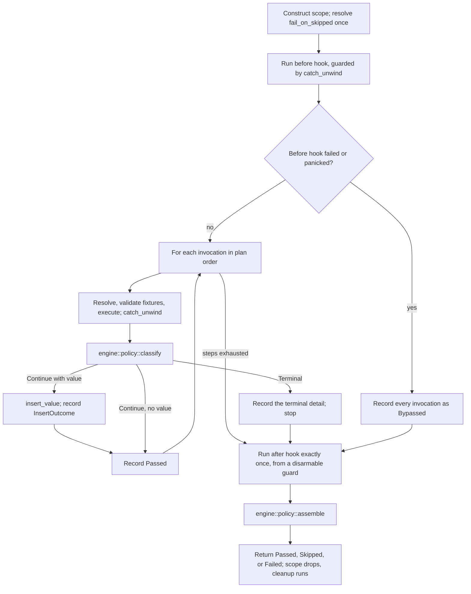

# Add parser-neutral scenario plan, outcome, and runner types (13.1.1)

This ExecPlan (execution plan) is a living document. The sections `Constraints`,
`Tolerances (exception triggers)`, `Risks`, `Progress`,
`Surprises & discoveries`, `Decision log`, `Outcomes & retrospective`,
`Conformance basis`, and `Verification plan` must be kept up to date as work
proceeds.

Status: IN PROGRESS — Stage A closed on 2026-09-19; D2 option (ii), D3, and D10
recorded as approved. EP-M1 is closed and gate-clean at `3a942230`; EP-M2 is in
progress.

## Purpose / big picture

Today the only way to run an `rstest-bdd` scenario is to let the `#[scenario]`
or `scenarios!` procedural macro generate a Rust test whose body contains a
hand-rolled step loop. That loop — not the runtime crate — decides what happens
when a step is skipped, when a step fails, where a returned value goes, and
which steps are reported as bypassed. The policy lives in quoted token streams,
so it cannot be unit-tested directly and cannot be reused by any caller that
did not start from a `.feature` file.

After this change the runtime crate `rstest-bdd` owns that policy in ordinary,
directly testable Rust. A caller builds a **scenario plan** — a name, tags, a
source identity, and an ordered list of step invocations — hands it to
`run_scenario` or `run_scenario_async`, and receives a **structured terminal
outcome** describing what every single invocation did, including the ones that
never ran.

Concretely, after this change a developer can write this, with no `.feature`
file, no procedural macro, and no panic on failure:

```rust,ignore
use rstest_bdd::runner::{
    ScenarioPlanBuilder, ScenarioScope, ScenarioStatus, StepStatus, run_scenario,
};
use rstest_bdd::{StepContext, StepKeyword};

let plan = ScenarioPlanBuilder::new("Add two numbers", "notes/arithmetic.md")
    .at_line(42)
    .step_at(StepKeyword::Given, "a calculator", 43)
    .step_at(StepKeyword::When, "I add 2 and 2", 44)
    .step_at(StepKeyword::Then, "the result is 4", 45)
    .build();

let mut ctx = StepContext::default();
let outcome = run_scenario(&plan, ScenarioScope::new(&mut ctx));

assert_eq!(outcome.status(), ScenarioStatus::Passed);
assert_eq!(outcome.steps().len(), 3);
let first = outcome.steps().first().expect("three steps produce three outcomes");
assert_eq!(first.status(), StepStatus::Passed);
assert_eq!(first.source().map(|s| s.line()), Some(43));
```

Every line of that example compiles against the API specified in
`Interfaces and dependencies`; a spike proving so is transcribed in
`Artefacts and notes`.

The observable wins are:

- A non-Gherkin frontend can execute the same registered steps that
  `#[scenario]` executes, keeping its own `.md`, `.txt`, or `.toml` source
  paths and line numbers in the outcome.
- A failed scenario returns data instead of panicking, so a caller chooses its
  own reporting and exit-code policy — while `#[must_use]` and a single
  canonical fold stop "returns data" from degrading into "fails silently".
- The `steps()` sequence is always complete and in plan order: after a terminal
  skip or failure, every remaining invocation appears as `Bypassed`, whether or
  not the `diagnostics` Cargo feature is enabled.

This step does **not** change the Gherkin macros. Migrating them is roadmap
13.2.1; proving an external frontend end to end is roadmap 13.3.1. This step
delivers the contract those two rely on.

## Definitions

Every term of art this plan uses, defined once. A reader who knows none of them
can still follow the rest of the document.

- **Step** — one `Given`/`When`/`Then` line. A **step definition** is the Rust
  function registered for it by `#[given]`/`#[when]`/`#[then]`. A **step
  invocation** is one occurrence of a step inside a scenario.
- **Registry** — the process-global `inventory`-populated map from
  `(keyword, pattern)` to step definition, in
  `crates/rstest-bdd/src/registry/mod.rs`. It is populated at link time; this
  plan adds no runtime registration.
- **Step wrapper** — the hidden function the `#[given]`/`#[when]`/`#[then]`
  macros generate around a user's step body. It performs argument extraction
  and, importantly here, `catch_unwind`.
- **Fixture** — a value supplied by `rstest` and made available to steps
  through `StepContext`. Implicit injection derives the fixture key from the
  parameter name and strips at most one leading underscore
  (`crates/rstest-bdd-macros/src/utils/pattern/mod.rs`,
  `normalize_param_name`), so `world` and `_world` both request the key `world`
  while `__world` requests `_world`. `#[from(name)]` binds the exact key `name`
  and bypasses that normalization entirely, so `#[from(_world)]` requests the
  literal `_world` key. `#[from]` with no argument requests the parameter's own
  normalized name, which is what an unannotated parameter already does, so it
  is documentary. The distinction matters to this plan because a step's
  parameter list is the only place a scenario's fixture requirements are
  stated, so any parser-neutral plan must reproduce the same key resolution
  rather than re-deriving it.
- **`StepContext`** — `crates/rstest-bdd/src/context/mod.rs`. A per-scenario
  map from fixture name to either a borrowed reference or an owned
  `RefCell<Box<dyn Any>>` cell, plus a second map of **step-returned override
  values**. Since ADR-012 its borrow methods take `&self` and return guards,
  while its insert methods still take `&mut self`.
- **Unique-type rule** — when a step function returns a value, the runtime
  offers it as an override for the one fixture whose type matches. Implemented
  by `StepContext::insert_value`, which returns `InsertOutcome::Inserted`,
  `NoMatch`, or `AmbiguousIgnored` (ADR-015).
- **Skip** — a step calls `rstest_bdd::skip!`, which panics with a
  `SkipRequest` payload. The step wrapper catches it and turns it into
  `StepExecution::Skipped`; `execute_step` then turns that into
  `ExecutionError::Skip`. A skip stops the scenario.
- **Bypassed** — a step that never ran because an earlier step skipped or
  failed. Today bypassed steps are only recorded into the diagnostics registry,
  and only when the `diagnostics` feature is on.
- **`allow_skipped`** — a compile-time boolean, `true` when the scenario or its
  feature carries the `@allow_skipped` tag.
- **`fail_on_skipped`** — a run-time boolean read by
  `rstest_bdd::config::fail_on_skipped()`. It resolves a process-local override
  (`config::set_fail_on_skipped`) first, then the `RSTEST_BDD_FAIL_ON_SKIPPED`
  environment variable, then `false`.
- **Forced failure** — `fail_on_skipped && !allow_skipped`. A skip that a
  caller is expected to treat as a failure.
- **False green** — a test that passes while failing to exercise what it was
  written to check. This repository has a whole roadmap step (11.3) devoted to
  eliminating a class of these, so it is treated here as the dominant failure
  mode, not a theoretical one.
- **AFIT** — `async fn` in a trait, stable since Rust 1.75 and therefore
  available at this workspace's minimum supported Rust version (MSRV) of 1.88.
  Its one limitation — no `dyn` compatibility without boxing — does not apply
  here, because hooks are dispatched statically.

## Signposted documentation and skills

Read these before starting, and return to them at the stages named.

### Signposted documentation

In reading order:

1. `docs/adr-018-parser-neutral-scenario-execution.md` — the contract. Read in
   full before Stage A.
2. `docs/adr-012-guard-based-stepcontext-borrowing.md` — the borrow and
   lifecycle model `ScenarioScope` builds on. Note what it does *not* define:
   lifecycle hooks.
3. `docs/adr-015-insert-outcome-for-step-return-overrides.md` — why
   `insert_value` returns `InsertOutcome`, and why discarding it is a defect.
4. `docs/rstest-bdd-design.md` §2.6 (runtime execution module), §3.11 (runtime
   module layout for contributors), and §2.7.6.5 (v0.7.0 redesign candidates).
5. `docs/testing-strategy.md` — especially *Invariants to prefer* and
   *Assertion posture*.
6. `docs/developers-guide.md` — *Assertion vocabulary*, *Bypassed-step
   recording contract*, *Step-return overrides and `InsertOutcome`*, *Test
   organization*, *nextest configuration*, and above all *`#[serial]`,
   `#[file_serial]`, and nextest test-groups*, which contradicts a naive
   reading of process isolation.
7. `docs/rust-testing-with-rstest-fixtures.md` and
   `docs/rust-doctest-dry-guide.md` — fixture and doctest conventions.
8. `docs/complexity-antipatterns-and-refactoring-strategies.md` — consult at
   Stage D before accepting the sync/async duplication shape.
9. `docs/users-guide.md` §*Skipping scenarios* and §*Asserting skipped
   outcomes* — the user-visible semantics that must not change.
10. `docs/gherkin-syntax.md` — only to confirm which concepts must **not** leak
    into the new types.
11. `docs/documentation-style-guide.md` — before writing any prose.
12. `clippy.toml`, the root `Cargo.toml` `[workspace.lints]` tables, and
    `dylint.toml` — the lint budget Constraint 8 summarizes.
13. `.config/nextest.toml` — timeouts and test groups, before adding any suite
    that could be slow.
14. `docs/adr-016-pinned-nightly-rustfmt.md` — `make fmt` and `make check-fmt`
    invoke a pinned nightly `rustfmt`.
15. `.github/workflows/mutation-testing.yml` — the `cargo-mutants` lane this
    plan leans on for negative controls.

### Signposted skills

With the stage at which each becomes relevant:

- `rust-router` — load first; it routes to the rest.
- `arch-crate-design` (Stage A) — module boundaries, public versus internal
  surface, and whether anything belongs in `rstest-bdd-policy`.
- `rust-types-and-apis` (Stage A and C) — opaque types, `#[non_exhaustive]`
  placement, builder ergonomics, and making illegal states unrepresentable.
- `rust-errors` (Stage C) — `ScenarioFailure` shape, `Display`/`Error`
  implementations, the no-panic boundary, and `catch_unwind` placement.
- `rust-memory-and-state` (Stage A) — `Cow<'static, str>` versus `Arc<str>`,
  and why the plan carries no lifetime.
- `rust-async-and-concurrency` (Stage C and D) — AFIT, the cancellation
  contract, and why the async runner takes `ScenarioScope` by value.
- `rust-unit-testing` (Stage B) — `rstest` fixtures, table tests, `#[serial]`,
  and `googletest`/`pretty_assertions`/`insta` selection.
- `proptest` (Stage B and D) — bounded step-sequence strategies and
  classification.
- `rust-verification` (Stage A) — confirm the method selection in *Verification
  plan*, including the decision not to reach for Kani or Verus.
- `nextest` (Stage B onwards) — test groups, `#[serial]` interaction,
  filtersets, and the 60-second slow timeout.
- `rust-unused-code` (Stage D) — if `dead_code` appears behind a feature gate.
- `addressing-whitaker-findings` (Stage D) — `make lint` runs the Whitaker
  Dylint suite; `no_expect_outside_tests` fires inside non-`#[cfg(test)]` test
  *helpers*, so use `let`-`else` and `panic!`, not `.expect()`.
- `arch-decision-records` (Stage D) — needed if D2 is *accepted*; see D7.
- `en-gb-oxendict` and `commit-message` (throughout).
- `codegraph-mcp` (Stage A) — prefer `codegraph_get_callers` and
  `codegraph_analyze_impact` over grep for structural questions.

## Constraints

These are hard invariants. Violating one requires escalation, not a workaround.

1. **Additive only.** `execute_step`, `execute_step_async`,
   `StepExecutionRequest`, `StepContext`, the `#[given]`, `#[when]`, `#[then]`,
   `#[scenario]`, and `scenarios!` macros, and every existing public item keep
   their current signatures and behaviour. `crates/rstest-bdd-macros` is not
   modified by this plan at all. One deliberate exception is permitted and
   named: adding `PartialEq`/`Eq` derives to `ExecutionError` and
   `MissingFixturesDetails`, which is additive on a `#[non_exhaustive]` type
   and is required so outcomes can be compared whole (see D9).
2. **No frontend *types* in the public runner surface.** No `gherkin`,
   Markdown, Trymark, process, snapshot, Clap, or reporter type may appear in
   the signature of any item under `rstest_bdd::runner`, whether directly, in a
   variant field, a bound, an associated type, or a re-export. Enforced by
   INV-11, not by review alone.
3. **The runner never panics, for any reason it can control.** An ordinary
   failure, a skip, a missing step, a missing fixture, a failing lifecycle
   hook, a *panicking* lifecycle hook, and a panicking step registered without
   a wrapper all produce a returned `ScenarioOutcome`. A panicking value
   destructor during cleanup is caught and **logged as a warning** rather than
   returned: `clear_values` drops the map whole, so a panic there leaves fewer
   values and never a half-visible one, and the field that would have carried
   it was dropped with the hooks under D2 option (ii) because a second failure
   channel defeats D13's single-fold contract. See D11.
4. **The outcome's step sequence is total and ordered.** For every plan,
   `outcome.steps().len() == plan.steps().len()`, entry `i` describes invocation
   `i`, and every entry after a terminal event is `Bypassed`. This holds
   identically with the `diagnostics` feature on and off, which requires a gate
   leg that does not exist today (see D4).
5. **No new dependency.** `proptest`, `googletest`, `pretty_assertions`,
   `insta`, `rstest`, `serial_test`, `temp-env`, `tracing`, and `tokio` are
   already available to `crates/rstest-bdd`; nothing else may be added without
   escalation. The `async-trait` crate is forbidden and `make lint` enforces
   its absence via `forbid-async-trait`. `metrics` is a workspace dependency
   but **not** a dependency of `rstest-bdd`, so metric emission is out of scope
   here and is deferred to 13.3.1.
6. **No runtime mutation of the global step registry.** Link-time `inventory`
   registration stays the only extension mechanism (ADR-018, *Extension
   boundary*).
7. **Source travels through the plan and the outcome, never out of an error.**
   The runner must not *add* source fields to `ExecutionError`, and must never
   infer a location by parsing an error string. It *does* populate the existing
   `StepExecutionRequest::feature_path` and `scenario_name`, from
   `plan.source()` and `plan.name()` respectively; ADR-018 *Source-neutral
   diagnostics* explicitly permits those legacy field names to remain during
   the additive migration. See D15 for the resulting wart and its follow-up.
8. **The workspace lint budget is not negotiable.** `make lint` runs Clippy
   with `-D warnings` over `--all-targets --all-features`, plus the Whitaker
   Dylint suite. The root `Cargo.toml` denies, among others, `unwrap_used`,
   `expect_used`, `indexing_slicing`, `missing_docs`,
   `missing_docs_in_private_items`, `missing_panics_doc`, and `unsafe_code`;
   `clippy.toml` sets `cognitive-complexity-threshold = 12`. Three consequences
   bind the implementation:
   - The engine may not index a slice. Use `.get(i)`, iterators, and `zip`.
   - No `.unwrap()` or `.expect()` outside `#[cfg(test)]`.
     `allow-expect-in-tests`
     does **not** cover helpers outside a `#[cfg(test)]` module or a `#[test]`
     function; use `let`-`else` with `panic!` there.
   - `unsafe_code` is denied, so the `ManuallyDrop` escape hatch is unavailable
     for the `ScenarioScope` destructor problem (see D2 and INV-14).
9. **No file over 400 lines.** `make lint` runs
   `scripts/check_rs_file_lengths.py`, whose exception list is
   `scripts/rs-length-allowlist.txt`. Do not add an entry for new code; split
   the file instead.
10. **Every module opens with a `//!` comment, and every item — public *and*
    private — carries a `///` doc comment**, because
    `missing_docs_in_private_items` is denied. `run_scenario` and
    `run_scenario_async` each carry a runnable rustdoc doctest; that is not
    optional, and a doctest must not touch process-global configuration (see
    AXIOM-7).
11. **en-GB-oxendict spelling** in all comments and prose, enforced by the
    `typos` gate. Never hand-edit `typos.toml`; edit
    `scripts/generate_typos_config.py` and regenerate. Note that `typos`
    rejects short capitalized tokens such as `AX`, which is why this plan's
    axioms are `AXIOM-n`.

## Tolerances (exception triggers)

Stop and escalate — do not improvise — when any of these is reached. These
figures were re-scoped after the design review pointed out that the first draft
would have tripped three of them before the second milestone, and a tolerance
that fires immediately trains its reader to ignore all of them.

- **Scope.** More than 36 files touched, or more than 4,500 net added lines
  across the whole plan. The expected shape is roughly 11 new source files, 9
  new test files, 1 feature file, snapshots, and 5 edited documents.
- **Public interface.** Any change to an *existing* public signature, other
  than the one named exception in Constraint 1.
- **Dependencies.** Any new entry in `[workspace.dependencies]` or in
  `crates/rstest-bdd/Cargo.toml`, including dev-dependencies.
- **Macro crate.** Any edit under `crates/rstest-bdd-macros/`.
- **Iterations.** A gate that still fails after 3 focused fix attempts.
- **Cancellation.** If the async cancellation contract cannot be observed
  deterministically without a new dependency or a timing-dependent test, stop
  and present options.
- **Time.** Any single milestone exceeding 8 hours of work.
- **Ambiguity.** Any point where ADR-018's binding text admits two readings
  producing materially different public types.

If the scope or time tolerance is approached rather than breached, the
preferred remedy is to split this item into **13.1.1a** (source, plan, outcome,
synchronous runner) and **13.1.1b** (skip parity, asynchronous runner,
cancellation, properties), which also gives the maintainer a decision point
between them. Raise that before spending the tolerance.

## Risks

- **Risk: the lifecycle-hook surface is a permanent public commitment made
  ahead of the ADR that should define it.** Severity: high. Likelihood: high
  (already observed). ADR-018 requires before- and after-scenario hooks
  "according to ADR 012"; ADR-012 defines none, and design document §2.7.6.5
  still lists "first-class world lifecycle hooks" as a *candidate*. Shipping
  `Lifecycle` now means reconciling a per-run `&mut self` trait with a future
  global registry — a change, not an extension. Mitigation: D2 presents three
  options including a third the review surfaced, under which
  `ScenarioScope<'ctx, H = NoHooks>` ships now with its defaulted type
  parameter and the traits are deferred. That is source-compatible for every
  caller writing `ScenarioScope::new(&mut ctx)`, so deferring costs almost
  nothing in forward compatibility.

- **Risk: a returned outcome is dropped and a failure becomes invisible.**
  Severity: high. Likelihood: medium. Today a failure panics, so a human always
  sees it. Constraint 3 removes that channel. Mitigation: `#[must_use]` on
  `ScenarioOutcome` itself (which covers the awaited async form, unlike
  `#[must_use]` on the function); exactly one canonical fold,
  `into_harness_result`, documented as the only sanctioned success test;
  `Display`; and `tracing` events on every terminal path. See D13 and D14.

- **Risk: a step-returned value silently fails to reach later steps.**
  Severity: high. Likelihood: medium. `insert_value` returns `InsertOutcome`,
  whose `NoMatch` variant emits no warning at all. The existing generated loop
  discards it with `let _ = ctx.insert_value(val)`, and a comment there wrongly
  claims both dropped cases are logged. Mitigation: INV-12 records the
  insertion outcome on `StepOutcome` and requires `NoMatch` to be generated and
  classified by the property suite.

- **Risk: the sync and async runners are not equivalent for `Async`-mode steps,
  and nothing says so.** Severity: medium. Likelihood: high (already true).
  `execute_step` calls `(step.run)` without consulting `execution_mode`. For an
  `Async`-registered step the generated wrapper's `run` either blocks on a
  fresh current-thread runtime or, if a runtime is already current, polls once
  and returns an error if the future is pending. Mitigation: AXIOM-2 is
  restated to its true scope; INV-15 documents and tests the
  `Async`-under-`run_scenario` behaviour, including from inside a live Tokio
  runtime.

- **Risk: `fail_on_skipped` tests interfere with each other, and doctests
  cannot be serialized at all.** Severity: medium. Likelihood: high. The
  override is a process-global `AtomicU8` with an environment fallback.
  `make test` runs nextest *and* `cargo test --doc --workspace`, and this is an
  edition-2024 workspace, where doctests are merged into one binary and run in
  parallel. `#[serial]` cannot be applied to a doctest. Mitigation: D10 moves
  the resolution into `ScenarioScope` construction, with an explicit
  `with_skip_policy` override. That makes INV-9 true by construction, removes
  `#[serial]` from most of the matrix, and makes doctests safe.

- **Risk: sync and async policy drift into two implementations.**
  Severity: medium. Likelihood: medium. Mitigation: `engine::classify` owns the
  stop decision so neither driver branches on a step result, `engine::assemble`
  owns everything else, and one `Lifecycle` trait whose async methods default
  to the sync ones makes hook drift impossible by construction. INV-5 pins the
  rest, with its known gap (async-only steps) recorded rather than glossed.

- **Risk: the new outcome types duplicate `rstest_bdd::reporting`.**
  Severity: medium. Likelihood: medium. There are in fact three overlapping
  models — the new one, `reporting`, and the `BypassedScenario` diagnostics
  registry — and only the new one can express failure at all:
  `reporting::ScenarioStatus` has exactly `Passed` and
  `Skipped(SkippedScenario)`. Mitigation: D5 names `runner` canonical, records
  the missing failure representation as a 13.2.1 obligation, and lands a
  test-gated conversion at EP-M2 as a structural smoke test.

- **Risk: a bounded property test passes vacuously.**
  Severity: medium. Likelihood: medium. A generator that rarely produces
  terminal events, or one whose shortest cases dominate, makes INV-1 and INV-2
  trivially true. Mitigation: every property test records `proptest`
  classification counters and asserts each material class was reached; INV-13
  forces the empty plan to have a defined, non-silently-passing outcome; and
  negative controls are provided by synthetic-input tests plus the repository's
  existing `cargo-mutants` lane rather than by fault injection in production
  code (D12).

- **Risk: outline code size regresses at 13.2.1.**
  Severity: low. Likelihood: medium. The macro currently emits a `'static` 2-D
  `const` table for outlines. A plan type containing `Vec` or `Arc` cannot
  appear in a `const`. Mitigation: `SourcePath::Static` and `Cow::Borrowed`
  keep every *string* in the plan const-constructible, so only the `Vec` spines
  cost anything; measure with `cargo llvm-lines` at 13.2.1 and net it against
  the shared `run_scenario` monomorphization, which should shrink per-test
  codegen.

- **Risk: suite concurrency is capped by a non-`Send` future.**
  Severity: low for 13.1.1, high for 13.3.1. Likelihood: certain.
  `StepScopeGuard` is `!Send`, so `run_scenario_async`'s future is not `Send`
  and cannot be `tokio::spawn`ed. A frontend must use a current-thread runtime
  or a thread-per-scenario runtime. Mitigation: document it here and add a note
  to roadmap 13.3.1 so it is not discovered empirically.

## Progress

- [x] (2026-09-14) Branch renamed to `13-1-1-add-parser-neutral-types` and
  pushed, tracking `origin/13-1-1-add-parser-neutral-types`.
- [x] (2026-09-14) Reconnaissance of the runtime crate, the macro-generated
  scenario loop, and the gate machinery completed.
- [x] (2026-09-14) Prior art reviewed: `cucumber-rs`'s `Parser`/`Runner`/
  `Writer` split, the Cucumber Messages status model, and Gauge's hook and
  pre/post-hook-failure model.
- [x] (2026-09-14) First draft written.
- [x] (2026-09-14) Six-lens design review completed; 8 design flaws and 20
  further findings folded in. See `Surprises & discoveries` and `Decision log`.
- [x] (2026-09-14) Four spikes compiled and run, validating the revised design.
  Transcripts in `Artefacts and notes`.
- [x] (2026-09-19) Stage A closed. The maintainer instructed that the
  preliminary decisions be recorded as approved, so **D2 option (ii)**, **D3**,
  and **D10** are approved as recommended. D2 option (ii) means EP-M4 is struck
  and ADR-018's lifecycle matrix is discharged only in part; that deviation is
  recorded under D2 and must be reflected in `docs/roadmap.md`.
- [x] (2026-09-19) EP-M1: source, plan, and outcome types. `runner/` exists
  with `source.rs`, `plan.rs`, `plan/builder.rs`, `outcome/mod.rs`,
  `outcome/step.rs`, `outcome/failure.rs`, and three test files under
  `runner/tests/`. Sixteen focused tests pass; scoped clippy is clean under
  `-D warnings`; the pinned nightly rustfmt reports no diff;
  `scripts/check_rs_file_lengths.py` exits 0 with no allowlist entry. Four
  public items were invented during implementation and are recorded in the
  Decision log: `ValueFate` (a projection of `InsertOutcome`, which cannot be
  `Clone`/`Eq` and so cannot sit inside `StepOutcome`), and the `EmptyPlan`/
  `ForcedSkip`/`EmptyPlan`-site trio that gives INV-13's fold an error to
  return. `LifecycleError` and `ScenarioOutcome::cleanup_error()` were dropped
  as corollaries of D2 option (ii).
- [x] (2026-09-19) EP-M1 gate closure: the full deterministic suite. The
  first `make lint` / `make test` / `make markdownlint` run failed on three
  unrelated-looking causes, all now resolved or explained; see
  `Surprises & discoveries`. In brief: (1) `make lint` failed with five Whitaker
  `no_std_fs_operations` findings in `runner/tests/surface.rs`, fixed by
  rewriting the scan onto `cap-std`'s `fs_utf8` API rather than by adding a
  `dylint.toml` exclusion; (2) `make markdownlint` failed on one `-ise`
  spelling in `outcome/failure.rs`, corrected to `-ize` per `typos.toml`; (3) a
  `cargo-bdd` timeout in `make test` was shown to be environmental by an
  isolated re-run (94s against a 180s budget), so no change was made. The
  `surface.rs` rewrite additionally repaired a non-vacuity guard that had been
  passing for the wrong reason, verified by mutation. Closed against commit
  `85b5fabe`. All five gates ran to completion and passed: `make check-fmt`
  (4s), `make lint` (17s), `make test` (611s), `make markdownlint` (12s),
  `make nixie` (<1s). `make test` reported
  `1944 tests run: 1944 passed, 7 skipped`, with 0 cancelled, 0 timed out and 0
  failed; the doctest pass reported 172 passed / 0 failed, and pytest 234
  passed. The `cargo-bdd::cli list_steps_runs` test that had previously been
  terminated at 180s now passed in 2.844s — a 63x margin, confirming the
  timeout was cold-cache and not a regression; the 78 tests it had cancelled
  executed here. This run also reached the whole of `make lint` for the first
  time: clippy, `cargo doc`, `lint-whitaker`, and the Python leg (ruff, PyLint
  10.00/10, the df12 plugin 10.00/10, `ambrleaks`) plus all five checker
  scripts. The gate suite was run by a `scrutineer` sub-agent on a settled,
  committed tree, so the evidence is attached to a revision rather than to a
  working directory.
- [x] (2026-09-19) EP-M1 second gate closure: the rebase and the CodeRabbit
  fixes re-verified. The first full-suite run at the rebased revision
  (`28dddcb5`) failed three gates, all traceable to the previous day's cleanup
  work rather than to the rebase itself: `make lint` rejected the new column
  guard with `option_if_let_else`, `make check-fmt` found a rustfmt diff in
  `surface.rs`, and `make markdownlint` found MD013 on the INV-1 domain
  enumeration. All three are fixed at `d3ff88b5`, and re-verified on the
  settled tree: `make lint` rc=0 (39s), `make check-fmt` rc=0 (3s),
  `make markdownlint` rc=0 with `Summary: 0 error(s)` (16s). See
  `Surprises & discoveries` for the two formatter behaviours behind the third
  one, and for the corrected account of the column guard, which had three forms
  before one satisfied both the lint and the language. `make test` and
  `make nixie` passed at `28dddcb5` and were unaffected by these deltas; the
  `make test` re-run against `d3ff88b5` is recorded below.

  The full deterministic suite then ran to completion against the settled tree
  at `035117e6`, and all five gates passed: `make check-fmt` rc=0 (3s),
  `make lint` rc=0 (39s), `make test` rc=0 (186s), `make markdownlint` rc=0
  (16s), `make nixie` rc=0 (1s). The `make test` result was checked against the
  log rather than against the exit code alone: nextest reported
  `1950 tests run: 1950 passed, 7 skipped` with a count of zero for each of
  `FAIL`, `CANCELLED`, `TIMEOUT`, and `LEAK`; all 16 doctest suites reported
  `ok` with zero `FAILED`; and pytest reported `244 passed`. The four
  `runner::tests::surface` tests pass by name, including the
  `an_upper_case_extension_is_still_source` guard added while clearing the
  CodeRabbit findings. EP-M1 is closed against `035117e6`.

- [x] **EP-M1 CodeRabbit, second pass, cleared 2026-09-19 at `99a93364`.** Nine
  findings collapsing to six distinct asks; three actioned, three rejected with
  reasons, all recorded in `Surprises & discoveries`. The five gates were
  re-run green before the review was requested and again after the fixes:
  `make check-fmt` rc=0, `make lint` rc=0, `make test` rc=0 with
  `1951 tests run: 1951 passed, 7 skipped` and zero failure markers,
  `make markdownlint` rc=0 (`Summary: 0 error(s)`), `make nixie` rc=0. The first
  `make lint` after the fixes failed on `module_max_lines` because
  `surface.rs` reached 429 lines; the tree walk moved to
  `runner/tests/surface/walk.rs` along its real seam, which is why the surface
  tests now report as `runner::tests::surface::walk::*`.

- [~] EP-M2: synchronous runner, engine split, and the sequence properties.
  *(2026-09-19) `runner_sequence_props.rs` is written, split, lint-clean and
  green: fifteen tests, all passing, against a full
  `cargo nextest run -p rstest-bdd` of `703 tests run: 703 passed, 7 skipped`.
  The property suite is `crates/rstest-bdd/tests/runner_sequence_props.rs` with
  its support modules under `tests/runner_sequence_props/`: `invariants.rs`
  (the four property bodies), `named_witnesses.rs` (the per-kind and per-class
  witnesses), `controls.rs` (the negative controls and the generator's own
  domain checks), and `sequence/` — `mod.rs` for the vocabulary, `run.rs` for
  the harness and its predicates, `witnesses.rs` for the non-vacuity
  accumulator, `generator.rs` for the strategy and the crafted shapes, and
  `steps/` (`mod.rs` for the registrations, `names.rs` for the pattern text).
  The support files are reached by `#[path]`, because a Cargo integration
  target is a single file: `mod controls;` there resolves to
  `tests/controls.rs`, not under a directory named after the target.

  Four defects were found by *running* the suite rather than by reading it, and
  all four are recorded in `Surprises & discoveries`: an attribute step cannot
  take a `StepContext`, so the observer is registered raw; the INV-3
  non-vacuity witness as first drafted was unsatisfiable, because it required a
  value to travel backwards; the per-kind control's expected execution count
  ignored that two kinds are terminal *without* reaching their handler; and one
  nextest `LEAK` classification is a stderr-timing artefact rather than a
  failure. Five more were found by *gating* it — the two files were over the
  400-line cap, and the suite had six pre-existing Clippy findings including two
  `deny`-level ones — also recorded there. An earlier note here claimed two of
  its four invariants were EP-M3-bound — INV-5 needs `run_scenario_async`, and
  INV-1/INV-2's domain includes terminal kinds only the async driver exercises
  as a comparable path. **The first half of that stands and the second was
  wrong**, on a reading taken while the file was still unwritten: INV-1, INV-2,
  INV-3, and INV-12 can all be discharged against the synchronous driver alone,
  because every terminal kind the domain enumerates has a sync-reachable
  registration — `panic` through a raw `step!` handler, which
  `runner_panics.rs` already demonstrates. So the file is split by necessity
  rather than by preference: INV-1, INV-2, INV-3, and INV-12 land here, and
  only INV-5's clause remains EP-M3-bound, recorded in-file as such rather than
  silently omitted. Recorded as partial rather than done for that one reason.*
  **Opened 2026-09-19.** The first act was to revise D16, and it is done: see
  D18 in `Decision log` for why its `Stop(ScenarioFailure)` cannot express a
  permitted skip. D18's `StepDecision` is checked into
  `Interfaces and dependencies` as the settled engine decomposition, together
  with a `Terminal` and a `SkipPolicy`, which EP-M2 mirrors while implementing
  rather than re-deriving. The two things a reader should not have to
  reconstruct: the driver keeps the error and hands `classify` a borrow, then
  moves it into `Terminal::Fail`; and a skip never stores a `failure`, forced
  or not, because `into_harness_result` derives that at fold time.

  **Red observed 2026-09-19.** `runner/tests/wire.rs` — three tests asserting
  that a run is *observable* rather than merely well-formed — failed at the
  `run_scenario` stub's `panic!("not implemented")`, which is the intended
  reason and not a typo. Full run: 191 tests, 187 passed, 4 failed (the three
  new plus the pre-existing `PERMISSIVE` constant bug below).

  **Green observed 2026-09-19, `make test` equivalent for the crate.** 192
  tests, 192 passed. What is implemented and passing:

  1. `runner/scope.rs` — `NoHooks`, `CleanupGuard`, and `ScenarioScope` with
     `new` / `with_skip_policy` / `split`. `CleanupGuard` holds the *only*
     `&mut StepContext`, so cleanup cannot be bypassed rather than merely being
     likely to run; there is deliberately no `armed` flag (below).
  2. `runner/engine/drive_sync.rs` — `drive` and `execute`, containing no `if`
     on a step result. `TableView` rebuilds the plan's
     `Vec<Vec<Cow<'static, str>>>` as the `&[&[&str]]` a
     `StepExecutionRequest` borrows, in two owned buffers on the stack frame.
  3. `context::StepContext::clear_values`, `pub(crate)`, called only from
     `CleanupGuard::drop` under `catch_unwind`.
  4. `tests/runner_wire.rs` — the first end-to-end callers of `run_scenario`.
     Four tests, covering INV-1 (termination *and* completeness), INV-12, INV-13,
     and the registry-verbatim error.

  **Green held through the first lint sweep, at the cost of five Clippy
  findings and three line-cap violations.** All eight are now fixed. The Clippy
  set was `trivially_copy_pass_by_ref` twice (`forces_failure` takes `self`),
  `double_must_use` (`assemble` returns a type that already carries the
  attribute), `elidable_lifetime_names`
  (`impl<'fix, H> ScenarioScope<'_, 'fix, H>`), and `manual_assert_eq`. The
  line caps are worth recording because two of the three were *not* where the
  first read suggested: `policy_tests.rs` was 495 lines and is now a directory
  of five files, `context/mod.rs` was 408 and is now 336, and `runner_wire.rs`'s
  `expect_used` was in a helper rather than a test body, so
  `allow-expect-in-tests` did not cover it.

  One planned refactor was dropped as unnecessary. The intent had been to pull
  `try_borrow`/`try_borrow_mut` into a new `context/borrow.rs`, but moving the
  closed ADR-007 wrapper block instead took `mod.rs` under the cap with one
  extraction rather than two, and the ADR-007 block is the better seam: it is
  self-contained, its in-place comment already declared the block closed, and
  the `try_borrow` pair is called from `entry.rs` and `guards.rs` and reads
  better beside the fixture map it reaches into. `context/harness.rs` is that
  extraction, unchanged apart from the move.

  The D5 conversion is now built: `reporting/conversion.rs` holds a private
  `record_from(&ScenarioPlan, &ScenarioOutcome) -> Result<ScenarioRecord, Gap>`
  with its signature pinned by an anonymous `const _:` coercion, and
  `reporting/conversion/tests.rs` holds six unit tests. The three `Gap`
  variants are D5's 13.2.1 obligations made executable, and building it
  corrected two of the three as the decision log records.

  D14 is now complete in source and covered by tests, which is itself a
  correction: the plan named the four events and assigned them **no artefact**,
  so the obligation had no way to fail. The four are emitted from
  `engine/drive_sync.rs` — the span carries `name`/`source`/`line`/`steps`/
  `allow_skipped`, the policy `debug!` logs both inputs and both outputs, the
  per-step `trace!` is emitted from the loop plus the bypass `map` so one site
  each covers every status, and the two terminal `warn!`s carry `location`
  (`path:line`, rendered by a driver-local `location()` helper because
  `SourceLocation` deliberately has no `Display`) and, for a failure, `kind`.
  The artefact is `crates/rstest-bdd/tests/runner_instrumentation.rs`: six
  tests over a hand-rolled `Subscriber` recording field *names* and levels.

  The artefact's path is the second correction. D14's tests were first written
  as a unit module at `src/runner/tests/instrumentation.rs`, following D19, and
  **every one of them panicked** at `registry/mod.rs:238` — the same duplicate
  the `Surprises` entry below records. D21 already says a step-resolving test
  is an integration test, but the constraint is stronger than D21 states: the
  unit-test binary cannot reach the registry *at all*, so it can observe only
  an unresolvable invocation. That would have left `Passed` and `Skipped`
  unobserved, which are two of the four statuses D14's per-step event exists to
  distinguish. The limit is now written into the file's module docs.

  The tests were falsified rather than trusted: deleting `allow_skipped` from
  the span, `location` from the failure warning, and `has_message` from the
  skip warning each failed exactly the test naming that field, and nothing else.

  **D14 committed at `cf4150a5`.** Formatting is gate-clean, and the last gate
  run before the commit was `make check-fmt` plus `markdownlint` plus `nixie`.
  The reflow mattered: `make check-fmt` had gone red on the plan's own Markdown
  (`mdtablefix --check` reported `+26 -26`), which was fixed with the canonical
  `mdtablefix --in-place` invocation rather than by hand, and `markdownlint`
  was then re-run even though `check-fmt` was green — `mdtablefix --wrap` can
  join an inline-code span past 80 columns, and `markdownlint` is the gate that
  rejects the result, so a green `check-fmt` does not imply a green
  `markdownlint` on a revision whose Markdown was just reflowed. It did not
  materialize here; the plan's hazard note now says to check regardless.

  Outstanding for EP-M2: the two behavioural scenarios, `tests/modes.rs` for
  INV-15, `crates/rstest-bdd/tests/runner_sequence_props.rs`,
  `tests/completeness.rs`, and `tests/skip_parity.rs`.

  **EP-M2 test artefacts closed at `874e12f0`.** Four of the five are now
  written and green; only `runner_sequence_props.rs` is outstanding, and INV-5
  needs `run_scenario_async`, so that file is EP-M3-bound as well.

  `tests/completeness.rs` (INV-2, INV-13) asserts the accounting end to end
  rather than inferring it from the engine's unit tests, with step lines 3, 4,
  5, 6 against a plan line of 99 so a runner that copied the plan's line or
  renumbered from zero fails. The bypassed-tail count is asserted directly,
  because the per-entry loop can only check a bypassed branch that exists. The
  one-step passing plan is the control that separates "the fold refuses empty
  plans" from "the fold refuses everything".

  `tests/skip_parity.rs` (INV-6, INV-9) writes out the full four-row product
  **and** gives the discriminating `(true, true)` row its own test, because
  three of the four rows agree under either candidate operator: only that row
  separates `!allow_skipped && fail_on_skipped` from `||`, `!=`, or a forgotten
  negation, so a future edit dropping a table case could silently remove the
  only case that has discriminating power. The first run failed — case inputs
  had been transposed against their labels — and the assertion caught its own
  setup error.

  One classification finding, recorded because it is a trap for the *next*
  person who writes a failing step: an `assert_eq!` inside a macro-registered
  step body reaches the runner as `FailureKind::Panic`, not `Assertion`. The
  wrapper's own `catch_unwind` converts it to a `PanicError` before the driver
  sees it; `Assertion` is the label for a handler that *returns* a
  `StepError::ExecutionError`. `completeness.rs` pins the end-to-end answer as
  `Panic`, and that is what would catch a boundary that swallowed the panic and
  relabelled it as a returned error.

  `tests/parser_neutral_runner.rs` with
  `tests/features/parser_neutral_runner.feature` binds the plan's first two
  behavioural scenarios. The steps build and run plans through the new API
  while the scenarios are executed by the *existing, unmigrated* macro path, so
  a green result is not the runner agreeing with itself. Two things are worth
  carrying forward. First, a negative control was run: perturbing one expected
  source line in the feature changes what the step receives and fails its
  assertion, so the scenarios are genuinely bound rather than silently skipped.
  Second, the specification's **third** scenario, "The asynchronous runner
  agrees with the synchronous runner", is **cut here** rather than bound — its
  `When` step needs `run_scenario_async`, which does not exist until EP-M3, so
  the step would not compile. That is D14's own rule, that an executable
  scenario may only assert observable behaviour of code that exists, and not a
  new decision; it lands with EP-M3.

  `tests/modes.rs` (INV-15) asserts the two runtime positions concretely rather
  than comparing them, because "the outcomes differ" is satisfied by a witness
  that fails in both. A resume counter makes the step demonstrably multi-poll —
  three resumptions outside a runtime, zero inside one, where the wrapper polls
  once and reports the diagnostic. The non-suspending sibling is the control
  that separates "a runtime is current" from "the step suspended", and it was
  falsified rather than trusted: giving it a single real `.await` flips only
  its in-runtime case to `Failed`. The first attempt at that mutation was inert
  — a `yield_now()` future that is never awaited does nothing, which the
  compiler warned about — so the mutation was redone with the `.await` present.

  **Two further gates cleared at `c3bc3147`, both of which were exposed only
  once the earlier failures were fixed.** A full sequential gate run at
  `4ebe45eb` reported `typecheck`, `test`, and `markdownlint` green but
  `check-fmt` and `lint` red, and each red was a *different* failure from the
  one that had been repaired just before it. This is worth recording as a
  pattern rather than as two incidents: a gate that aborts at its first failing
  step hides every step after it, so repairing one failure reveals the next and
  a "green except for X" report from an earlier revision can be stale in the
  direction of optimism.

  `make lint` **regressed**, which is the stronger finding: it recorded exit 0
  at `e6f92be4` and exit 2 here, so the four new suites introduced it. Five
  `no_unwrap_or_else_panic` errors, all deny-by-default, at
  `tests/modes.rs:102` and `tests/parser_neutral_runner.rs:97,123,148,162`.
  Four of the five are in **non-test helper functions** — the two `#[given]`
  steps, the `#[when]` step, and the `outcome` helper — which is exactly where
  the rule bites, because it denies the closure form outside `#[test]` bodies
  while permitting it inside them. The fix is ADR-013's
  `let ... else { panic!(..) }` shape, already used by `completeness.rs` and
  `skip_parity.rs`; those two suites were clean for precisely that reason, so
  the repo already contained the answer and the two outliers were mine. One
  site needed a named scrutinee, because its diagnostic is built from the
  `Result` rather than from a panic message and `let ... else` does expose the
  scrutinee to the `else` block:
  `let Ok(runtime) = built else { panic!("{built:?}") }`. Note also that
  `lint-whitaker` aborts before `lint-python` and the six `scripts/check_*.py`
  checks run, so the earlier green `make lint` at `e6f92be4` had never covered
  them either; the re-run at `c3bc3147` is the first that did, and all of them
  pass.

  `make check-fmt` failed on the plan's own Markdown, `mdtablefix --check`
  reporting `+157 -154`. This drift **predates** the four suites and traces
  back through `83a240f1`, `f5f0ec3a`, `e6f92be4`, and earlier to `3ee3f9db`;
  it was invisible because `check-fmt` had aborted at the rustfmt step in every
  run until `f5f0ec3a` fixed the pinned-nightly drift. The reflow is prose, not
  table repair — it joins and splits ordinary wrapped paragraph lines,
  including across a bold-run boundary. `mdtablefix` is idempotent here, so
  this was a genuine unformatted state and not a formatter oscillation, and CI
  at the pinned version would have reproduced it. Fixed with the canonical
  `mdtablefix --in-place` invocation rather than by hand, per the hazard note
  above, and confirmed to be a **pure whitespace change**: the file's token
  multiset is identical before and after, which is the check that distinguishes
  reflow from content loss on a document this large. Re-running `markdownlint`
  afterwards confirmed the reflow had not joined an inline-code span past 80
  columns — the failure mode the note warns about — so the two Markdown gates
  are simultaneously green rather than trading one for the other.

  Gate evidence at `c3bc3147`, run sequentially: `make lint` EXIT=0,
  `make check-fmt` EXIT=0, `markdownlint` `Summary: 0 error(s)` over 121 files,
  and
  `cargo nextest run -p rstest-bdd -E 'binary(parser_neutral_runner) |
  binary(modes)'`
  reporting 6 tests run, 6 passed, 0 skipped.

- [x] (2026-09-19) EP-M2's D11 panic boundary implemented, having been found
  absent. `crates/rstest-bdd/src/execution/unwind.rs` is new and both
  `execute_step` and `execute_step_async` pass through it; the sync path uses
  `catch_unwind`, the async path `catch_unwind_future` per poll, and both end
  in one `from_payload` so the two registration forms cannot disagree.
  Placement, the three rejected alternatives, and the `function` field's
  `file:line` fallback are D22. The five tests are
  `crates/rstest-bdd/tests/runner_panics.rs` plus its `runner_panics/mod.rs`
  companion, which holds the raw `step!` registration that has no wrapper. Each
  boundary was verified by removing it and observing exactly its own test fail
  — the negative control matters more than usual here, because the first red
  run was an abort caused by the test harness itself and was briefly misread as
  the driver failing *harder* than it did. `engine/drive_sync.rs`'s `# Panics`
  section, which documented the gap as "owned by D11", now states the boundary
  is in place. Not yet gated: the full deterministic suite has not been re-run
  against this revision.
- [-] EP-M3: asynchronous runner and cancellation. **The milestone's commit
  gates are green; what remains is the named `cargo-mutants` control.**
  - [x] `run_scenario_async`, the shared `engine/drive.rs` step handling, and
    the third behavioural scenario. Committed in `9f4ca8c7`.
  - [x] INV-10's step case, in `crates/rstest-bdd/tests/runner_cancel.rs`, with
    the three hardening requirements and two non-vacuity controls. D25 records
    the design, including a third withdrawn claim. Committed in `854b8186`.
  - [x] INV-5's property in `crates/rstest-bdd/tests/runner_sequence_props.rs`,
    in a new `equivalence` module, with `run_case_async` beside `run_case` in
    `sequence/run.rs`. Whole-`Run` comparison, two in-suite controls, and one
    bespoke mutation run and recorded. The file's module documentation, which
    previously said INV-5 lands with EP-M3, now describes it.
  - [x] The commit gates for this milestone. The first run was **red**: three
    gates failed, and two further failures were masked behind early recipe
    aborts. Every finding is fixed and the second run is green —
    `check-fmt`, `lint` (Clippy *and* Whitaker), `typecheck`, `test`
    (2041 Rust tests, 244 Python), `spelling`, `markdownlint`, and `nixie`.
    See the Surprises entry on what the first run cost and why.
  - [ ] The `cargo-mutants` negative control for INV-5 over
    `runner/engine/drive_async.rs` — the plan's named control for that
    invariant. A bespoke mutation was run in its place and did catch the
    property, which is evidence but not the same evidence: `cargo-mutants`
    enumerates mutations this hand-picked one does not.
- [x] ~~EP-M4: lifecycle hooks and the lifecycle matrix~~ — struck by D2
  option (ii).
- [ ] EP-M5: documentation, snapshots, and the full gate.

## Surprises & discoveries

- **Observation:** a unit test inside `rstest-bdd` cannot resolve *any* step,
  and this has nothing to do with the runner. Evidence:
  `crates/rstest-bdd/src/registry/introspection.rs` registers
  `DUPLICATE_PATTERN` twice — deliberately, so that `duplicate_steps` has a
  duplicate to find — and the first lookup in a process builds `STEP_MAP`,
  whose duplicate `assert!` (`src/registry/mod.rs:238`) fires on it. Every wire
  test panicked there, at `registry/mod.rs:238`, reporting
  `duplicate step for 'When' + 'introspection duplicate step'`. Impact: the
  three end-to-end tests were moved from `src/runner/tests/wire.rs` to
  `crates/rstest-bdd/tests/runner_wire.rs`. Two consequences worth keeping. The
  move is not a workaround: `run_scenario` is public API and these are its
  first end-to-end callers, so an integration test is the honest home. But it
  *also* means the Red stage masked the hazard — the stub panicked before the
  registry was ever reached, which is exactly the class of blindness a Red
  stage is supposed to expose rather than create. The hazard is live for any
  future in-crate registry lookup, and is not caused by this milestone.

  **Second sighting, at EP-M2, and it is stronger than D21 records.** D21 says
  a runner test that *resolves a step* must be an integration test. The actual
  constraint is that the unit-test binary cannot reach the registry at all, so
  a runner test that merely *executes* must be one too, whether or not its step
  resolves. Writing D14's instrumentation tests as a unit module
  (`src/runner/tests/instrumentation.rs`) put all six in that trap; the panic
  was immediate and identical. The distinction matters because D21's phrasing
  reads as permission to keep a non-resolving runner test in the unit binary,
  and that is exactly the case that appears to work: a plan naming no
  registered step does fail, cleanly and for the right printed reason, so the
  test passes. What it silently cannot do is produce `Passed` or `Skipped` —
  the two statuses most of the runner's behaviour is about. A test suite built
  that way would be green and would have stopped observing the runner.

- **Observation:** a step function has no way to receive the `StepContext`.
  Evidence: no step in the workspace takes one —
  `rg 'fn .*ctx: &mut StepContext' crates/rstest-bdd/tests/` returned only this
  milestone's own new file. The macro classifies such a parameter as a *fixture
  requirement* named `ctx`, so the step fails validation with
  `MissingFixtures { missing: ["ctx"] }`. Impact: the first draft of
  `runner_wire.rs` was written against an assumption that does not hold. The
  driver owns the context; a step sees only its fixtures. This is not a defect
  the milestone needed to fix — but it *is* the reason a returned value, and
  not a direct context touch, is how a step communicates anything outward,
  which is the whole point of INV-12.

- **Observation:** a by-reference step parameter is served from *mutable*
  fixture storage, and its `TypeId` is the referent's. Evidence: a step taking
  `counter: &'a Cell<u32>` reported
  `MissingFixture { name: "counter", ty: "Counter < '_ >" }` when the fixture
  was registered with `insert("counter", &cell)`; registering the
  `StepContext::owned_cell(Cell::new(…))` with `insert_owned::<Cell<u32>>` made
  it resolve. The generated guard enum has `Owned(FixtureRef<'a, T>)` and
  `Shared(FixtureRef<'a, &'a T>)`. Impact: this is the pre-existing
  fixture-typing convention, not a runner behaviour, and it cost three
  iterations to discover by error message alone. Recorded here so the two
  behavioural scenarios do not rediscover it.

- **Observation:**
  `#[cfg_attr(not(test), expect(dead_code, reason = "constructed by the EP-M2 engine"))]`
  became *unfulfilled* rather than satisfied the moment the driver landed.
  Evidence: seven `unfulfilled_lint_expectations` warnings, five in
  `runner/outcome/step.rs` and two in `runner/outcome/mod.rs`. Impact: all
  seven attributes were deleted. Worth noting for EP-M3: the same attribute
  pattern will need the same treatment on whatever the async driver is the
  first non-test constructor of, and `-D warnings` makes the failure loud
  rather than silent, which is the correct trade.

- **Observation:** `SkipPolicy`'s fields are `pub(crate)`, so a test *can* write
  a raw struct literal, and doing so silently encodes a pre-resolution shape.
  Evidence: `PERMISSIVE` was written as
  `SkipPolicy { allow_skipped: false, fail_on_skipped: false }`, which reads as
  "permissive" but is not what a resolved permissive policy holds — resolution
  folds in `|| !fail_on_skipped`, giving `allow_skipped: true`. The test
  asserted the post-resolution invariant against the pre-resolution value and
  failed. Impact: all three constants now go through `SkipPolicy::resolve`,
  which states the plan-side flag each one stands for and makes the mistake
  unrepresentable. The general lesson is that a constructor is worth using even
  inside the module that owns the private fields, precisely when the fields
  encode a distinction the constructor computes.

- **Observation:** ADR-018 requires before- and after-scenario hooks "according
  to ADR 012", but ADR-012 defines no hooks at all. Evidence: ADR-012's *World
  lifecycle contract* describes only drop-based cleanup performed by the
  generated test body; `rg 'before_scenario| after_scenario|ScenarioScope'`
  returns no runtime matches; design document §2.7.6.5 still lists "first-class
  world lifecycle hooks" among the *remaining candidates*. Impact: Decision D2,
  which needs explicit approval, and which the review argued should be
  *deferred* rather than merely approved.

- **Observation:** `ScenarioScope::with_hooks` as first drafted does not
  compile. Moving a `&'ctx mut StepContext` out of a type that implements
  `Drop` is `E0713`, and `Drop` is load-bearing because cancellation safety
  depends on it. Evidence:
  `error[E0713]: borrow may still be in use when destructor runs`. Impact: the
  destructor moves onto a private `CleanupGuard` field so `ScenarioScope`
  itself is not `Drop`. Validated by Spike 4. Without this finding an
  implementer would have hit the error on day one and might have "fixed" it by
  removing the `Drop`, silently destroying the guarantee.

- **Observation:** the first draft's justification for boxing the async hook
  futures was wrong. AFIT is stable from Rust 1.75, well below the MSRV of
  1.88, and nothing here is `dyn` — hooks are dispatched statically through
  `H: Lifecycle`. Evidence: Spike 3 compiles a trait with `async fn` defaults,
  a stateful synchronous implementor, and an async-only implementor. Impact:
  two heap allocations per run removed, and `Pin<Box<dyn Future>>` kept out of
  a permanent public surface.

- **Observation:** a fully borrowed plan is not required, and dropping the
  lifetime deletes an entire risk, a tolerance, and a prototyping milestone.
  Evidence: Spike 2 builds a macro-style plan whose step text and tags are all
  `Cow::Borrowed` (no `String` allocated), parses a dynamic plan from a
  non-`'static` buffer in one call, and outlives that buffer. Impact: Decision
  D3 replaced. `OwnedScenarioPlan`, `PlanTable`, and the two-call
  `invocations()`/`as_plan()` dance are all gone. The review independently
  established that the two-call form was virally non-composable (`E0515`
  prevents returning a `ScenarioPlan<'_>` from a helper), which would have made
  it the primary API for exactly the audience this work exists for.

- **Observation:** `&'a [String]` for tags is not constructible from `const`
  data, so the first draft's EP-M1 allocation criterion was unsatisfiable and
  the milestone would have failed its own gate. Evidence: `String::from` is not
  `const`, so `static TAGS: [String; N]` cannot exist. Impact: tags are
  `Vec<Cow<'static, str>>`, which costs one `Vec` per scenario and no string
  allocation on the macro path.

- **Observation:** `ExecutionError` already carries public `feature_path` and
  `scenario_name` fields, and the localized message renders them. Evidence:
  `crates/rstest-bdd/src/execution/error/mod.rs` variants `StepNotFound` and
  `HandlerFailed`, `MissingFixturesDetails`, and
  `crates/rstest-bdd/i18n/en/rstest-bdd.ftl:28` —
  `... (feature: { $feature_path }, scenario: { $scenario_name })`. Impact: the
  first draft's Constraint 7 was unachievable. ADR-018 *Source-neutral
  diagnostics* already permits these legacy names during the additive
  migration, so Constraint 7 is restated and D15 records the resulting
  user-visible wart and its follow-up.

- **Observation:** `reporting::ScenarioStatus` has no failure representation at
  all — only `Passed` and `Skipped(SkippedScenario)`. Evidence:
  `crates/rstest-bdd/src/reporting/record.rs`. It works today only because
  failure panics and the generated report guard suppresses recording via
  `!std::thread::panicking()`. Impact: 13.2.1 must *extend* `reporting`, not
  merely add a conversion. D5 records this so it is not discovered at migration
  time.

  Confirmed at EP-M2 by writing the conversion, and the confirmation is
  stronger than the prediction. Evidence: `Gap::Failure` in
  `crates/rstest-bdd/src/reporting/conversion.rs`, and
  `a_failed_run_reports_the_missing_failure_case`, which asserts the conversion
  *refuses* rather than coercing. The difference from the prediction is what
  the refusal buys: the natural failure mode of a conversion is to pick a
  variant that nearly fits, and `Passed` nearly fits every non-skip outcome. So
  the obligation is now carried by a `match` arm that returns `Err` and a test
  that would have to be deleted, not by a paragraph that a migration could
  overlook. Date/Author: 2026-09-19, implementation agent.

- **Observation:** a plan can over-claim its own progress, and no deterministic
  gate can catch it. Evidence: D5's narrowed note asserted "the first is what
  shipped" of a conversion module that did not exist —
  `grep -rn 'runner::' crates/rstest-bdd/src/reporting/` returned nothing, and
  `reporting/mod.rs` had no `runner` reference at all. Every gate was green
  while the claim was false, and correctly so: `make test` cannot test a
  function that was never written, and `make markdownlint` has no opinion about
  whether prose matches the tree. It was found only by re-reading the decision
  against the code. Impact: this is the characteristic failure of a living
  document, and it is the mirror image of the `surface.rs` completeness guard
  going stale — that guard failed by not *claiming* new files, and this note
  failed by claiming completed work. The remedy is the same in both directions:
  state the evidence (a path, a command, a count) rather than the intent, so a
  reader can check the claim without re-deriving it. D5's record now names the
  file, the signature, and the test count for exactly this reason. Date/Author:
  2026-09-19, implementation agent.

- **Observation:** the first draft's `#[cfg(test)]` seeded-fault switch could
  not have worked, and would have been dangerous if it had. Evidence: INV-1's
  artefact is an integration test, which links the crate compiled *without*
  `cfg(test)`; making the switch reachable would require a Cargo feature, which
  feature unification can enable downstream, and whose effect is "keep
  executing after a terminal event" — a total silent false green shipped to
  users. Impact: Decision D12. Negative controls become synthetic-input tests
  of the assertion helpers plus the repository's existing nightly
  `cargo-mutants` lane, which answers the same question adversarially and
  across every mutation.

- **Observation:** `#[non_exhaustive]` on an enum does not protect the fields
  of its variants. Evidence: adding a field to an existing struct variant
  breaks every downstream `match` that does not already write `..`. Impact: the
  outcome is re-carved as an opaque struct with a fieldless
  `#[non_exhaustive] ScenarioStatus`. That also removed two real defects: a
  `Skipped { cleanup_error }` field that could never be inhabited, and the loss
  of the skip's `forced_failure` when an after-hook failure upgraded the status
  to `Failed`. See D9, validated by Spike 4.

- **Observation:** the panic boundary the runner would rely on does not cover
  what the runner will call. Evidence: `catch_unwind` lives in macro-generated
  step wrappers only
  (`crates/rstest-bdd-macros/src/codegen/wrapper/emit/assembly/mod.rs`).
  Caller-supplied hooks, steps registered through the raw `step!` form — which
  is ADR-018's own extension story — and value destructors run during cleanup
  all have none. `ScopeKind::Hook` already exists in the skip enum, inviting
  users to write `skip!()` in a hook, where it would panic with a plain `&str`.
  Impact: Decision D11 makes the runner panic-safe at its own boundary, and
  INV-4's panic row is rewritten to use a raw `step!` handler that genuinely
  unwinds — otherwise that row could not fail.

- **Observation:** the first draft's claim that Cucumber's `AMBIGUOUS` status
  maps onto an existing `ExecutionError` variant is false. Evidence: the
  variants are `Skip`, `StepNotFound`, `MissingFixtures`, and `HandlerFailed`;
  `find_step_with_metadata` returns a bare `Option` and resolves ambiguity
  silently. `duplicate_steps()` exists only for introspection. Impact:
  `StepStatus` still stays at four variants, but on the honest ground that it is
  `#[non_exhaustive]` and a `FailureKind` projection (INV-16) gives reporters
  a stable classification without freezing `ExecutionError`.

- **Observation:** Gauge — a language-agnostic acceptance-test runner whose
  core owns execution and whose language runners supply steps — records an
  after-hook failure separately from a primary failure and does not let it
  override one. Evidence: `ProtoScenario.PreHookFailure` and `PostHookFailure`
  are distinct fields, and a `ScenarioResult` can carry both. Impact:
  independent corroboration for ADR-018's primary-versus-cleanup distinction.
  It did not survive contact with D2 option (ii): a separate `cleanup_error()`
  accessor has no producer while the hooks are deferred, and as drafted it was
  ambiguous — a caller seeing `Some(_)` still could not tell which failure was
  terminal, because `failure()` already carries that. The distinction returns
  with the hooks; until then exactly one failure channel is the honest shape.
  See the D2 note and D13.

- **Observation:** `cucumber-rs`, the obvious Rust prior art, is *not*
  parser-neutral in the type sense: its `Parser` trait's `Output` is a stream of
  `gherkin::Feature`, so a non-Gherkin frontend must synthesize Gherkin AST
  nodes. Impact: that is exactly ADR-018's rejected Option B, corroborating the
  accepted boundary. It also means there is no upstream type vocabulary worth
  copying.

- **Observation:** Cucumber Messages collapses "deliberately skipped" and
  "skipped because an earlier step failed" into one `SKIPPED` status. Impact:
  ADR-018's separate `Skipped` and `Bypassed` is a deliberate divergence and
  the better fit, because the two have different causes and the runtime already
  distinguishes them.

- **Observation:** `std::task::Waker::noop()` is stable and available at the
  MSRV of 1.88, and `crates/rstest-bdd/src/panic_support.rs` already uses this
  harness shape in its own doctests. Impact: INV-10 needs no new dependency.

- **Observation:** a milestone that ships types before their consumer cannot be
  `-D warnings` clean on its own, and the workspace's lint configuration forces
  the resolution rather than merely permitting one. Evidence: EP-M1's
  `StepOutcome::passed`/`skipped`/`failed`/`bypassed`, `ScenarioOutcome::new`,
  `ScenarioSkip::new`, and the private `StepRecord` have no production caller
  until EP-M2's engine, so `make lint` failed with
  `error: associated functions ... are never used`. `#[allow]` is unavailable —
  the workspace denies `allow_attributes` and
  `allow_attributes_without_reason` — so each carries
  `#[cfg_attr(not(test), expect(dead_code, reason = "constructed by the EP-M2
  engine"))]`.
  Impact: the `not(test)` scoping is deliberate in both directions. Unscoped,
  the attribute is *unfulfilled* in a `cfg(test)` build, because the unit tests
  do construct these; and once EP-M2 supplies the production caller it becomes
  unfulfilled in a normal build too, so the lint fails until the attribute is
  deleted rather than lingering as permanent dead-code camouflage. This is the
  mechanism the plan's `rust-unused-code` skill note points at; it applies to
  any milestone, not only to a feature-gated one.

- **Observation:** D3's no-lifetime decision is enforced at the *builder's*
  signature, so a dynamic frontend must own every string it keeps — and the
  compiler says so at the call site. Evidence: EP-M1's parser test, written as
  a real parser over a borrowed `&str` buffer, failed to compile with
  `E0521: borrowed data escapes outside of function` on `step_at`, because
  `impl Into<Cow<'static, str>>` admits a `&'static str` and an owned `String`
  but not a `&'buffer str`. Impact: the first draft of that test asserted the
  opposite — that a parser could hand borrowed slices straight to the builder —
  which the plan's own `Cow<'static, str>` choice forbids. The test now copies
  at the parse and says why: the error is the decision being enforced, not an
  obstacle. It is a *compile*-time check living in a *runtime* test file, so
  the failure mode is a build break in a later milestone, when a frontend is
  first written. Worth knowing before that frontend is written.

- **Observation:** Whitaker's `no_std_fs_operations` lint reaches test code, and
  offers no test-only exemption — so a source-scanning *test* may not use
  `std::fs` either. Evidence: `make lint` on EP-M1 reported five
  `no_std_fs_operations` findings in
  `crates/rstest-bdd/src/runner/tests/surface.rs` alone — the import,
  `read_dir`, the iteration, `entry.path()`, and `read_to_string` — and failed
  the build. Reading the lint's own source
  (`~/.local/share/whitaker/crates/no_std_fs_operations/src/`) confirms the
  absence of any `allow-fs-read-in-tests` escape: the driver has no
  test-awareness at all. The lint *does* offer `excluded_paths`, a
  module-scoped counterpart to `excluded_crates`. Impact: three candidate
  remedies, and the choice matters. In-source `expect`/`allow` attributes
  cannot suppress it (already recorded in `docs/developers-guide.md`);
  excluding the whole `rstest_bdd` crate would exempt the entire library from
  the workspace's filesystem policy, which is far too broad;
  `excluded_paths = ["rstest_bdd::runner::tests"]` would work and is narrowly
  scoped. The remedy taken is **none of these** — `surface.rs` now reaches the
  tree through `cap-std`'s `fs_utf8` API, mirroring
  `crates/rstest-bdd-macros/src/validation/steps/tests/support.rs`. That keeps
  the crate inside the policy rather than carving an exemption out of it, and
  it needs no new `dylint.toml` entry. The general lesson for later milestones:
  **any test that touches the filesystem must use `cap-std`**, and reaching for
  `excluded_paths` should be a deliberate, argued exception rather than the
  first idea.

- **Observation:** converting that scan to `cap-std` exposed a latent weakness
  in EP-M1's own non-vacuity guard, which had been passing for the wrong
  reason. Evidence: `the_scan_finds_the_runner_tree` reduced each path to a
  bare file name — `path.rsplit('/').next()` — and then asserted that the names
  contained `"outcome"`. No file under `outcome/` has that name (`mod.rs`,
  `step.rs`, `failure.rs`), so the expectation was satisfied incidentally by an
  *unrelated* file, `runner/tests/outcome.rs`. It was a guard that named a
  directory and then never checked one. Rewritten to compare whole relative
  paths, and verified by mutation: with `child_path` altered to drop its prefix
  so every key collapsed to a basename, the old guard **passed** while the new
  guard **failed** with
  `expected the scan to reach outcome/failure.rs; found
  ["builder.rs", "failure.rs", "mod.rs", …]`.
  Impact: two corrections to the record. First, a passing test in EP-M1's own
  inventory was not evidence of what it claimed, which is exactly the vacuity
  the plan's `Verification plan` requires each obligation to argue against —
  the guard now has a mutation witness. Second, an over-strong claim in an
  intermediate doc comment was itself refuted and removed: an early draft
  asserted that the old form "would not notice the recursion silently stopping
  a level early", but a mutation that skipped the `outcome` directory *was*
  caught, by the separate `"step.rs"` expectation. The real defect was narrower
  — the directory expectation was satisfiable by a same-named file at the top
  level — and the comment now states only what was measured.

- **Observation:** INV-15's premise is confirmed in the generated code, and the
  two-case test it prescribes is exactly right. Evidence:
  `crates/rstest-bdd-macros/src/codegen/wrapper/emit/mod.rs` lines 103-166. The
  sync wrapper first calls
  `__rstest_bdd_tokio::runtime::Handle::try_current()`. If a runtime is already
  current it polls the future exactly once with `Waker::noop()` and maps
  `Poll::Pending` to a `StepError::ExecutionError` whose message ends
  "multi-poll async steps are not supported under a harness — use
  `runtime = \"tokio-current-thread\"` or an `async fn` scenario signature
  instead". Otherwise it builds a `new_current_thread` runtime and drives the
  step under a `LocalSet`. Impact: the divergence INV-15 exists to document is
  real, is *not* reachable from `execute_step` (which never consults
  `execution_mode`), and is decided one layer down in macro-generated code. A
  multi-poll step therefore succeeds outside a runtime and fails inside one,
  which is what the invariant's non-vacuity requirement asks the two cases to
  distinguish. It also means the test cannot be written against `execute_step`
  alone — it must go through a registered `Async`-mode step, which EP-M2's
  `tests/modes.rs` will need.

- **Observation:** editing a tracked file *while a gate run is in flight*
  invalidates part of that run's evidence, even when the edits are innocent.
  Evidence: this plan was revised during EP-M1's gate closure to record the
  reconnaissance above. `make markdownlint` and `make nixie` both read
  `docs/execplans/`, so their verdicts depend on file contents at the moment
  they run, and the run's result no longer maps to a single tree revision.
  Impact: a process rule rather than a code one. The plan is edited only
  between gate runs, never during one; if a correction is urgent, it is made
  after the run finishes and the affected gates are re-run. Where a gate has
  already been read from its log and re-verified against the settled tree, that
  is recorded explicitly rather than left to inference.

- **Observation:** the shared `/tmp` gate-log filenames are a hazard when a
  sub-agent and the main conversation both run gates, because the second writer
  silently overwrites the first writer's evidence. Evidence: the gate-closure
  run delegated to `scrutineer` wrote its logs to
  `/tmp/$ACTION-13-1-1-add-parser-neutral-types.out`, the naming convention
  this repository mandates. Before committing `85b5fabe` the main conversation
  ran `make markdownlint` and `make nixie` itself against the same filenames.
  The agent then observed an impossible ordering — the `nixie` log mtime
  (07:02:05) *preceding* the `markdownlint` log mtime (07:02:33) despite
  `nixie` being invoked second — and reasonably raised it as evidence that a
  second session was authoring on the branch. It was not: `git worktree list`
  showed exactly one worktree on `13-1-1-add-parser-neutral-types`, the reflog
  for this worktree showed only this session's commits, and the plan hash
  `3c1345330e8db42b` matched `git show 85b5fabe:` byte for byte, so the logs
  described two different runs against two different revisions. Impact: the
  convention is a filename template, not a lock. Two writers colliding on it
  can manufacture a false anomaly, and a *real* anomaly could equally be
  dismissed as one. The resolution is to compare contents rather than trust
  mtimes: a log's revision is established by reading it, and a log whose
  verdict cannot be tied to a revision is not evidence. It also cost the
  scrutineer real analysis effort, so where a sub-agent is running the gates,
  the main conversation should not run those same targets concurrently, even
  read-only ones — the `make markdownlint` there was a verification, not an
  authoring act, and it still collided.

- **Observation:** the spelling policy is `-ize`, not the `-ise` that the
  "en-GB" label invites, and it catches prose written *about* the work as
  readily as the work itself. Evidence: after fixing `unrecognised` →
  `unrecognized` in `outcome/failure.rs`, the very prose added to this plan to
  describe that fix then failed the same gate with
  `error: materialise should be materialize`, caught by running `typos` on the
  edited file directly rather than by waiting for `make markdownlint`. Impact:
  `typos.toml` lines 2127-2145 map a whole family — `recognisable`,
  `recognised`, `organise`, `materialise`, and others — onto their `-ize`
  forms, so this is a standing trap, not a one-off. The cheap defence is to run
  `typos` on any file touched by a commit before requesting the gate,
  especially a plan or doc where the surrounding prose has not been through
  review. Checking locally first turned a gate failure into a one-word edit.

- **Observation:** the full `make test` run reported a `cargo-bdd` timeout that
  is environmental, not a regression. Evidence:
  `cargo-bdd::cli list_steps_runs` was terminated at 180.002s against its
  per-test override, and the run then cancelled the remaining 78 tests. Run in
  isolation it passes in 94.079s — comfortably inside the same 180s budget. The
  full run competed for a cold build cache and the `cargo-spawning` test group,
  which is capped at `max-threads = 1`. Impact: nothing in EP-M1 touches
  `cargo-bdd`, so no change is warranted. Two things to carry forward: a
  `make test` that reports this timeout should be re-run in isolation before
  being believed, and because the timeout cancelled 78 tests, a run that ends
  this way has **not** exercised them — the green result for those tests must
  come from a completed run, not from the cancelled one.

- **Observation:** the first CodeRabbit pass over EP-M1 returned eight findings
  (one `major`, five `minor`, two `trivial`, of which the two `trivial` are
  duplicates of one another, so seven distinct). All seven were verified
  against the code before any were acted on, and one did not survive. Evidence
  and disposition:
  - **Accepted and fixed.** `is_rust_source` compared `ext == "rs"`, which is
    case-sensitive, while the doc comment four lines above it claimed a `.RS`
    file would be caught. `Utf8Path::extension` splits the name but does not
    fold case, so the claim was false and an upper-case file would have been
    skipped silently — the one failure mode this module exists to prevent,
    since the scan's silence is indistinguishable from a clean tree.
    `git show 08d4bfa5:…/surface.rs` shows the comparison predates the cap-std
    rewrite, so this was pre-existing rather than a regression. Fixed to
    `eq_ignore_ascii_case`, with `an_upper_case_extension_is_still_source` as
    the guard and a mutation witness: reverting to `ext == "rs"` makes exactly
    that test fail and nothing else.
  - **Accepted and fixed.** `ScenarioStatus::Failed` documented itself as "a
    step failed, or the plan was empty", contradicting `failure.rs`, which
    states that a runner reports `Passed` for an empty plan and that the fold
    is deliberately stricter than the status. The failure.rs wording is the
    true one.
  - **Accepted and fixed.** `SourceLocation::new_static` and `::new` asserted
    `line >= 1` but never checked `column`, though the field is documented
    "One-based column". Both now reject `Some(0)`. The guard took three
    attempts, and the two rejected ones are worth recording because each looked
    correct in isolation. `Option::is_none_or` is not const-stable on this
    toolchain, so the `const fn new_static` failed to compile (`E0658`). A
    `match` compiles, but `option_if_let_else` — denied at workspace level —
    rejects it and suggests `Option::map_or`, which is *also* non-const and
    fails the same way. `!matches!(column, Some(0))` is const-stable, satisfies
    the lint, and says the rejection directly instead of asserting a negated
    predicate over a mapped value; a comment records the constraint. The
    general lesson is that a `const fn` on this toolchain cannot use the
    `Option` combinators clippy prefers, so the lint and the language disagree
    and only the `matches!` form satisfies both.
  - **Accepted and fixed.** `normalize_param_name` strips at most one leading
    underscore and `#[from(name)]` bypasses normalization; the `Fixture`
    glossary entry said neither. Both are now recorded, with the file path.
  - **Accepted and fixed.** A `Surprises` entry used first person ("I had
    written"); rewritten impersonally. A scan for the rest of the document
    found no other first-person prose.
  - **Accepted and fixed.** `failure_kinds_are_stable` walked an array in a
    loop, so any broken mapping failed as "the loop threw" without naming the
    case. Converted to six named `#[case]`s with `handler_failed` lifted to a
    helper; the runner's test output now names each case.
  - **Partially accepted, example rejected.** The `major` finding asked the
    surface test to resolve aliases to underlying types and cited
    `crate::FrontendStep` as a public runner type that could launder a frontend
    through an alias. That type does not exist — a repository-wide grep returns
    nothing — so the example is fabricated. The underlying concern is real but
    narrower: `reporting::` was the only `FORBIDDEN` entry carrying a trailing
    `::`, so it matched the qualified spelling and missed
    `use crate::reporting as rep;`, after which every `rep::T` is invisible.
    The token is now bare, and `every_leak_shape_is_flagged` covers both bare
    import forms. The residue that genuinely cannot be closed by a token scan —
    a type re-exported under an unrelated name — is now stated in the module
    docs rather than left implied, and the module says plainly that it is a
    tripwire over realistic leak shapes and not a proof of INV-11. Resolving
    names properly needs a compiler pass over the public API, which is a
    different instrument; that is a candidate for the 13.3.1 follow-ups.
  - **Impact:** six of seven findings were real defects in EP-M1's own
    artefacts, which is a useful correction to any belief that a milestone
    whose gates pass is thereby correct. Every one of them passed `make lint`,
    `make test`, and rustfmt. The review's value was in the class of defect
    those gates cannot see: a test whose guard does not test what its comment
    claims, and documentation that contradicts the code it documents.

- **Observation:** the second CodeRabbit pass returned nine findings that
  collapse to six distinct asks, and two of the six were *opposed* to each
  other on the same lines. Adopting one would have broken the next milestone's
  mandated test. Evidence: findings 1 and 9 both addressed
  `runner/tests/surface.rs:60-68`. Finding 1 would have added the bare tokens
  `process`, `snapshot`, `clap`, and `reporter` to `FORBIDDEN`; finding 9
  argued explicitly *against* exactly those tokens and for narrow ones instead.
  The 11-token list passes today — every current hit is on a `//!` or `///`
  line, which `is_comment` filters — so the harm is prospective and precise:
  `crates/rstest-bdd/Cargo.toml:45` already carries `insta.workspace = true`,
  and INV-7 mandates an `insta` snapshot of the `Display` projection in
  `runner/tests/source.rs`, a file inside the scanned tree. `assert_snapshot!`
  contains the substring `snapshot`, so finding 1 would make INV-7's own
  required artefact fail INV-11's check. Two further findings rested on
  evidence that does not exist: finding 4 cited a token list at doc lines
  1597-1598, which are INV-7's artefact text, and the premise it asked to fix
  had already been fixed at line 848; finding 9 cited `clap::Args`, which
  appears nowhere in the tree (`clap` is not a dependency of `rstest-bdd` at
  all) and `std::process::ExitStatus`, which appears once repo-wide in
  `crates/rstest-bdd-harness/src/nested_cargo.rs` — a crate the scan does not
  read. Four findings were duplicates: 5 = 7 and 3 = 8.
  - **Impact:** this is the second pass in a row to contain a fabricated
    citation, which is now a standing property of the tool rather than a
    one-off. Every finding must therefore be checked against the tree before it
    is actioned, and a finding whose cited symbol does not exist is rejected
    outright. More importantly, opposed findings on identical lines mean the
    set cannot be applied as a batch: it has to be triaged, and the triage
    recorded, or a later pass will re-raise the same conflict. Three findings
    were rejected: 1 (harmful to INV-7, and contradicted by 9), 4 (misattributed
    evidence), and 9's cited examples (fabricated). Three were actioned: the
    `is_passed` doc, which claimed a forced skip reports `Passed` when both the
    code and an EP-M1 test already said otherwise; the stale Status line; and
    the unguarded `at_line`, which was the one entry point accepting a
    zero-valued one-based coordinate while `step_at` already guarded the same
    coordinate through `SourceLocation::new`. The `collect` concern (3 = 8) was
    actioned in the narrower form it actually has: the walk does not swallow
    read errors, because an unread file is as invisible as a clean one. The
    claim that the scan "proves nothing" was rejected — the seven-path
    completeness guard already catches a wholesale failure — and the residual
    gap was closed rather than argued about.

- **Observation:** the `-ise`/`-ize` trap recorded above caught this plan
  *again*, on the very next edit, and the recorded defence was not applied.
  Evidence: the D18 entry added `materialised` at line 2436 and `make spelling`
  failed with `error: materialised should be materialized`, which in turn
  aborted `make markdownlint` before `markdownlint-cli2` ran, because
  `spelling` is its prerequisite. The failing word was written while
  *recording* a hazard documented 1600 lines earlier in the same file. Impact:
  the entry above states the defence as "run `typos` on any file touched by a
  commit before requesting the gate, especially a plan or doc", and that is the
  step that was skipped; a one-word edit was the whole cost, but it cost a full
  gate cycle and a scrutineer run to discover. The sharper lesson is that
  documenting a trap is not the same as being protected from it, and a
  checklist entry that lives only in prose is not a mechanism. Worth noting
  also that the failure mode is louder than it looks: a red `spelling` does not
  merely fail one gate, it silently suppresses Markdown linting, so a run that
  reports "spelling failed" has left MD013 and its neighbours entirely
  unverified rather than verified-and-passing. The gate must be re-run after
  the fix, not just the one word corrected.

- **Observation:** the first version of INV-10's cleanup assertion was vacuous,
  and the assertion's own author did not notice — a *negative control* did.
  Evidence: `insert_value` writes a step's returned value into the context's
  override map (`ctx.values`), not into the fixture's own cell, so the fixture
  cell reads the same value before and after cleanup. The first version
  asserted on that cell, because the discriminating read
  (`ctx.try_borrow::<Marker>(MARKER)`) needs the run's mutable borrow of `ctx`
  to have ended first. With `CleanupGuard::drop` rewritten to do nothing, the
  fixture-cell version still **passed**, reporting that cleanup had run. Only
  when the read was changed to `ctx.try_borrow` did the broken guard fail, with
  `left: Some(7), right: Some(0)`. Impact: the control was aimed at the driver
  and the defect was in the test, which is the more dangerous direction — a
  vacuous assertion is invisible in a green suite and would have shipped as
  evidence for a clause it did not test. It also falsified a claim already
  written into D25, which has been corrected. Two lessons worth carrying.
  First, an assertion about "state was cleaned up" must read the state cleanup
  actually touches; picking a neighbouring observable that merely *correlates*
  with it is how a vacuous assertion looks correct in review. Second, this is
  the third vacuity of the milestone (D24 records two design claims that died
  to a compiler), and all three were found by *running* something rather than
  reading it — which is the pattern the plan's own `Verification plan` warns
  about in the abstract.

- **Observation:** a planned assertion macro was the wrong tool for a `proptest`
  property, and the plan named it anyway. Evidence: INV-5's row prescribes
  `pretty_assertions::assert_eq!`. That macro **panics**, and a panic inside a
  proptest case aborts the case rather than reporting a failure, so the
  counter-example is never shrunk. The property was written with `prop_assert!`
  and `pretty_assertions::Comparison` in the message instead; the control run
  then shrank a real failure to the two-invocation plan `[Skip, Pass]`, which
  an unshrunk panic would have reported as a fifteen-invocation plan or
  whatever the generator happened to draw. Impact: recorded as a deviation in
  INV-5's row rather than taken silently. The general point is that a plan
  written before the harness exists can name a mechanism that is right in a
  unit test and wrong in a property, and the difference is invisible until
  something actually fails — this one only surfaced *because* the negative
  control was run, which is the second time in this milestone that a control
  found something the writing did not.

- **Observation:** twelve of the sixteen rows in the conformance trace table
  named artefacts that do not exist. Evidence: checking each row against the
  tree, `tests::runner::props::sync_async_equivalence`,
  `tests::runner::terminal::stops_and_bypasses`,
  `tests::runner::completeness::bypasses_every_later_invocation`,
  `tests::runner::outcome::failure_is_returned_not_panicked`,
  `tests::runner::outcome::canonical_fold_folds_forced_skip`,
  `tests::runner::surface::no_frontend_types_in_public_api`,
  `tests::runner::plan::macro_path_allocates_no_step_text`,
  `tests::runner::plan::parses_and_outlives_its_buffer`,
  `tests::runner::skip_parity::matrix`,
  `tests::runner::source::non_feature_paths_preserved`, and
  `tests::runner::cancel::drop_during_step` all return nothing, and the three
  `tests::runner::lifecycle::*` rows are contingent on a struck milestone. Four
  of the twelve rows name *actual* tests under wrong paths or names — the tests
  exist in `src/runner/tests/` and `tests/` under different names — and the
  rest name nothing that was ever written. Impact: the trace table is the
  plan's main answer to "is every requirement discharged?", and a table whose
  rows do not resolve answers it vacuously. Every row now names a path and
  symbol that exists, checked by grep rather than by memory. The rows for EP-M4
  stay as they are, because they are labelled contingent and that milestone is
  struck. The lesson generalizes past this table: a traceability artefact is
  *also* a verification claim, and it decays exactly like the code references
  in a comment — silently, and in the direction of looking complete.

### The two Markdown formatters do not agree, and only one of them is checked

`make check-fmt` gained a `mdtablefix --check` leg in PR #781, which landed on
`main` while this branch was open. `mdtablefix --wrap` reflows prose to 80
columns, and it *joined* the two lines of the INV-1 domain enumeration into one
line of 107 characters, because the whole enumeration sat inside a single
inline-code span: `--wrap` will not break inside backticks, and the joined
result is the shortest form it can produce.

`markdownlint` then failed that line. `.markdownlint-cli2.jsonc` exempts code
blocks (`code_block_line_length: 120`) and tables from MD013, so this was the
only prose line in the document above 80 characters — the file has 52 lines
over 80, and every other one is a table row or a fenced-code line. The two
tools therefore agree on every line except the one where `mdtablefix` has no
choice, and on that line they contradict each other outright:
`mdtablefix --check` exits 0 because the line is already the joined form, while
`markdownlint` reports `MD013/line-length [Expected: 80; Actual: 107]`.

The fix is to give `mdtablefix` something it is willing to wrap, and the
constraint is that the fix must survive a future `mdtablefix --in-place` run —
otherwise the next `make fmt` reintroduces the violation. Splitting the single
long span into eight short separate spans does that: each piece is short, so
`mdtablefix` accepts the three resulting lines as already wrapped and exits 0,
and each line is under 80 characters, so MD013 is satisfied. The obvious
alternative — one inline-code span spanning several lines — is *not* stable,
because `--wrap` joins it back into the single 107-character line. The document
now uses the split-span form:

```plaintext
- Domain: sequences of length 0 to 8, each invocation drawn from `Pass`,
  `ReturnValue`, `ReturnUnmatchedValue`, `Skip`, `HandlerError`,
  `UnregisteredStep`, `MissingFixture`, or `Panic`.
```

The rule this leaves for the rest of the plan is narrow but worth stating,
because EP-M5 adds several documents with long type enumerations in prose:
whenever an inline-code span would push a prose line past 80 columns, break the
span into separate short spans rather than relying on `mdtablefix` to wrap it.
`mdtablefix` cannot do it, and `markdownlint` will not accept the result.

### A formatter that writes to stdout can be mistaken for one that edits in place

- **Observation:** `mdtablefix` requires `--in-place` to modify its argument,
  and without it the formatted text goes to standard output while the file is
  left untouched. The check that was supposed to confirm the fix compared the
  file against a copy of itself, which of course matched, and the claim "the
  plan is now formatted" was reported upward on that basis. The scrutineer
  falsified it in one line: the file was byte-identical to `HEAD`.
- **Impact:** this is a vacuous verification, not a tooling quirk — the exact
  class of error the plan's own `Avoid vacuous verification` section is written
  to prevent, committed one section away from that text. The comparison was
  incapable of failing, so its passing carried no information. Two things
  follow for the remainder of this work. First, a formatter is confirmed to
  have written by re-running its `--check` mode and requiring a
  non-zero-to-zero transition, or by inspecting `git diff --stat` for the file;
  never by comparing the file to a copy of itself. Second, `--git` and an
  explicit `[FILES]...` argument are mutually exclusive in `mdtablefix`, so the
  working invocation is
  `mdtablefix --in-place --wrap --renumber --breaks --ellipsis --fences <file>`.

### Lint suppressions that are scoped to test *items* do not reach test *helpers*

- **Observation:** `crates/rstest-bdd/tests/runner_wire.rs`'s `counter_value`
  helper used `.expect("the cell holds a Cell<u32>")` and was rejected by
  `clippy::unwrap_used`/`expect_used`, despite `clippy.toml` setting
  `allow-expect-in-tests = true`. `AGENTS.md:278` states the limitation and
  this is the first place it has bitten: the exemption covers `#[test]`
  functions and `#[cfg(test)]` items, not a free function in an integration
  test's root module. The fix is a `let ... else { panic!(...) }`, which is
  sound here because the failure means the test's own registration is wrong
  rather than that the behaviour under test is wrong.
- **Impact:** the workspace lints `unwrap_used` and `expect_used`
  deny-by-default in `[workspace.lints]`, so this recurs for every helper a
  future integration test extracts. Worth knowing before a milestone closes,
  because the error names the helper and not the lint configuration, and the
  natural reading — "this is a test, the exemption should apply" — is wrong.

### The 400-line module cap forces the split, and the split should be at a real seam

- **Observation:** two files breached the cap during EP-M2. `policy_tests.rs`
  reached 495 lines and became a five-file directory; `context/mod.rs` reached
  408 and gave up its ADR-007 harness-context wrapper block to
  `context/harness.rs`, landing at 336. `scripts/check_rs_file_lengths.py` and
  Whitaker's `module_max_lines` both enforce the limit, and both failed.
- **Impact:** the cap is a *module* cap, so tests count. A large test module
  cannot be given room by reclassifying it as an integration test, which is how
  the wire tests escaped (D19) and would not have worked here: the policy tests
  exercise `pub(crate)` functions and must stay inside the crate. Splitting at
  a named seam rather than at an arbitrary line number is what keeps the result
  readable — `context/harness.rs` documents its own boundary, and the block it
  holds had already been declared closed by an in-place comment. One planned
  extraction was dropped as a result: `try_borrow`/`try_borrow_mut` stayed put,
  because the harness move alone was sufficient and the pair reads better
  beside the fixture map they reach into.

### The cap caught the sequence suite too, and the run harness is the seam

- **Observation:** the EP-M2 sequence properties were written as
  `tests/runner_sequence_props.rs` (696 lines) plus `tests/sequence/mod.rs`
  (691), both over the cap, and both carrying a doc comment that *claimed*
  compliance — which is worse than silence, because it is a false statement a
  reader would trust instead of running the gate.
- **Impact:** the split had to be at a seam that was already a seam in the
  design rather than one invented to satisfy a line count. Three fell out:
  `sequence/mod.rs` keeps only the *vocabulary* (`Kind`, `Step`, `Arrangement`,
  `Reading`, `SENTINEL`, `MAX_STEPS`, `CASES`) because the generator, the
  harness, the accumulator, and every failure message speak it, and gave up the
  *run harness* to `sequence/run.rs` and the *non-vacuity accumulator* to
  `sequence/witnesses.rs`; `runner_sequence_props.rs` gave up the property
  bodies to `invariants.rs`, the named per-kind witnesses to
  `named_witnesses.rs`, and the negative controls to `controls.rs`.
- **A Cargo integration target is a single file, not a directory.**
  `mod controls;` from `tests/runner_sequence_props.rs` is resolved as
  `tests/controls.rs`, not as `tests/runner_sequence_props/controls.rs` — the
  Rust 2018 `foo.rs` + `foo/` rule applies to `src/` module paths, not to
  integration targets, whose module root *is* the file. Colocating support
  files under a directory named after the target therefore needs the
  repository's established `#[path = "..."]` idiom, as `runner_panics.rs` and
  `runner_instrumentation.rs` already do. Getting this wrong is a compile
  error, not a silent one.
- **Six of the nine lint findings were pre-existing and invisible.** These
  files had never been through `make lint`, so two `deny`-level errors
  (`indexing_slicing` in `invariants.rs`, `string_slice` in `names.rs`) and
  seven warnings were sitting in them. The two errors would have failed the
  gate on the first run; the `string_slice` one was in `substitute`, which
  sliced a pattern by byte offsets from `find`. It is correct for the ASCII
  patterns here and wrong in general, so it now uses `split_once`. Two
  `#[expect]`s were *unfulfilled* — a lint that expects to fire and does not is
  itself a gate failure — because the items they guarded had since changed
  shape, and one was removed entirely because `observes_probe` now has a real
  `Err` path and `unnecessary_wraps` no longer applies.

### A failing `assert_eq!` in a step body classifies as `Panic`, not `Assertion`

- **Observation:** writing `completeness.rs`'s failing step as an ordinary
  `assert_eq!(1, 0, "...")` and then asserting `FailureKind::Assertion` on the
  result failed with `left: Some(Panic), right: Some(Assertion)`. The cause is
  the two-level panic architecture, not a bug: a macro-registered step's body
  runs inside the wrapper's own `catch_unwind`, which converts the unwind into
  `StepError::PanicError` before `execute_step` ever sees it. `Assertion` is
  reserved for a handler that *returns* `StepError::ExecutionError`:
  `FailureKind::of` maps the outer `HandlerFailed` to `Assertion` only when the
  step error it wraps is `StepError::ExecutionError`. So the kind is decided by
  *how* the step reported the failure, not by whether the failure was an
  assertion in the `assert_eq!` sense.
- **Impact:** the plan's INV-16 wording, and the label itself, invite the
  mistake — "Assertion" reads as "the assertion failed" to anyone who has not
  read the mapping. The end-to-end expectation was therefore *pinned to the
  real answer* rather than to the expected one, with a comment naming the
  distinction; that pin is also what would catch a boundary which swallowed a
  panic and relabelled it as a returned error, which is the INV-17 failure mode
  this whole suite exists to detect. No code change follows: the behaviour is
  pre-existing, approved, and now documented from the outside.

- **Observation:** an attribute step cannot take a `StepContext`. Evidence: the
  first EP-M2 run of the observer case failed with
  `MissingFixtures(MissingFixturesDetails { required: ["ctx"], missing: ["ctx"],
  missing_requirements: [MissingFixtureDiagnostic { name: "ctx",
  ty: "StepContext < '_ >" }], available: ["sequence probe"] })`.
  The argument classifier has no type-based recognition of `StepContext`
  (`codegen/wrapper/args/classify/fixture_or_step.rs`): a parameter is a
  placeholder when its name matches one after normalization, an explicit
  `#[from]`/`#[datatable]`/`#[step_args]` when it carries that attribute, and a
  *fixture* otherwise. So `ctx: &mut StepContext<'_>` is recorded as a fixture
  named `ctx` of that type, and since nothing inserts one the wrapper refuses
  the call before the handler runs. **Impact:** the observer step is registered
  raw — the `submit!` form — which is what every other context-reaching step in
  this repository already does, so this was a defect in the draft rather than
  in the machinery. The raw form needs no classifier because it never parses a
  signature, and it makes the placeholder explicit: the index is recovered with
  the public `extract_placeholders` against a module-level `StepPattern`, and a
  text that does not yield exactly one capture is a hard
  `StepError::ExecutionError` rather than a silent zero, so a fabricated index
  can never enter the log INV-1 is checked against.

- **Observation:** the INV-3 non-vacuity witness as first drafted was
  *unsatisfiable*, and that is why the suite failed rather than merely being
  thin. The flag was set from `seen > reading.observer` — "the observer read
  the value of a producer at a later index". A value can only travel forwards,
  so that is precisely the relation the invariant *forbids*; no correct run can
  produce it, and the assertion "no case placed an observer before the first
  producer" was therefore unable to ever pass. **Impact:** the witness is now
  read from the plan's producer indices instead: a case witnesses the negative
  clause when an observer read no producer's value *and* a producer sits after
  it *and* that producer ran. The third condition is not decoration — without
  it, "the observer saw nothing" would hold trivially for a driver that hands
  every observer a future value, which is the failure the clause exists to
  catch. The general lesson, recorded because it recurred twice in this
  milestone: a non-vacuity assertion whose condition cannot be met fails
  loudly, but one whose condition is met *for the wrong reason* passes
  silently, and only running the predicate against a corrupted log
  distinguishes them.

- **Observation:** two of the nine kinds cannot reach their own handler, and the
  per-kind control's expected execution count silently assumed they could.
  `Kind::UnregisteredStep` resolves to no step at all and
  `Kind::MissingFixture` fails validation upstream of the call, so neither logs
  its position — but both are *terminal*, so the control plan
  `Pass, kind, Pass` still runs index 0. The expectation of `2` for a terminal
  kind was therefore correct only for the kinds that run; the two that do not
  leave exactly one entry, not two. **Impact:** `expected_executed` now decides
  from both questions (`terminal_status`, `logs_its_position`) rather than from
  the first alone, and the assertion is an exact count with a companion check
  that index 1 is absent from the log. This is a *test* defect, not a driver
  defect: the driver behaved correctly throughout, and the log held exactly the
  invocations that reached a handler. It was found by running the control,
  which is the only thing that could have found it.

- **Observation:** a `LEAK` classification from nextest is a stderr-timing
  artefact here, not a failing test. One run in thirteen reported
  `15 tests run: 15 passed (1 leaky)` for
  `a_keyword_mismatch_resolves_to_nothing`, which passes in isolation and
  passed 10 times out of 10 on re-run. `StepContext`'s ambiguity path emits
  through `emit_visible_warning`, which `eprintln!`s when no `tracing` listener
  would receive the event; nextest detects a test as leaky when it writes to a
  descriptor it did not capture. **Impact:** none on correctness — a leaky test
  still passes — but the distinction is worth recording so a later reader does
  not chase it as a failure. The `IntoIterator`-order
  `Ambiguous fixture override` lines in a captured log come from the same
  emitter and are the expected signal for `Arrangement::TwoProbes`.

- **Observation:** EP-M3's first commit-gate run was red in three gates, and
  *two further failures were invisible* because an earlier recipe line in the
  same target aborted first. `check-fmt` failed on nine rustfmt hunks and then
  never reached `mdtablefix`, which was independently unhappy about this very
  document; `lint` failed on five Clippy errors and so never reached
  `lint-whitaker`, which had a sixth finding in the file this milestone had
  just written; `markdownlint` depends on `spelling`, and `spelling` failed, so
  markdownlint-cli2 did not run at all and its status was unknown rather than
  green. **Impact:** the useful lesson is not "run the gates sooner" — they
  were run at the milestone boundary, which is where they belong — but that a
  target whose recipe lines share a shell reports only its *first* failure, so
  a single reported defect count understates the work. Two habits follow, and
  both are now the pattern to keep: run the masked lines standalone when a
  target aborts early, and treat an aborted target's *later* lines as unknown
  rather than passing. Concretely, `markdownlint` was red while Markdown was in
  fact clean (121 files, 0 errors standalone), and `lint` was red while
  rustdoc, the 400-line cap, and the four sibling checkers were clean.

- **Observation:** the five Clippy findings and the Whitaker finding were all in
  *new* code, and four of the five would have been caught by the compiler's own
  test conventions had they been consulted: the `Ok(..)`-wrapping step fixtures
  trip `unnecessary_wraps`, which this repository already `#[expect]`s on 21
  step fixtures elsewhere (`step_return.rs`, `step_registry/wrappers.rs`, and
  others); and the `tokio::runtime::Builder::build().expect(..)` site has an
  in-repo `let Ok(..) else { panic!(..) }` counterpart in `modes.rs` written
  for exactly the same expression. **Impact:** a step fixture returning
  `Result` is the *normal* case here, not an exception, so the attribute is a
  house convention to copy rather than a decision to make. The one genuinely
  new finding was Whitaker's `no_unwrap_or_else_panic` at `sequence/run.rs`,
  and its fix is the same `let ... else` idiom — which suggests the idiom is
  worth reaching for *first* when a helper needs a panicking fallback, since
  both the Clippy and the Whitaker rule converge on it.

- **Observation:** clearing the spelling gate required distinguishing two
  separate errors that look like one. `typos` rejected `canceled` (US spelling;
  the repository is en-GB-oxendict) and `generalises` (`-ize` policy), while
  the second, phrase-level pass rejected `hand-written` in favour of
  `handwritten` — in two files, both in doc comments. **Impact:** none on
  design, but it confirms the two-pass structure is load-bearing: the first
  pass alone would have left both `hand-written` instances in place, and the
  failure signature (`current: typos.toml` marking the transition) is worth
  reading rather than assuming one speller's output is the whole gate.

## Decision log

### The panic boundary D11 mandates did not exist, and the plan said it did

- **Observation:** EP-M2's `Outcome` (line 3256) and Constraint 3 both claim
  `run_scenario` returns rather than panicking "even when a raw-`step!` handler
  panics". It did not. `execute_step` called `(step.run)(..)` with no
  `catch_unwind` anywhere, so a raw-`step!` handler's panic unwound straight
  out of `run_scenario`. `engine/drive_sync.rs` documented the gap as "owned by
  D11", and D11's text does mandate `catch_unwind` "around hook and step
  invocation" — but the *step* half had never been implemented, and the trace
  table pointed at `tests::runner::panics::runner_never_unwinds`, a test that
  did not exist.
- **Evidence:** a throwaway probe registered a raw `step!` handler whose body
  was a bare `panic!`, ran it through `run_scenario` under `catch_unwind`, and
  printed `escaped=true`. The registered test
  `an_unwrapped_step_panic_is_returned_not_thrown` reproduces it; removing the
  new boundary fails it while leaving the attribute-registered control passing.
- **Impact:** D11's step half is now implemented at `execution::unwind`, which
  both `execute_step` and `execute_step_async` pass through. This is the third
  defect of one class on this branch — a claim in the plan that no artefact
  discharged (previously D5's conversion and D21's artefact path). The class is
  worth naming: **every one was found by writing the artefact, not by reading
  the plan**, and four review passes plus four spikes did not catch any of
  them. Where the plan says a behaviour *is* the case, the plan is a claim and
  the test is the evidence; until the test exists and has been seen to fail,
  the claim is unverified no matter how confidently it is worded.

### A second defect of the same class, in the test harness built to catch the first

- **Observation:** the first draft of `runner_panics.rs` reported `SIGABRT` with
  `thread caused non-unwinding panic. aborting.` on three of four tests, while
  the *control* passed. The abort came from the test's own helper, not the
  driver: `NoPanicHook::drop` called `panic::set_hook`, and `std` panics when
  that is called from a panicking thread (`library/std/src/panicking.rs`:
  "cannot modify the panic hook from a panicking thread"). Drop runs *during*
  the assertion's unwind, the resulting panic cannot itself unwind, and `std`
  calls `process::abort()`.
- **Impact:** a `#[should_panic]`-shaped helper that touches process-global
  state jointly on its success and failure paths is a trap, and the failure
  mode is an abort with no attribution rather than a failed assertion. The fix
  is to confine the silencing to a window around the *run*, never an assertion,
  so the guard's `Drop` only ever runs on a normal return; the guard still
  checks `thread::panicking()` and skips the restore, so a future edit that
  widens the window fails safe. Recorded because the wrong diagnosis was
  plausible and cost real time: the abort was briefly read as the driver's
  failure — a *stronger* claim than the truth, since the real behaviour was a
  clean unwind. A test that fails harder than the defect it reports is worth
  disbelieving.

### A silent panic hook also silences the assertion message

- **Observation:** with the hook replaced by a no-op — which is what makes the
  deliberate panics in `runner_panics.rs` not print stack traces — libtest
  still reports `FAILED`, but the assertion message is gone. libtest recovers
  the message *from the panic hook*, so suppressing it discards the diagnostic
  along with the noise. Probed directly: a failing `assert_eq!` under a no-op
  hook prints `FAILED` and nothing else.
- **Impact:** this is why the negative control is the important artefact here
  rather than a formality. The first red run was undiagnosable for this reason,
  and a suite whose failures say only `FAILED` invites exactly the wrong
  conclusion. The window around the run fixes both problems at once, since the
  assertion runs outside it.

### D19: the unit-test binary cannot resolve a step, so the wire tests live outside it

**Decided 2026-09-19 during EP-M2.**
`crates/rstest-bdd/src/registry/introspection.rs` registers `DUPLICATE_PATTERN`
twice on purpose, and `STEP_MAP`'s duplicate `assert!` fires on it the first
time any unit test in the crate performs a lookup. The three end-to-end tests
for `run_scenario` therefore live at `crates/rstest-bdd/tests/runner_wire.rs`
rather than in `src/runner/tests/wire.rs`.

The options were: (a) move the tests to an integration test; (b) make
`STEP_MAP` ignore duplicates instead of asserting; (c) delete the duplicate
fixture from `introspection.rs` and give `duplicate_steps` its coverage some
other way. (a) was chosen. (b) is a real behaviour change to the registry made
for a test's convenience, and the assert is load-bearing: it is what turns a
colliding pattern pair into a startup failure rather than a silently first-wins
lookup. (c) removes coverage that `duplicate_steps` needs to be tested at all,
and the affected module is outside this milestone's Constraint 1 boundary.

The cost is that the Red stage could not observe the registry at all: the stub
panicked first, so the duplicate-step collision stayed hidden until Green. That
is recorded in `Surprises & discoveries` rather than treated as a reason to
prefer (b).

### D20: the INV-11 control-flow token carries its delimiter

**Decided 2026-09-19 during EP-M2.** `FORBIDDEN` now contains
`"StepExecution::"` and `"StepExecution "` in place of the bare
`"StepExecution"`, and remains at eight entries.

The driver must build a `StepExecutionRequest` to reach the registry, and
`execute_step` takes one by reference. The bare token matches that name as a
prefix, so the scan rejected the driver's one unavoidable interaction with the
existing runtime — the opposite of its purpose. INV-11's concern is a frontend
or reporting type reaching a *public signature a caller must name*; naming
`StepExecutionRequest` is how a caller reaches the registry.

The options were: (a) narrow the token; (b) rename the pre-existing public
`StepExecutionRequest`; (c) drop the token. (a) was chosen. (b) is an
unapproved public-API rename in service of a lint, and `rstest-bdd-macros`
constructs that type, so it is outside Constraint 1 as well. (c) loses the
guard on the runtime's control-flow vocabulary, which is the thing the token
was added for.

The residual gap is honest and recorded in the test's own doc comment: a
sentence like "the StepExecution is not adopted here" now escapes the scan.
That is a narrower hole than rejecting the request type would have been a false
positive, and `BypassedScenario` — which has no collision — stays bare.

- **D1: put the new types in a new `rstest_bdd::runner` module, not in
  `execution`, and not in `rstest-bdd-policy`.** Rationale: `execution` is
  per-step and its name is load-bearing in published documentation;
  `rstest-bdd-policy` exists only for definitions the proc-macro crate needs
  without depending on the runtime, and the macro crate needs none of these
  until 13.2.1 — when it will reference them through `#path::runner::…`,
  exactly as it already does `#path::execution::…`. Considered and rejected:
  `context::ScenarioScope`, which would keep ADR-012's lifecycle model in one
  module but split the runner's own vocabulary across two; and extracting
  `rstest-bdd-core` now, which ADR-018 defers (Option E). Date/Author:
  2026-09-14, planning agent.

- **D2: lifecycle hooks — one `Lifecycle` trait, caller-supplied per run, no
  global registry. THREE OPTIONS; APPROVED AS (ii) ON 2026-09-19.** ADR-018
  makes the before-hook-failure and after-hook-failure rows of its lifecycle
  matrix binding, but no hook mechanism exists anywhere in the workspace and
  the design document still lists them as a candidate.
  - **(i) Ship the trait now.** One `Lifecycle` trait with `before`/`after` and
    `before_async`/`after_async`, the async pair defaulting to the sync pair so
    the two cannot drift; `NoHooks` as the defaulted type parameter; hooks
    receive `&mut StepContext`. Spike 3 and Spike 4 prove this compiles,
    including a stateful implementor and an async-only implementor.
  - **(ii) Ship `ScenarioScope<'ctx, H = NoHooks>` now, defer the traits.**
    The defaulted parameter means adding the traits later is source-compatible
    for every caller writing `ScenarioScope::new(&mut ctx)`. ADR-018's
    lifecycle matrix is partially discharged and that is recorded as a
    deviation in this plan and in the roadmap entry. EP-M4 shrinks to nothing
    and INV-4, INV-8, and INV-10 lose their hook rows.
  - **(iii) Defer hooks entirely, including the type parameter.** Cheapest now,
    most expensive later, because adding the parameter is then a breaking
    change.
  **Recommendation: (ii).** The hook traits are the least-settled and most
  permanent part of this surface; a future user-facing `#[before_scenario]`
  attribute will bring its own ordering and duplicate-detection policy, and
  reconciling that with a per-run `&mut self` trait would be a change, not an
  extension. Option (ii) costs almost nothing in forward compatibility and
  keeps the cancellation guarantee — which depends on `ScenarioScope`, not on
  hooks — fully intact. If (i) is chosen instead, D7 requires an ADR first.
  Date/Author: 2026-09-14, planning agent. **Status: APPROVED AS (ii) on
  2026-09-19** — ship `ScenarioScope<'ctx, 'fix, H = NoHooks>` with its
  defaulted type parameter now; defer `Lifecycle`, `NoHooks`'s `impl`,
  `with_hooks`, `split`, the `Before`/`After` variants of `ScenarioFailure`,
  and every hook row of INV-4, INV-8, and INV-10. EP-M4 is struck. ADR-018's
  lifecycle-path matrix (ADR-018-FR8) is **partially discharged**: its
  after/cleanup column still holds, because scope cleanup is synchronous and
  unconditional, but its before/after *hook* rows have no mechanism to
  exercise. That deviation must be recorded in `docs/roadmap.md` under 13.1.1
  as a follow-up, exactly as `Outcomes & retrospective` requires. **Two
  interface consequences, established during EP-M1 (2026-09-19).** Both types
  existed in the first draft *only* to describe hook failure, so with the hooks
  deferred they have no producer and would be dead public surface:
  `LifecycleError` is not shipped at all, and
  `ScenarioOutcome::cleanup_error()` is not shipped. `cleanup_error` also
  folded ambiguously — a caller seeing `Some(_)` could not tell whether the
  primary failure was the cleanup or a step, because `failure()` already
  carries the terminal one. Removing it keeps exactly one failure channel
  (`failure()` / `into_harness_result()`), which is the property D13 exists to
  protect. `LifecycleError` returns with the hooks under a future ADR, as
  `&StepError` behind an opaque struct, exactly as the first draft had it.

- **D3: the plan carries no lifetime. Text is `Cow<'static, str>`; source paths
  are `SourcePath { Static(&'static str), Shared(Arc<str>) }`. APPROVED ON
  2026-09-19.** Rationale: ADR-018 leaves ownership open to this review and
  requires support for both statically generated and dynamically parsed
  scenarios "without requiring avoidable copies at every step". A
  lifetime-parameterized plan forces a dynamic frontend into either a
  self-referential type or a two-call borrow dance that cannot be wrapped in a
  helper (`E0515`), and infects the outcome — which must outlive the run — with
  a lifetime. `Cow<'static, str>` gives the macro path `Cow::Borrowed` from
  `'static` literals, so it allocates no string at all, and gives a dynamic
  frontend one allocation per string, which any owned representation would also
  pay. `SourcePath` adds a `Static` case so the macro path stays
  const-constructible — which matters for the outline `const` table at 13.2.1 —
  and a `Shared` case so a dynamic frontend allocates one path per scenario
  rather than one per step. Both are `Clone`-cheap. Considered: a fully borrowed
  `ScenarioPlan<'a>` plus an owned twin (the first draft; rejected for the
  reasons above); `Cow<'a, str>` (still lifetime-parameterized, so it solves
  nothing); a fully owned plan with `Arc` strings (loses the macro path's
  zero-allocation property for no gain over `Cow`); a generic
  `ScenarioPlan<S: PlanStorage>` (the type parameter infects every signature
  and doubles the monomorphized code subject to the 400-line and complexity-12
  gates); an index-based string arena (every access becomes a `.get(..)` plus a
  non-`unwrap` error path, because `indexing_slicing` is denied); and widening
  `execute_step`'s table parameter (blocked by Constraint 1 and by `StepFn`
  being the registry ABI the macro crate emits). Date/Author: 2026-09-14,
  planning agent. **Status: APPROVED on 2026-09-19.** No revision was requested.

- **D4: the outcome's step sequence is complete independently of the
  `diagnostics` feature, and a gate leg must prove it.** Rationale: ADR-018
  states "diagnostics or reporter configuration must not change this sequence",
  whereas the generated code computes bypassed steps only under
  `diagnostics_enabled()`. This is the plan's one deliberate behavioural
  divergence from the existing loop, and it is the correct direction: the
  outcome is data for the caller; the diagnostics registry stays feature-gated.
  Because it is deliberate, it must be visible to a gate: `make test` today
  never builds `rstest-bdd` without default features, so EP-M5 adds a
  `--no-default-features -p rstest-bdd` leg. Without that leg the divergence is
  untested by every gate the project runs. Date/Author: 2026-09-14, planning
  agent.

- **D5: `runner` is the canonical outcome model and does not depend on
  `reporting`; the conversion lands in `reporting`, test-gated, at EP-M2.**
  Rationale: ADR-018 forbids reporter types in the outcome surface, and there
  are three overlapping models today. A one-way arrow is necessary but not
  sufficient: `reporting::ScenarioStatus` cannot express failure at all, so
  13.2.1 must extend it. Writing the conversion now — in `reporting`, behind
  `#[cfg(test)]`, so nothing is pulled into `runner` and no unused public
  function ships — is the cheapest possible proof that the two models are
  reconcilable, and it is what surfaced the missing failure representation.
  Recorded 13.2.1 obligations: `reporting::ScenarioStatus` needs a failure case;
  `BypassedScenario` needs tags and a reason that `ScenarioOutcome` does not
  carry, which the caller still holds in the plan; and the report guard's
  `thread::panicking()` suppression must be revisited for a runner that returns
  instead of panicking. Date/Author: 2026-09-14, planning agent.

  **Narrowed at EP-M2: "test-gated" is `#[cfg(test)]` inside the crate, which
  an integration test cannot reach.** The decision text asked the conversion to
  run behind `#[cfg(test)]` so that nothing is pulled into `runner` and no
  unused public function ships. The first clause holds exactly as written; the
  second does not follow, because a `#[cfg(test)]` module is compiled only for
  the crate's own unit tests and is invisible to `crates/rstest-bdd/tests/`. So
  the smoke test cannot live where EP-M2's acceptance list implied. Two shapes
  were available: a `#[cfg(test)]` module inside `reporting` unit-testing the
  conversion against a hand-built `ScenarioOutcome` with a real type-level
  assertion that a `gherkin` type does not appear in either signature; or a
  `#[cfg(any(test, feature = "diagnostics"))]` module, which would reach the
  integration tests by making the function part of the `diagnostics` build. The
  second was rejected — it makes a test-only helper part of a shipped feature's
  surface, which is the thing the gating exists to prevent. The first is what
  shipped, and the consequence is recorded rather than glossed: **the
  conversion is smoke-tested at the unit level, not against a live run.** D5's
  own purpose survives intact, because the missing failure representation it
  was written to surface is still surfaced; what is lost is the end-to-end
  shape of the evidence, not the finding.

  **Built at EP-M2, and the note above was briefly ahead of the work.** The
  first version of this paragraph said "the first is what shipped" while no
  such module existed: `grep -rn 'runner::' crates/rstest-bdd/src/reporting/`
  returned nothing, so the conversion had not been written at all. Found while
  re-reading D5 against the tree rather than from any gate — no gate can see a
  plan that over-claims, which is the standing hazard of a living document and
  the reason this paragraph now names the evidence rather than the intent. What
  shipped is `crates/rstest-bdd/src/reporting/conversion.rs` plus its
  `conversion/tests.rs`, six unit tests, with the signature pinned by an
  anonymous `const _:` coercion. The conversion is a private
  `fn record_from(&ScenarioPlan, &ScenarioOutcome) -> Result<ScenarioRecord,
  Gap>`,
  and `Gap` is the finding made operational.

  Building it changed the shape of two of D5's three recorded obligations, so
  the record is corrected here rather than left as it was predicted.
  `reporting::ScenarioStatus`'s missing failure case is confirmed and is now
  `Gap::Failure` — the conversion *returns* it rather than degrading to
  `Passed`, and a test asserts that, so the obligation fails loudly when 13.2.1
  adds the variant instead of quietly passing. The `BypassedScenario`
  obligation is real but finer than predicted: the type does carry tags and a
  reason, so the missing pieces are `ScenarioOutcome`'s *name, path, and
  declared line*, which is why `record_from` takes the plan as a second
  parameter. A third gap surfaced that the decision text did not anticipate —
  `ScenarioMetadata::line` is a non-optional `u32` while a plan's line is
  optional under D3, so a frontend that omits it has no record at all;
  substituting `0` would write a coordinate the frontend never observed, so the
  conversion reports `Gap::MissingLine` instead. The `thread::panicking()`
  obligation is unchanged and unexercised by this work: the guard lives in
  macro-generated code (`codegen/scenario/runtime/generators/scenario.rs:78`),
  and the conversion neither touches nor tests it.

- **D6: one set of pure decision functions, two thin drivers, and the stop
  decision inside `engine::classify`.** Rationale: Rust cannot express one loop
  that is both synchronous and asynchronous without a macro-duplication crate
  (forbidden by the dependency tolerance) or per-step boxing. Note that the
  async path *already* boxes — `AsyncStepFn` returns `Pin<Box<dyn Future>>` —
  so the real argument against a unified future-based loop is that it would
  impose a *new* box on the sync path and would change what running an
  `Async`-mode step synchronously means. The first draft factored only post-hoc
  assembly into `engine`, leaving the stop decision in each driver's `break` —
  in duplicate, and in the one place INV-1 exists to protect.
  `engine::classify(result) -> StepDecision` fixes that: each driver's body
  becomes a `match` with no policy branch of its own, which also keeps both
  under `cognitive-complexity-threshold = 12`. Date/Author: 2026-09-14,
  planning agent.

- **D7: an ADR is required if D2 option (i) is *accepted*, not if it is
  rejected.** Rationale: the first draft had this backwards. Deferring hooks
  needs a recorded deviation in this plan and the roadmap. *Introducing* a new
  public extension point — `Lifecycle`, `NoHooks`,
  `ScenarioScope::with_hooks` — ahead of the ADR that will define user-facing
  hook registration, ordering, and duplicate detection is the decision that
  outlives its author and is hard to reverse. Under option (i), raise an ADR
  amending ADR-018 and closing FR8's dangling reference to ADR-012 before Stage
  C. Date/Author: 2026-09-14, planning agent.

- **D8: no Kani and no Verus for this change.**
  Rationale: ADR-018 says so, and the review sharpened the reason. The logic
  Kani would attack — terminal-index selection over a linear sequence — is the
  part of this design least likely to be wrong and is already exhaustively
  partitioned by LEM-1's parameterized tests. Verus would require specifying
  the registry and `StepContext` boundary, paying the whole cost exactly where
  AXIOM-1 to AXIOM-3 assume it away. Every failure mode the review found is a
  *specification* gap (a discarded `InsertOutcome`, an undefined empty plan, an
  unguarded hook panic, an unconsumed `forced_failure`) or an *environment* gap
  (feature lanes, process-global configuration), and no model checker finds a
  missing requirement. The residual risk therefore lives in AXIOM-1 to AXIOM-7
  and in what the caller does with the outcome; the tools that pay there are
  `cargo-mutants`, already in CI, and 13.2.1's dual-path corpus. Date/Author:
  2026-09-14, planning agent.

- **D9: `ScenarioOutcome` is an opaque struct with a fieldless
  `#[non_exhaustive] ScenarioStatus`, and failure is one sum type.** Rationale:
  the first draft's `#[non_exhaustive]` enum with public struct variants froze
  its representation while appearing not to, because `#[non_exhaustive]` on an
  enum protects only the addition of *variants*. The carve was also wrong on
  the merits: `steps` appeared in all three variants and is not
  variant-specific at all; `Skipped { cleanup_error }` could never be
  inhabited, because INV-8 upgrades a cleanup failure after a skip to `Failed`;
  and that upgrade discarded the skip's `at`, `message`, and `forced_failure`,
  forcing a caller to rescan `steps` and recompute
  `!allow_skipped && fail_on_skipped` — the duplicated policy ADR-018 exists to
  abolish. Separately, `FailureSite` and `ScenarioError` as independent fields
  admitted contradictory states such as `site: Before` with a step error. One
  `ScenarioFailure` sum — `Before(LifecycleError)`, `Step { index, error }`,
  `After(LifecycleError)` — cannot lie, and `site()` is kept as a projection.
  `LifecycleError` is opaque so the internal `Arc` stays a free implementation
  choice. `ExecutionError` and `MissingFixturesDetails` gain `PartialEq`/`Eq`
  (additive; see Constraint 1) so INV-5 compares whole outcomes rather than a
  handwritten projection that could itself omit the differing field. Validated
  by Spike 4. Date/Author: 2026-09-14, planning agent.

- **D10: `fail_on_skipped` is resolved once, at `ScenarioScope` construction,
  with an explicit per-run override. APPROVED ON 2026-09-19.** Rationale:
  ADR-018 fixes the resolution *order* — programmatic, then environment, then
  `false` — but not the *absence* of a per-run knob. Reading a process-global
  `AtomicU8` plus an environment variable from inside a library entry point is
  the wrong contract for the external-frontend use case that motivated the ADR,
  and it is the sole reason INV-6 and INV-9 would need `#[serial]` and
  `temp-env` at all. It is also unworkable for Constraint 10's mandatory
  doctests: this is an edition-2024 workspace, `make test` runs
  `cargo test --doc --workspace --all-features`, doctests are merged into one
  parallel binary, and `#[serial]` cannot be applied to a doctest.
  `ScenarioScope::new` therefore calls `config::fail_on_skipped()` once and
  stores the result, and `with_skip_policy(bool)` overrides it. The ADR's
  resolution order is preserved as the default. This makes INV-9 a type-level
  fact rather than a test, and gives frontends the per-run control ADR-018
  promises. Additive; no existing signature changes. Date/Author: 2026-09-14,
  planning agent. **Status: APPROVED on 2026-09-19.** No revision was requested.

- **D11: the runner is panic-safe at its own boundary.**
  Rationale: Constraint 3 cannot rest on the existing `catch_unwind`, which
  lives only in macro-generated step wrappers. Three call paths the runner owns
  have none: caller-supplied hooks; steps registered through the raw `step!`
  form, which is ADR-018's own extension story; and value destructors run by
  cleanup. A panicking hook would unwind straight through `run_scenario`; a
  panicking destructor *during* that unwind would abort the process, which for
  a standalone frontend is the difference between a report and exit 134.
  Therefore: `catch_unwind(AssertUnwindSafe(..))` around hook and step
  invocation, mapped through the existing `panic_support::panic_message` into a
  `Panicked` classification; the after hook run from a disarmable drop guard so
  an unwind cannot skip it; `catch_unwind` inside the scope's cleanup so a
  panicking destructor degrades to `tracing::warn!` rather than aborting (the
  `cleanup_error` field this first named was dropped with the hooks under D2
  option (ii), and the warning is what shipped — as-built in
  `runner/scope.rs`); and `enter_scope(ScopeKind::Hook, ..)` around hook
  bodies, so `skip!()` in a hook is defined rather than panicking with a bare
  `&str`. `ScopeKind::Hook` already exists, which is precisely why users will
  try it. Date/Author: 2026-09-14, planning agent.

- **D12: no fault-injection switch in production code; negative controls are
  synthetic-input tests plus the existing `cargo-mutants` lane.** Rationale:
  the first draft proposed a `SEEDED_FAULT_CONTINUE_AFTER_TERMINAL` switch. It
  could not have worked — INV-1's artefact is an integration test, which links
  the crate compiled without `cfg(test)` — and making it reachable would have
  required a Cargo feature that feature unification can enable downstream,
  whose effect is a total silent false green shipped to users. It was also
  unnecessary: the subject of INV-1's control is the *assertion helper*, which
  can simply be handed a synthetic bad log. And it was redundant:
  `.github/workflows/mutation-testing.yml` already runs `cargo-mutants` nightly
  over `crates/`. Caveat to carry: that lane is scheduled and informational
  rather than gating, and mutates only files changed in its detection window,
  so its survivor list must be read, not assumed green. Date/Author:
  2026-09-14, planning agent.

- **D13: `#[must_use]` on `ScenarioOutcome`, plus exactly one canonical fold.**
  Rationale: removing the panic removes the only channel that guaranteed a
  human saw a failure. `#[must_use]` on the *type* rather than the function
  covers `let _ = run_scenario_async(..).await;`, which a function-level
  attribute does not. More importantly, returning data leaves the *decision*
  with every caller, so ADR-018's driver — one canonical skip policy — is only
  half discharged by structure.
  `into_harness_result() -> Result<(), ScenarioFailure>` is shipped in 13.1.1
  and documented as the only sanctioned success test; it folds in
  `forced_failure` and the empty-plan rule, so a forced skip cannot pass.
  `is_passed()` deliberately does *not* fold policy and its documentation says
  so, because it is the helper everyone would otherwise reach for. `Display` is
  implemented, and 13.2.1's generated adapter must reproduce today's message;
  that contract is specified at EP-M5 and is the snapshot target for INV-7.
  Date/Author: 2026-09-14, planning agent.

- **D14: instrument the runner with `tracing`.**
  Rationale: `tracing` is already a non-optional dependency of
  `crates/rstest-bdd`, so this costs nothing against the dependency tolerance,
  and AGENTS.md mandates spans around meaningful units of work. A scenario run
  is the canonical example. Four events: a per-run `debug_span!` carrying name,
  source path and line, step count, and `allow_skipped`, entered in the sync
  driver and `Instrument`-ed in the async one (AGENTS.md forbids holding an
  `enter()` guard across `.await`); a per-step `trace!` with index, keyword,
  and resulting `StepStatus`; a `debug!` at policy resolution naming which
  source won, because "why did my skip become a failure on CI but not locally"
  is otherwise unanswerable after the fact; and a `warn!` on every terminal
  skip or failure carrying index, `path:line`, and the error *kind*
  discriminant — never the formatted message, which is unbounded localized user
  text. Metric emission is deferred to 13.3.1, where `metrics` would be a new
  dependency and a long-running process has something worth aggregating.
  Date/Author: 2026-09-14, planning agent.

- **D15: the legacy `feature_path` naming is accepted for now and recorded as a
  follow-up.** Rationale: the runner must populate
  `StepExecutionRequest::feature_path`, and the only sensible value is the
  plan's own source path. ADR-018 *Source-neutral diagnostics* explicitly
  permits existing `feature_path` fields to remain during the additive
  migration and anticipates a later pre-1.0 rename. The consequence is a real
  user-visible wart: a Markdown frontend's user will read
  `(feature: notes/demo.md, scenario: …)`, because
  `crates/rstest-bdd/i18n/en/rstest-bdd.ftl` renders that label. Two follow-ups
  are recorded rather than done here, because both touch surfaces Constraint 1
  freezes: a source-neutral Fluent message variant, and the field rename
  ADR-018 anticipates. Add both to the roadmap under 13.3.1, whose success
  criterion is precisely that a non-Gherkin frontend "reports their supplied
  locations". Date/Author: 2026-09-14, planning agent.

- **D16: `StepDecision` has two variants, and the driver's `match` site is what
  discharges D6.** This settles integration point 5. The type is
  `pub(crate) enum StepDecision { Continue, Stop(ScenarioFailure) }`, defined
  beside `engine::policy` and not exported. Rationale, and the alternatives
  rejected, are worth recording because the shape is what makes D6 checkable.

  The plan's own constraint is that "no `if` on a result" is satisfiable by a
  `classify` that itself branches on everything, so the decision type has to be
  small enough to enumerate and total over its input. Enumerating the inputs
  reaches `4 + 2 = 6` classes, not the 8 names in INV-1's domain: `Ok(None)`;
  `Ok(Some(_))`; and four `Err` classes — `Skip`, `StepNotFound`,
  `MissingFixtures`, and `HandlerFailed`, the last further split by its
  `StepError` into `MissingFixture` / assertion / panic only to compute the
  `FailureKind` label. The *decision* is coarser than the labels, because in
  every `Err` case the run stops for the same reason and the terminal record is
  `ScenarioFailure::Step { index, error }` carrying the error **verbatim**.
  Five of the six inputs map to `Stop`; only `Ok(None)` and `Ok(Some(_))` map to
  `Continue`. Keeping `FailureKind` out of the decision is deliberate: a kind
  is a reporting label computed from the error, so a decision carrying one
  would duplicate a projection `FailureKind::of` already owns, and the two
  could drift.

  **Superseded in part by D18.** The payload on the stop variant is wrong: a
  *permitted* skip carries no `ScenarioFailure`, so `Stop(ScenarioFailure)`
  cannot represent it. The enumeration, the exclusion of `FailureKind`, the
  rejected four-variant candidate, and the two consequences at the end of this
  entry all stand; read D18 for the corrected variant list and only treat the
  paragraph below as the reasoning that led to it.

  `Stop(ScenarioFailure)` rather than a bare `Stop`. It reuses the
  `ScenarioFailure::Step { index, error }` variant that already ships from
  EP-M1 and already carries exactly the pair the terminal record needs. It
  makes the decision self-contained, so `assemble` consumes decisions instead
  of re-deriving the failure from an error list — which is D6's requirement
  that assembly not be re-derived per driver. And it leaves room for D2 option
  (ii)'s deferred `ScenarioFailure::Before`, so a future `classify_before` is
  one more constructor rather than a redesign. A bare `Stop` plus a separate
  `Option<ScenarioFailure>` out-parameter was rejected as exactly the two-field
  contradictory-state shape D9 was written to remove.

  The candidate with four variants — `ContinueNoValue`,
  `ContinueInserting(Box<dyn Any>)`, `StopForSkip { message, index }`,
  `StopForFailure { error, index }` — was rejected despite appearing to express
  three intents. It overloads "what the driver does next" with "what a returned
  value did", putting an insertion decision and an `ExecutionError`-derived
  stop decision in one type, and its insert variant drags a value that
  `execute_step` already returns at the call site into the pure-decision layer.
  The three-way split it offers is real, but it is a split in the *record*
  rather than in the control flow, and D6's claim is about control flow. The
  "three intents" framing also came from treating `InsertOutcome::NoMatch` as a
  decision; it is not one, because INV-12 is discharged by the driver recording
  the `ValueFate` after insertion, not by `classify` returning it.

  Two consequences that must not be lost. The driver's body is a **single
  `match` on the decision**, and that is where "no `if` on a step result" is
  actually enforced; `classify` may branch freely because it is the designated
  home for the policy. And the insertion happens *before* classification, so the
  `Ok(Some(_))` arm calls `ctx.insert_value`, converts with the existing
  `impl From<crate::InsertOutcome> for ValueFate`, and records the `ValueFate`.
  An `Ok(Some(_))` whose insertion returns `NoMatch` still `Continue`s, which
  is the INV-12 behaviour the macro path deliberately lacks. Date/Author:
  2026-09-19, implementation agent.

- **D17: `engine` is a private module, and three rows of the module table
  needed correcting.** The table above is the plan's own statement of the
  layout, and three of its rows are wrong or incomplete against the shipped
  EP-M1 tree. `runner/outcome.rs` is `runner/outcome/mod.rs`; the table was
  internally inconsistent on this point, since it already listed
  `runner/outcome/failure.rs` and `runner/outcome/step.rs` as siblings of the
  file it named. `runner/scope.rs` does not exist yet: D2 option (ii) struck
  `Lifecycle` and deferred `with_hooks`, so `ScenarioScope` currently lives in
  `runner/mod.rs` and moves to `scope.rs` at EP-M2 when `CleanupGuard` joins
  it. And `engine` must be a **private** module, with `classify`, `assemble`,
  and `StepDecision` held at `pub(crate)`: they are this milestone's internal
  decomposition, not adopted API, and publishing them would freeze a shape D6
  frames as a refactoring boundary. Constraint 1's additive-only rule governs
  the *existing* surfaces, not every new item, so a private engine does not
  conflict with it. Only `run_scenario` and `ScenarioScope`'s constructor are
  public. Recorded rather than silently deviated, because the plan calls the
  module table the design of record and a later reader comparing table to tree
  would otherwise flag the difference. Date/Author: 2026-09-19, implementation
  agent.

- **D18: D16's `Stop(ScenarioFailure)` is replaced by three variants, because a
  *permitted* skip carries no failure.** D16 is defective as written and this
  supersedes it; the reasoning above about input enumeration, about excluding
  `FailureKind`, and about the driver's single `match` all stand. What does not
  stand is the payload on the stop variant.

  A permitted skip — `allow_skipped = true` or `fail_on_skipped = false` — is a
  terminal event whose outcome is `status: Skipped`, `skip: Some(_)`,
  `failure: **None**`. There is no `ScenarioFailure` to carry, and there cannot
  be: `ScenarioFailure::ForcedSkip` is **never stored** in an outcome. It is
  derived on demand by `into_harness_result`, which folds the stored
  `ScenarioSkip` through `forced_failure` at fold time. So a `Stop` that must
  carry a `ScenarioFailure` cannot represent the single most common skip case,
  and the driver would have to fabricate one — a lie in exactly the field a
  caller reads to decide whether the suite should fail.

  This was not visible at EP-M1 because `StepDecision` had no callers: the
  contradiction only appears when `classify` has to produce the value. The
  evidence is the shipped EP-M1 shape, not a reading of it:
  `runner/outcome/mod.rs` gives `ScenarioOutcome` four independent fields
  (`status`, `steps`, `skip`, `failure`), and `runner/tests/outcome.rs:97`
  constructs a permitted skip as
  `ScenarioOutcome::new(ScenarioStatus::Skipped, vec![step], Some(skip),`
  `None)` — a skip with no failure. The fold then returns `Ok(())` for it
  (`canonical_fold_accepts_an_unforced_skip`, line 127).

  The corrected type:

  ```rust,ignore
  pub(crate) enum StepDecision {
      /// The step ran; a returned value was already inserted by the caller.
      Continue,
      /// The step requested a skip. The run stops, and the outcome carries a
      /// `ScenarioSkip` but no failure unless policy forces one.
      Skip { message: Option<String> },
      /// The step failed. The run stops and the error is the terminal failure.
      Fail(ExecutionError),
  }
  ```

  **Refined during EP-M2: `absorb` makes the insertion structural.** The
  sentence above — "a returned value was already inserted by the caller" — was
  a statement about discipline, and discipline is exactly what D6 exists to
  replace. It could not be tightened in the driver, because D6 forbids the
  driver from inspecting a step result; and it could not be tightened in
  `classify`, because LEM-1 forbids the policy layer from taking a
  `StepContext`. The resolution is a third function,
  `absorb(result, insert: impl FnOnce(Box<dyn Any>) -> ValueFate) -> Absorbed`,
  which takes the insertion as a **required parameter**, so there is no path to
  `classify` that skipped it. The driver supplies
  `|v| ctx.insert_value(v).into()`. `classify` then takes
  `Option<ExecutionError>`, not the whole result, which is the smallest input
  its decision actually depends on. The full signatures are in *The engine, as
  settled by D16 and D18*; the load-bearing point is that "insertion happens
  before classification" went from a convention to a consequence of the types.

  Three variants, and the third is where D16's insight is kept rather than lost.
  `Fail(ExecutionError)` carries the error **verbatim**, as D16 required, and
  it is `assemble` — not `classify` — that pairs it with the index to build
  `ScenarioFailure::Step { index, error }`. That is the right home for the
  pairing: the index is a property of *where* the decision sat in the plan, not
  of the step result, so putting it in the decision would have forced
  `classify` to take an index purely to restate it. D16 reached for
  `ScenarioFailure` to avoid re-deriving a failure from an error list; with the
  index available at assembly, the same goal is met by carrying the error alone
  and letting `assemble` do the one projection it already has the inputs for.

  `Continue` is still value-free, and the input enumeration is unchanged: of
  the eight shapes `execute_step` can return — `Ok(Some(_))`, `Ok(None)`, and
  the six `Err` classes — five map to `Fail`, one to `Skip`, and two to
  `Continue`. The six `Err` classes are `Skip`, `StepNotFound`,
  `MissingFixtures`, `HandlerFailed`, and, per AXIOM-2's exclusions, two more
  that the plan did not name when D16 was written: a **panic in a step
  registered without the macro wrapper's `catch_unwind`**, and an **
  `Async`-mode step invoked through the sync `execute_step`**, which is
  INV-15's case. Both map to `Fail`, and `classify` needs no knowledge of
  `ExecutionMode` to do it — a fact worth stating because it is the reason
  INV-15 requires no new decision variant.

  The insertion happens *before* classification, so `Ok(Some(_))` calls
  `ctx.insert_value` and records the `ValueFate`, then `Continue`s — including
  when the insertion returns `NoMatch`, which is INV-12's whole point. See the
  `absorb` note above for how that ordering is enforced rather than assumed.

  Rejected alternatives, and why. A fourth variant
  `ContinueInserting(Box<dyn Any>)` was rejected for D16's original reason and
  one more: it drags a value `execute_step` already returns at the call site
  into the pure-decision layer, and `classify` would then have to be handed the
  context to insert into, which destroys LEM-1's "takes no `StepContext`". A
  `StopForSkip(ScenarioSkip)` carrying a fully built skip record was rejected
  because it would put `allow_skipped` and `forced_failure` — scope-level
  policy resolved once per run — into a per-step decision, so `classify` would
  need the scope's policy as an input and would no longer be a function of the
  step result alone. `Skip { message }` keeps the decision minimal: the message
  is the only part that comes from the step, and `assemble` owns the policy.
  Date/Author: 2026-09-19, implementation agent.

### D21: every runner test that resolves a step is an integration test

**Decided 2026-09-19 during EP-M2.** This is a rule, not a one-off, and INV-15
is the instance that forced it to be stated as one. The rule: a runner test
that causes a step to be *looked up* lives under `crates/rstest-bdd/tests/`,
never under `crates/rstest-bdd/src/runner/tests/`. `src/runner/tests/` keeps
the tests that exercise the pure folds — `outcome`, `plan`, `surface`, and the
`engine::policy_tests` directory — none of which touch the registry.

The rule applies to INV-15, INV-2's `completeness.rs`, INV-6's
`skip_parity.rs`, and INV-4's `lifecycle.rs` (as far as D2 leaves it standing).
All four execute steps, so all four are affected.

**Amended 2026-09-19, later in EP-M2: the condition is "executes a step", not
"resolves a step".** D14's instrumentation tests were first written as
`src/runner/tests/instrumentation.rs`, on the reading that a plan naming no
registered step resolves nothing and so escapes the rule. That reading is
wrong, and the tests panicked immediately at the same `registry/mod.rs:238`.
The duplicate fires on the first lookup *of any kind*, so the lib-test binary
cannot reach the registry at all, and a run in it can only ever terminate as an
unresolvable failure.

The distinction is worth stating because the mistaken reading does not look
like a mistake. Such a test *passes*: it drives a real run through the real
driver, and receives a real, correctly-classified failure. What it cannot
receive is `Passed` or `Skipped`. So a runner suite built on the weaker rule
would be green while having stopped observing most of the runner's behaviour —
the same silent-narrowing shape as the `surface.rs` completeness guard, in the
opposite direction. The rule as amended: **any** runner test that calls
`run_scenario` or `run_scenario_async` lives under `crates/rstest-bdd/tests/`.
`src/runner/tests/` keeps only the tests that exercise the pure folds and the
source-level scan, none of which invoke a driver.

INV-15's `Artefact` line above says
`crates/rstest-bdd/src/runner/tests/modes.rs`. It cannot be. The case that
carries the invariant — an `Async`-registered step invoked through
`run_scenario` — must be *found in the registry* before it can be executed, and
`registry/introspection.rs` registers `DUPLICATE_PATTERN` twice inside a
`#[cfg(test)] mod tests` (lines 57 and 108-115). The duplicate `assert!` lives
in `STEP_MAP`'s `LazyLock` initializer at `registry/mod.rs:238`, so it fires on
the first lookup of any kind, in a binary that has those registrations. The
lib-test binary is exactly such a binary. So the plan's own artefact line names
a location where the test cannot run — the same defect D19 recorded for the
wire tests, reached by a different route.

The artefact is therefore `crates/rstest-bdd/tests/modes.rs`. The invariant,
its method (parameterized, one case outside a runtime and one inside
`tokio::runtime::Builder::new_current_thread`), and its non-vacuity requirement
are unchanged. Only the path moves, and the reason is D19's reason: an
integration test is where a caller of public API can observe the registry at
all.

Worth recording as a process point rather than a curiosity. The plan was
reviewed six ways and four spikes were run against it, and this is the second
artefact path found to be unrunnable *only* once the code existed to try it
against. `Verification plan` entries name files optimistically: they are
written before the test's registry interaction is understood. A plan that names
an artefact path is making a claim about the build graph, and claims about the
build graph are settled by building, not by review.

The non-vacuity requirement needs one adjustment that follows from the move.
INV-15 as written says the in-runtime case "must produce a *different* outcome
from the out-of-runtime case for a genuinely multi-poll step". In the
out-of-runtime case the wrapper builds its own current-thread runtime and
`LocalSet::block_on` drives the future to completion, so a multi-poll step
*succeeds*. In the in-runtime case the probe at `wrapper/emit/mod.rs:103` finds
a live runtime, polls exactly once with `Waker::noop()`, and a multi-poll step
therefore returns `Pending` — which the wrapper converts to a `StepError`
carrying "async step yielded Pending inside a harness-provided runtime". Two
genuinely different outcomes, as required, and the difference is the documented
behaviour rather than an accident. A *single-poll* step in the same two
positions gives the same outcome in both, so the witness must be multi-poll and
the test must assert the success in the first case explicitly; otherwise
"different outcomes" could be satisfied by a pair of failures and the test
would not be exercising the documented asymmetry at all. Date/Author:
2026-09-19, implementation agent.

### D22: the panic boundary sits in the execution layer, not in a driver

**Decided 2026-09-19 during EP-M2**, when D11's step half was implemented.

The boundary lives in `crates/rstest-bdd/src/execution/unwind.rs`, and both
`execute_step` and `execute_step_async` pass through it. Three alternatives
were rejected, and the reasons are worth recording because the placement looks
arbitrary from the outside.

**Rejected: a `catch_unwind` in `engine/drive_sync.rs`.** This is the placement
the plan's own D11 note implies, and it is wrong for a reason the engine's
split already states. `engine/policy.rs`'s module note says the two drivers
differ only in how they *await* a step, so anything they would otherwise both
decide exists twice and can drift. A panic boundary is exactly such a decision,
and `drive_async` would need a second copy of it in EP-M3. Putting it at the
one call both drivers make keeps the two from disagreeing about what a panic
means.

**Rejected: mapping the panic to an `ExecutionError` directly.** Folding the
unwind into a `HandlerFailed` at the boundary and returning it would have been
simpler, and it loses the point. `handle_step_result` already maps
`StepExecution`/`StepError` into `ExecutionError`, so converging on that single
mapping means there is no second place for a panic to be classified differently
from an `Err` the handler returned deliberately. The boundary therefore returns
the *handler-shaped* result an unguarded call would have, and lets the existing
path do the rest.

**Rejected: filling `StepError::PanicError::function` with the handler's
name.** It is not recoverable. A `Step` records `file`, `line`, `pattern`, and
the two function pointers — not what the handler was called — and the macro
wrapper fills the field from `stringify!` only because it *is* the generated
code. The driver has no equivalent, and a fabricated name would be worse than
an absent one. The field carries `file:line` instead, which is the crate's
existing answer to this same question: `MissingFixturesDetails::step_location`
identifies a step the same way, for the same reason. Unlike a guessed
identifier it is actionable, because it points at the line a reader has to
open. The wrapped path is unchanged and still reports the real name, so the
field is strictly more informative than it was wherever a name is available at
all.

**As-built detail.** The synchronous path uses `catch_unwind` around the call.
The asynchronous path cannot: an `async` body panics while its future is being
*polled*, which is a different frame, and wrapping the call would guard only
the construction. It uses the crate's existing `catch_unwind_future` per poll
instead, and both paths end in the same `from_payload`, so the two registration
forms cannot classify a panic differently. Verified by negative control: with
either boundary removed, its test fails and the other does not.

Date/Author: 2026-09-19, implementation agent.

### D23: the async driver reuses the loop, not the file

**Decided 2026-09-19, opening EP-M3.** D6 says the two drivers differ only in
how they *await* a step. The plan's module-layout table settled the answer
before the code existed: `drive_async.rs` is "the asynchronous driver,
identical but for `.await`". That is a statement about *behaviour*, and EP-M3
has to decide what it means for the file.

**Rejected: two fully written-out loops.** It is what the table's phrase reads
like, and it is the one option INV-5 cannot hold to. Every future edit would
have to be made twice and could be made once; the equivalence the invariant
asserts would then depend on a reviewer noticing. Worse, the *recording* half
of the loop — the per-step `trace!`, the `details.push`, the bypass `extend` —
has no reason to differ at all, so duplicating it buys nothing.

**Chosen: share the step-result handling, not the loop.** The drift-prone part
of a driver is not its fifteen-line `for` loop; it is what it *decides* about a
step result — which `StepOutcome` constructor to call, what `Terminal` to
build, and which of the three arms the classification landed in. That is
exactly the part that can be shared, because it is also the part that does not
care whether the `Result` came from `execute_step` or `execute_step_async`. A
shared `engine/drive.rs` owns:

```rust,ignore
/// Rebuild a plan's table as the borrowed rows a request needs.
pub(super) struct TableView<'a> { /* .. */ }

/// Assemble one invocation's request view.
pub(super) fn request<'a>(
    index: usize,
    invocation: &'a StepInvocation,
    table: Option<&'a [&'a [&'a str]]>,
    plan: &'a ScenarioPlan,
) -> StepExecutionRequest<'a>;

/// Record what happened to one invocation, and whether the run stops.
pub(super) fn record_step(
    index: usize,
    invocation: &StepInvocation,
    ctx: &mut StepContext<'_>,
    result: Result<Option<Box<dyn Any>>, ExecutionError>,
) -> (StepOutcome, Option<Terminal>);
```

`record_step` is `drive_sync::execute` with its one `execute_step` call hoisted
out to the caller. Each driver is then a plain `for` loop whose body reads
`request`, call, `record_step`, and which differs from the other in exactly the
call and its `.await`. `drive_async.rs` still *contains a loop* — the table's
phrase is literal after all — but the loop contains no decision, which is D6's
actual claim, and the decisions that could drift are shared and so cannot.

**Falsified and withdrawn: the `StepPoller`/boxed-future design.** The first
draft of this entry concluded that one loop must own the whole body and that
Rust therefore forced it to be written against a boxed next-poll future, with a
sync poller returning an already-ready future and an async poller boxing
`execute_step_async`. **That was falsified by prototyping it.** The mechanism
does work — a miniature of it drives one `async fn` from both a
`now_or_never`-style single poll and a real multi-poll loop, and the sync half
does stay `Ready` on its first poll (the probe recorded 1 poll for the sync
driver and 5 for the async one over the same loop). But it buys a duplication
removal at the price of a **silent wrong answer on the shipping path**:
`run_scenario` is a plain synchronous `fn` returning `ScenarioOutcome`, so if
its poller ever yielded, the only honest outcomes are a panic or a silently
truncated run. That assumption has no type-level protection and nothing in
EP-M3's evidence would catch it, because INV-5 compares *outcomes* and a
truncated sync run would simply differ loudly rather than subtly. Trading a
compile-checked property of the more important entry point for the removal of a
duplication that INV-5 already polices is the wrong way round. The withdraw is
recorded rather than deleted because it is the second time on this branch that
a carefully-reasoned claim about what *will* compile survived review and died
on contact with a compiler; see D24's withdrawal for the third.

**Rejected: a macro over the two bodies.** It would keep the loops textually
separate while generating them from one source, and it cannot make synchronous
code await, so the shared expansion would still have to call back into each
driver's executor. The macro adds an indirection layer and removes nothing that
`engine/drive.rs` does not remove more simply.

### D24: the gates are module-private, driven without a runtime

**Decided 2026-09-19, opening EP-M3**, implementing INV-10's three hardening
requirements.

INV-10's artefact is `runner/tests/cancel.rs`, and the plan's caveat says the
gates must not touch Tokio. That decides the driver: a `#[cfg(test)] mod gates`
inside `runner::scope` holds module-private flags that the scope consults as it
passes each boundary, and a test in the unit-test binary appends an `EnterGate`
hook by hand and polls the run future with `std::task::Waker::noop()`.

**Why the hook is reachable from the unit-test binary.** The plan's note that
the unit-test binary cannot reach the *registry* is about `run_scenario`'s step
resolution, not about the runner's public surface: a plan whose steps never
resolve still runs the before hook, and INV-10's step case is *about*
cancellation during a step, so it needs a step that genuinely blocks. The
answer is the gate hook, which is reached before any step is executed and
therefore above the registry. Cancellation during a *step handler* is then
observed as "the run was dropped while parked at the gate", which is the same
executor position, and the step case is recorded as discharged *by proxy* in
`Verification plan` rather than claimed directly.

**Why `std::task::Waker::noop` and not a runtime.** Polling a future outside a
runtime is legal; what panics is a *Tokio* future being polled without one. It
was not obvious that this distinction survives here, because
`execute_step_async` for a `Both`-mode step calls `run` **synchronously** with
no Tokio future anywhere on the path — so what a case must avoid is a *test
double* that reaches Tokio, not the driver. Probed directly: an async fn owning
a context by value, projecting `&mut` from it through a `split`-shaped method,
and holding that borrow across a real suspension point runs to completion under
`Waker::noop()` with no runtime in scope. `Waker::noop()` was stabilized in
Rust 1.85 and this workspace pins 1.98.1, so the harness needs no dependency
beyond `std`. Its `RawWaker` ignores `wake` by definition, so a gate that woke
only its own waker would never be re-polled; hardening requirement 2 exists for
exactly this, and the bounded loop is what makes the harness converge or fail
loudly rather than hang.

**Falsified and withdrawn: `PhantomPinned` and the `unsafe` projection.** The
first draft of this entry concluded that `split`'s `&mut StepContext` borrow,
held across a gate, forced `Instrumented` to carry a `PhantomPinned` and
`run_scenario_async` to project it with `unsafe`. **That is wrong, and it was
falsified by compiling the shape rather than by reasoning about it.** A future
that owns its scope by value and holds a `&mut` projected from it across an
await point is an ordinary self-referential borrow, and the borrow checker
accepts it without any pinning ceremony: `run_scenario_async` takes `scope` by
value (the plan's signature), calls `split`, and awaits; the compiler proves
the borrow ends before the scope is dropped because it can see both. The
projection never needs to outlive the future's own frame, so there is nothing
to pin and nothing to make `unsafe` sound. **EP-M3 adds no `unsafe` to this
crate**, which also keeps it clear of the tolerance on unspecified safety
arguments. The lesson is the same one D11's entry records: a claim about what
*will* compile, however carefully reasoned, is a hypothesis until it is
compiled — and this one had already been written into a decision log as settled.

**The gate hook is permanent surface, and is documented as such.**
`NoHooks::enter_scope` is a defaulted trait method taking `&mut StepContext`,
not a `#[cfg(test)]` shim: a hook that only existed under `cfg(test)` would
make the invariant untestable in the build that ships, which is the build whose
behaviour matters. The plan's hooks are deferred under D2 option (ii), and this
is the one hook-shaped thing EP-M3 adds; it is inert unless a caller implements
it, and `NoHooks` cannot.

**The step case is a proxy discharge, and the first draft's second reading was
also wrong.** The sequence is worth recording in full, because two confident
readings in a row were each falsified by one probe.

- *First reading:* the unit-test binary cannot reach the registry, so the
  harness must park at a gate above the registry and the step case is
  discharged by proxy. *Right conclusion, wrong reason.*
- *Second reading, after the probe below was written up as a fix:* only
  *resolving* a registered step needs the registry, so a plan whose text
  matches nothing still drives the loop and the gate can sit at step position,
  making the discharge direct. **Falsified.** A probe in `runner/tests/` — the
  unit-test binary, a plan with one unregistered step, no registration of its
  own — panicked in `registry/mod.rs:238`,
  `duplicate step for 'When' + 'introspection duplicate step'`. The reason is in
  `registry/mod.rs`'s `STEP_MAP`: it is a `LazyLock` that **eagerly asserts no
  two registrations collide**, and `registry/introspection.rs` registers
  `DUPLICATE_PATTERN` twice *on purpose* to test that assertion. The very first
  registry touch in the unit-test binary aborts, whatever the plan contains. So
  the boundary is not at *resolve*; it is at *the registry*, exactly as D19
  first said, and the first reading's conclusion stands.

What the gate therefore discharges is cancellation **at the scope/step boundary
position**, with the loop entered and an in-flight invocation under way, in the
shipping build — not a registered `Async`-mode handler's `run_async` arm, which
only an integration binary can reach. That narrower claim is what
`Verification plan` records, and `runner_panics.rs` plus INV-15 own the rest.

**Recorded because the failure mode is the branch's recurring one.** Two
consecutive readings — one in D23, one here — each concluded, on inspection,
that a simpler design was available, and each died to a compiler error the
inspection could have produced in a minute. Both are left in place rather than
tidied away: the plan's value at this point is partly as a record that "I
verified this by reasoning" is not verification.

Date/Author: 2026-09-19, implementation agent.

### D25: INV-10 is discharged directly, from an integration binary

**Decided 2026-09-19, closing EP-M3's cancellation work.** D24 recorded two
withdrawals about this test and left the step case as a *proxy* discharge. That
conclusion was wrong a third time, for a reason the first two never tested: the
plan named `runner/tests/cancel.rs` as INV-10's artefact, and that path
*cannot* discharge the step case — but nothing forces the test to live there.

**The step case is direct, and needs no production seam.** D24 is right that
`execute_step_async` resolves through `STEP_MAP` and that the unit-test
binary's first registry touch aborts. The inference that the test must
therefore park above the registry does not follow, because D21's rule — *runner
tests that resolve steps live in `crates/rstest-bdd/tests/`* — applies here as
it does to every other step-resolving test in this milestone. An integration
binary may register a step. So the test registers a `StepExecutionMode::Async`
step whose `run_async` returns a future that parks forever, drives the plan
through `run_scenario_async`, polls the run until the handler is entered, drops
the run, and asserts the handler's future was dropped with it. That is INV-10's
step case with no proxy and no `#[cfg(test)]` hook.

**Probed before it was written.** Two throwaway integration tests, run and then
deleted, established the two facts the design rests on: that a `submit!`-ed
`Async` step's parked future is reachable and is dropped with the run, and that
the caller's context is observably cleaned by that drop. **The first probe's
`ctx.try_borrow` after the drop does not compile** — `E0502`, the live run
still holds `ctx` mutably — so the read has to happen after the run is dropped;
the first version of the test therefore asserted on the *fixture cell*, which
does compile and does outlive the borrow.

**That first version was vacuous, and a negative control proved it.** A
negative control is a deliberate defect the test must catch; here,
`CleanupGuard::drop` was rewritten to do nothing. The test still **passed**.
The reason is `insert_value`: it writes the step's returned value into the
context's *override map* (`ctx.values`), not into the fixture's own cell, so
the fixture cell reads the same `0` before and after cleanup and says nothing
about whether cleanup ran. The discriminating read is
`ctx.try_borrow::<Marker>(MARKER)`, which consults the override map first and
the fixture second — it yields the returned `7` while the override is live and
the fixture's `0` once cleanup has cleared it. Binding the run inside a block
so the borrow ends, then reading, is what makes the assertion both compile and
mean something. Both reads were then run against the broken guard: the
fixture-cell read reported "clean", the `try_borrow` read reported `Some(7)`
against an expected `Some(0)`. The test that shipped uses the second.

**Rejected: a `#[cfg(test)]` gate slot in `drive_async`.** This was designed in
full before the probe — a `Gates` struct threaded through `drive` as a new
parameter, with futures awaited immediately before each step and after the
loop. It was deleted unbuilt. It buys nothing the integration test does not,
and it costs a test-only parameter in the driver's signature and a
`#[cfg(test)]` await point in the shipping loop. Writing the seam first and the
test second would have left that parameter in the code for the sake of a test
that does not need it.

**What is proven, stated precisely.** Cancellation while a real
`StepExecutionMode::Async` handler's `run_async` future is in flight: the
future is dropped, no `ScenarioOutcome` is produced, and synchronous scope
cleanup still runs. That is INV-10's step case in full.

**The hook cases (a) and (c) remain contingent on D2, and are unreachable
rather than merely unwritten.** Under option (ii) there is no `Lifecycle` trait
and no hook to cancel during; `NoHooks` exists precisely to be the defaulted
parameter that keeps their arrival source-compatible. A plan cannot cancel
during a hook that does not exist, so no test can discharge that row, and the
plan already records it as contingent rather than discharged.

**Where this lands against D24's three hardening requirements.** They were
written for a harness that polls a future it did not otherwise exercise, and
one of them changes shape here:

1. **The progress witness is kept.** The gate future increments a counter inside
   its own `poll`, and the harness's bounded loop returns only once that
   counter is non-zero — so the test cannot proceed to the drop assertions on a
   run that never reached the awaiting position. Without it, "no outcome was
   observed" is true of any future dropped before `Ready`, correct or broken,
   and carries no discriminating power. The test also asserts the gate was
   polled exactly once, which is what makes "the drop probe fired exactly once"
   a statement about the drop rather than about a re-poll.
2. **The bounded poll loop is kept, and is *more* necessary than D24 thought.**
   `Waker::noop`'s `RawWaker` ignores `wake` by definition, so a future that
   registered interest and yielded would never be re-polled. The loop is what
   makes the harness converge or fail loudly rather than hang.
3. **The drop probe is owned by the gate future, not by the closure that builds
   it**, and the test asserts it has *not* fired before the run is dropped and
   *has* fired exactly once after. The "before" assertion is what stops a probe
   that was never installed — or one that fired early, before the run held the
   step — from satisfying the "after" assertion.

**Two negative controls, and what each caught.** The first made
`drive_async::execute` poll the handler future once, drop it while pending, and
carry on as though it had returned `None`; the test failed with "the run reached
`Ready` instead of parking at the gate", which is the intended reason, though
it does not isolate the driver's `.await` propagation specifically — it shows
only that the test notices a parked handler being discarded early. A stronger
control against the driver is still outstanding and is recorded as such. The
second made `CleanupGuard::drop` a no-op, and it caught the vacuity described
above rather than a driver defect: the control was aimed at the driver and the
finding was in the test.

Date/Author: 2026-09-19, implementation agent.

## Outcomes & retrospective

To be completed at EP-M5. Before marking this plan `COMPLETE`, reconcile every
discovery with the upstream artefacts in `Conformance basis`:

- If D2 option (i) is accepted, an ADR amending ADR-018 must land first (D7).
- If D2 option (ii) or (iii) is accepted, record the partial discharge of
  ADR-018's lifecycle matrix here, in the roadmap entry for 13.1.1, and as a
  follow-up item, before marking anything complete.
- Record the resolved ownership and outcome shapes in
  `docs/rstest-bdd-design.md` §2.6 and §3.11, discharging ADR-018's Stage 1
  compatibility review.
- If implementation falsifies any of AXIOM-1 to AXIOM-7, return to
  `Verification plan` before elaborating further.
- Add the D15 follow-ups and the `!Send` suite-concurrency ceiling to the
  roadmap under 13.3.1, and the `execute_step` table-widening and
  `reporting::ScenarioStatus` failure-case obligations under 13.2.1.

## Context and orientation

Read this section even if the repository is unfamiliar. It names every file
this plan touches. Every term of art it uses is defined in `Definitions`.

### The workspace

`rstest-bdd` is a Cargo workspace at the repository root. The crates that
matter here are:

- `crates/rstest-bdd` — the **runtime** crate. It owns the step registry, step
  patterns, the fixture context, step execution, skip signalling, and the
  reporting collector. All new code in this plan goes here.
- `crates/rstest-bdd-macros` — the **procedural macro** crate. It parses
  `.feature` files at compile time and generates scenario test functions. This
  plan reads it for reference and does **not** modify it.
- `crates/rstest-bdd-patterns` — shared pattern and keyword types. It defines
  `StepKeyword` (`Given`, `When`, `Then`, `And`, `But`;
  `Debug + Clone + Copy + PartialEq + Eq + Hash`), re-exported as
  `rstest_bdd::StepKeyword`.
- `crates/rstest-bdd-policy` — definitions both the runtime and the macro crate
  need. The macro crate may not depend on the runtime crate, because that would
  be a proc-macro dependency cycle.

### The code that exists today

`crates/rstest-bdd/src/execution/mod.rs` already provides per-step execution:

```rust,ignore
pub struct StepExecutionRequest<'a> {
    pub index: usize,
    pub keyword: StepKeyword,
    pub text: &'a str,
    pub docstring: Option<&'a str>,
    pub table: Option<&'a [&'a [&'a str]]>,
    pub feature_path: &'a str,
    pub scenario_name: &'a str,
}

pub fn execute_step(
    request: &StepExecutionRequest<'_>,
    ctx: &mut StepContext<'_>,
) -> Result<Option<Box<dyn Any>>, ExecutionError>;

pub async fn execute_step_async(
    request: &StepExecutionRequest<'_>,
    ctx: &mut StepContext<'_>,
) -> Result<Option<Box<dyn Any>>, ExecutionError>;
```

Both resolve the step in the registry, validate its fixture requirements, run
the handler, and map the result into `ExecutionError`, which is
`#[non_exhaustive]` with variants `Skip { message }`, `StepNotFound { .. }`,
`MissingFixtures(Arc<MissingFixturesDetails>)`, and `HandlerFailed { .. }`.

Three details of that module matter to this plan and are easy to miss:

1. `StepNotFound`, `HandlerFailed`, and `MissingFixturesDetails` each carry
   public `feature_path` and `scenario_name` `String` fields, and the localized
   `Display` renders them (see D15).
2. `execute_step` calls `(step.run)` **without consulting
   `step.execution_mode`**, whereas `execute_step_async` does consult it. So an
   `Async`-registered step behaves differently under the two runners; see
   AXIOM-2 and INV-15.
3. ~~Neither function performs `catch_unwind`.~~ Unwind protection lived in the
   macro-generated step wrapper alone, so a step registered through the raw
   `step!` form had none. **This was implemented during EP-M2**, after the gap
   was found to be live rather than theoretical: both functions now pass the
   handler call through `execution::unwind`. See D11 and D22.

What does **not** exist is anything above a single step. The scenario loop is
generated in
`crates/rstest-bdd-macros/src/codegen/scenario/runtime/generators/step_loop.rs`
and reads, in expanded form:

```rust,ignore
let mut __rstest_bdd_failed: Option<String> = None;
let __rstest_bdd_steps = [(keyword, text, docstring, table), /* ... */];
for (index, (keyword, text, docstring, table)) in __rstest_bdd_steps.iter().copied().enumerate() {
    match __rstest_bdd_execute_single_step(index, keyword, text, docstring, table, &mut ctx, FEATURE, NAME) {
        Ok(Some(val)) => { let _ = ctx.insert_value(val); }   // InsertOutcome discarded
        Ok(None) => {}
        Err(ref error) => {
            if let Some(msg) = __rstest_bdd_extract_skip_message(error) {
                __rstest_bdd_skipped = Some(msg);
                __rstest_bdd_skipped_at = Some(index);
                break;
            } else {
                __rstest_bdd_failed = Some(format!("{}", error));   // structure is lost here
                break;
            }
        }
    }
}
if let Some(error_msg) = __rstest_bdd_failed { panic!("{}", error_msg); }
```

The companion skip handler in `generators/scenario.rs` then computes
`forced_failure = config::fail_on_skipped() && !allow_skipped`, records
bypassed steps **only when `diagnostics_enabled()`**, records a
`reporting::ScenarioStatus::Skipped`, and panics when `forced_failure` is set.
Scenario outlines use the same handler over a `'static` 2-D `const` table
indexed by a hidden case parameter.

Four properties of that code motivate this plan:

1. The failure is stringified before it leaves the loop, so no caller can
   inspect it.
2. The bypassed-step sequence is computed only under `diagnostics`, so it is
   not a reliable part of the contract (D4).
3. `InsertOutcome` is discarded, and a comment there wrongly claims both
   dropped cases are logged — `NoMatch` logs nothing (INV-12).
4. None of it is reachable from a test without generating a scenario.

## Conformance basis

There is no Terms of Reference document for this work. The upstream artefacts
are:

- **ADR-018**, `docs/adr-018-parser-neutral-scenario-execution.md`, status
  **Accepted**, dated 2026-07-13. Binding sections: *Requirements*, *Decision
  outcome and proposed direction*, *Compatibility and migration* Stage 1, and
  *Verification strategy*.
- **ADR-012**, `docs/adr-012-guard-based-stepcontext-borrowing.md`, status
  **Accepted**. Supplies the `&self` borrow model and the world lifecycle
  contract. It does **not** define lifecycle hooks; see D2 and D7.
- **ADR-015**, `docs/adr-015-insert-outcome-for-step-return-overrides.md`.
  Fixes returned-value propagation, including the requirement that a dropped
  value be observable at the call site.
- **ADR-002** and **ADR-019** constrain what a step handler may return; the
  runner consumes the already-classified result and does not reinterpret it.
- **Roadmap** `docs/roadmap.md` §13.1.1, whose prerequisites 12.1.1 and 12.1.3
  are both marked done.
- **AGENTS.md** and `docs/documentation-style-guide.md`.

`ADR-018-FRn` and `ADR-018-TRn` below are this plan's shorthand for the
numbered functional and technical requirements in ADR-018's *Requirements*
section; the ADR itself assigns no identifiers.

```plaintext
ADR-018-FR1,FR2 -> EP-M1 -> src/runner/tests/plan.rs (macro_path_allocates_no_step_text)
ADR-018-FR3     -> EP-M2 -> tests/completeness.rs (every_invocation_is_recorded_once_in_order)
ADR-018-FR4     -> EP-M3 -> tests/runner_sequence_props.rs (equivalence)
ADR-018-FR5     -> EP-M2 -> tests/runner_sequence_props.rs (a_returned_value_is_visible_only_after_its_producer)
ADR-018-FR6,FR7 -> EP-M2 -> tests/completeness.rs (the_bypassed_tail_has_the_length_the_terminal_event_implies)
ADR-018-FR8     -> EP-M4 -> tests::runner::lifecycle::terminal_paths       (contingent on D2)
ADR-018-FR9     -> EP-M2 -> tests/runner_panics.rs (an_unwrapped_step_panic_is_returned_not_thrown)
ADR-018-FR10    -> EP-M2 -> src/runner/tests/outcome.rs (canonical_fold_folds_forced_skip)
ADR-018-TR1     -> EP-M1 -> src/runner/tests/surface.rs (no_frontend_types_in_public_api)
ADR-018-TR2     -> EP-M2 -> tests/runner_panics.rs (a_wrapped_step_panic_is_unchanged)
ADR-018-TR3     -> EP-M5 -> git diff --stat crates/rstest-bdd-macros (empty)
ADR-018-TR7     -> EP-M1 -> src/runner/tests/plan.rs (parses_and_outlives_its_buffer)
Skip parity     -> EP-M2 -> tests/skip_parity.rs (forced_failure_is_the_conjunction_of_both_inputs)
Lifecycle matrix-> EP-M4 -> tests::runner::lifecycle::cleanup_exactly_once (contingent on D2)
Cancellation    -> EP-M3 -> tests/runner_cancel.rs (cases::cancelling_during_a_step_)
Source fidelity -> EP-M2 -> tests/parser_neutral_runner.rs (every_step_reports_its_source_line)
```

## Verification plan

Verification is co-designed with the implementation: the engine is split into
pure decision functions plus two thin drivers precisely so the invariants below
are stated over data rather than over control flow.

### Axioms (assumed, not verified here)

- **AXIOM-1.** `inventory` registers every linked step definition before the
  first test runs, and the registry is not mutated at run time. Note that
  lookup resolves ambiguity *silently*: `find_step_with_metadata` returns a bare
  `Option`, and `duplicate_steps()` exists only for introspection.
- **AXIOM-2.** `execute_step` and `execute_step_async` correctly resolve,
  validate fixtures for, and invoke a single step **registered through
  `#[given]`/`#[when]`/`#[then]` in `Sync` or `Both` mode**, and map its result
  into `ExecutionError` as documented. This scope is deliberately narrow. It
  excluded steps registered through the raw `step!` form on the ground that
  they had no `catch_unwind`; **that exclusion is discharged**, since D11's
  boundary now covers them and `tests/runner_panics.rs` exercises a raw
  registration directly. It still excludes `Async`-mode steps invoked through
  `execute_step`, whose behaviour differs from `execute_step_async` (handled by
  INV-15). This plan treats the in-scope behaviour as a contract boundary and
  exercises it for real rather than through a mock.
- **AXIOM-3.** `StepContext::insert_value` implements the unique-type rule
  (ADR-015). The runner is verified for *when* it calls it and for *recording
  its answer* — not for the rule's internals. It is explicitly **not** a
  licence to discard the returned `InsertOutcome`; see INV-12.
- **AXIOM-4.** `config::fail_on_skipped()` resolves override, then environment,
  then `false`. Under D10 the runner reads it exactly once, at scope
  construction.
- **AXIOM-5.** `proptest` shrinks failures to minimal counter-examples and
  honours a fixed seed via a checked-in
  `crates/rstest-bdd/tests/runner_sequence_props.proptest-regressions`.
- **AXIOM-6.** Dropping a Rust future drops the values it owns; an `async fn`
  future takes ownership of its arguments at *construction*, so dropping one
  that was never polled still drops them; and `std::task::Waker::noop()`
  permits polling a future once without an executor. All three are stable at
  the MSRV of 1.88, and `crates/rstest-bdd/src/panic_support.rs` already uses
  this harness shape.
- **AXIOM-7.** Test isolation for process-global state is **not** provided by
  the runner. `make test` runs nextest *and* `cargo test --doc --workspace`, and
  `cargo test` remains a supported fallback in the `Makefile`; under it all
  unit tests share one process and `serial_test`'s mutex excludes only *other*
  `#[serial]` tests. This is an edition-2024 workspace, so doctests are merged
  into one parallel binary and `#[serial]` cannot be applied to one. Therefore:
  D10 removes the global read from the runner's hot path; any test that still
  mutates `config::set_fail_on_skipped` or `RSTEST_BDD_FAIL_ON_SKIPPED` carries
  `#[serial]` and uses `temp-env`, restoring with
  `config::clear_fail_on_skipped_override()`; and **no doctest may touch either
  one**.

### Invariants and lemmas

**INV-1 — Termination.** No invocation whose index exceeds the terminal index
is executed.

- Method: property test over bounded generated step sequences.
- Domain: sequences of length 0 to 8, each invocation drawn from `Pass`,
  `ReturnValue`, `ReturnUnmatchedValue`, `Skip`, `HandlerError`,
  `UnregisteredStep`, `MissingFixture`, or `Panic`.
- Artefact: `crates/rstest-bdd/tests/runner_sequence_props.rs`.
- Evidence:
  `cargo nextest run -p rstest-bdd -E 'binary(runner_sequence_props)'`. The
  execution log's maximum index equals the terminal index.
- Non-vacuity: each case is classified by terminal kind and the test asserts
  every one of
  `{pass-through, skip, handler error, not found, missing fixture, panic}`
  occurred across the run. The negative control is a synthetic-input test that
  hands the assertion helper a hand-built log containing an execution *after*
  the terminal index and requires the helper to reject it; plus the
  `cargo-mutants` obligation in *Artefacts and notes*.

**INV-2 — Completeness and ordering.** `outcome.steps().len()` equals
`plan.steps().len()`; entry `i` carries invocation `i`'s keyword, text, and
source; entries after the terminal index are all `Bypassed`; and this holds
with the `diagnostics` feature both enabled and disabled.

- Method: the INV-1 property test, plus a parameterized `rstest` run under both
  feature configurations.
- Artefact: `crates/rstest-bdd/tests/runner_sequence_props.rs` and
  `crates/rstest-bdd/tests/completeness.rs` (D21: it resolves steps).
- Evidence: `cargo nextest run -p rstest-bdd -E 'test(/runner/)'` and the same
  with `--no-default-features`. The second leg is added to `make test` at
  EP-M5; without it, D4's deliberate divergence is invisible to every gate.
- Non-vacuity: a witness plan with a terminal skip at index 0 and three
  trailing invocations must produce exactly three `Bypassed` entries. Negative
  control: a synthetic outcome truncated at the terminal index must be rejected
  by the assertion helper.

**INV-3 — Returned-value visibility.** A value returned by invocation `i` is
visible to every invocation `j > i` and to no invocation `j <= i`.

- Method: property test with typed probe values carrying their producing index.
- Domain: 1 to 3 value-returning invocations and 1 to 5 observer invocations,
  with a fixture of the probe's type present so the unique-type rule matches —
  **and**, per INV-12, cases where it does not.
- Artefact: `crates/rstest-bdd/tests/runner_sequence_props.rs`.
- Non-vacuity: classification asserts at least one case places an observer
  *before* the first producer. Negative control: a synthetic trace in which an
  observer sees a later producer's value must be rejected.

**INV-4 — Cleanup exactly once.** For every terminal path in ADR-018's
lifecycle matrix, the after hook runs exactly once and scope cleanup runs
exactly once.

- Method: parameterized `rstest` over the matrix rows, with counting probes.
- Domain: before-hook failure, step pass, step skip, step failure, resolution
  or fixture failure, **hook panic**, **raw-`step!` handler panic**, and
  after-or-cleanup failure. Note that a panic inside a *macro-wrapped* step is
  **not** a distinct row: the wrapper's `catch_unwind` turns it into an ordinary
  `HandlerFailed`. Writing the panic row with a wrapped step would make it
  unfailable, which is why the two panic rows above name their sources
  explicitly.
- Artefact: `crates/rstest-bdd/tests/lifecycle.rs` (D21: it resolves steps).
- Evidence: each row asserts `after_calls == 1`, `cleanup_runs == 1`, **and**
  the row's expected primary outcome, so a row cannot pass by producing the
  wrong terminal status.
- Non-vacuity: the parameterization guarantees every row is reached. Negative
  control: `cargo-mutants` survivors on `runner/engine/` and `runner/scope.rs`.
- Contingent on D2 for the hook rows; under option (ii) or (iii) the hook rows
  are struck and the deviation recorded.

**INV-5 — Synchronous and asynchronous equivalence.** For a plan whose every
step definition is registered in `StepExecutionMode::Both`, `run_scenario` and
`run_scenario_async` produce equal outcomes.

- Method: property test running the same generated plan through both runners
  and comparing the whole recorded run — the `ScenarioOutcome` *and* the two
  step-side logs (`executed`, `readings`) the rest of the suite treats as
  independent evidence. Comparison is on the derived `PartialEq` of the harness
  `Run`, so that a handwritten projection cannot itself omit the differing
  field; the `PartialEq` derives named in Constraint 1 are what make that
  possible for the outcome.
- Artefact: `crates/rstest-bdd/tests/runner_sequence_props.rs`, in its
  [`equivalence`](crates/rstest-bdd/tests/runner_sequence_props/equivalence.rs)
  module. The async leg is `run_case_async` in
  `runner_sequence_props/sequence/run.rs`, deliberately a mirror of its sync
  sibling: same plan, same arrangement, same context builder, same logs read
  back the same way — so the only difference between a compared pair is the
  driver.
- **Deviation from the planned comparison macro, recorded rather than silently
  taken.** The row asked for `pretty_assertions::assert_eq!`. The property uses
  `prop_assert!` with `pretty_assertions::Comparison` in the message instead,
  which renders the identical diff. The reason is that `assert_eq!` *panics*,
  and a panic inside a proptest case aborts the case rather than reporting a
  failure, so the counter-example is never shrunk. The plan's requirement is
  that the comparison be whole-value and diff-rendered, and both hold; only the
  macro changed. On the only occasion the property has failed it shrank to the
  two-invocation plan `[Skip, Pass]`, which an unshrunk panic would not have
  produced.
- **Known gap, recorded rather than glossed:** `Async`-only steps have no sync
  counterpart and are therefore outside this invariant; INV-15 covers them
  separately. The claim "the two loops differ only by `.await`" is a design
  intent that INV-5 supports for `Both`-mode steps and does not establish in
  general.
- Non-vacuity: classification asserts terminal skips, terminal failures, and
  full passes all occurred, which is the suite's existing `assert_complete`
  folded over the generated cases. Two in-suite controls guard the comparison
  itself: `the_comparison_rejects_a_mutated_outcome` (two runs whose plans
  differ in one recorded source line must compare unequal) and
  `a_run_records_the_source_its_plan_gave` (pins the intermediate fact that
  makes that mutation meaningful rather than a no-op).
- **In-suite negative control, run and recorded.** `drive_async` was mutated to
  drop its bypassed records — `details.extend(remaining.map(..))` deleted. The
  property failed, and `proptest` shrank the counter-example to
  `plan=[Skip, Pass]`, naming the missing second `Bypassed` record. Reverted
  after. This is a bespoke mutation standing in for the named `cargo-mutants`
  pass, not a replacement for it: the named pass over
  `runner/engine/drive_async.rs` is **still outstanding** and is carried in
  Progress as such.

**INV-6 — Skip parity.** A successfully skipped step always has
`StepStatus::Skipped`, and the skip record's `forced_failure` equals
`!allow_skipped && fail_on_skipped`, for all four combinations and each of the
three policy sources.

- Method: parameterized `rstest`. Under D10 most cases set the policy through
  `ScenarioScope::with_skip_policy` and need no serialization; only the cases
  proving the *default* resolution order carry `#[serial]` and use `temp-env`.
- Domain: `allow_skipped` × `fail_on_skipped` × source in
  `{explicit per-run, programmatic global, environment, default}` × runner in
  `{sync, async}`.
- Artefact: `crates/rstest-bdd/tests/skip_parity.rs` (D21: it resolves steps).
- Non-vacuity: the discriminating row is
  `allow_skipped = true, fail_on_skipped = true`, expecting
  `forced_failure = false`; an implementation using `||` instead of `&& !`
  fails exactly there, and the test asserts that mutation explicitly.

**INV-7 — Source fidelity and rendered shape.** Every `StepOutcome::source()`
equals the `SourceLocation` the plan supplied, for all four statuses;
`terminal_source()` equals the terminal invocation's source; and no source is
read back out of `ExecutionError`.

- Method: parameterized `rstest` with non-`.feature` paths, plus an `insta`
  snapshot of the **`Display` projection** across outcome variants — not of
  `Debug`, which is not a contract and whose churn would train a reviewer to
  accept snapshots reflexively.
- Artefact: `crates/rstest-bdd/src/runner/tests/source.rs` and snapshots under
  `crates/rstest-bdd/src/runner/tests/snapshots/`.
- Non-vacuity: the paths are `notes/example.md` and `spec/cases.toml`, which no
  Gherkin code path could produce, and the per-step lines differ from the
  scenario line, so an implementation copying the scenario source onto every
  step fails.

**INV-8 — Failure precedence.** A before-hook or step failure is primary and an
after-hook failure is retained as `cleanup_error()`. With no primary failure —
including after a normal terminal skip — an after-hook failure produces
`ScenarioStatus::Failed` with `ScenarioFailure::After`, **and the skip record
remains reachable through `skip()` with its `forced_failure` intact**.

- Method: parameterized `rstest` over the precedence combinations.
- Artefact: `crates/rstest-bdd/tests/lifecycle.rs` (D21: it resolves steps).
- Non-vacuity: the skip-then-after-failure case is discriminating — it is the
  only path where a `Skipped` result is upgraded — and the "skip record
  survives the upgrade" assertion is what stops a caller having to rescan
  `steps` and recompute policy. Validated by Spike 4.
- Contingent on D2.

**INV-9 — Resolve-once.** `fail_on_skipped` is resolved exactly once, at scope
construction. Mutating the global from inside a step handler does not change
the run's `forced_failure`.

- Method: under D10 this is largely a *type-level* fact — the scope stores a
  `bool` and the engine reads that field — so one `#[serial]` regression test
  suffices rather than a matrix.
- Artefact: `crates/rstest-bdd/tests/skip_parity.rs` (D21: it resolves steps).
- Non-vacuity: the mirror case (started `true`, flipped to `false`) must still
  report `forced_failure == true`. An implementation reading the config inside
  the skip handler fails both directions.

**INV-10 — Cancellation.** Dropping a pending `run_scenario_async` future
produces no outcome, drops the in-flight step or hook future, and still
performs synchronous scope cleanup. The awaited after hook is not guaranteed to
run.

- Method: a deterministic poll harness built on `std::task::Waker::noop()`.
- Domain: cancellation during (a) the before hook, (b) a step handler, (c) the
  after hook. (a) and (c) are contingent on D2, and under D2's option (ii) they
  are **unreachable** rather than merely unwritten: there is no hook to cancel
  during. (b) is discharged.
- Artefact: `crates/rstest-bdd/tests/runner_cancel.rs` and its `cases` module.
  The plan originally named `crates/rstest-bdd/src/runner/tests/cancel.rs`;
  **D25 records why it moved** — reaching the registry at all aborts the
  unit-test binary (D24), and D21's rule sends step-resolving runner tests to
  `tests/`. D25 also withdraws D24's conclusion that the step case could only
  be discharged by proxy.
- Evidence and the three hardening requirements the review identified:
  1. **A progress witness is mandatory.** "No `ScenarioOutcome` was observed"
     is true of *any* future dropped before `Ready`, in every implementation,
     correct or broken, so it carries no discriminating power and must not be
     counted as evidence. The gate increments a poll counter inside its own
     `poll`, and the harness returns only once it is non-zero, so the drop
     assertions cannot run on a run that never reached the awaiting position.
     The same counter is then asserted to be exactly one, so "the drop probe
     fired once" is about the drop and not about a re-poll.
  2. **Poll in a bounded loop until the named gate reports entered**, not
     exactly once. Case (c) would reach the after hook only if every step
     resolved `Ready` on the first poll, which holds today purely because
     `execute_step_async` calls `run` synchronously for `Sync|Both` steps. One
     added `yield_now()` for fairness would silently turn case (c) into case
     (b) with every assertion still passing.
  3. **The gate's drop probe must be owned by the gate future, not by the
     closure that builds it**, or dropping the closure would satisfy the probe
     assertion whether or not the gate was ever polled. The test therefore
     asserts the probe has *not* fired before the run is dropped and *has* fired
     exactly once after.
- Non-vacuity controls, both run against the shipped test:
  1. **`drive_async::execute` discards the parked handler and proceeds**: the
     test fails with "the run reached `Ready` instead of parking at the gate".
     Recorded caveat: this shows the test notices an early-discarded handler; it
     does not isolate the driver's `.await` propagation specifically.
  2. **`CleanupGuard::drop` is made a no-op**: the test fails on the cleanup
     assertion. This control was aimed at the driver and found a defect in the
     test itself — the first version read the fixture cell, which
     `insert_value` never writes, so it passed under a guard that cleared
     nothing. See `Surprises & discoveries`.
- Non-vacuity: a companion normal-completion case polls the same future to
  `Poll::Ready` and asserts the after hook ran exactly once, so the
  cancellation assertions are not passing merely because the hook is
  unreachable. Negative control: taking `scope` by reference instead of by
  value leaves cleanup to the caller and fails the cleanup assertion. Validated
  by Spike 1.
- Caveat to document: these gates must not touch Tokio, because polling
  outside a runtime panics; the obvious first refactor is `tokio::time::sleep`.

**INV-11 — Surface purity.** No public item under `rstest_bdd::runner` mentions
a `gherkin`, Markdown, Trymark, process, snapshot, or reporter type.

- Method: a source-level check over `runner/**/*.rs` plus `lib.rs`'s
  re-exports.
- Artefact: `crates/rstest-bdd/src/runner/tests/surface.rs`.
- Hardening the review required: the first draft matched only *lines beginning
  with* `pub`, which misses enum variant fields (the variant line does not
  begin with `pub`), associated types, trait bounds, `where` clauses, type
  aliases, and re-exports through a private module. The matcher must cover each
  of those shapes, and the forbidden token list must include `gherkin`,
  `reporting::`, `ScenarioRecord`, `StepExecution`, and `BypassedScenario`.
- Non-vacuity: **one negative control per leak shape**, not one per file — a
  synthetic source fragment for each of variant field, bound, associated type,
  alias, and re-export, each of which the matcher must flag. A doc-comment-only
  mention is permitted; a signature mention is not.
- Explicitly **out of scope**: `ExecutionError`'s own `feature_path` field,
  which is inherited rather than introduced and is governed by D15. INV-11
  could not detect it and must not pretend to.

**INV-12 — Returned values are never silently dropped.** `StepOutcome` records
the `InsertOutcome` of every value-returning invocation, and the property suite
generates and classifies `NoMatch`.

- Method: property test plus parameterized `rstest`.
- Rationale: this is the plan's highest-severity false-green risk. `NoMatch`
  emits no warning anywhere in the runtime — only `AmbiguousIgnored` does — so
  a renamed fixture or a changed type makes later assertions run against a
  default value while the suite stays green. `InsertOutcome` is
  `#[must_use = "inspect the outcome to detect dropped step return values"]`,
  and the design must not suppress the crate's own signal.
- Artefact: `crates/rstest-bdd/tests/runner_sequence_props.rs` and
  `crates/rstest-bdd/src/runner/tests/values.rs`.
- Non-vacuity: the generator must produce a value whose type matches no
  fixture, asserted by classification; without that, INV-3's rigged domain
  would exercise only the `Inserted` path.

**INV-13 — The empty plan has a defined outcome.** A plan with no steps
produces a documented outcome that a caller cannot mistake for a successful run.

- Method: parameterized `rstest`, both runners.
- Rationale: a dynamic frontend's parser can emit an empty plan from a
  malformed document. Returning `Passed` with an empty step list would be the
  canonical false green. The plan's decision, to be confirmed at Stage A:
  `run_scenario` returns `ScenarioStatus::Passed` with an empty `steps()`, but
  `into_harness_result` — the canonical fold of D13 — treats an empty plan as
  an error, and the `Display` says so.
- **Resolved during EP-M1 (2026-09-19): how the fold *represents* that error.**
  The decision above fixes the fold's behaviour but names no error to return.
  Under D2 option (ii) no existing `ScenarioFailure` variant could carry it —
  `Step` needs an index and an `ExecutionError`, and neither exists for a plan
  that never had a step — so `ScenarioFailure::EmptyPlan` and
  `FailureSite::EmptyPlan` were added, both fieldless. The alternative, reusing
  `ForcedSkip`, would have been a lie in exactly the case a caller most needs
  to distinguish. `error()` returns `None` for it, which the doc comment
  states. This is the minimal honest representation, and it is the shape the
  fold's `#[non_exhaustive]` attribute exists to permit.
- Artefact: `crates/rstest-bdd/tests/completeness.rs` (D21) for the
  runners;
  `crates/rstest-bdd/src/runner/tests/outcome.rs::
  canonical_fold_rejects_an_empty_plan`
  for the fold, which is observable at EP-M1 because the fold is a pure
  function of the outcome's fields.
- Non-vacuity: the control is a one-step passing plan, which must fold to
  `Ok(())` (`passing_outcome_folds_to_ok`).

**INV-14 — The scope's cleanup cannot be skipped or bypassed.** `ScenarioScope`
is not itself `Drop` (its destructor lives on a private `CleanupGuard` field, so
`with_hooks` can move the context out), it is consumed by value, and cleanup
runs exactly once on normal completion, on unwind, and on cancellation.

- Method: parameterized `rstest` with a counting drop probe, plus a
  compile-fail `trybuild` case proving a `ScenarioScope` cannot be reused after
  a run.
- Artefact: `crates/rstest-bdd/src/runner/tests/scope.rs` and
  `crates/rstest-bdd/tests/ui_macros/`.
- Non-vacuity: this invariant exists because the naive design does not compile
  (`E0713`) and the tempting "fix" — removing the `Drop` — silently destroys
  INV-10. Validated by Spike 4.

**INV-15 — `Async`-mode steps under the synchronous runner.** The documented
behaviour of running an `Async`-registered step through `run_scenario` is
tested, including from inside a live Tokio runtime.

- Method: parameterized `rstest`, one case outside any runtime and one inside
  `tokio::runtime::Builder::new_current_thread`.
- Rationale: `execute_step` does not consult `execution_mode`; the generated
  wrapper's `run` either blocks on a fresh current-thread runtime or, when a
  runtime is already current, polls once and returns an error if pending. A
  frontend calling the sync runner from inside its own runtime would otherwise
  discover this empirically.
- Artefact: `crates/rstest-bdd/tests/modes.rs` — **not**
  `src/runner/tests/modes.rs` as first drafted; see D21, which gives D19's
  reason.
- Non-vacuity: the in-runtime case must produce a *different* outcome from the
  out-of-runtime case for a genuinely multi-poll step, which is the whole point
  of documenting it. Both outcomes must be asserted, not merely their
  difference: the multi-poll step *succeeds* outside a runtime and *fails with
  the `Pending` diagnostic* inside one, so a witness that failed in both
  positions would satisfy "different" while exercising nothing. D21 records the
  asymmetry.
- **Discharged at `874e12f0`.** Written as
  `crates/rstest-bdd/tests/modes.rs`, with a fourth test the invariant did not
  name. The prescribed two cases are
  `a_suspending_async_step_diverges_on_runtime_position`; they assert status
  *and* a thread-local resume count, so "multi-poll" is witnessed rather than
  assumed (three resumptions outside a runtime, zero inside one). The added
  control is `a_non_suspending_async_step_passes_in_both_positions`: the same
  registration form, the same lookup, the same driver, an `async fn` whose
  first poll is `Ready`. Without it, "the outcomes differ" could be misread as
  "the macro path is unreachable from inside a runtime", which is stronger and
  false. The control was falsified rather than trusted — one genuine `.await`
  added to it flips **only** its in-runtime case to `Failed`, with the
  `Pending` diagnostic, and that mutation was run and reverted. Note for anyone
  repeating it: the first attempt dropped the `.await` and was inert, because a
  `yield_now()` future that is never awaited does nothing. That is worth
  recording as a near-miss — an inert mutation that "leaves the suite green"
  reads exactly like a passing negative control.

**INV-16 — Failure classification is stable.** `StepOutcome::failure_kind()`
projects an `ExecutionError` onto a small `#[non_exhaustive] FailureKind`
(`Undefined`, `MissingFixture`, `Assertion`, `Panic`, `Other`).

- Method: parameterized `rstest` over one witness per variant.
- Rationale: without it, any Cucumber-Messages-shaped reporter must match
  `ExecutionError`'s variants directly — realizing ADR-018's "may accidentally
  freeze internal registry or error representations" risk. A projection is
  cheap now and expensive to retrofit.
- Artefact: `crates/rstest-bdd/tests/runner_instrumentation.rs` for the
  observable event, with `src/runner/tests/outcome.rs` covering the projection
  itself. Recorded as a correction: the plan named this artefact as
  `src/runner/tests/source.rs`, a file that holds D7's source-fidelity tests
  and has nothing to do with `FailureKind`. The projection's witnesses live in
  `src/runner/tests/outcome.rs:269`; they were written at EP-M1 and the
  verification plan was never updated to point at them.

**INV-17 — A step handler's panic is returned, not thrown, whatever
registration form produced it.** No panic raised by a step body unwinds out of
`execute_step` or `execute_step_async`: it arrives at the caller as a returned
`Err`, which the runner classifies `FailureKind::Panic`, carrying the
registry's own pattern string and a `file:line` identity; and a `SkipRequest`
payload raised by `skip!` is still read as a skip rather than as a panic.

- Rationale: this is Constraint 3 and ADR-018-TR2 stated as an obligation rather
  than as prose, and it is the obligation D11's boundary discharges. It is
  separate from INV-16 because INV-16 asks whether a *given* `ExecutionError`
  projects to the right `FailureKind`, while this asks whether the error is
  constructed at all for the registration form that has no wrapper to construct
  it. The two are independently falsifiable: a driver can classify every error
  correctly and still throw the one it never caught.
- Method: five integration tests, of which three exercise the synchronous
  boundary, one the asynchronous boundary, and one is the non-regression
  control for a macro-wrapped step. The observed quantity is what a caller
  sees: each test runs the scenario inside `catch_unwind` and requires that
  guard to capture *nothing*, then asserts the returned status, the
  classification, and the diagnostic's own contents. "Does not unwind" is
  therefore never asserted alone — a boundary that swallowed every payload
  would satisfy it while turning a crashed step into a green suite. The async
  test drives `execute_step_async` directly rather than `run_scenario_async`,
  which is EP-M3's deliverable; the boundary it checks is the one a future
  async driver reaches through, and D22 records why the boundary sits there and
  not in a driver.
- Artefact: `crates/rstest-bdd/tests/runner_panics.rs`, with the raw
  registration and the panic-hook harness in `runner_panics/mod.rs`. D21
  applies — the raw `step!` registration means the step must resolve, so the
  unit-test binary cannot reach it. The payload mapping itself needs no
  registry, so it is also asserted as a total function in
  `crates/rstest-bdd/src/execution/tests/unwind.rs`, six cases covering the
  ordinary pass-through, a handler's own `Err`, both skip shapes, the step
  identity, and payloads `panic_message` cannot downcast to a string. That file
  is a child of `execution/tests/`, which was `tests.rs` until this milestone
  and became `tests/mod.rs` for the 400-line cap: `tests.rs` was already 345
  lines and the new cases would have exceeded it.
- Evidence: `an_unwrapped_step_panic_is_returned_not_thrown` (a returned
  `Failed` classified `Panic`),
  `an_unwrapped_step_panic_is_not_mistaken_for_a_skip` (the outcome is not
  `Skipped`, `skip()` is `None`, `failure()` is `Some`),
  `the_panic_carries_the_registry_identity_and_the_plans_source` (pattern,
  `file:line`, message, and the plan's own path and line all pinned, so a
  placeholder in any of them fails),
  `an_unwrapped_async_step_panic_is_returned_not_thrown` (the panic occurs on a
  *resumed* poll, after a `yield_now`, which a boundary around the future's
  construction cannot observe), and `a_wrapped_step_panic_is_unchanged` (the
  wrapper's message still wins for the registration path that always worked).
- Non-vacuity: established by negative control rather than asserted, and
  established separately for the two boundaries so that neither can be
  satisfied by the other. Removing the synchronous boundary from `execute_step`
  fails exactly the three synchronous tests and leaves both the wrapped control
  and the async test green; removing the asynchronous boundary from
  `execute_step_async` fails exactly the async test. In each case the failures
  are readable assertion failures and the test process survives, which is the
  control against the harness itself aborting — an earlier revision of this
  file did, on the two tests whose hooks were restored during an unwind (`std`
  aborts when `set_hook` is called from a panicking thread), and a survival
  check is what distinguishes "the boundary works" from "the test died before
  it could object". The skip-versus-panic discrimination is independently
  controlled: the panicking handler is registered through a form whose payload
  is a plain `&str`, and the second test asserts the outcome is not a skip,
  which a boundary that mapped *every* payload to a skip would fail. The
  unit-level cases carry a control of the same shape: the pass-through and
  handler-`Err` tests fail against a `guarded` that returned a `PanicError`
  unconditionally, so the six assertions cannot all hold for a boundary that
  ignores what it was handed.

**D14 — Instrumentation.** The runner emits four events: a per-run
`debug_span!` carrying the plan's name, source path, line, step count, and
`allow_skipped`; a `debug!` at policy resolution naming both inputs and both
outputs; a per-step `trace!` carrying index, keyword, and resulting
`StepStatus`; and a `warn!` on every terminal skip or failure carrying index,
`path:line`, and — for a failure — the error's kind discriminant, never the
formatted message.

- Method: capture the events with a hand-rolled `tracing::Subscriber` installed
  per-thread with `set_default`, and assert each event's *field names* and
  level.
- Artefact: `crates/rstest-bdd/tests/runner_instrumentation.rs` for the six
  tests, with the subscriber and its readers in the companion
  `runner_instrumentation/capture.rs`. The split is `module_max_lines`'s doing,
  not a design choice: the file was 469 lines and the cap is 400.
- What the method cannot establish, and why that is acceptable: the field
  *values* are not read back, because a `tracing` field's type is fixed at the
  macro and reading one generically needs a visitor per type. The assertions
  establish that each documented field is present and named as documented; the
  values are established where they are decided, by the `engine/policy_tests`
  and `runner/tests/outcome.rs` obligations above. The two halves meet here.
- Non-vacuity: the `WARN`-filtered case asserts the terminal warning still
  arrives **and** that nothing lighter does, which is the control against a
  subscriber whose `enabled` ignores the level — without it every other
  assertion would hold for an ungated runner. Falsified at EP-M2 by deleting
  `allow_skipped` from the span, `location` from the failure warning, and
  `has_message` from the skip warning: each deletion failed exactly one named
  test and nothing else.
- D21 applies, and more sharply than the plan first recorded. The events are
  emitted from a driver, and observing them requires a run. A run in the
  unit-test binary can only ever fail to resolve, so `Passed` and `Skipped` —
  two of the four statuses the per-step event exists to distinguish — would be
  unobservable there. Hence the integration-test path above.

### Lemmas

**LEM-1 — The outcome is a pure function of five inputs.** Given the plan, the
resolved `fail_on_skipped`, the ordered per-step details, and the two hook
results, every field of `ScenarioOutcome` is determined. The stop decision
itself is `engine::classify`, a total function from one step result to
`StepDecision`.

- This is what makes INV-1, INV-2, INV-6, INV-8, INV-12, and INV-13 testable
  without running scenarios, and — crucially — it is what makes the stop
  decision *single-sourced*. The first draft left it in each driver's `break`,
  in duplicate, in the one place INV-1 exists to protect.
- Method: parameterized unit tests on `engine::classify` and
  `engine::assemble`, with no registry involvement.
- Artefact: `crates/rstest-bdd/src/runner/engine/policy_tests.rs`.
- Non-vacuity: the tests feed detail sequences no real registry could produce
  (for example a `Passed` after a `Failed`) and assert the functions remain
  total. That proves totality; it deliberately does **not** claim to prove the
  drivers call them correctly, which is INV-1's and INV-5's job.

**LEM-2 — Cleanup is drop-carried.** Because `ScenarioScope` is moved into the
async future and its destructor lives on a private guard field, cancellation
cannot skip cleanup. Witnessed by INV-10 and INV-14 rather than proved
separately; AXIOM-6 supplies the premise that an `async fn` future owns its
arguments from construction.

### Why no formal proof or model checker

See D8. Recorded here so the section is not silently omitted: this change
introduces one bounded, linear state machine whose interesting logic LEM-1
reduces to total functions over finite, enumerated partitions. Every failure
mode this plan's review surfaced was a specification or environment gap, and no
model checker finds a missing requirement. The residual risk lives in AXIOM-1
to AXIOM-7 and in what a caller does with the outcome; `cargo-mutants` and
13.2.1's dual-path corpus are the tools that pay there.

## Interfaces and dependencies

This section is prescriptive. Every signature below was compiled in Spike 4; see
`Artefacts and notes`. Names remain subject to the Stage A review, and any
revision must be recorded in `Decision log` and reflected here.

### Module layout

All new code lives under `crates/rstest-bdd/src/runner/`, re-exported from
`lib.rs` as `pub mod runner;`. Each file stays under 400 lines.

| File                           | Contents                                                                              |
| ------------------------------ | ------------------------------------------------------------------------------------- |
| `runner/mod.rs`                | Module documentation, re-exports, `run_scenario`, `run_scenario_async`                |
| `runner/source.rs`             | `SourcePath`, `SourceLocation`                                                        |
| `runner/plan.rs`               | `StepInvocation`, `ScenarioPlan`, accessors                                           |
| `runner/plan/builder.rs`       | `ScenarioPlanBuilder`                                                                 |
| `runner/outcome.rs`            | `ScenarioOutcome`, `ScenarioStatus`, `ScenarioSkip`, `Display`, `into_harness_result` |
| `runner/outcome/failure.rs`    | `ScenarioFailure`, `FailureSite`, `FailureKind`                                       |
| `runner/outcome/step.rs`       | `StepOutcome`, `StepStatus`                                                           |
| `runner/scope.rs`              | `ScenarioScope`, `CleanupGuard`, `NoHooks`                                            |
| `runner/engine/mod.rs`         | A two-paragraph map of the split, and nothing else                                    |
| `runner/engine/policy.rs`      | `classify`, `assemble` — every decision, no I/O, no `async`                           |
| `runner/engine/drive_sync.rs`  | The synchronous driver: resolve, execute, delegate                                    |
| `runner/engine/drive_async.rs` | The asynchronous driver, identical but for `.await`                                   |
| `runner/tests/`                | Unit tests, one file per invariant group                                              |

The naming is deliberate. The first draft made `engine.rs` the *parent* of
`engine/sync.rs`, which inverts a reader's expectation: a contributor asking
"how does a scenario run" opens the driver, finds a loop containing no
decisions, and has to navigate back up. `policy.rs` beside `drive_sync.rs`
states the relationship. `drive_async.rs` also avoids the raw-identifier
filename `r#async.rs`, which clutters every search result.

The rule the developers' guide must state, because
`cognitive-complexity-threshold = 12` is a lint and not a domain boundary: **a
driver resolves, executes, and delegates; it contains no `if` on a step
result.**

### Source identity

```rust,ignore
/// A source path that is `const`-constructible on the macro path and shared on
/// the dynamic path.
#[derive(Debug, Clone, PartialEq, Eq, Hash)]
#[non_exhaustive]
pub enum SourcePath {
    /// A path known at compile time; `Clone` is a copy.
    Static(&'static str),
    /// A path parsed at run time and shared across a scenario's steps.
    Shared(Arc<str>),
}

/// A one-based position in a frontend's own source text.
///
/// The path is opaque to the runtime: a `.feature` file, a Markdown document,
/// or any other identifier. Columns are measured in Unicode scalar values.
/// A `line` of `0` means "unknown"; the constructor debug-asserts against it.
#[derive(Debug, Clone, PartialEq, Eq, Hash)]
pub struct SourceLocation { /* private */ }

impl SourceLocation {
    pub const fn new_static(path: &'static str, line: u32, column: Option<u32>) -> Self;
    pub fn new(path: impl Into<SourcePath>, line: u32, column: Option<u32>) -> Self;
    pub fn path(&self) -> &str;
    pub fn line(&self) -> u32;
    pub fn column(&self) -> Option<u32>;
}
```

`SourcePath` keeps the macro path const-constructible, which matters for the
outline `const` table at 13.2.1, and lets a dynamic frontend allocate one path
per scenario rather than one per step. Two types rather than one for
`ScenarioSource`-style data was considered and rejected: the scenario's own
line is optional whereas a step location's is not, so a single type would make
"a step that has a source always has a line" representable-otherwise. The
scenario's path and optional line are therefore plain accessors on
`ScenarioPlan`.

### The plan

```rust,ignore
/// One step occurrence within a scenario plan.
///
/// Carries no lifetime: `Cow::Borrowed` costs nothing on the macro path, and a
/// dynamically parsed plan outlives the buffer it was parsed from.
#[derive(Debug, Clone)]
pub struct StepInvocation { /* private */ }

impl StepInvocation {
    pub fn new(keyword: StepKeyword, text: impl Into<Cow<'static, str>>) -> Self;
    pub fn with_docstring(self, docstring: impl Into<Cow<'static, str>>) -> Self;
    pub fn with_table(self, rows: Vec<Vec<Cow<'static, str>>>) -> Self;
    pub fn at(self, source: SourceLocation) -> Self;

    pub fn keyword(&self) -> StepKeyword;
    pub fn text(&self) -> &str;
    pub fn docstring(&self) -> Option<&str>;
    pub fn table(&self) -> Option<&[Vec<Cow<'static, str>>]>;
    pub fn source(&self) -> Option<&SourceLocation>;
}

/// A parser-neutral plan for one scenario. `Clone` and `'static`.
#[derive(Debug, Clone)]
pub struct ScenarioPlan { /* private */ }

impl ScenarioPlan {
    pub fn name(&self) -> &str;
    /// Tags are carried for the caller and the reporter. The runner itself
    /// reads only `allow_skipped`.
    pub fn tags(&self) -> impl Iterator<Item = &str> + '_;
    pub fn source(&self) -> &str;
    pub fn source_line(&self) -> Option<u32>;
    pub fn steps(&self) -> &[StepInvocation];
    pub fn allow_skipped(&self) -> bool;
}

/// The single construction path for a plan.
pub struct ScenarioPlanBuilder { /* private */ }

impl ScenarioPlanBuilder {
    pub fn new(name: impl Into<Cow<'static, str>>, source: impl Into<SourcePath>) -> Self;
    pub fn at_line(self, line: u32) -> Self;
    pub fn tag(self, tag: impl Into<Cow<'static, str>>) -> Self;
    pub fn allow_skipped(self, allow: bool) -> Self;
    /// Add a fully-specified step.
    pub fn step(self, step: StepInvocation) -> Self;
    /// Add a step located in the scenario's own source, sharing its path.
    pub fn step_at(self, keyword: StepKeyword, text: impl Into<Cow<'static, str>>, line: u32) -> Self;
    pub fn build(self) -> ScenarioPlan;
}
```

`step_at` rather than a `.step(..).at(..)` pair, because the latter makes
`ScenarioPlanBuilder::new(..).at(..)` — `.at` with no preceding step —
type-legal and forces a panic or a silent no-op, which is a poor look in a
crate that denies `unwrap_used` and whose runner must not panic.

`ScenarioPlan` has private fields and is therefore *not* marked
`#[non_exhaustive]`: external construction and exhaustive destructuring are
already impossible, so the attribute would add nothing. Record that reasoning
so a later reviewer does not "fix" it.

### The outcome

```rust,ignore
#[derive(Debug, Clone, Copy, PartialEq, Eq, Hash)]
#[non_exhaustive]
pub enum StepStatus { Passed, Skipped, Failed, Bypassed }

/// A stable projection of a step failure, so a reporter need not match
/// `ExecutionError`'s variants directly.
#[derive(Debug, Clone, Copy, PartialEq, Eq, Hash)]
#[non_exhaustive]
pub enum FailureKind { Undefined, MissingFixture, Assertion, Panic, Other }

/// What became of a step's returned value.
///
/// A projection of `InsertOutcome` that drops the displaced previous override,
/// which cannot be compared and which the outcome has no use for. `InsertOutcome`
/// is `Inserted(Option<Box<dyn Any>>)`, so returning it directly would put a
/// non-`Eq`, non-`Clone` payload inside `StepOutcome` — and `StepOutcome`'s
/// `PartialEq`/`Clone` derives are load-bearing for the outcome's own.
#[derive(Debug, Clone, Copy, PartialEq, Eq, Hash)]
#[non_exhaustive]
pub enum ValueFate { Inserted, NoMatch, AmbiguousIgnored }

impl From<InsertOutcome> for ValueFate;

/// The recorded result of one invocation, in plan order.
///
/// Status and payload are stored as one private sum, so a `Passed` outcome
/// carrying an error is unrepresentable rather than merely untested.
#[derive(Debug, Clone, PartialEq, Eq)]
pub struct StepOutcome { /* private */ }

impl StepOutcome {
    pub fn index(&self) -> usize;
    pub fn keyword(&self) -> StepKeyword;
    pub fn text(&self) -> &str;
    /// Available for every status, including `Bypassed`.
    pub fn source(&self) -> Option<&SourceLocation>;
    pub fn status(&self) -> StepStatus;
    pub fn skip_message(&self) -> Option<&str>;
    pub fn error(&self) -> Option<&ExecutionError>;
    pub fn failure_kind(&self) -> Option<FailureKind>;
    /// What became of this step's returned value, if it returned one.
    ///
    /// `ValueFate::NoMatch` means the value reached no later step. The
    /// runtime emits no warning for it, so this is the only signal.
    pub fn value_insertion(&self) -> Option<ValueFate>;
}

/// Where a terminal failure occurred, together with its payload, so the two
/// cannot disagree.
///
/// The `Before` and `After` variants D2 option (i) would have added are absent
/// with the rest of the hooks; see D2 and EP-M4.
#[derive(Debug, Clone, PartialEq, Eq)]
#[non_exhaustive]
pub enum ScenarioFailure {
    Step { index: usize, error: ExecutionError },
    /// The run skipped, and `!allow_skipped && fail_on_skipped` converts that
    /// skip into a failure. The whole `ScenarioSkip` is carried, so a caller
    /// that treats the skip as a failure need not rescan `steps`.
    ForcedSkip(ScenarioSkip),
    /// The plan contained no invocations. A runner still reports `Passed` for an
    /// empty plan, because running nothing is not itself an error; the fold is
    /// stricter than the status, deliberately.
    EmptyPlan,
}

impl ScenarioFailure {
    /// A projection, for callers that want the site alone.
    pub fn site(&self) -> FailureSite;
    /// The step error, when this is a step failure.
    pub fn error(&self) -> Option<&ExecutionError>;
}

#[derive(Debug, Clone, Copy, PartialEq, Eq, Hash)]
#[non_exhaustive]
pub enum FailureSite { Step(usize), ForcedSkip(usize), EmptyPlan }

/// The terminal skip, retained even when a later cleanup failure upgrades the
/// overall status to `Failed`.
#[derive(Debug, Clone, PartialEq, Eq)]
pub struct ScenarioSkip { /* private */ }

impl ScenarioSkip {
    pub fn at(&self) -> usize;
    pub fn message(&self) -> Option<&str>;
    pub fn source(&self) -> Option<&SourceLocation>;
    pub fn allow_skipped(&self) -> bool;
    /// `!allow_skipped && fail_on_skipped`, resolved once per run.
    pub fn forced_failure(&self) -> bool;
}

#[derive(Debug, Clone, Copy, PartialEq, Eq, Hash)]
#[non_exhaustive]
pub enum ScenarioStatus { Passed, Skipped, Failed }

/// The complete terminal outcome of one scenario run.
#[must_use = "a dropped outcome is a silently green scenario; see into_harness_result"]
#[derive(Debug, Clone, PartialEq, Eq)]
pub struct ScenarioOutcome { /* private */ }

impl ScenarioOutcome {
    pub fn status(&self) -> ScenarioStatus;
    pub fn steps(&self) -> &[StepOutcome];
    pub fn skip(&self) -> Option<&ScenarioSkip>;
    pub fn failure(&self) -> Option<&ScenarioFailure>;
    pub fn terminal_source(&self) -> Option<&SourceLocation>;
    /// True only for a clean pass. This does **not** fold skip policy; use
    /// `into_harness_result` to decide whether a run should fail a suite.
    pub fn is_passed(&self) -> bool;
    /// The one canonical success test. Folds `forced_failure` and the empty-plan
    /// rule.
    pub fn into_harness_result(self) -> Result<(), ScenarioFailure>;
}

impl std::fmt::Display for ScenarioOutcome { /* the message 13.2.1 must reproduce */ }
```

Every payload sits behind an accessor and the status enum is fieldless, so the
representation can move freely — which is what ADR-018's *Known risks* asks
for, and what a `#[non_exhaustive]` enum with public struct variants does not
deliver.

### The scope and hooks

```rust,ignore
/// Carries the destructor, so `ScenarioScope` is not itself `Drop` and its
/// fields can be moved out by `with_hooks`. Without this split, `with_hooks`
/// is `E0713`.
struct CleanupGuard<'ctx, 'fix> { /* private */ }

/// A single-use lifecycle token owning the cleanup guard around a
/// caller-supplied `StepContext`.
///
/// Dropping the scope clears the run's step-returned override values. That
/// cleanup is synchronous, so it survives cancellation of an asynchronous run;
/// an awaited after hook does not.
///
/// Reusing one `StepContext` across scenarios is **not supported**: the scope
/// clears override values but cannot reset fixture cells the caller owns, so a
/// reused context gives partial isolation, which is worse than none.
pub struct ScenarioScope<'ctx, 'fix, H = NoHooks> { /* private */ }

impl<'ctx, 'fix> ScenarioScope<'ctx, 'fix, NoHooks> {
    /// Resolves `fail_on_skipped` once, here, via `config::fail_on_skipped()`.
    pub fn new(ctx: &'ctx mut StepContext<'fix>) -> Self;
}

impl<'ctx, 'fix, H> ScenarioScope<'ctx, 'fix, H> {
    /// Override the resolved skip policy for this run, bypassing the global.
    pub fn with_skip_policy(self, fail_on_skipped: bool) -> Self;
    pub fn with_hooks<G: Lifecycle>(self, hooks: G) -> ScenarioScope<'ctx, 'fix, G>;
    /// Disjoint field borrows the engine needs. Expressible only through
    /// direct field access on one `&mut self`, which is why this is a method
    /// on the scope and not a pair of accessors.
    pub(crate) fn split(&mut self) -> (&mut H, &mut StepContext<'fix>);
}

/// Per-run lifecycle hooks, for both runners.
///
/// The asynchronous methods default to lifting the synchronous ones, so an
/// implementor who writes only `before`/`after` behaves identically under both
/// runners by construction. Native `async fn` is used rather than a boxed
/// future: hooks are dispatched statically through `H`, nothing here is `dyn`,
/// and AFIT is stable well below this workspace's MSRV.
pub trait Lifecycle {
    fn before(&mut self, ctx: &mut StepContext<'_>) -> Result<(), StepError> { let _ = ctx; Ok(()) }
    fn after(&mut self, ctx: &mut StepContext<'_>) -> Result<(), StepError> { let _ = ctx; Ok(()) }
    async fn before_async(&mut self, ctx: &mut StepContext<'_>) -> Result<(), StepError> { self.before(ctx) }
    async fn after_async(&mut self, ctx: &mut StepContext<'_>) -> Result<(), StepError> { self.after(ctx) }
}

/// The default: both hooks succeed and do nothing.
#[derive(Debug, Default, Clone, Copy)]
pub struct NoHooks;
impl Lifecycle for NoHooks {}
```

Hooks receive `&mut StepContext`, which the `split` method makes expressible.
Two limitations must be documented, because a user will hit them within an hour:
`ctx.get::<T>` and `harness_context::<T>` borrow for the *fixture* lifetime
and so are uncallable from a hook, which must use the guard-based accessors;
and while a hook can mutate an existing owned fixture cell, it cannot register
a *new* fixture whose reference would have to outlive the context.

Everything from `Lifecycle` downwards is contingent on D2. Under option (ii),
`ScenarioScope<'ctx, 'fix, H = NoHooks>` and `NoHooks` still ship — the
defaulted parameter is what makes adding the trait later source-compatible —
and the trait, `with_hooks`, and the `Before`/`After` variants of
`ScenarioFailure` are deferred.

**Do not implement the `Lifecycle` block below in any milestone of this plan.**
It is retained as the agreed design for the deferred work, so that whoever
picks it up inherits the reasoning rather than re-deriving it. Two of its
constraints are load-bearing and were expensive to find: the `CleanupGuard`
split exists because moving `&'ctx mut StepContext` out of a `Drop` type is
`E0713` (Spike 4), and native `async fn` in the trait is deliberate rather than
a boxed future, since hooks dispatch statically and AFIT is below the MSRV.

### Integration points EP-M2 must resolve, measured at EP-M1

Reconnaissance during EP-M1's gate closure turned up five facts that EP-M2
depends on. They are recorded here because each costs real time to rediscover,
and because three of them are API-shape questions the plan did not anticipate.

1. **The data table needs a conversion that does not exist.** `StepInvocation`
   stores `Option<Vec<Vec<Cow<'static, str>>>>` and `table()` borrows it as
   `Option<&[Vec<Cow<'static, str>>]>`, but `StepExecutionRequest.table` demands
   `Option<&'a [&'a [&'a str]]>`. Those are different shapes at every level —
   owned rows of owned `Cow`s versus borrowed slices of borrowed slices — so
   the driver cannot pass the plan's table straight through. It must
   materialize a borrowed view for the duration of the call. No helper exists
   today; EP-M2 adds one. This is also a `'static`-versus-borrowed boundary, so
   the view is necessarily per-call rather than stored on the plan.
2. **`context::clear_values` does not exist yet** and is discharged by EP-M2, as
   the plan already states. Confirmed absent by search.
3. **`ExecutionError` and `MissingFixturesDetails` already derive
   `PartialEq`/`Eq`** (line 146 and line 192 of
   `crates/rstest-bdd/src/execution/error/mod.rs`), so the plan's "changes
   outside `runner/`" item 2 is already satisfied and needs no work. Item 3,
   `pub mod runner;` in `lib.rs`, is likewise already present at line 40.
4. **The existing macro runtime deliberately discards the insertion outcome** —
   `crates/rstest-bdd-macros/src/codegen/scenario/runtime/generators/step_loop.rs`
   line 68 emits `let _ = ctx.insert_value(__rstest_bdd_val);` with a comment
   explaining that `NoMatch` and `AmbiguousIgnored` are expected and the
   ambiguous case already warns internally. This is the *shape* INV-12 exists
   to change: the new runner must record the fate rather than discard it. It is
   also the reason `ValueFate` had to be invented — `InsertOutcome` cannot be
   `Clone`/`Eq` because it carries `Box<dyn Any>`, so it cannot sit inside a
   `StepOutcome` that INV-5 wants to compare. The macro path is **not** to be
   changed by this work; the divergence is intentional and belongs in the
   developers' guide.
5. **`StepDecision` is named but never defined, and LEM-1 pins no signature for
   either policy function.** D6 says `engine::classify(result) -> StepDecision`
   and LEM-1 calls it "a total function from one step result to
   `StepDecision`", but the type is mentioned in only those two places and
   never given variants; likewise `engine::assemble` appears in the module
   table and in LEM-1's test method with no signature at all. This is a real
   gap rather than a stylistic one, because the whole point of D6 is that
   *neither driver branches on a step result* — a property that is only
   checkable once the decision type is fixed, since "no `if` on a result" is
   satisfiable by a `classify` that itself branches on everything. EP-M2 must
   therefore settle both signatures before writing either driver, and the shape
   that discharges D6 is one where `classify` returns a value the driver can
   `match` once, with the count of reachable decision states small enough to
   enumerate in `policy_tests.rs`. The constraints the shape must satisfy, all
   already stated in this plan: the decision must express *stop* (INV-1),
   *stop-for-skip versus stop-for-failure* (INV-2, INV-8), and *continue*; it
   must be a total function of the step result alone, so it takes no
   `StepContext` and returns no `Result` (LEM-1); and `assemble` must consume
   the ordered decision list rather than being re-derived per driver (D6).
   Recorded rather than resolved here so that EP-M2 opens with the decision
   rather than discovering it mid-driver, which is exactly how the first draft
   ended up with the stop decision duplicated in two `break`s.

   **Settled at EP-M2 by D16 as revised by D18.** Worth noting against the
   constraints listed above: the third one — the decision must express
   "stop-for-skip versus stop-for-failure" — already demanded precisely the
   split that D16 collapsed, and it is the constraint that catches D16's
   defect. A single `Stop(ScenarioFailure)` cannot distinguish the two, because
   the permitted-skip case has no failure to carry. So this point was not
   merely under-specified; read carefully it *refutes* D16's payload, and it is
   the earliest place in the plan where the contradiction was visible.

   **Corrected at code time.** The D6 spelling quoted above,
   `engine::classify(result) -> StepDecision`, does not survive contact with
   LEM-1's other clause. Taking the whole `Result` would put the returned
   `Box<dyn Any>` inside the pure-decision layer, and insertion would then have
   to happen either in the driver — which D6 forbids, since insertion requires
   inspecting the result — or in `classify`, which would need a `StepContext`
   and so break LEM-1. The shipped split is three functions rather than two:
   `absorb` (see *The engine, as settled by D16 and D18*) inserts and keeps the
   `ValueFate`, `classify(error: Option<ExecutionError>)` decides, and
   `assemble` builds the outcome. D6's *claim* — neither driver branches on a
   step result — is preserved exactly; only the spelling that carried it
   changed, and it changed because LEM-1 and D6 could not both be honoured by
   the quoted signature.

   **Settled at EP-M2 by D16 as revised by D18.** Worth noting against the
   constraints listed above: the third one — the decision must express
   "stop-for-skip versus stop-for-failure" — already demanded precisely the
   split that D16 collapsed, and it is the constraint that catches D16's
   defect. A single `Stop(ScenarioFailure)` cannot distinguish the two, because
   the permitted-skip case has no failure to carry. So this point was not
   merely under-specified; read carefully it *refutes* D16's payload, and it is
   the earliest place in the plan where the contradiction was visible.

Two rows of the module-layout table above were stale against D2 option (ii) and
have been corrected in place. `runner/outcome/failure.rs` was listed as holding
`LifecycleError`, which D2 (ii) dropped; and `runner/scope.rs` was listed as
holding `Lifecycle`, which D2 (ii) deferred. The third entry in the table that
names a deferred item — `ScenarioScope` — is correct, because the struct ships
with its defaulted `H = NoHooks` parameter while the trait does not.

The runner signatures also read `<H: Lifecycle>` against a deferred
`Lifecycle`, which cannot compile. Under D2 (ii) they take `H = NoHooks` with
no bound, since nothing constrains `H` until the trait arrives. The signatures
below are corrected accordingly. Note that this makes the `H` parameter inert
for now: it exists so that adding `impl Lifecycle` bounds later is
source-compatible, which is the whole point of option (ii).

### The engine, as settled by D16 and D18

```rust
/// What one step result means for the run, as a decision the driver matches
/// once.
pub(crate) enum StepDecision {
    /// The step ran; a returned value was already inserted by the caller.
    Continue,
    /// The step requested a skip. The run stops; policy is applied at assembly.
    Skip { message: Option<String> },
    /// The step failed; the error is carried verbatim as the terminal failure.
    Fail(ExecutionError),
}

/// The event that stopped the run, named by the plan position it happened at.
pub(crate) enum Terminal {
    /// The run stopped because the step at `index` requested a skip. `source`
    /// is the invocation's own, supplied by the driver from the plan.
    Skip {
        index: usize,
        message: Option<String>,
        source: Option<SourceLocation>,
    },
    /// The run stopped because the step at `index` failed.
    Fail { index: usize, error: ExecutionError },
}

/// The resolved skip policy, computed once per run by `ScenarioScope::new`.
pub(crate) struct SkipPolicy {
    /// The effective `allow_skipped`: the plan's flag, or the explicit override.
    pub(crate) allow_skipped: bool,
    /// The resolved `fail_on_skipped`.
    pub(crate) fail_on_skipped: bool,
}

/// A step result with its returned value already absorbed.
///
/// The two fields are mutually exclusive by construction: `fate` is `Some`
/// only when the step returned a value, and a step that returned a value did
/// not fail. They are kept separate rather than merged into one sum because
/// merging them would be the skip-versus-failure discrimination, and that is
/// `classify`'s job, not the driver's.
pub(crate) struct Absorbed {
    /// What became of the step's returned value, when it returned one.
    pub(crate) fate: Option<ValueFate>,
    /// The error the step ended with, when it ended with one.
    pub(crate) error: Option<ExecutionError>,
}

/// Absorb a step result: insert any returned value through `insert`, and keep
/// the insertion's fate alongside the error, if any.
///
/// The insertion is a parameter rather than a `StepContext` because this
/// function is part of the context-free policy layer (LEM-1); the closure is
/// how the driver supplies the context without the engine naming it. Making
/// it a parameter is also what makes "insertion happens before
/// classification" structural rather than conventional: there is no way to
/// call `classify` that skipped it.
pub(crate) fn absorb(
    result: Result<Option<Box<dyn Any>>, ExecutionError>,
    insert: impl FnOnce(Box<dyn Any>) -> ValueFate,
) -> Absorbed;

/// Classify one step's error. Total, and free of I/O, context, and policy.
///
/// `None` is a step that ran; `Some` is a step that did not, and the single
/// discrimination this function owns is `is_skip`: a skip is control flow,
/// anything else is a failure.
pub(crate) fn classify(error: Option<ExecutionError>) -> StepDecision;

/// Assemble the terminal outcome from the recorded details and the terminal.
pub(crate) fn assemble(
    details: Vec<StepOutcome>,
    terminal: Option<Terminal>,
    policy: &SkipPolicy,
) -> ScenarioOutcome;
```

Four points carry the load, and all four are consequences of decisions already
taken rather than new ones.

`absorb` exists because D6 and LEM-1 pull in opposite directions on the same
line. D6 forbids the driver from inspecting a step result, so the insertion
decision cannot live there; LEM-1 forbids `classify` from taking a
`StepContext`, so insertion cannot live there either. Insertion *must* happen —
INV-12 hangs on it, since `InsertOutcome::NoMatch` is the only signal for the
silently dropped value — so it has to be a parameter. `absorb` takes the real
`Result<Option<Box<dyn Any>>, ExecutionError>` the driver already holds plus a
closure that performs the insertion, and returns a value the driver can hand to
`classify` without looking inside. Making insertion a required parameter is
also what makes "insertion happens before classification" structural: there is
no way to reach `classify` that skipped it, and no way for a `NoMatch` to
change the control flow, because neither function can see a `ValueFate` except
to carry it.

`classify` takes `Option<ExecutionError>` — `None` for a step that ran, `Some`
for one that did not. Its whole body is `is_skip`: a skip is control flow,
anything else is a failure. `FailureKind` stays out for D16's reason. The
result carries no value and no fate, so the coarse `Ok(None)` versus
`Ok(Some(_))` split D16 enumerated is not visible here at all; what remains is
the skip-versus-failure discrimination, which is the only one that changes
control flow.

`Terminal` exists so that `assemble` does not have to re-derive the stop
decision by scanning `details` for the last non-`Bypassed` entry. That scan is
the one derivation this split exists to prevent: it would silently produce a
wrong outcome if the driver ever padded wrongly, whereas an explicit `Terminal`
is produced by the very `match` arm that stopped the loop. `Terminal::Skip`
carries the invocation's `source` for the same reason: reading it from
`details[index]` instead would let an out-of-range index produce
`status: Skipped` with `skip: None`, a contradictory outcome, when one match
arm producing both fields makes that unrepresentable.

`Terminal::Fail` carries its own `ExecutionError` rather than `assemble`
borrowing one back out of `details[index]`. The cost is one **clone**, on the
failure path only, because `StepOutcome::failed` consumes its error by value —
so the driver clones the error it already holds, records the step, and moves
the original into the `Terminal`. That is bounded at one per scenario and
`ExecutionError` is cheap to clone. The alternative that avoids the clone,
having `assemble` build the terminal step's record itself from `Terminal` plus
the plan, was rejected because it would make `assemble` take `&ScenarioPlan`
and reconstruct plan-side identity the driver had already materialized. Read
the two copies as a value guarantee rather than an identity one: they descend
from one original, so they cannot disagree, which is what D16's "verbatim"
requires. `ExecutionError` already derives `Clone` and `PartialEq`, the latter
landing in EP-M2 for INV-5.

`assemble` sets `status: Skipped` and
`skip: Some(ScenarioSkip::new(at, message, source, allow_skipped, forced_failure))`
for a terminal skip. It does **not** set `failure` for a skip, even a forced
one: `ScenarioFailure::ForcedSkip` is derived at fold time by
`into_harness_result`, and storing it as well would create a second source of
truth for one fact. The `allow_skipped` written into the record is the
*effective* one, `allow_skipped || !policy.fail_on_skipped`, so D10's invariant
`forced_failure == !allow_skipped && fail_on_skipped` holds of the record
itself rather than only of the policy that produced it. A terminal `Fail`
becomes `failure: Some(ScenarioFailure::Step { index, error })` with
`status: Failed`.

Because `Terminal` carries everything the record needs, `assemble` never indexes
`details` for it, and `status` and `skip` cannot disagree: a `Skipped` status
always comes with a `Some(skip)`, since both are produced by the same match
arm. Had `source` been read from `details[index]` instead, an out-of-range
index would have produced `status: Skipped` with `skip: None` — a contradictory
outcome no caller could interpret, and one that only a driver bug could reach,
which is precisely the sort of thing a pure function should make
unrepresentable rather than leave to a `debug_assert`.

### The runners

```rust,ignore
/// Execute a plan synchronously and return its terminal outcome.
///
/// Never panics: a failing step, and a failing or panicking hook, become part
/// of the returned outcome. A panicking value destructor during cleanup is
/// caught and logged as a warning instead, because the outcome carries exactly
/// one failure channel (D13) and `cleanup_error` was dropped with the hooks
/// under D2 option (ii).
pub fn run_scenario<H>(
    plan: &ScenarioPlan,
    scope: ScenarioScope<'_, '_, H>,
) -> ScenarioOutcome;

/// Execute a plan asynchronously and return its terminal outcome.
///
/// The returned future is **not** `Send`, because step scope guards are thread
/// bound; a caller cannot `tokio::spawn` it and must use a current-thread or
/// thread-per-scenario runtime. Dropping it cancels the run: no outcome is
/// produced and the awaited after hook is not guaranteed to have run.
/// Synchronous scope-drop cleanup still happens, because the future owns the
/// scope.
pub async fn run_scenario_async<H>(
    plan: &ScenarioPlan,
    scope: ScenarioScope<'_, '_, H>,
) -> ScenarioOutcome;
```

Both carry a runnable rustdoc doctest (Constraint 10) that does not touch
process-global configuration (AXIOM-7).

### Changes outside `runner/`

Three, all additive:

1. `crates/rstest-bdd/src/context/mod.rs` gains
   `pub(crate) fn clear_values(&mut self)`, dropping every step-returned
   override value. `pub(crate)` — not `pub` — because `ScenarioScope`'s
   destructor is the only caller and public surface is permanent. The name
   mirrors `insert_value`. Its documented contract is that it clears **all**
   override values, including any the caller inserted before the run; that is
   simpler than recording and restoring, and it is the honest description.
2. `crates/rstest-bdd/src/execution/error/mod.rs` gains `PartialEq`/`Eq`
   derives on `ExecutionError` and `MissingFixturesDetails`, so INV-5 can
   compare whole outcomes. All payloads are already `Eq`-able.
3. `crates/rstest-bdd/src/lib.rs` gains `pub mod runner;`, added last.

### Execution sequence the engine must implement



*Figure 1: the canonical scenario execution sequence owned by the runner.*

## Plan of work

### Stage A — understand and decide (no code changes)

Read ADR-018 in full, then ADR-012 and ADR-015, then design document §2.6 and
§3.11. Load `rust-router`, then `arch-crate-design` and `rust-types-and-apis`.
Prefer `codegraph_symbol_search` and `codegraph_get_callers` to grep.

Produce nothing but updates to this document: confirm or revise D1 to D15, and
confirm the interface table.

**Go/no-go:** D2, D3, and D10 must be explicitly approved, because all three
extend ADR-018 rather than merely implementing it. If D2 option (i) is chosen,
an ADR must land before Stage C (D7).

### Stage B onwards — red tests *per milestone*

The first draft instructed the implementer to write all eight red test files
before any production code. That is incompatible with every milestone being a
validated plateau: seven non-compiling test files mean `make test`,
`make lint`, and `cargo doc` fail at every commit until the last milestone, and
EP-M1's own acceptance evidence cannot be observed while a later milestone's
test file refuses to compile.

So: **introduce each milestone's red tests at the start of that milestone, make
them green within it, and leave the tree gate-clean at its end.** Within a
milestone, follow Red-Green-Refactor strictly, committing after each transition:

- **Red:** add the smallest test specifying the missing behaviour; run it;
  confirm it fails for the intended reason and not a typo.
- **Green:** the smallest production change that passes it; run the focused
  test again.
- **Refactor:** clean up; rerun the focused test and
  `cargo nextest run -p rstest-bdd`.

No `#[ignore]` or expected-failure marker may remain at the end of a milestone.

### Stage D — refactor, document, and widen validation

1. Re-read `docs/complexity-antipatterns-and-refactoring-strategies.md` and
   check both drivers against it: if `drive_sync.rs` or `drive_async.rs`
   contains a decision rather than only driving, move it into `policy.rs`.
2. Run `scripts/check_rs_file_lengths.py` and split any file at 400 lines.
   Do not add an allowlist entry.
3. Documentation:
   - `docs/users-guide.md` — a section after *Asserting skipped outcomes*
     describing the runner for consumers, with a runnable example and an
     explicit pointer to `into_harness_result`. Respect the generated
     reference-link block: links go through
     `scripts/check_users_guide_links.py`, and `make lint` runs the checker.
   - `docs/developers-guide.md` — the engine split and the
     driver-contains-no-decision rule; the `#[serial]` and `temp-env`
     requirement and why D10 mostly removes it; the cancellation-harness
     pattern; and the `--no-default-features` gate leg.
   - `docs/rstest-bdd-design.md` §2.6 — replace the paragraph saying the
     parser-neutral runner "is future roadmap work" with what landed, add a
     §2.6.4 for the runner, and add the new modules to §3.11.
   - `docs/testing-strategy.md` — add the cancellation-harness pattern and the
     "negative controls come from `cargo-mutants`, not fault injection" rule.
   - `docs/roadmap.md` — mark 13.1.1 `[x]` with finish-line evidence; add the
     follow-ups D15, D5, and the `!Send` ceiling under 13.2.1 and 13.3.1.
   - `docs/contents.md` — confirm no change is needed.
4. Run the full gate sequence, including the new `--no-default-features` leg.

**Go/no-go:** `make check-fmt`, `make lint`, `make test`, `make markdownlint`,
and `make nixie` all pass.

## Milestones and plateaus

Each milestone ends in a coherent, validated repository state. No milestone
introduces a compatibility shim: this is a pre-1.0 crate adding an entirely new
module, so every milestone's compatibility decision is "none required" and is
not repeated below.

### EP-M1 — Source, plan, and outcome types

- **Outcome:** `rstest_bdd::runner` exists and exports `SourcePath`,
  `SourceLocation`, `StepInvocation`, `ScenarioPlan`, `ScenarioPlanBuilder`,
  `ScenarioStatus`, `StepStatus`, `FailureKind`, `ValueFate`, `StepOutcome`,
  `ScenarioSkip`, `ScenarioFailure`, `FailureSite`, and `ScenarioOutcome` with
  its accessors, `Display`, and `into_harness_result`. `LifecycleError` is
  *not* among them; see the D2 note. No runner yet.
- **Requirements:** ADR-018-FR1, FR2, TR1, TR6, TR7.
- **Acceptance evidence:**
  `tests::runner::plan::macro_path_allocates_no_step_text` (every text and tag
  is `Cow::Borrowed`); `tests::runner::plan::parses_and_outlives_its_buffer` (a
  real ~20-line parser, written as a parser rather than as struct construction,
  because the ergonomic risk lives in parsing);
  `tests::runner::plan::shares_one_source_path_across_steps`;
  `tests::runner::surface::no_frontend_types_in_public_api` with all five leak
  shapes controlled;
  `tests::runner::outcome::canonical_fold_folds_forced_skip`. Four further
  tests were added at implementation time because the acceptance list alone
  left the milestone's own invariants unobserved:
  `tests::runner::outcome::canonical_fold_rejects_an_empty_plan` (INV-13's fold
  case, per the plan above);
  `tests::runner::outcome::canonical_fold_prefers_the_failure_over_a_skip` (a
  failed step must outrank a skip record, which the fold's `if` order decides);
  `tests::runner::plan::plan_is_clone_and_static` (D3's `'static` claim,
  checked by a trait bound and exercised by `spawn`); and
  `tests::runner::surface::the_scan_finds_the_runner_tree`, without which a
  `collect` that silently found no files would make INV-11's check pass while
  policing nothing.
- **Conformance check:** no frontend type in the surface; no existing signature
  changed beyond the named `PartialEq` derives; the headline example in
  *Purpose* compiles verbatim.
- **Recovery:** additive and unreferenced; revert the milestone's commits.
- **Remaining gaps:** no execution.

### EP-M2 — Synchronous runner, engine split, and sequence properties

- **Outcome:** `run_scenario`, `ScenarioScope::new`, `with_skip_policy`,
  `CleanupGuard`, `engine::policy::{classify, assemble}`, and
  `engine/drive_sync.rs`. A plan runs end to end, stops after a terminal event,
  bypasses the rest, propagates returned values and records their insertion
  outcome, resolves skip policy once, and returns rather than panicking — even
  when a raw-`step!` handler panics. `tracing` instrumentation lands here.
  Hooks are not yet supported.
- **Requirements:** ADR-018-FR3, FR5, FR6, FR7, FR9, FR10, TR2, TR4 (partial).
- **Acceptance evidence:** INV-1, INV-2, INV-3, INV-6, INV-7, INV-9, INV-11,
  INV-12, INV-13, INV-14, INV-15, INV-16, INV-17, and LEM-1; the first two
  behavioural scenarios; and the `#[cfg(test)]` `reporting` conversion smoke
  test from D5.
- **Conformance check:** the bypassed sequence is complete under
  `--no-default-features`; the drivers contain no decision; both files are
  under the complexity threshold.
- **Recovery:** revert; EP-M1 remains valid.
- **Remaining gaps:** no async runner, no hooks.

### EP-M3 — Asynchronous runner and cancellation

- **Outcome:** `run_scenario_async` and `engine/drive_async.rs`; sync and async
  agree for `Both`-mode steps; cancellation behaves as ADR-018 specifies.
- **Requirements:** ADR-018-FR4 and the asynchronous cancellation contract.
- **Acceptance evidence:** INV-5 and INV-10's step case, with the three
  hardening requirements; the normal-completion control; the third behavioural
  scenario.
- **Conformance check:** the future is documented as not `Send`; no new
  dependency; property classification shows every material class reached; the
  proptest case budget is pinned in-file so INV-1/3/5 cannot cross nextest's
  60-second `terminate-after` timeout.
- **Recovery:** revert; EP-M2 remains a coherent synchronous-only plateau.
- **Remaining gaps:** no hooks.
- **Sequenced before hooks deliberately:** FR4 is binding, whereas hooks rest
  on the one decision with no upstream mechanism. This ordering makes the plan
  robust to D2 being deferred.

### EP-M4 — Lifecycle hooks and the lifecycle matrix (contingent on D2)

- **Outcome:** under D2 option (i), `Lifecycle`, `NoHooks`,
  `ScenarioScope::with_hooks`, `split`, the `Before`/`After` variants of
  `ScenarioFailure`, hook panic guarding, and
  `enter_scope(ScopeKind::Hook, ..)` around hook bodies. Under option (ii) or
  (iii) this milestone is **struck** and the deviation recorded.
- **Requirements:** ADR-018-FR8 and the lifecycle matrix.
- **Acceptance evidence:** INV-4's full row set, INV-8, and INV-10's before-
  and after-hook cases.
- **Conformance check:** no global registry introduced; the ADR required by D7
  has landed.
- **Recovery:** hooks sit behind a defaulted type parameter; reverting leaves
  EP-M3's `NoHooks` path intact.

### EP-M5 — Documentation, snapshots, gates, and the roadmap

- **Outcome:** the five documents updated; `insta` snapshots of the `Display`
  projection; the `--no-default-features -p rstest-bdd` leg added to
  `make test` and CI; the roadmap entry ticked and the recorded follow-ups
  added.
- **Requirements:** ADR-018-TR3 and AGENTS.md's documentation obligations.
- **Acceptance evidence:** `make check-fmt`, `make lint`, `make test`,
  `make markdownlint`, `make nixie` all pass;
  `git diff --stat crates/rstest-bdd-macros` is empty.
- **Conformance check:** every trace link resolves to a passing test; no
  upstream assumption falsified without being recorded; the `cargo-mutants`
  survivor list for `runner/` has been *read*, not assumed green.
- **Recovery:** documentation-only commits revert independently.

## Concrete steps

Run every command from the repository root,
`/home/leynos/.lody/repos/github---leynos---rstest-bdd/worktrees/b2d2d7aa-238f-44c8-b3fa-bdf3933c56ee`.
Capture long output with `tee`:

```bash
ACTION=test; make "$ACTION" 2>&1 | tee "/tmp/$ACTION-rstest-bdd-$(git branch --show-current).out"
```

### Focused loops

```bash
# One invariant group at a time. `-E` takes a nextest filterset.
cargo nextest run -p rstest-bdd -E 'test(/runner::tests::lifecycle/)'

# The property suite, with classification output visible.
cargo nextest run -p rstest-bdd -E 'binary(runner_sequence_props)' --no-capture

# INV-2's second configuration, which no existing gate covers.
cargo nextest run -p rstest-bdd --no-default-features -E 'test(/runner::/)'

# The behavioural suite.
cargo nextest run -p rstest-bdd -E 'binary(parser_neutral_runner)'

# Doctests, which `make test` runs and which must not touch global config.
cargo test --doc -p rstest-bdd
```

Expected shape of a red test during a milestone's first commit:

```plaintext
error[E0433]: failed to resolve: could not find `runner` in `rstest_bdd`
 --> crates/rstest-bdd/tests/completeness.rs:12:20
```

Expected shape once EP-M2 is green:

```plaintext
    Starting 41 tests across 2 binaries (run ID ..., nextest profile: default)
        PASS [   0.012s] rstest-bdd runner::tests::completeness::bypasses_every_later_invocation
        PASS [   0.009s] rstest-bdd runner::tests::outcome::failure_is_returned_not_panicked
...
     Summary [   0.184s] 41 tests run: 41 passed, 0 skipped
```

### The behavioural specification

`crates/rstest-bdd/tests/features/parser_neutral_runner.feature`, driven by
`crates/rstest-bdd/tests/parser_neutral_runner.rs`. The steps build and run
plans through the new API while the scenarios themselves are executed by the
*existing, unmigrated* macro path, so there is no circularity.

```gherkin
Feature: Parser-neutral scenario execution

  Scenario: A plan from a Markdown source records every step
    Given a plan named "markdown demo" sourced from "notes/demo.md"
    And the plan has a passing step at line 12
    And the plan has a skipping step at line 13
    And the plan has a passing step at line 14
    When the plan is executed synchronously
    Then the outcome is skipped at step 1
    And step 2 is recorded as bypassed
    And every recorded step reports its supplied source line

  Scenario: A failing step returns an outcome rather than panicking
    Given a plan named "failure demo" sourced from "notes/demo.md"
    And the plan has a failing step at line 20
    When the plan is executed synchronously
    Then the outcome is failed at step 0
    And no panic was raised
    And folding the outcome for the harness yields an error

  Scenario: The asynchronous runner agrees with the synchronous runner
    Given a plan named "parity demo" sourced from "notes/demo.md"
    And the plan has a passing step at line 30
    And the plan has a failing step at line 31
    When the plan is executed through both runners
    Then both outcomes are equal
```

### The commit gate, in order

Run sequentially, never in parallel — the workspace relies on build caching.
Delegate the full run to the `scrutineer` subagent, which captures each gate's
log under `/tmp` and returns a bounded report; when it reports a failure, read
the cited log rather than re-running the gate.

```bash
make fmt            # see the notes below
make check-fmt
make lint
make test
make markdownlint
make nixie
```

Three notes from prior sessions and from `.config/nextest.toml`:

- `make fmt` is not idempotent for Markdown: it can introduce MD039 and MD013
  violations. Always run `make markdownlint` *after* `make fmt`.
- `make markdownlint` depends on `spelling`, which Make considers satisfied if
  it already ran in the same invocation. Force a fresh run with
  `make -B spelling`.
- `make fmt` and `make check-fmt` call a *pinned nightly* `rustfmt` (ADR-016);
  a bare `cargo fmt` produces different output and fails the gate.

### Committing

Commit after each red-to-green transition, so every commit is a working
plateau. Follow AGENTS.md: imperative subject under 50 characters, body wrapped
at 72 explaining what and why. Use the `commit-message` skill.

## Validation and acceptance

### Behaviour a human can verify

1. Copy the example from *Purpose / big picture* into
   `crates/rstest-bdd/examples/parser_neutral.rs`, register three trivial
   steps, and run `cargo run -p rstest-bdd --example parser_neutral`. It prints
   a passed outcome with three steps and source lines 43, 44, and 45.
2. Change the second step's text to something unregistered and re-run. The
   program still exits 0 and prints a `Failed` outcome whose failure is
   `Step { index: 1, .. }` with `failure_kind() == Undefined`, and whose third
   step is `Bypassed` — proving the runner returns rather than panicking.
3. Add `let _ = outcome;` in place of the assertions and rebuild: the
   `#[must_use]` warning fires under `-D warnings`, proving a dropped outcome
   cannot silently pass.
4. Run
   `RSTEST_BDD_FAIL_ON_SKIPPED=1 cargo nextest run -p rstest-bdd -E 'test(/skip_parity/)'`
   and observe the same cases pass, because D10 makes the tests control the
   policy explicitly rather than inheriting the ambient value.

### Quality criteria (what "done" means)

- **Tests:** `make test` passes, including the new `--no-default-features` leg
  and `cargo test --doc`.
- **Verification:** INV-1 to INV-16 and LEM-1 are each discharged by the named
  artefact, each with its non-vacuity control present and passing.
- **Mutation:** the nightly `cargo-mutants` lane's survivor list for
  `crates/rstest-bdd/src/runner/` has been read and every survivor either
  killed or recorded with a reason. Remember that the lane is scheduled and
  informational, not gating, and mutates only files changed in its detection
  window.
- **Lint and typecheck:** `make lint` passes, including Clippy with
  `-D warnings`, the Whitaker Dylint suite, `cargo doc` with denied rustdoc
  warnings, and `scripts/check_rs_file_lengths.py` with no new allowlist entry.
- **Formatting:** `make check-fmt` passes.
- **Prose:** `make markdownlint` and `make nixie` pass.
- **Performance:** no benchmark threshold applies. The structural obligations
  are `macro_path_allocates_no_step_text` and
  `shares_one_source_path_across_steps`. For scale: 5,000 scenarios × 10 steps
  costs on the order of 10⁵ allocations and a few milliseconds of CPU across
  the whole suite, against 5–15 seconds of nextest process-spawn overhead — so
  allocation is not the constraint and should not drive design here.
- **Security:** none applicable; no input parsing, filesystem access, or
  network boundary is added.

## Idempotence and recovery

Every step is re-runnable. The plan adds files and appends to existing
documents; it deletes nothing and migrates no data. `make` targets are
idempotent. If a milestone must be abandoned, `git revert` of its commits
restores the previous plateau, because each milestone is a coherent state and
none depends on a half-finished successor.

The one irreversible-looking step is `cargo insta accept`. Review snapshots with
`cargo insta review`; never accept a diff you have not read. Snapshotting the
`Display` projection rather than `Debug` (INV-7) exists precisely so that churn
is semantic and a reviewer's attention stays worth having.

This worktree shares its stash stack with other checkouts. Do not use bare
`git stash`; prefer a temporary work-in-progress commit.

## Artefacts and notes

### Pre-approval spikes (already run)

Four spikes were compiled and executed under `rustc 1.98.1` with edition 2024
before this plan was submitted, so its load-bearing claims are demonstrated
rather than asserted. None is checked in; their output is the evidence.

**Spike 1 — the cancellation harness is sound and needs no dependency.** A
scope whose `Drop` performs synchronous cleanup, a gate future returning
`Poll::Pending` on its first poll while holding a drop probe, and a run future
that owns the scope. Polled once with `Context::from_waker(Waker::noop())`,
then dropped.

```plaintext
cancel-during-step: step dropped, scope cleaned, after hook did not run
normal completion: outcome returned, after hook ran exactly once
INV-10 harness is sound: deterministic, executor-free, no new dependency
```

The second case is INV-10's non-vacuity control. The review subsequently added
three hardening requirements to INV-10 that this spike did **not** demonstrate
— the per-gate `entered` witness, the bounded poll loop, and probe ownership.
**All three are now built into the shipped test** at
`crates/rstest-bdd/tests/runner_cancel.rs`: the poll counter is asserted before
any drop assertion, the harness polls in a bounded loop rather than once, and
the drop probe is a field of the gate future rather than of the closure that
builds it. Note also that this spike's premise was optimistic in a way that
took three attempts to correct: it assumed the cancellation case could park
*above* the registry, and D24 and D25 record why the real test registers a
genuine `Async` step in an integration binary instead.

**Spike 2 — the plan needs no lifetime.** `Cow<'static, str>` text with shared
source paths.

```plaintext
A: macro-style plan built; step text and tags allocate no String; Arc shared
B: dynamic plan parsed in one call; plan outlives its parse buffer
C: plan is Clone and 'static; no lifetime parameter anywhere
D: both paths adapt to the Option<&[&[&str]]> shape StepFn demands
```

**Spike 3 — AFIT works for the hooks.** One trait, native `async fn`, async
methods defaulting to the synchronous ones.

```plaintext
native `async fn` in trait: one impl serves both runners identically
an async-only hook overrides just the two async methods; no boxing
the run future carries no Send bound, as the thread-bound guards require
```

**Spike 4 — the revised API compiles and behaves as specified.** The full
surface: lifetime-free plan, opaque outcome with fieldless status, single
`ScenarioFailure` sum, `ScenarioScope` with a private `CleanupGuard` (the
`E0713` fix), `split()`, `engine::classify`, and both drivers.

```plaintext
sync: terminal skip stops execution, bypasses the rest, keeps its source
async: outcome is equal to the synchronous one
skip + after-hook failure: status upgrades, skip data is not lost
step failure + after-hook failure: primary wins, cleanup is retained
scope cleanup ran exactly once; the plan is Clone and 'static
revised API compiles and behaves as the panel-revised plan specifies
```

The third and fourth lines are the ones that matter: they demonstrate the two
defects the first draft's outcome carve contained — an uninhabited
`Skipped { cleanup_error }` and the loss of `forced_failure` when a cleanup
failure upgrades a skip.

### Evidence still to capture

- The red transcript for each milestone's first test.
- The `proptest` classification output showing every material class reached,
  including `InsertOutcome::NoMatch` (INV-12) and the empty plan (INV-13).
- The synthetic-input negative-control transcripts for INV-1, INV-2, INV-3,
  and INV-11's five leak shapes.
- The `cargo-mutants` survivor list for `crates/rstest-bdd/src/runner/`, read
  and annotated.
- The final `make lint` and `make test` summaries, including the
  `--no-default-features` leg.

## Revision note

**2026-09-14, revision 2.** Revised after a six-lens design review (structural
integrity, contracts, alternatives, failure modes, scaling, long-term
viability) and four compile-and-run spikes.

*What changed.* Decision D3 was replaced: the plan now carries no lifetime, and
`OwnedScenarioPlan`, `PlanTable`, and the two-call `invocations()`/`as_plan()`
borrow dance are gone, along with the self-reference risk and its tolerance. D2
gained a recommended third option — ship the scope, defer the hook traits — and
D7's ADR trigger was inverted, because it is *introducing* a public extension
point, not declining to, that needs an ADR. The outcome was re-carved as an
opaque struct with a fieldless status (D9), fixing an uninhabited field and the
loss of a skip's `forced_failure` on the cleanup-failure path.
`fail_on_skipped` moved into scope construction (D10), which makes INV-9 a
type-level fact and makes the mandatory doctests safe under edition 2024's
merged doctest binary. Five decisions were added: panic safety at the runner's
own boundary (D11), removal of the fault-injection switch in favour of
synthetic-input controls and the existing `cargo-mutants` lane (D12),
`#[must_use]` plus one canonical fold (D13), `tracing` instrumentation (D14),
and acceptance of the legacy `feature_path` naming with recorded follow-ups
(D15). Five invariants were added (INV-12 to INV-16), INV-10 gained three
hardening requirements without which it would have gone silently vacuous,
INV-11's matcher was widened to five leak shapes, and AXIOM-2 and AXIOM-7 were
restated because both were false as written. Constraint 7 was corrected — it
was unachievable — and Constraint 3 widened to cover hooks, raw-`step!`
handlers, and panicking destructors. Stage B no longer front-loads all red
tests, which would have broken every gate until the final milestone, and the
tolerances were re-scoped after the review showed three of them would have
fired before the second milestone. Milestones were resequenced so the binding
asynchronous requirement lands before the contested hooks.

*Why it changed.* Eight findings were genuine defects rather than preferences:
`with_hooks` did not compile, the outcome carve froze its own representation
and lost data, the boxed-hook rationale was factually wrong, the seeded-fault
control could not have worked and would have been dangerous, `&[String]` tags
made a milestone criterion unsatisfiable, `InsertOutcome::NoMatch` was being
discarded at a new public boundary, the empty plan was undefined, and the hook
panic boundary did not exist.

*How it affects the remaining work.* Stage A now gates on three decisions
rather than two, and the recommended answer to D2 would remove a milestone
entirely. Implementation is otherwise unstarted.
