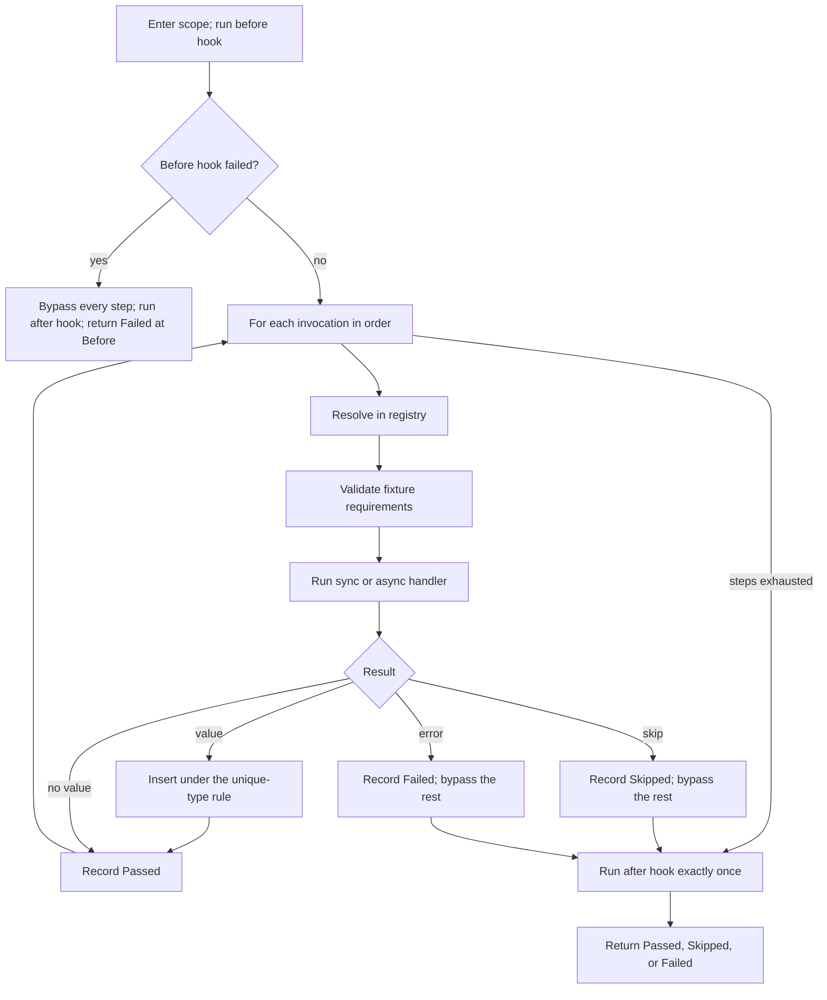

# Add parser-neutral scenario plan, outcome, and runner types (13.1.1)

This ExecPlan (execution plan) is a living document. The sections
`Constraints`, `Tolerances (exception triggers)`, `Risks`, `Progress`,
`Surprises & discoveries`, `Decision log`, `Outcomes & retrospective`,
`Conformance basis`, and `Verification plan` must be kept up to date as work
proceeds.

Status: DRAFT

## Purpose / big picture

Today the only way to run an `rstest-bdd` scenario is to let the
`#[scenario]` or `scenarios!` procedural macro generate a Rust test whose body
contains a hand-rolled step loop. That loop — not the runtime crate — decides
what happens when a step is skipped, when a step fails, where a returned value
goes, and which steps are reported as bypassed. The policy lives in quoted
token streams, so it cannot be unit-tested directly and cannot be reused by any
caller that did not start from a `.feature` file.

After this change the runtime crate `rstest-bdd` owns that policy in ordinary,
directly testable Rust. A caller builds a **scenario plan** — a name, tags, a
source identity, and an ordered list of step invocations — hands it to
`run_scenario` or `run_scenario_async`, and receives a **structured terminal
outcome** describing what every single invocation did, including the ones that
never ran.

Concretely, after this change a developer can write this and watch it work,
with no `.feature` file, no procedural macro, and no panic on failure:

```rust,ignore
use rstest_bdd::runner::{ScenarioOutcome, ScenarioPlanBuilder, ScenarioScope, StepStatus, run_scenario};
use rstest_bdd::{StepContext, StepKeyword};

let plan = ScenarioPlanBuilder::new("Add two numbers")
    .source("notes/arithmetic.md", Some(42))
    .step(StepKeyword::Given, "a calculator").at("notes/arithmetic.md", 43, None)
    .step(StepKeyword::When, "I add 2 and 2").at("notes/arithmetic.md", 44, None)
    .step(StepKeyword::Then, "the result is 4").at("notes/arithmetic.md", 45, None)
    .build();

let mut ctx = StepContext::default();
let outcome = run_scenario(&plan.as_plan(), ScenarioScope::new(&mut ctx));

assert!(matches!(outcome, ScenarioOutcome::Passed { .. }));
assert_eq!(outcome.steps().len(), 3);
let first = outcome.steps().first().expect("a plan with three steps records three outcomes");
assert_eq!(first.status(), StepStatus::Passed);
assert_eq!(first.source().map(|s| s.line()), Some(43));
```

The observable wins are:

- A non-Gherkin frontend can execute the same registered steps that `#[scenario]`
  executes, keeping its own `.md`, `.txt`, or `.toml` source paths and line
  numbers in the outcome.
- A failed scenario returns data instead of panicking, so a caller chooses its
  own reporting and exit-code policy.
- The `steps()` sequence is always complete and in plan order: after a terminal
  skip or failure, every remaining invocation appears as `Bypassed`, whether or
  not the `diagnostics` Cargo feature is enabled.

This step does **not** change the Gherkin macros. Migrating them is roadmap
13.2.1; proving an external frontend end to end is roadmap 13.3.1. This step
delivers the contract those two rely on.

## Definitions

Every term of art this plan uses, defined once. A reader who knows none
of these can still follow the rest of the document.

- **Step** — one `Given`/`When`/`Then` line. A **step definition** is the Rust
  function registered for it by `#[given]`/`#[when]`/`#[then]`. A **step
  invocation** is one occurrence of a step inside a scenario.
- **Registry** — the process-global `inventory`-populated map from
  `(keyword, pattern)` to step definition, in
  `crates/rstest-bdd/src/registry/mod.rs`. It is populated at link time; this
  plan adds no runtime registration.
- **Fixture** — a value supplied by `rstest` and made available to steps
  through `StepContext`.
- **`StepContext`** — `crates/rstest-bdd/src/context/mod.rs`. A per-scenario
  map from fixture name to either a borrowed reference or an owned
  `RefCell<Box<dyn Any>>` cell, plus a second map of **step-returned override
  values**. Since ADR-012 its borrow methods take `&self` and return guards.
- **Unique-type rule** — when a step function returns a value, the runtime
  offers it as an override for the one fixture whose type matches. Implemented
  by `StepContext::insert_value`, which returns `InsertOutcome::Inserted`,
  `NoMatch`, or `AmbiguousIgnored` (ADR-015).
- **Skip** — a step calls `rstest_bdd::skip!`, which panics with a
  `SkipRequest` payload. The step wrapper catches it and turns it into
  `StepExecution::Skipped`; `execute_step` then turns that into
  `ExecutionError::Skip`. A skip stops the scenario.
- **Bypassed** — a step that never ran because an earlier step skipped or
  failed. Today bypassed steps are only recorded into the diagnostics registry,
  and only when the `diagnostics` feature is on.
- **`allow_skipped`** — a compile-time boolean, `true` when the scenario or its
  feature carries the `@allow_skipped` tag.
- **`fail_on_skipped`** — a run-time boolean read by
  `rstest_bdd::config::fail_on_skipped()`. It resolves a process-local override
  (`config::set_fail_on_skipped`) first, then the `RSTEST_BDD_FAIL_ON_SKIPPED`
  environment variable, then `false`.
- **Forced failure** — `fail_on_skipped && !allow_skipped`. A skip that a
  caller is expected to treat as a failure.

## Signposted documentation and skills

Read these before starting, and return to them at the stages named.

### Signposted documentation

In reading order:

1. `docs/adr-018-parser-neutral-scenario-execution.md` — the contract. Read in
   full before Stage A.
2. `docs/adr-012-guard-based-stepcontext-borrowing.md` — the borrow and
   lifecycle model `ScenarioScope` builds on.
3. `docs/rstest-bdd-design.md` §2.6 (runtime execution module), §3.11 (runtime
   module layout for contributors), and §2.7.6.5 (v0.7.0 redesign candidates).
4. `docs/testing-strategy.md` — especially *Invariants to prefer* and
   *Assertion posture*; this plan's test design follows it.
5. `docs/developers-guide.md` — *Assertion vocabulary*, *Bypassed-step recording
   contract*, *Step-return overrides and `InsertOutcome`*, *Test organization*,
   *nextest configuration*, and *`#[serial]`, `#[file_serial]`, and nextest
   test-groups*.
6. `docs/rust-testing-with-rstest-fixtures.md` and `docs/rust-doctest-dry-guide.md`
   — fixture and doctest conventions.
7. `docs/complexity-antipatterns-and-refactoring-strategies.md` — consult at
   Stage D before accepting the sync/async duplication shape.
8. `docs/users-guide.md` §*Skipping scenarios* and §*Asserting skipped outcomes*
   — the user-visible semantics that must not change.
9. `docs/gherkin-syntax.md` — only to confirm which concepts must **not** leak
   into the new types.
10. `docs/documentation-style-guide.md` — before writing any prose.
11. `clippy.toml`, the root `Cargo.toml` `[workspace.lints]` tables, and
    `dylint.toml` — the lint budget Constraint 8 summarizes.
12. `.config/nextest.toml` — test timeouts and test groups, before adding a
    suite that could be slow.
13. `docs/adr-016-pinned-nightly-rustfmt.md` — `make fmt` and `make check-fmt`
    invoke a pinned nightly `rustfmt`, so formatting differs from a bare
    `cargo fmt`.

### Signposted skills

With the stage at which each becomes relevant:

- `rust-router` — load first; it routes to the rest.
- `arch-crate-design` (Stage A) — module boundaries, public versus internal
  surface, and whether anything belongs in `rstest-bdd-policy`.
- `rust-types-and-apis` (Stage A and C) — the plan and outcome type shapes,
  opaque accessors, `#[non_exhaustive]`, and builder ergonomics.
- `rust-errors` (Stage C) — `ScenarioError` shape, the no-panic boundary, and
  keeping `ExecutionError` free of source metadata.
- `rust-memory-and-state` (Stage A) — the borrowed-view versus owned-plan
  ownership decision and why the owned form must not be self-referential.
- `rust-async-and-concurrency` (Stage C and D) — the cancellation contract, and
  why the async runner must take `ScenarioScope` by value.
- `rust-unit-testing` (Stage B) — `rstest` fixtures, table tests, `#[serial]`,
  and `googletest`/`pretty_assertions`/`insta` selection.
- `proptest` (Stage B and D) — the bounded step-sequence strategies.
- `rust-verification` (Stage A) — confirm the method selection recorded in
  *Verification plan*, including the decision not to reach for Kani or Verus.
- `nextest` (Stage B onwards) — test groups, `#[serial]` interaction, and
  filtersets for running one suite.
- `rust-unused-code` (Stage D) — if `dead_code` appears behind a feature gate.
- `addressing-whitaker-findings` (Stage D) — `make lint` runs the Whitaker
  Dylint suite; in particular `no_unwrap_or_else_panic` and
  `no_expect_outside_tests` (the latter fires inside non-`#[cfg(test)]` test
  *helpers*, so use `let`-`else` and `panic!`, not `.expect()`).
- `arch-decision-records` (Stage D) — only if a decision here amends ADR-018.
- `en-gb-oxendict` and `commit-message` (throughout).
- `codegraph-mcp` (Stage A) — prefer `codegraph_get_callers` and
  `codegraph_analyze_impact` over grep for structural questions.

## Constraints

These are hard invariants. Violating one requires escalation, not a workaround.

1. **Additive only.** `execute_step`, `execute_step_async`,
   `StepExecutionRequest`, `ExecutionError`, `StepContext`, the `#[given]`,
   `#[when]`, `#[then]`, `#[scenario]`, and `scenarios!` macros, and every
   existing public item keep their current signatures and behaviour.
   `crates/rstest-bdd-macros` is not modified by this plan at all.
2. **No frontend concepts in the public plan or outcome surface.** No `gherkin`
   type, no Markdown, Trymark, process, snapshot, Clap, or reporter type may
   appear in the signature of any item under `rstest_bdd::runner`. This is
   enforced by a test, not by review alone.
3. **The runner never panics for an ordinary scenario failure.** A failure, a
   skip, a missing step, a missing fixture, and a failing lifecycle hook all
   produce a returned `ScenarioOutcome`. Panics raised *inside* step handlers
   continue to flow through the existing step-error machinery.
4. **The outcome's step sequence is total and ordered.** For every plan,
   `outcome.steps().len() == plan.steps().len()`, entry `i` describes
   invocation `i`, and every entry after a terminal event is `Bypassed`. This
   holds identically with the `diagnostics` feature on and off.
5. **No new runtime dependency.** `proptest`, `googletest`, `pretty_assertions`,
   `insta`, `rstest`, `serial_test`, `temp-env`, and `tokio` are already
   available; nothing else may be added without escalation. The `async-trait`
   crate is forbidden and `make lint` enforces its absence via the
   `forbid-async-trait` target.
6. **No runtime mutation of the global step registry.** Link-time `inventory`
   registration stays the only extension mechanism (ADR-018, *Extension
   boundary*).
7. **No source information inside `ExecutionError`, and none parsed out of error
   strings.** Source travels through the plan and the outcome only.
8. **The workspace lint budget is not negotiable.** `make lint` runs Clippy
   with `-D warnings` over `--all-targets --all-features`, plus the Whitaker
   Dylint suite. The root `Cargo.toml` denies, among others, `unwrap_used`,
   `expect_used`, `indexing_slicing`, `missing_docs`, `missing_docs_in_private_items`,
   `missing_panics_doc`, and `unsafe_code`; `clippy.toml` sets
   `cognitive-complexity-threshold = 12`, well below Clippy's default of 25.
   Three consequences bind this plan's implementation:
   - The engine may not index a slice. Use `.get(i)`, iterators, and
     `zip`; `steps[i]` will not compile under `-D warnings`.
   - No `.unwrap()` or `.expect()` anywhere outside `#[cfg(test)]`. Note that
     `allow-expect-in-tests` does **not** cover helper functions that live
     outside a `#[cfg(test)]` module or a `#[test]` function; use `let`-`else`
     with `panic!` in such helpers.
   - A threshold of 12 means the two driving loops must stay thin. If either
     trips the lint, that is a signal to move a decision into `engine.rs`, not
     to raise the threshold or add an `#[expect]`.
9. **No file over 400 lines.** `make lint` runs
   `scripts/check_rs_file_lengths.py`, whose exception list is
   `scripts/rs-length-allowlist.txt`. Do not add an entry to that allowlist for
   new code; split the file instead.
10. **Every module opens with a `//!` comment, and every item — public *and*
    private — carries a `///` doc comment**, because
    `missing_docs_in_private_items` is denied. Add an example where the example
    adds information beyond the signature.
11. **en-GB-oxendict spelling** in all comments and prose, enforced by the
    `typos` gate. Never hand-edit `typos.toml`; edit
    `scripts/generate_typos_config.py` and regenerate.

## Tolerances (exception triggers)

Stop and escalate — do not improvise — when any of these is reached.

- **Scope.** More than 22 files touched, or more than 2500 net added lines
  across the whole plan. (The expected shape is roughly 10 new source files and
  8 new test files.)
- **Public interface.** Any change to an *existing* public signature, however
  small. Additive new items are in scope; edits to existing ones are not.
- **Dependencies.** Any new entry in `[workspace.dependencies]` or in
  `crates/rstest-bdd/Cargo.toml`, including dev-dependencies.
- **Macro crate.** Any edit under `crates/rstest-bdd-macros/`.
- **Iterations.** A gate that still fails after 3 focused fix attempts.
- **Self-reference.** If the owned plan form cannot be expressed without a
  self-referential struct or an arena crate, stop: the ownership decision (D3)
  needs revisiting with the maintainer.
- **Cancellation.** If the async cancellation contract cannot be observed
  deterministically without a new dependency or a timing-dependent test, stop
  and present options.
- **Time.** Any single milestone exceeding 6 hours of work.
- **Ambiguity.** Any point where ADR-018's binding text admits two readings that
  produce materially different public types.

## Risks

- **Risk: the owned plan form turns out to be self-referential.**
  Severity: high. Likelihood: medium.
  The execution view wants `Option<&[&[&str]]>` for data tables, matching
  `execute_step`. A frontend holding `Vec<Vec<String>>` cannot produce that
  without an intermediate `Vec<Vec<&str>>` *and* a `Vec<&[&str]>`, and a struct
  holding both the owned data and those views is self-referential.
  Mitigation: Milestone EP-M1 is an explicit prototyping milestone whose
  go/no-go criterion is a compiling, safe, allocation-free-on-the-macro-path
  design. Decision D3 records the candidate representations and the
  recommendation (a small `PlanTable<'a>` enum over borrowed-static and
  owned-row forms).

- **Risk: `ScenarioScope` and lifecycle hooks are under-specified upstream.**
  Severity: high. Likelihood: high (already observed).
  ADR-018 requires before- and after-scenario hooks; ADR-012 never defined them,
  and the design document still lists them as a candidate.
  Mitigation: Decision D2 proposes the narrowest shape that discharges ADR-018 —
  caller-supplied, per-run hooks with no global registry — and flags it for
  explicit approval before Stage C. If the maintainer prefers to defer hooks,
  the plan's Milestone EP-M3 shrinks and three rows of ADR-018's lifecycle
  matrix stay untested, which must be recorded as a deviation.

- **Risk: sync and async policy drift into two implementations.**
  Severity: medium. Likelihood: medium.
  Rust has no clean way to write one loop that is both.
  Mitigation: factor every *decision* into pure, non-async functions so the two
  loops differ only by `.await`, and pin equivalence with a property test
  (INV-5). Consult `docs/complexity-antipatterns-and-refactoring-strategies.md`
  at Stage D.

- **Risk: the new outcome types duplicate `rstest_bdd::reporting`.**
  Severity: medium. Likelihood: medium.
  `reporting::ScenarioStatus`, `ScenarioRecord`, `SkippedScenario`, and
  `types::StepExecution` already model outcomes for the reporter.
  Mitigation: Decision D5 fixes the dependency direction — `runner` knows
  nothing about `reporting`; a conversion is added in `reporting` in roadmap
  13.2.1, not here. Constraint 2's surface test guards this.

- **Risk: `fail_on_skipped` tests interfere with each other.**
  Severity: medium. Likelihood: high.
  The override is a process-global `AtomicU8` and the fallback reads a process
  environment variable. `make test` uses nextest (process per test), but
  `cargo test` does not.
  Mitigation: every test that touches it carries `#[serial]`, uses
  `temp-env` for the environment variable, and restores the override with
  `config::clear_fail_on_skipped_override()`. Direct environment mutation is
  forbidden by AGENTS.md.

- **Risk: the async runner future is not `Send`.**
  Severity: low. Likelihood: high (already true today).
  `StepScopeGuard` is `!Send` and is held inside async step bodies.
  Mitigation: do not add a `Send` bound to `run_scenario_async`, document that
  the future is not `Send`, and test it under
  `tokio::runtime::Builder::new_current_thread`, as generated async scenarios
  already do.

- **Risk: a bounded property test passes vacuously.**
  Severity: medium. Likelihood: medium.
  A generator that rarely produces terminal events would make INV-1 and INV-2
  trivially true.
  Mitigation: every property test records `proptest` classification counters and
  asserts each material class was reached, and each carries a named seeded-fault
  control that the test must reject. See *Verification plan*, *Non-vacuity*.

- **Risk: `Arc<str>` in `SourceLocation` allocates more than expected.**
  Severity: low. Likelihood: low.
  Mitigation: the builder shares one `Arc<str>` per distinct path within a plan;
  a unit test asserts `Arc::ptr_eq` across the steps of a plan built from one
  source path.

## Progress

- [x] (2026-09-14) Branch renamed to `13-1-1-add-parser-neutral-types` and
  pushed, tracking `origin/13-1-1-add-parser-neutral-types`.
- [x] (2026-09-14) Reconnaissance of the runtime crate, the macro-generated
  scenario loop, and the gate machinery completed.
- [x] (2026-09-14) Prior art reviewed: `cucumber-rs`'s `Parser`/`Runner`/`Writer`
  split and the Cucumber Messages status model.
- [x] (2026-09-14) Draft ExecPlan written.
- [ ] Stage A: maintainer approval of Decisions D2 and D3.
- [ ] EP-M1: plan and source types (prototyping milestone).
- [ ] EP-M2: synchronous runner and structured outcome.
- [ ] EP-M3: skip parity and lifecycle.
- [ ] EP-M4: asynchronous runner, cancellation, and properties.
- [ ] EP-M5: documentation, snapshots, and the full gate.

## Surprises & discoveries

- **Observation:** ADR-018 requires before- and after-scenario hooks "according
  to ADR 012", but ADR-012 defines no hooks at all.
  Evidence: `docs/adr-012-guard-based-stepcontext-borrowing.md` *World lifecycle
  contract* describes only drop-based cleanup performed by the generated test
  body; `rg 'before_scenario|after_scenario|ScenarioScope'` returns no runtime
  matches; `docs/rstest-bdd-design.md` §2.7.6.5 still lists "first-class world
  lifecycle hooks" among the *remaining candidates*.
  Impact: Decision D2 exists, and it needs explicit approval. This is the single
  largest scope question in 13.1.1.

- **Observation:** the generated loop computes bypassed steps only when the
  `diagnostics` feature is on, but ADR-018 makes the bypassed sequence
  unconditional.
  Evidence:
  `crates/rstest-bdd-macros/src/codegen/scenario/runtime/generators/scenario.rs`
  wraps the `record_bypassed_steps` call in `if #path::diagnostics_enabled()`.
  Impact: Decision D4, and INV-2 must be tested in both feature configurations.

- **Observation:** the generated loop stringifies the failure with
  `format!("{}", error)` before panicking, so structure is already lost inside
  the macro.
  Evidence: `generators/step_loop.rs`, the `else` branch of the result handler.
  Impact: the new runner is strictly more informative than the path it will
  eventually replace; roadmap 13.2.1 gains structured failures for free.

- **Observation:** `cucumber-rs` — the obvious Rust prior art — is *not*
  parser-neutral in the type sense. Its `Parser` trait's `Output` is a stream of
  `gherkin::Feature`, so a non-Gherkin frontend must synthesize Gherkin AST
  nodes.
  Evidence: the `cucumber` crate's `Parser`, `Runner`, and `Writer` trait
  boundary; the `Runner` consumes `gherkin::Feature` and `gherkin::Step`.
  Impact: this is exactly ADR-018's rejected Option B, and it is useful
  corroboration that ADR-018's boundary is the right one. It also means there
  is no upstream type vocabulary worth copying; the names here should be chosen
  for this codebase.

- **Observation:** Cucumber Messages collapses "deliberately skipped" and
  "skipped because an earlier step failed" into a single `SKIPPED` status, and
  adds `UNDEFINED`, `AMBIGUOUS`, and `PENDING`.
  Evidence: the shared `cucumber/messages` `TestStepResultStatus` enum.
  Impact: ADR-018's separate `Skipped` and `Bypassed` statuses are a deliberate
  divergence and a better fit here, because the two have different causes and
  the runtime already distinguishes them. `UNDEFINED` and `AMBIGUOUS` map onto
  existing `ExecutionError` variants rather than onto new statuses, so
  `StepStatus` stays at four variants.

- **Observation:** `std::task::Waker::noop()` is stable and available at this
  workspace's MSRV of 1.88, so the cancellation tests need no new dependency.
  Evidence: `Cargo.toml` sets `rust-version = "1.88"`; `Waker::noop` is a stable
  `const fn` in `std::task`.
  Impact: INV-10 is testable deterministically without `tokio-test` or
  `futures-test`, keeping the no-new-dependency tolerance intact.

## Decision log

- **Decision D1: put the new types in a new `rstest_bdd::runner` module, not in
  `execution`, and not in `rstest-bdd-policy`.**
  Rationale: `execution` is per-step and its name is already load-bearing in
  public documentation; `rstest-bdd-policy` exists only for definitions the
  proc-macro crate needs without depending on the runtime, and the macro crate
  needs none of these types until roadmap 13.2.1 — at which point it will
  reference them through `#path::runner::…` in generated code, exactly as it
  already references `#path::execution::…`. A new module also keeps ADR-018's
  boundary visible in the file tree. Alternative considered: extracting an
  `rstest-bdd-core` crate now, which ADR-018 explicitly defers (Option E).
  Date/Author: 2026-09-14, planning agent.

- **Decision D2: deliver caller-supplied, per-run lifecycle hooks; do not
  introduce a global hook registry. REQUIRES MAINTAINER APPROVAL.**
  Rationale: ADR-018 requires before- and after-scenario hooks and makes
  "before-hook failure" and "after/cleanup failure" rows of its lifecycle matrix
  binding, but no hook mechanism exists anywhere in the workspace, and design
  document §2.7.6.5 still lists "first-class world lifecycle hooks" as a
  *candidate*. The narrowest shape that discharges ADR-018 is a pair of traits
  whose implementation the *caller* supplies per run, defaulted to `NoHooks`.
  That adds no global state, no registration order question, and no new
  attribute; a user-facing `#[before_scenario]` attribute would change duplicate
  detection and ordering policy and therefore needs its own ADR, exactly as
  ADR-018 says of runtime registry mutation.
  Alternatives: (a) defer hooks entirely and leave three lifecycle rows
  untested, which would be a recorded deviation from ADR-018; (b) design a
  global registry now, which exceeds 13.1.1's scope and pre-empts roadmap 12.2.
  Impacts if (a) is chosen instead: EP-M3 shrinks to skip parity plus
  drop-cleanup; INV-4 and INV-8 lose the before- and after-hook rows; INV-10
  loses two of its three cancellation cases; ADR-018's lifecycle matrix is
  partially undischarged and must be recorded here and in the roadmap entry.
  Date/Author: 2026-09-14, planning agent. **Status: awaiting approval.**

- **Decision D3: `SourceLocation` owns an `Arc<str>` path; the plan is a
  borrowed view; a separate owned plan type serves dynamic frontends; data
  tables use a two-form `PlanTable<'a>` enum. REQUIRES MAINTAINER APPROVAL.**
  Rationale: ADR-018 leaves ownership open and requires that the plan "supports
  both statically generated Gherkin scenarios and dynamically parsed frontends
  without requiring avoidable copies at every step". A fully borrowed table
  (`Option<&[&[&str]]>`, matching `execute_step`) forces a dynamic frontend into
  a self-referential struct, because the owned `Vec<Vec<String>>`, the
  intermediate `Vec<Vec<&str>>`, and the `Vec<&[&str]>` view would all have to
  live together. `PlanTable::Owned(&[Vec<String>])` removes one level of
  indirection, which is exactly the level that made the type self-referential.
  The cost is that the engine materializes one `Vec<&str>` per table row at the
  moment it calls `execute_step`, and only on the dynamic path and only for
  steps that actually carry a table. `Arc<str>` for paths means the *outcome*
  carries no lifetime, which matters because an outcome outlives the run.
  Alternatives: `Cow<'a, str>` throughout (nests badly for tables); a fully
  owned plan (copies on the macro path, violating TR7); an arena or
  `self_cell`-style crate (new dependency, forbidden by tolerance).
  Follow-up: if `execute_step`'s table parameter is ever widened, `PlanTable`
  can collapse; note that in roadmap 13.2.1.
  Date/Author: 2026-09-14, planning agent. **Status: awaiting approval.**

- **Decision D4: the outcome's step sequence is always complete, independent of
  the `diagnostics` feature.**
  Rationale: ADR-018 states "diagnostics or reporter configuration must not
  change this sequence". Today the generated code computes bypassed steps only
  under `diagnostics_enabled()`. This is a deliberate behavioural difference
  between the new runner and the old loop, and it is the correct direction: the
  outcome is data for the caller, whereas the diagnostics registry remains
  feature-gated. INV-2 tests both feature configurations.
  Date/Author: 2026-09-14, planning agent.

- **Decision D5: `runner` does not depend on `reporting`; the conversion is
  added in `reporting` during roadmap 13.2.1.**
  Rationale: ADR-018 forbids reporter types in the outcome surface, and the
  existing `reporting::ScenarioStatus` / `SkippedScenario` / `ScenarioRecord`
  triple plus `types::StepExecution` already model an overlapping concept. Two
  overlapping models are tolerable only if the dependency arrow is one-way and
  explicit. Adding the conversion now would either pull reporter concepts into
  `runner` or add an unused function; both are worse than waiting until 13.2.1
  actually needs it. INV-11 enforces the arrow.
  Date/Author: 2026-09-14, planning agent.

- **Decision D6: two driving loops, one set of pure decision functions.**
  Rationale: Rust cannot express one loop that is both synchronous and
  asynchronous without either a macro-duplication crate (new dependency,
  forbidden) or per-step boxing (an allocation on the hot path, and a `dyn`
  bound that `!Send` step futures complicate). Factoring every *decision* —
  terminal-index selection, bypass filling, `forced_failure`, precedence,
  outcome assembly — into non-async functions in `engine.rs` means the two
  drivers differ only by `.await`, and LEM-1 plus INV-5 pin that they cannot
  drift. This is also what keeps both drivers under `clippy.toml`'s
  `cognitive-complexity-threshold = 12`: a driver that only resolves, executes,
  and hands the result to a decision function has almost no branching left.
  Alternative rejected: a `Runner` trait with an associated future type, which
  buys nothing here and obscures the sequence.
  Date/Author: 2026-09-14, planning agent.

- **Decision D7: record decisions in this plan and in the design document; do
  not raise a new ADR unless one of D2 or D3 is rejected.**
  Rationale: ADR-018 is already Accepted and explicitly leaves ownership,
  naming, and representation open to "the Stage 1 compatibility review", which
  is what EP-M1 is. Recording the outcome in
  `docs/rstest-bdd-design.md` §2.6 and §3.11 plus this plan satisfies AGENTS.md.
  A new ADR becomes necessary only if the maintainer rejects D2 (deferring
  hooks leaves an accepted ADR partially undischarged) or D3 in a way that
  changes the accepted `ScenarioPlan` contract.
  Date/Author: 2026-09-14, planning agent.

- **Decision D8: no Kani and no Verus for this change.**
  Rationale: ADR-018 *Verification strategy* explicitly states the runner does
  not need formal verification at introduction and that property-based sequence
  tests plus dual-path conformance give the stronger return. LEM-1 reduces the
  interesting logic to pure total functions whose material partitions are
  finite and enumerated. Recorded here rather than omitted, as the ExecPlan
  skill requires.
  Date/Author: 2026-09-14, planning agent.

## Outcomes & retrospective

To be completed at EP-M5. Before marking this plan `COMPLETE`, reconcile every
discovery above with the upstream artefacts in `Conformance basis`:

- If D2 or D3 is accepted as proposed, record the resolved shape in
  `docs/rstest-bdd-design.md` §2.6 and §3.11 and note in this plan that
  ADR-018's Stage 1 compatibility review is discharged.
- If D2 is rejected in favour of deferring hooks, record the partial discharge
  of ADR-018's lifecycle matrix here, in the roadmap entry, and as a follow-up
  item, and set this plan's status appropriately before continuing.
- If implementation falsifies any axiom AX-1 to AX-7, return to *Verification
  plan* before elaborating further.

## Context and orientation

Read this section even if the repository is unfamiliar. It names every file
this plan touches. Every term of art it uses is defined in `Definitions`
above.

### The workspace

`rstest-bdd` is a Cargo workspace at the repository root. The crates that
matter here are:

- `crates/rstest-bdd` — the **runtime** crate. It owns the step registry, step
  patterns, the fixture context, step execution, skip signalling, and the
  reporting collector. This is where all new code in this plan goes.
- `crates/rstest-bdd-macros` — the **procedural macro** crate. It parses
  `.feature` files at compile time and generates scenario test functions. This
  plan reads it for reference and does **not** modify it.
- `crates/rstest-bdd-patterns` — shared pattern and keyword types. It defines
  `StepKeyword` (`Given`, `When`, `Then`, `And`, `But`; `Debug + Clone + Copy +
  PartialEq + Eq + Hash`), re-exported as `rstest_bdd::StepKeyword`.
- `crates/rstest-bdd-policy` — a tiny crate holding definitions both the
  runtime and the macro crate need (the macro crate may not depend on the
  runtime crate, because that would be a proc-macro dependency cycle).

### The code that exists today

`crates/rstest-bdd/src/execution/mod.rs` already provides per-step execution:

```rust,ignore
pub struct StepExecutionRequest<'a> {
    pub index: usize,
    pub keyword: StepKeyword,
    pub text: &'a str,
    pub docstring: Option<&'a str>,
    pub table: Option<&'a [&'a [&'a str]]>,
    pub feature_path: &'a str,
    pub scenario_name: &'a str,
}

pub fn execute_step(
    request: &StepExecutionRequest<'_>,
    ctx: &mut StepContext<'_>,
) -> Result<Option<Box<dyn Any>>, ExecutionError>;

pub async fn execute_step_async(
    request: &StepExecutionRequest<'_>,
    ctx: &mut StepContext<'_>,
) -> Result<Option<Box<dyn Any>>, ExecutionError>;
```

Both resolve the step in the registry, validate its fixture requirements, run
the handler, and map the result into `ExecutionError`, which is
`#[non_exhaustive]` with variants `Skip { message }`, `StepNotFound { .. }`,
`MissingFixtures(Arc<MissingFixturesDetails>)`, and `HandlerFailed { .. }`.

What does **not** exist is anything above a single step. The scenario loop is
generated in
`crates/rstest-bdd-macros/src/codegen/scenario/runtime/generators/step_loop.rs`
and reads, in expanded form:

```rust,ignore
let mut __rstest_bdd_failed: Option<String> = None;
let __rstest_bdd_steps = [(keyword, text, docstring, table), /* ... */];
for (index, (keyword, text, docstring, table)) in __rstest_bdd_steps.iter().copied().enumerate() {
    match __rstest_bdd_execute_single_step(index, keyword, text, docstring, table, &mut ctx, FEATURE, NAME) {
        Ok(Some(val)) => { let _ = ctx.insert_value(val); }
        Ok(None) => {}
        Err(ref error) => {
            if let Some(msg) = __rstest_bdd_extract_skip_message(error) {
                __rstest_bdd_skipped = Some(msg);
                __rstest_bdd_skipped_at = Some(index);
                break;
            } else {
                __rstest_bdd_failed = Some(format!("{}", error));   // structure is lost here
                break;
            }
        }
    }
}
if let Some(error_msg) = __rstest_bdd_failed { panic!("{}", error_msg); }
```

The companion skip handler in `generators/scenario.rs` then computes
`forced_failure = config::fail_on_skipped() && !allow_skipped`, records
bypassed steps **only when `diagnostics_enabled()`**, records a
`reporting::ScenarioStatus::Skipped`, and panics when `forced_failure` is set.

Three properties of that code motivate this plan:

1. The failure is stringified with `format!("{}", error)` before it leaves the
   loop, so no caller can inspect it.
2. The bypassed-step sequence is computed only under `diagnostics`, so it is
   not a reliable part of the contract.
3. None of it is reachable from a test without generating a scenario.

### What does not exist yet

Grepping the workspace for `ScenarioScope`, `before_scenario`, `after_scenario`,
`BeforeScenario`, `AfterScenario`, or `scenario_hook` returns **no runtime
matches**. ADR-018 assumes a `ScenarioScope` lifecycle token and before- and
after-scenario hooks "according to ADR 012", but ADR-012 delivers only
*scope-based drop cleanup performed by the generated test body*. Design
document §2.7.6.5 still lists "first-class world lifecycle hooks" as a
*remaining candidate*. Closing that gap is therefore part of this plan; see
Decision D2.

## Conformance basis

There is no Terms of Reference document for this work. The upstream artefacts
are:

- **ADR-018**, `docs/adr-018-parser-neutral-scenario-execution.md`, status
  **Accepted**, dated 2026-07-13. The binding sections are *Requirements*,
  *Decision outcome and proposed direction* (scenario plan, structured outcome,
  canonical execution sequence, skip parity, lifecycle and outcome contract,
  asynchronous cancellation, source-neutral diagnostics, extension boundary),
  *Compatibility and migration* Stage 1, and *Verification strategy*.
- **ADR-012**, `docs/adr-012-guard-based-stepcontext-borrowing.md`, status
  **Accepted**. Supplies the `&self` borrow model, the opaque guards, and the
  world lifecycle contract that `ScenarioScope` must extend rather than
  contradict.
- **ADR-015**, `docs/adr-015-insert-outcome-for-step-return-overrides.md`. Fixes
  the returned-value propagation semantics the runner must preserve.
- **ADR-002** and **ADR-019** (step-return classification) constrain what a step
  handler may return; the runner consumes the already-classified result and does
  not reinterpret it.
- **Roadmap** `docs/roadmap.md` §13.1.1, whose prerequisites 12.1.1 and 12.1.3
  are both marked done.
- **AGENTS.md** and `docs/documentation-style-guide.md` govern code style,
  documentation, and en-GB-oxendict spelling.

Trace chain for this plan:

```plaintext
ADR-018-FR1..FR3  -> EP-M1 -> tests::runner::plan::round_trips_borrowed_and_owned
ADR-018-FR4       -> EP-M4 -> tests::runner::props::sync_async_equivalence
ADR-018-FR5       -> EP-M2 -> tests::runner::props::value_visibility
ADR-018-FR6/FR7   -> EP-M2 -> tests::runner::terminal::stops_and_bypasses
ADR-018-FR8       -> EP-M3 -> tests::runner::lifecycle::cleanup_exactly_once
ADR-018-FR9/FR10  -> EP-M2 -> tests::runner::outcome::failure_is_returned_not_panicked
ADR-018-TR1       -> EP-M1 -> tests::runner::surface::no_frontend_types_in_public_api
ADR-018-TR2       -> EP-M2 -> tests::runner::outcome::failure_is_returned_not_panicked
ADR-018-TR3       -> EP-M5 -> make test (existing macro fixtures unchanged)
ADR-018-TR7       -> EP-M1 -> tests::runner::plan::owned_plan_needs_no_self_reference
Skip-parity matrix-> EP-M3 -> tests::runner::skip_parity::matrix
Lifecycle matrix  -> EP-M3 -> tests::runner::lifecycle::terminal_paths
Cancellation      -> EP-M4 -> tests::runner::cancel::drop_during_step
Source fidelity   -> EP-M2 -> tests::runner::source::non_feature_paths_preserved
```

`ADR-018-FRn` and `ADR-018-TRn` refer to the numbered functional and technical
requirements in ADR-018's *Requirements* section. Those numbers are this plan's
shorthand; the ADR itself does not assign identifiers.

## Verification plan

Verification is co-designed with the implementation: the engine is deliberately
split into pure decision functions plus two thin drivers precisely so that the
invariants below are stated over data, not over control flow.

### Axioms (assumed, not verified here)

- **AX-1.** `inventory` registers every linked step definition before the first
  test runs. The registry is not mutated at run time.
- **AX-2.** `execute_step` and `execute_step_async` correctly resolve, validate
  fixtures for, and invoke a single step, and map its result into
  `ExecutionError` as documented. This plan treats them as a contract boundary
  and does not re-verify their internals; it does exercise them for real rather
  than through a mock.
- **AX-3.** `StepContext::insert_value` implements the unique-type rule
  (ADR-015). The runner is verified for *when* it calls it, not for what it does.
- **AX-4.** `config::fail_on_skipped()` resolves override, then environment,
  then `false`.
- **AX-5.** `proptest` shrinks failures to minimal counter-examples and honours
  a fixed seed via a checked-in `.proptest-regressions` file.
- **AX-6.** Dropping a Rust future drops the values it owns, and
  `std::task::Waker::noop()` (stable, and available at this workspace's MSRV of
  1.88) permits polling a future once without an executor.
- **AX-7.** `serial_test`'s `#[serial]` serializes in-process, and nextest runs
  each test in its own process, so the process-global `fail_on_skipped`
  override cannot leak between tests under `make test`.

### Invariants and lemmas

**INV-1 — Termination.** No invocation whose index exceeds the terminal index
executes. Formally: if the outcome is `Skipped { at }` or `Failed { site:
Step(at) }`, then for every `j > at` the handler for invocation `j` was never
invoked.

- Method: property test over bounded generated step sequences.
- Rationale: the property ranges over orderings and handler kinds, which no
  finite table covers honestly.
- Domain: sequences of length 0 to 8, each invocation drawn from `{Pass,
  ReturnValue, Skip, HandlerError, UnregisteredStep, MissingFixture}`.
- Artefact: `crates/rstest-bdd/tests/runner_sequence_props.rs`.
- Evidence: `cargo nextest run -p rstest-bdd runner_sequence_props`. Before the
  engine exists the test fails to compile; after it, it passes with the
  execution log's maximum index equal to the terminal index.
- Non-vacuity: each generated case is classified by terminal kind, and the test
  asserts every one of `{pass-through, skip, error, not-found, missing-fixture}`
  was produced across the run. Negative control: a `#[cfg(test)]`-only
  `SEEDED_FAULT_CONTINUE_AFTER_TERMINAL` switch makes the engine keep going
  after a terminal event; a dedicated test enables it and asserts the property
  test's assertion helper rejects the resulting log.

**INV-2 — Completeness and ordering.** `outcome.steps().len()` equals
`plan.steps().len()`; entry `i` carries invocation `i`'s keyword, text, and
source; entries after the terminal index all have `StepStatus::Bypassed`; this
holds with the `diagnostics` feature both enabled and disabled.

- Method: property test (same generator as INV-1) plus a parameterized
  `rstest` case run in both feature configurations.
- Rationale: the feature-flag dimension is a two-valued partition, so it is a
  table; the sequence dimension is generated.
- Artefact: `crates/rstest-bdd/tests/runner_sequence_props.rs` and
  `crates/rstest-bdd/src/runner/tests/completeness.rs`.
- Evidence: `cargo nextest run -p rstest-bdd runner` and
  `cargo nextest run -p rstest-bdd --no-default-features runner`.
- Non-vacuity: a witness plan with a terminal skip at index 0 and three trailing
  invocations must produce exactly three `Bypassed` entries. Negative control: a
  seeded fault that truncates the sequence at the terminal index must fail the
  assertion.

**INV-3 — Returned-value visibility.** A value returned by invocation `i` is
visible to every invocation `j > i` and to no invocation `j <= i`.

- Method: property test with typed probe values carrying their producing index.
- Rationale: this is an ordering invariant over generated sequences.
- Domain: sequences containing between 1 and 3 value-returning invocations and
  between 1 and 5 observer invocations, with a fixture of the probe's type
  present so the unique-type rule matches.
- Artefact: `crates/rstest-bdd/tests/runner_sequence_props.rs`.
- Evidence: as INV-1. Each observer records the value it saw; the test asserts
  the recorded value equals the most recent strictly-earlier producer's index,
  and `None` before the first producer.
- Non-vacuity: the generator must produce at least one case with an observer
  *before* the first producer, asserted by classification. Negative control: an
  engine variant that inserts the value before recording the step outcome must
  not change visibility, whereas one that inserts it *before* running the
  producing step must be rejected.

**INV-4 — Cleanup exactly once.** For every terminal path in ADR-018's
lifecycle matrix, the after hook runs exactly once and scope cleanup runs
exactly once.

- Method: parameterized `rstest` over the seven matrix rows, with counting
  probes.
- Rationale: the matrix is a finite, enumerated partition; a table test that
  runs every row is the proportionate method and matches the ADR's own framing.
- Domain: before-hook failure, step pass, step skip, step failure, resolution
  or fixture failure, panic or unwind, after or cleanup failure.
- Artefact: `crates/rstest-bdd/src/runner/tests/lifecycle.rs`.
- Evidence: `cargo nextest run -p rstest-bdd runner::tests::lifecycle`. Each row
  asserts `after_calls == 1` and `cleanup_drops == 1`.
- Non-vacuity: every row must be reached, which the parameterization guarantees,
  and each row separately asserts the *primary outcome* column so a row cannot
  pass by producing the wrong terminal status. Negative control: an engine
  variant that returns early on step failure without running the after hook must
  fail the step-failure and resolution-failure rows.

**INV-5 — Synchronous and asynchronous equivalence.** For a plan whose every
step definition is registered in `StepExecutionMode::Both`, `run_scenario` and
`run_scenario_async` produce equal outcomes.

- Method: property test running the same generated plan through both runners.
- Rationale: this is the ADR's *Verification strategy* item 2, and the whole
  point of factoring policy into shared non-async functions.
- Artefact: `crates/rstest-bdd/tests/runner_sequence_props.rs`.
- Evidence: `pretty_assertions::assert_eq!` on a normalized projection of the
  two outcomes (status, step statuses, terminal index, sources, messages).
- Non-vacuity: classification asserts that terminal skips, terminal failures,
  and full passes all occurred. Negative control: a seeded fault that makes only
  the async loop skip the `insert_value` call must be rejected by the
  comparison.

**INV-6 — Skip parity.** A successfully skipped step always has
`StepStatus::Skipped`, and the terminal outcome's `forced_failure` equals
`!allow_skipped && fail_on_skipped`, for every one of the four combinations and
for each of the three `fail_on_skipped` sources.

- Method: parameterized `rstest`, `#[serial]`, using `temp-env` for the
  environment source and `config::set_fail_on_skipped` for the programmatic
  source.
- Rationale: a four-by-three finite partition; exhaustive enumeration is
  practical and the ADR requires all four rows to be executed.
- Domain: `allow_skipped` in `{false, true}` by `fail_on_skipped` in `{false,
  true}` by source in `{programmatic, environment, default}` by runner in
  `{sync, async}`. The `default` source is only defined for
  `fail_on_skipped == false`.
- Artefact: `crates/rstest-bdd/src/runner/tests/skip_parity.rs`.
- Evidence: `cargo nextest run -p rstest-bdd runner::tests::skip_parity`, 20
  cases passing.
- Non-vacuity: the one row where the two inputs disagree
  (`allow_skipped = true`, `fail_on_skipped = true`, expecting `forced_failure =
  false`) is the discriminating case; an implementation using `||` instead of
  `&& !` fails exactly there. Negative control: assert that mutation explicitly.

**INV-7 — Source fidelity.** Every `StepOutcome::source()` equals the
`SourceLocation` the plan supplied for that invocation, for all four statuses,
and `terminal_source()` equals the terminal invocation's source. No source is
derived from `ExecutionError`.

- Method: parameterized `rstest` with non-`.feature` paths and a snapshot.
- Rationale: a finite partition over four statuses; the snapshot additionally
  pins the rendered shape across outcome variants.
- Artefact: `crates/rstest-bdd/src/runner/tests/source.rs` plus `insta`
  snapshots under `crates/rstest-bdd/src/runner/tests/snapshots/`.
- Evidence: `cargo nextest run -p rstest-bdd runner::tests::source`; review new
  snapshots with `cargo insta review`.
- Non-vacuity: paths used are `notes/example.md` and `spec/cases.toml`, which no
  Gherkin code path could produce. Negative control: an engine variant that
  copies the *scenario* source onto every step must fail, because the per-step
  lines differ from the scenario line.

**INV-8 — Failure precedence.** A before-hook or step failure is the primary
outcome and an after-hook failure is retained as `cleanup_error`. With no
primary failure — including after a normal terminal skip — an after-hook failure
produces `Failed { site: FailureSite::After }`.

- Method: parameterized `rstest` over the five precedence combinations.
- Rationale: finite and enumerated by the ADR's lifecycle matrix.
- Artefact: `crates/rstest-bdd/src/runner/tests/lifecycle.rs`.
- Evidence: each case asserts both the primary variant and `cleanup_error()`.
- Non-vacuity: the skip-then-after-failure case is the discriminating one — it
  is the only path where a `Skipped` result is upgraded to `Failed`. Negative
  control: an implementation that always prefers the after error fails the
  step-failure case.

**INV-9 — Resolve-once.** `fail_on_skipped` is read exactly once per run, before
the first step. Mutating the override from inside a step handler does not change
the run's `forced_failure`.

- Method: `rstest`, `#[serial]`, with a step handler that flips the override.
- Rationale: a single sharp behaviour; a property test would add nothing.
- Artefact: `crates/rstest-bdd/src/runner/tests/skip_parity.rs`.
- Evidence: a run started with the override `false` and flipped to `true` by
  step 0 must still report `forced_failure == false` for a skip at step 1.
- Non-vacuity: the control is the mirror case (started `true`, flipped to
  `false`), which must still report `forced_failure == true`. An implementation
  that reads the config inside the skip handler fails both.

**INV-10 — Cancellation.** Dropping a pending `run_scenario_async` future
produces no outcome, drops the in-flight step or hook future, and still performs
synchronous scope cleanup. The awaited after hook is not guaranteed to run.

- Method: deterministic single-poll harness built on `std::task::Waker::noop()`.
- Rationale: the only honest way to observe cancellation without timing
  dependence; no new dependency is required at MSRV 1.88.
- Domain: cancellation during (a) the before hook, (b) a step handler, (c) the
  after hook.
- Artefact: `crates/rstest-bdd/src/runner/tests/cancel.rs`, using a
  `GateFuture` that returns `Poll::Pending` on its first poll and holds a
  `DropProbe`.
- Evidence: for each of (a), (b), (c): `Box::pin` the run future, poll once,
  assert `Poll::Pending`, drop it, then assert the gate's `DropProbe` was
  dropped, the scope's cleanup probe was dropped, and no `ScenarioOutcome` was
  observed. For (c), additionally assert the after hook's completion counter is
  zero — documenting, not requiring, that the hook did not finish.
- Non-vacuity: a companion "normal completion" case polls the same future to
  `Poll::Ready` and asserts the after hook ran exactly once, proving the
  cancellation assertions are not passing merely because the hook never runs at
  all. Negative control: an implementation that takes `scope` by reference
  instead of by value leaves cleanup to the caller and fails the scope-cleanup
  assertion.

**INV-11 — Surface purity.** No public item under `rstest_bdd::runner` mentions
a `gherkin`, Markdown, Trymark, process, snapshot, or reporter type.

- Method: a compile-time plus textual check.
- Rationale: this is a structural constraint, not a behavioural one; a test that
  reads `cargo public-api`-style output is not available without a new
  dependency, so the practical check is a source-level assertion.
- Artefact: `crates/rstest-bdd/src/runner/tests/surface.rs`.
- Evidence: the test reads every `runner/**/*.rs` source file via `include_str!`
  and asserts no line beginning with `pub` mentions `gherkin`, `reporting::`,
  `ScenarioRecord`, `ScenarioStatus`, or `StepExecution`. A doc-comment-only
  mention is permitted; a signature mention is not.
- Non-vacuity: the test includes an inline positive control string that it must
  flag, proving the matcher works. Negative control: temporarily adding
  `pub fn r(&self) -> reporting::ScenarioStatus` must fail the test.

### Lemmas

**LEM-1 — Terminal-index determinism.** Given the sequence of per-step results,
the terminal index is the index of the first non-`Ok` result, or `None` when all
are `Ok`. Every other outcome field is a pure function of the plan, the resolved
`fail_on_skipped`, the results, and the hook results.

- This lemma is what makes INV-1, INV-2, INV-6, and INV-8 testable without
  re-running scenarios: the engine's decision functions take exactly those
  inputs and return the outcome.
- Method: direct parameterized unit tests on the pure functions in
  `runner/engine.rs`, with no registry involvement.
- Artefact: `crates/rstest-bdd/src/runner/engine/tests.rs`.
- Non-vacuity: the tests feed result sequences that no real registry could
  produce (for example, `Ok` after `Err`) and assert the function still computes
  the documented terminal index, proving it is total.

**LEM-2 — Cleanup is drop-carried.** Because `ScenarioScope` is moved into the
async future and its `Drop` performs the synchronous cleanup, cancellation
cannot skip it.

- Method: this follows from AX-6 plus the by-value signature; it is *witnessed*
  by INV-10 rather than proved separately.

### Why no formal proof or model checker

ADR-018 states: "The runner does not need formal verification at introduction.
Property-based sequence tests and dual-path conformance provide the stronger
return for this bounded state machine. A later model-checking spike remains
available if lifecycle interactions grow beyond those tests."

This plan follows that. Concretely, the state machine has one linear index, one
terminal flag, and two hook slots; Kani would enumerate what the bounded
property tests already generate, at a much higher build cost, and Verus would
require reimplementing the registry boundary as a specification. LEM-1 reduces
the interesting logic to pure functions that parameterized tests cover
exhaustively over their material partitions. If roadmap 13.2.1 or 13.3.1 adds
concurrent scenarios or retry, revisit this with the `rust-verification` skill.

## Interfaces and dependencies

This section is prescriptive. At the end of EP-M4 these items must exist with
these names, in these files. Names are subject to the EP-M1 compatibility review
(ADR-018 Stage 1) and may be revised there, but revisions must be recorded in
`Decision log` and reflected here.

### New module layout

All new code lives under `crates/rstest-bdd/src/runner/`, re-exported from
`lib.rs` as `pub mod runner;`. Each file stays under 400 lines.

| File | Contents |
| --- | --- |
| `runner/mod.rs` | Module documentation, re-exports, `run_scenario`, `run_scenario_async` |
| `runner/plan.rs` | `ScenarioPlan`, `StepInvocation`, `PlanTable`, accessors |
| `runner/plan/builder.rs` | `ScenarioPlanBuilder`, `OwnedScenarioPlan`, `OwnedStepInvocation` |
| `runner/source.rs` | `SourceLocation`, `ScenarioSource` |
| `runner/outcome.rs` | `ScenarioOutcome`, `FailureSite`, `ScenarioError`, accessors |
| `runner/outcome/step.rs` | `StepOutcome`, `StepStatus` |
| `runner/scope.rs` | `ScenarioScope`, `ScenarioHooks`, `AsyncScenarioHooks`, `NoHooks` |
| `runner/engine.rs` | The shared, non-async policy functions both loops call |
| `runner/engine/sync.rs` | The synchronous driving loop |
| `runner/engine/r#async.rs` | The asynchronous driving loop |
| `runner/tests/` | Unit tests (`mod.rs` plus one file per invariant group) |

### Source identity

```rust,ignore
/// A one-based position in a frontend's own source text.
///
/// The path is opaque to the runtime: it may be a `.feature` file, a Markdown
/// document, or any other identifier a frontend chooses. Lines and columns are
/// one-based; columns are measured in Unicode scalar values.
#[derive(Clone, Debug, PartialEq, Eq, Hash)]
pub struct SourceLocation { /* path: Arc<str>, line: u32, column: Option<u32> */ }

impl SourceLocation {
    pub fn new(path: impl Into<Arc<str>>, line: u32, column: Option<u32>) -> Self;
    pub fn path(&self) -> &str;
    pub fn line(&self) -> u32;
    pub fn column(&self) -> Option<u32>;
}

/// The scenario's own source identity.
#[derive(Clone, Debug, PartialEq, Eq, Hash)]
pub struct ScenarioSource { /* path: Arc<str>, line: Option<u32> */ }

impl ScenarioSource {
    pub fn new(path: impl Into<Arc<str>>, line: Option<u32>) -> Self;
    pub fn path(&self) -> &str;
    pub fn line(&self) -> Option<u32>;
}
```

`Arc<str>` rather than a lifetime parameter so the *outcome* needs no lifetime
and cloning a per-step location is a refcount bump. See Decision D3.

### The plan

```rust,ignore
/// A data table supplied with a step invocation.
///
/// The two forms let a macro-generated plan borrow `'static` data with no copy,
/// while a dynamically parsed plan supplies its own owned rows without an
/// intermediate borrowed view.
#[derive(Clone, Copy, Debug)]
#[non_exhaustive]
pub enum PlanTable<'a> {
    /// Rows already materialized as borrowed string slices.
    Borrowed(&'a [&'a [&'a str]]),
    /// Rows owned by the caller as `String` cells.
    Owned(&'a [Vec<String>]),
}

/// One step occurrence within a scenario plan.
#[derive(Clone, Debug)]
pub struct StepInvocation<'a> { /* private */ }

impl<'a> StepInvocation<'a> {
    pub fn new(keyword: StepKeyword, text: &'a str) -> Self;
    pub fn with_docstring(self, docstring: &'a str) -> Self;
    pub fn with_table(self, table: PlanTable<'a>) -> Self;
    pub fn with_source(self, source: SourceLocation) -> Self;

    pub fn keyword(&self) -> StepKeyword;
    pub fn text(&self) -> &'a str;
    pub fn docstring(&self) -> Option<&'a str>;
    pub fn table(&self) -> Option<PlanTable<'a>>;
    pub fn source(&self) -> Option<&SourceLocation>;
}

/// A parser-neutral, borrowed execution view of one scenario.
#[derive(Clone, Debug)]
pub struct ScenarioPlan<'a> { /* private */ }

impl<'a> ScenarioPlan<'a> {
    pub fn new(name: &'a str, source: ScenarioSource, steps: &'a [StepInvocation<'a>]) -> Self;
    pub fn with_tags(self, tags: &'a [String]) -> Self;
    pub fn with_allow_skipped(self, allow_skipped: bool) -> Self;

    pub fn name(&self) -> &'a str;
    pub fn tags(&self) -> &'a [String];
    pub fn source(&self) -> &ScenarioSource;
    pub fn steps(&self) -> &'a [StepInvocation<'a>];
    pub fn allow_skipped(&self) -> bool;
}
```

For dynamically parsed input, `runner/plan/builder.rs` supplies an owned form
whose `as_plan` borrow is *not* self-referential, because `PlanTable::Owned`
removes the intermediate level:

```rust,ignore
/// A plan that owns its own strings, for frontends that parse at run time.
pub struct OwnedScenarioPlan { /* name: String, tags: Vec<String>, source, steps: Vec<OwnedStepInvocation>, allow_skipped */ }

impl OwnedScenarioPlan {
    /// Borrow the owned data as an execution view.
    ///
    /// The returned `Vec<StepInvocation<'_>>` borrows from `self` only; no
    /// intermediate storage is required, so no self-referential type appears.
    pub fn invocations(&self) -> Vec<StepInvocation<'_>>;
    pub fn as_plan<'a>(&'a self, invocations: &'a [StepInvocation<'a>]) -> ScenarioPlan<'a>;
}

pub struct ScenarioPlanBuilder { /* ... */ }
```

The two-call shape (`invocations()` then `as_plan(&invocations)`) is deliberate:
it keeps the caller holding the intermediate `Vec`, which is what makes the type
non-self-referential. EP-M1 must confirm this compiles and reads acceptably, and
may replace it with a better ergonomic wrapper that preserves the property.

### The outcome

```rust,ignore
/// What one invocation did.
#[derive(Clone, Copy, Debug, PartialEq, Eq, Hash)]
#[non_exhaustive]
pub enum StepStatus { Passed, Skipped, Failed, Bypassed }

/// The recorded result of one invocation, in plan order.
#[derive(Clone, Debug)]
pub struct StepOutcome { /* private */ }

impl StepOutcome {
    pub fn index(&self) -> usize;
    pub fn keyword(&self) -> StepKeyword;
    pub fn text(&self) -> &str;
    pub fn status(&self) -> StepStatus;
    /// The source location supplied by the plan for this invocation.
    ///
    /// Available for every status, including `Bypassed`.
    pub fn source(&self) -> Option<&SourceLocation>;
    /// The skip message, when `status()` is `StepStatus::Skipped`.
    pub fn skip_message(&self) -> Option<&str>;
    /// The execution error, when `status()` is `StepStatus::Failed`.
    pub fn error(&self) -> Option<&ExecutionError>;
}

/// Where a terminal failure was attributed.
#[derive(Clone, Copy, Debug, PartialEq, Eq, Hash)]
#[non_exhaustive]
pub enum FailureSite { Before, Step(usize), After }

/// A terminal failure, from either a step or a lifecycle hook.
#[derive(Clone, Debug)]
#[non_exhaustive]
pub enum ScenarioError {
    Step(ExecutionError),
    Lifecycle(Arc<StepError>),
}

/// The complete terminal outcome of one scenario run.
#[derive(Clone, Debug)]
#[non_exhaustive]
pub enum ScenarioOutcome {
    Passed { steps: Vec<StepOutcome> },
    Skipped {
        at: usize,
        source: Option<SourceLocation>,
        message: Option<String>,
        forced_failure: bool,
        steps: Vec<StepOutcome>,
        cleanup_error: Option<ScenarioError>,
    },
    Failed {
        site: FailureSite,
        source: Option<SourceLocation>,
        error: ScenarioError,
        steps: Vec<StepOutcome>,
        cleanup_error: Option<ScenarioError>,
    },
}

impl ScenarioOutcome {
    pub fn steps(&self) -> &[StepOutcome];
    pub fn is_passed(&self) -> bool;
    /// The source of the terminal step or lifecycle hook, when there is one.
    pub fn terminal_source(&self) -> Option<&SourceLocation>;
    /// A secondary after-hook or cleanup failure retained alongside a primary
    /// failure or a normal skip.
    pub fn cleanup_error(&self) -> Option<&ScenarioError>;
}
```

`FailureSite` extends ADR-018's illustrative `at: usize` because a before- or
after-hook failure has no step index. ADR-018 requires the outcome to "expose
this primary versus cleanup distinction without requiring these illustrative
type names", so this is an elaboration, not a deviation.

### The scope and hooks

```rust,ignore
/// Per-run lifecycle hooks for the synchronous runner.
pub trait ScenarioHooks {
    fn before(&mut self, ctx: &StepContext<'_>) -> Result<(), StepError> { let _ = ctx; Ok(()) }
    fn after(&mut self, ctx: &StepContext<'_>) -> Result<(), StepError> { let _ = ctx; Ok(()) }
}

/// Per-run lifecycle hooks for the asynchronous runner.
///
/// The methods return a boxed future rather than using `async fn` in a trait,
/// because this workspace forbids the `async-trait` crate and `async fn` in
/// traits is not `dyn`-compatible.
pub trait AsyncScenarioHooks {
    fn before<'a>(&'a mut self, ctx: &'a StepContext<'_>)
        -> Pin<Box<dyn Future<Output = Result<(), StepError>> + 'a>>;
    fn after<'a>(&'a mut self, ctx: &'a StepContext<'_>)
        -> Pin<Box<dyn Future<Output = Result<(), StepError>> + 'a>>;
}

/// The default hook set: both hooks succeed and do nothing.
#[derive(Debug, Default, Clone, Copy)]
pub struct NoHooks;

impl ScenarioHooks for NoHooks {}
impl AsyncScenarioHooks for NoHooks { /* immediately-ready futures */ }

/// A single-use lifecycle token owning the cleanup guard around a caller-backed
/// `StepContext`.
///
/// Dropping the scope clears every step-returned override value inserted during
/// the run. That cleanup is synchronous and therefore survives cancellation of
/// an asynchronous run; an awaited after hook does not.
pub struct ScenarioScope<'ctx, 'fix, H = NoHooks> { /* private */ }

impl<'ctx, 'fix> ScenarioScope<'ctx, 'fix, NoHooks> {
    pub fn new(ctx: &'ctx mut StepContext<'fix>) -> Self;
}

impl<'ctx, 'fix, H> ScenarioScope<'ctx, 'fix, H> {
    pub fn with_hooks<G>(self, hooks: G) -> ScenarioScope<'ctx, 'fix, G>;
}
```

### The runners

```rust,ignore
/// Execute a plan synchronously and return its terminal outcome.
///
/// Never panics for an ordinary scenario failure.
pub fn run_scenario<H: ScenarioHooks>(
    plan: &ScenarioPlan<'_>,
    scope: ScenarioScope<'_, '_, H>,
) -> ScenarioOutcome;

/// Execute a plan asynchronously and return its terminal outcome.
///
/// The returned future is not `Send`, because step scope guards are thread
/// bound. Dropping it cancels the run: no outcome is produced and the awaited
/// after hook is not guaranteed to have run. Synchronous scope-drop cleanup
/// still happens, because the scope is owned by the future.
pub async fn run_scenario_async<H: AsyncScenarioHooks>(
    plan: &ScenarioPlan<'_>,
    scope: ScenarioScope<'_, '_, H>,
) -> ScenarioOutcome;
```

### One additive internal change outside `runner/`

`ScenarioScope`'s drop cleanup needs to remove the step-returned override values
it inserted. Add to `crates/rstest-bdd/src/context/mod.rs`:

```rust,ignore
impl<'a> StepContext<'a> {
    /// Drop every step-returned override value, leaving fixtures untouched.
    ///
    /// Called by `ScenarioScope` at the scenario boundary. Fixture cells
    /// themselves remain owned by the caller and drop at the caller's scope
    /// exit, exactly as ADR-012 specifies.
    pub fn clear_step_values(&mut self);
}
```

This is additive and does not change any existing signature.

### Execution sequence the engine must implement

This is ADR-018's normative sequence, restated as the engine's contract:



*Figure 1: the canonical scenario execution sequence owned by the runner.*

## Plan of work

### Stage A — understand and decide (no code changes)

Read ADR-018 in full, then ADR-012, then design document §2.6 and §3.11. Load
`rust-router`, then `arch-crate-design` and `rust-types-and-apis`. Use
`codegraph_symbol_search` and `codegraph_get_callers` rather than grep for
structural questions.

Produce nothing but updates to this document: confirm or revise Decisions D1 to
D7 below, and confirm the module table in *Interfaces and dependencies*.

**Go/no-go:** Decisions D2 (lifecycle hooks scope) and D3 (ownership) must be
explicitly approved by the maintainer before Stage B, because both extend
ADR-018 rather than merely implementing it.

### Stage B — red tests and the compatibility spike

Write the failing tests first, in this order, running each and observing the
expected failure before moving on:

1. `crates/rstest-bdd/src/runner/tests/surface.rs` (INV-11) — fails because
   `runner/` does not exist.
2. `crates/rstest-bdd/src/runner/engine/tests.rs` (LEM-1) — pure decision
   functions.
3. `crates/rstest-bdd/src/runner/tests/completeness.rs` (INV-2).
4. `crates/rstest-bdd/src/runner/tests/source.rs` (INV-7).
5. `crates/rstest-bdd/src/runner/tests/skip_parity.rs` (INV-6, INV-9).
6. `crates/rstest-bdd/src/runner/tests/lifecycle.rs` (INV-4, INV-8).
7. `crates/rstest-bdd/src/runner/tests/cancel.rs` (INV-10).
8. `crates/rstest-bdd/tests/runner_sequence_props.rs` (INV-1, INV-3, INV-5).

Alongside test 1, run the EP-M1 ownership spike: write the smallest possible
`ScenarioPlan` and `OwnedScenarioPlan` that compile and prove the round trip,
with nothing else in the module. This is the ADR-018 Stage 1 compatibility
review made concrete.

Also add the behavioural feature file and its steps:

- `crates/rstest-bdd/tests/features/parser_neutral_runner.feature`
- `crates/rstest-bdd/tests/parser_neutral_runner.rs`

The feature file drives the *new runner* from step definitions executed by the
*existing, unmigrated* macro path, so there is no circularity:

```gherkin
Feature: Parser-neutral scenario execution

  Scenario: A plan from a Markdown source records every step
    Given a plan named "markdown demo" sourced from "notes/demo.md"
    And the plan has a passing step at line 12
    And the plan has a skipping step at line 13
    And the plan has a passing step at line 14
    When the plan is executed synchronously
    Then the outcome is skipped at step 1
    And step 2 is recorded as bypassed
    And every recorded step reports its supplied source line

  Scenario: A failing step returns an outcome rather than panicking
    Given a plan named "failure demo" sourced from "notes/demo.md"
    And the plan has a failing step at line 20
    When the plan is executed synchronously
    Then the outcome is failed at step 0
    And no panic was raised

  Scenario: The asynchronous runner agrees with the synchronous runner
    Given a plan named "parity demo" sourced from "notes/demo.md"
    And the plan has a passing step at line 30
    And the plan has a failing step at line 31
    When the plan is executed through both runners
    Then both outcomes are equal
```

**Go/no-go:** every test above fails, and fails for the stated reason (a missing
item, not a typo). No production code has been written.

### Stage C — implementation

Build in dependency order: `source.rs`, `plan.rs` and `plan/builder.rs`,
`outcome.rs` and `outcome/step.rs`, `scope.rs`, `engine.rs` (pure decisions),
`engine/sync.rs`, `engine/async.rs`, then `mod.rs`. Make one red test green at
a time, in the Stage B order, committing after each.

Add `StepContext::clear_step_values` when `scope.rs` needs it, with its own unit
test in `crates/rstest-bdd/src/context/tests/`.

Wire `pub mod runner;` into `crates/rstest-bdd/src/lib.rs` last, so the surface
test only starts passing once the module is real.

**Go/no-go:** `cargo nextest run -p rstest-bdd` passes, and the property tests
report their classification counters with every material class reached.

### Stage D — refactor, document, and widen validation

1. Re-read `docs/complexity-antipatterns-and-refactoring-strategies.md` and
   check the two drivers against it: if `engine/sync.rs` and `engine/async.rs`
   contain any *decision* rather than only *driving*, move it into `engine.rs`.
2. Run `scripts/check_rs_file_lengths.py` and split any file at 400 lines.
3. Documentation:
   - `docs/users-guide.md` — a new section after *Asserting skipped outcomes*
     describing the runner API for consumers, with a runnable example.
   - `docs/developers-guide.md` — a new section documenting the internal
     engine split, the pure-decision-function convention, and the
     `#[serial]` + `temp-env` requirement for `fail_on_skipped` tests.
   - `docs/rstest-bdd-design.md` §2.6 — replace the paragraph saying the
     parser-neutral runner "is future roadmap work" with a description of what
     landed, and add a §2.6.4 for the runner; add the new modules to §3.11.
   - `docs/testing-strategy.md` — add the cancellation-harness pattern to
     *Recommended patterns*.
   - `docs/contents.md` — no change expected; confirm.
   - `docs/roadmap.md` — mark 13.1.1 `[x]` with the finish-line evidence.
   - Record D1 to D7 in this plan's `Decision log`. Only raise an ADR if a
     decision *amends* ADR-018; see Decision D7.
4. Run the full gate sequence.

**Go/no-go:** `make check-fmt`, `make lint`, `make test`, `make markdownlint`,
and `make nixie` all pass.

## Milestones and plateaus

Each milestone ends in a coherent, validated repository state. No milestone
introduces a compatibility shim: this is a pre-1.0 crate adding an entirely new
module, so nothing needs to be compatible with anything. Every milestone's
compatibility decision is therefore "none required".

### EP-M1 — Plan and source types (prototyping milestone)

- **Outcome:** `rstest_bdd::runner` exists and exports `SourceLocation`,
  `ScenarioSource`, `PlanTable`, `StepInvocation`, `ScenarioPlan`,
  `OwnedScenarioPlan`, and `ScenarioPlanBuilder`. No runner yet.
- **Requirements:** ADR-018-FR1, FR2, TR1, TR6, TR7.
- **Acceptance evidence:** `tests::runner::plan::round_trips_borrowed_and_owned`
  and `tests::runner::plan::owned_plan_needs_no_self_reference` pass;
  `tests::runner::surface::no_frontend_types_in_public_api` passes;
  `tests::runner::plan::shares_one_arc_per_source_path` passes.
- **Prototype go/no-go:** keep the design only if (a) a frontend holding
  `Vec<Vec<String>>` data can build and borrow a plan using only safe,
  non-self-referential code, and (b) a macro-style plan built from `'static`
  data allocates nothing beyond one `Arc<str>` per distinct source path. If
  either fails, stop and escalate under the *Self-reference* tolerance.
- **Conformance check:** no `gherkin` or reporter type in the surface; no
  existing signature changed; trace links for FR1, FR2, TR1, TR7 point at real
  tests.
- **Recovery:** the module is additive and unreferenced; `git revert` of the
  milestone's commits restores the previous state.
- **Remaining gaps:** no execution yet.
- **Compatibility decision:** none required — new module, pre-1.0 crate.

### EP-M2 — Synchronous runner and structured outcome

- **Outcome:** `run_scenario`, `ScenarioOutcome`, `StepOutcome`, `StepStatus`,
  `FailureSite`, `ScenarioError`, and `ScenarioScope::new` exist. A synchronous
  plan runs end to end, stops after a terminal event, records every remaining
  invocation as `Bypassed`, propagates returned values, and returns rather than
  panicking. Hooks are not yet supported (`NoHooks` only).
- **Requirements:** ADR-018-FR3, FR5, FR6, FR7, FR9, FR10, TR2, TR4 (partial).
- **Acceptance evidence:** `tests::runner::completeness`,
  `tests::runner::terminal::stops_and_bypasses`,
  `tests::runner::outcome::failure_is_returned_not_panicked`,
  `tests::runner::source::non_feature_paths_preserved`, and the first two
  behavioural scenarios in `parser_neutral_runner.feature` pass.
- **Conformance check:** the outcome exposes no `ExecutionError`-embedded source;
  the bypassed sequence is complete with `--no-default-features`.
- **Recovery:** revert the milestone's commits; EP-M1 remains valid.
- **Remaining gaps:** no async runner, no hooks, no property tests.
- **Compatibility decision:** none required.

### EP-M3 — Skip parity and lifecycle

- **Outcome:** `ScenarioHooks`, `AsyncScenarioHooks`, `NoHooks`, and
  `ScenarioScope::with_hooks` exist. `forced_failure` is computed from a
  once-per-run resolution; the after hook and scope cleanup run exactly once on
  every terminal path; failure precedence and `cleanup_error` behave as
  specified.
- **Requirements:** ADR-018-FR8, plus the skip-parity and lifecycle matrices.
- **Acceptance evidence:** `tests::runner::skip_parity::matrix` (20 cases),
  `tests::runner::skip_parity::resolve_once`,
  `tests::runner::lifecycle::terminal_paths` (7 rows),
  `tests::runner::lifecycle::cleanup_exactly_once`.
- **Conformance check:** all four skip-parity rows and all seven lifecycle rows
  execute and assert; the hook API introduces no global registry.
- **Recovery:** hooks are additive behind a defaulted type parameter; reverting
  leaves EP-M2's `NoHooks` path intact.
- **Remaining gaps:** no async runner.
- **Compatibility decision:** none required.

### EP-M4 — Asynchronous runner, cancellation, and properties

- **Outcome:** `run_scenario_async` exists; sync and async agree; cancellation
  behaves as ADR-018 specifies; the bounded property suite passes.
- **Requirements:** ADR-018-FR4, plus the asynchronous cancellation contract and
  *Verification strategy* items 2, 5, and 6.
- **Acceptance evidence:** `tests::runner::props::sync_async_equivalence`,
  `tests::runner::props::value_visibility`,
  `tests::runner::props::no_step_after_terminal`,
  `tests::runner::cancel::drop_during_before_hook`,
  `tests::runner::cancel::drop_during_step`,
  `tests::runner::cancel::drop_during_after_hook`,
  `tests::runner::cancel::normal_completion_runs_after_once`, and the third
  behavioural scenario.
- **Conformance check:** the async future is documented as not `Send`; no new
  dependency was added; property classification shows every material class
  reached.
- **Recovery:** revert; EP-M3 remains a coherent synchronous-only plateau.
- **Remaining gaps:** none in 13.1.1; macro migration is 13.2.1.
- **Compatibility decision:** none required.

### EP-M5 — Documentation, snapshots, and the full gate

- **Outcome:** users' guide, developers' guide, design document, testing
  strategy, and roadmap updated; `insta` snapshots pin the rendered outcome
  shape across variants; every commit gate passes.
- **Requirements:** ADR-018-TR3 (existing macros untouched and still passing),
  plus AGENTS.md documentation obligations.
- **Acceptance evidence:** `make check-fmt`, `make lint`, `make test`,
  `make markdownlint`, `make nixie` all pass; the existing macro compile-pass
  and compile-fail fixtures are byte-identical to their pre-change state
  (`git diff --stat crates/rstest-bdd-macros` is empty).
- **Conformance check:** every trace link in *Conformance basis* resolves to a
  passing test; no upstream assumption was falsified without being recorded.
- **Recovery:** documentation-only commits are independently revertible.
- **Remaining gaps:** none.
- **Compatibility decision:** none required.

## Concrete steps

Run every command from the repository root,
`/home/leynos/.lody/repos/github---leynos---rstest-bdd/worktrees/b2d2d7aa-238f-44c8-b3fa-bdf3933c56ee`.
Capture long output with `tee` so it can be read after truncation:

```bash
ACTION=test; make "$ACTION" 2>&1 | tee "/tmp/$ACTION-rstest-bdd-$(git branch --show-current).out"
```

### Focused loops during Stages B and C

```bash
# One invariant group at a time. `-E` takes a nextest filterset.

cargo nextest run -p rstest-bdd -E 'test(/runner::tests::lifecycle/)'

# The property suite, with classification output visible.

PROPTEST_CASES=256 cargo nextest run -p rstest-bdd -E 'binary(runner_sequence_props)' --no-capture

# INV-2's second configuration.

cargo nextest run -p rstest-bdd --no-default-features -E 'test(/runner::/)'

# The behavioural suite.

cargo nextest run -p rstest-bdd -E 'binary(parser_neutral_runner)'
```

Expected transcript shape for a red test in Stage B:

```plaintext
error[E0433]: failed to resolve: could not find `runner` in `rstest_bdd`
 --> crates/rstest-bdd/src/runner/tests/completeness.rs:12:20
```

Expected transcript shape once EP-M2 is green:

```plaintext
    Starting 14 tests across 1 binary (run ID ..., nextest profile: default)
        PASS [   0.012s] rstest-bdd runner::tests::completeness::bypasses_every_later_invocation
        PASS [   0.009s] rstest-bdd runner::tests::outcome::failure_is_returned_not_panicked
...
     Summary [   0.184s] 14 tests run: 14 passed, 0 skipped
```

### The commit gate, in order

Run these sequentially, never in parallel — the workspace relies on build
caching and parallel invocations defeat it. Delegate the full run to the
`scrutineer` subagent, which captures each gate's log under `/tmp` and returns a
bounded report.

```bash
make fmt            # formats Rust and Markdown; see the note below
make check-fmt
make lint
make test
make markdownlint
make nixie
```

Three notes from prior sessions and from `.config/nextest.toml`:

- `make fmt` is not idempotent for Markdown: it can introduce MD039 and MD013
  violations. Always run `make markdownlint` *after* `make fmt`, never before.
- `make markdownlint` depends on `spelling`, which Make will consider satisfied
  if it already ran in the same invocation. To force a fresh spelling run, use
  `make -B spelling`.
- `make fmt` and `make check-fmt` call a *pinned nightly* `rustfmt` (ADR-016).
  A bare `cargo fmt` produces different output and will fail the gate.

### Committing

Commit after each red-to-green transition, so every commit is a working
plateau. Follow `docs/` conventions and AGENTS.md: imperative subject under 50
characters, body wrapped at 72, explaining what and why. Use the
`commit-message` skill.

Suggested commit sequence:

```plaintext
Add parser-neutral source and plan types
Prove the owned plan needs no self-reference
Add the structured scenario outcome types
Add the synchronous scenario runner
Record bypassed steps independently of diagnostics
Add per-run scenario lifecycle hooks
Resolve fail_on_skipped once per scenario run
Add the asynchronous scenario runner
Pin the asynchronous cancellation contract
Add bounded property tests for runner sequences
Document the parser-neutral runner
Mark roadmap 13.1.1 as done
```

## Validation and acceptance

### Red-Green-Refactor evidence to record

For each of the eight test artefacts in Stage B, record in `Progress`:

- **Red:** the exact command and the compiler or assertion error, confirming the
  test fails for the intended reason and not for a typo.
- **Green:** the same command passing after the minimal implementation.
- **Refactor:** the same command plus `cargo nextest run -p rstest-bdd` passing
  after cleanup.

No `#[ignore]` or expected-failure marker may remain in the final tree.

### Behaviour a human can verify

1. Copy the example from *Purpose / big picture* into
   `crates/rstest-bdd/examples/parser_neutral.rs`, register three trivial steps,
   and run `cargo run -p rstest-bdd --example parser_neutral`. It prints a
   passed outcome with three steps and the source lines 43, 44, and 45. Delete
   the example afterwards, or keep it if it earns its place as tested living
   documentation.
2. Change the second step's text to something unregistered and re-run. The
   program still exits 0 and prints a `Failed` outcome whose `site` is
   `Step(1)`, whose error is `StepNotFound`, and whose third step is
   `Bypassed` — proving the runner returns rather than panicking.
3. Run `RSTEST_BDD_FAIL_ON_SKIPPED=1 cargo nextest run -p rstest-bdd -E
   'test(/skip_parity/)'` and observe the same 20 cases pass, because the tests
   control the source explicitly rather than inheriting the ambient value.

### Quality criteria (what "done" means)

- **Tests:** `make test` passes. The suite gains at least the fourteen named
  test items in *Conformance basis*, plus the three behavioural scenarios.
- **Verification:** INV-1 to INV-11 and LEM-1 are each discharged by the named
  artefact, each with its non-vacuity control present and passing, and each
  negative control demonstrated at least once during development and recorded
  in `Artefacts and notes`.
- **Lint and typecheck:** `make lint` passes, including Clippy with
  `-D warnings`, the Whitaker Dylint suite, `cargo doc` with denied rustdoc
  warnings, and `scripts/check_rs_file_lengths.py`.
- **Formatting:** `make check-fmt` passes.
- **Prose:** `make markdownlint` (which runs the `typos` en-GB-oxendict gate)
  and `make nixie` pass.
- **Performance:** no benchmark threshold applies. The only performance
  obligation is structural and is asserted by
  `tests::runner::plan::shares_one_arc_per_source_path`.
- **Security:** none applicable; this change adds no input parsing, no
  filesystem access, and no network boundary.

### Quality method

Delegate the full gate run to the `scrutineer` subagent after each milestone.
When it reports a failure, read the cited log under `/tmp` rather than re-running
the gate; re-run only after applying a fix.

## Idempotence and recovery

Every step here is re-runnable. The plan adds files and appends to existing
documents; it deletes nothing and migrates no data. `make` targets are
idempotent. If a milestone must be abandoned, `git revert` of that milestone's
commits restores the previous plateau, because each milestone is a coherent
state and no milestone depends on a half-finished successor.

The one irreversible-looking step is `cargo insta accept`. Review snapshots with
`cargo insta review` rather than accepting blind, and never accept a snapshot
whose diff you have not read.

This worktree shares its stash stack with other checkouts. Do not use bare
`git stash`; prefer a temporary work-in-progress commit to set work aside.

## Artefacts and notes

To be filled in as work proceeds. At minimum, capture:

- The red transcript for each of the eight Stage B artefacts.
- The `proptest` classification output showing every material class reached.
- The negative-control transcript for INV-1, INV-5, INV-6, INV-7, INV-8,
  INV-10, and INV-11, each demonstrating that the verification rejects a
  deliberately wrong implementation.
- The final `make lint` and `make test` summaries.

## Revision note

2026-09-14 — Initial draft. Written after reconnaissance of
`crates/rstest-bdd`, `crates/rstest-bdd-macros`, the gate machinery, and the
`cucumber-rs` and Cucumber Messages prior art. Two decisions (D2, lifecycle
hooks; D3, ownership shape) extend ADR-018 rather than merely implementing it
and are marked as awaiting maintainer approval; Stage A cannot complete without
them. Remaining work is unstarted.
