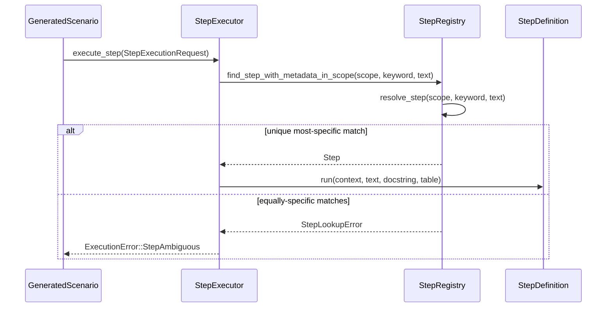

# RFC 0001: Explicit step-library scopes

## Preamble

- **RFC number:** 0001
- **Status:** Implemented
- **Created:** 2026-08-30
- **Target release:** v0.7.0
- **Issue:** [#658](https://github.com/leynos/rstest-bdd/issues/658)

## Summary

This RFC introduces named step libraries and lets each scenario select its
complete step vocabulary. The selection is lexical and fixed before scenario
execution: the order of selected libraries and the previously matched step do
not affect lookup.

The built-in `rstest_bdd::global` library preserves existing unannotated step
definitions and scenarios. Named libraries make otherwise identical domain
phrases reusable without turning a process-wide registry collision into a
specification-language constraint.

## Problem

The global registry previously required every `(keyword, pattern)` pair to be
unique for the whole test process. Generic phrases such as
`Given the account is empty` are useful in more than one disjoint domain, but
could not coexist. Making every phrase globally distinctive exposed suite
implementation scale in business-language specifications and made reusable step
packs difficult to compose safely.

## Goals and non-goals

- Goals:
  - Declare a named library around a module of step definitions.
  - Select an exact library set from `#[scenario]` and `scenarios!`.
  - Permit duplicate patterns across libraries, while rejecting duplicates
    within one library.
  - Resolve selected definitions deterministically and diagnose ambiguity.
  - Preserve existing unannotated suites through `rstest_bdd::global`.
  - Support public, cross-crate libraries using ordinary Rust paths.
- Non-goals:
  - Dynamic, previous-step-sensitive dispatch.
  - Library precedence based on list or registration order.
  - Runtime registry mutation, library inheritance, or implicit composition.
  - Changes to fixture namespaces or fixture lookup.

## Proposed design

### Declaring and selecting libraries

`#[step_library]` declares a module as a named vocabulary. It supports inline,
out-of-line, nested, and public modules. The macro emits a marker that is
resolved through an ordinary Rust path, so visibility and cross-crate failures
remain compiler errors rather than string lookup failures.

```rust,no_run
use rstest_bdd_macros::{given, scenario, step_library, when};

#[step_library]
mod common {
    use super::given;

    #[given("the service is running")]
    fn service_is_running() {}
}

#[step_library]
mod accounts {
    use super::{given, when};

    #[given("the account is empty")]
    fn account_is_empty() {}

    #[when("the customer deposits {amount:u64}")]
    fn deposit() {}
}

#[scenario(
    path = "tests/features/accounts.feature",
    libraries = [common, accounts],
)]
fn account_scenarios() {}
```

Every registered `Step` has one `StepLibraryId`. The registry indexes exact and
parameterized steps by library and keyword before applying pattern-specificity
comparison. This avoids a whole-inventory scan for each execution step.

### Closed-world selection

Omitting `libraries` selects only `rstest_bdd::global`, which contains every
unannotated definition. An explicit list selects exactly that list; it does not
silently add global definitions.

```rust,no_run
#[scenario(
    path = "tests/features/mixed.feature",
    libraries = [rstest_bdd::global, accounts],
)]
fn mixed_scenarios() {}
```

The explicit `global` entry makes compatibility vocabulary visible at the
binding site and prevents unrelated registrations from silently changing a
scenario's meaning.

### Lookup and ambiguity

Screen reader description: the diagram shows a generated scenario sending one
step request to its executor. The executor asks the registry to resolve the
request within the scenario's fixed scope. A unique most-specific result runs
the step definition; equally specific results return a lookup error that the
executor reports as a scoped ambiguity.



Figure: Scoped lookup uses one immutable scenario vocabulary and rejects an
equally specific match rather than taking a first match.

Library order never supplies precedence. If selected libraries contain equally
specific candidates, lookup fails and identifies the Gherkin keyword and text,
the selected library paths, and every candidate library, pattern, and source
location. A missing-step diagnostic also reports when a matching definition is
available only in an unselected library.

## Compatibility and tooling

Unannotated source remains source-compatible: its steps belong to the global
library and unscoped scenarios select that library. Code that opts into named
libraries must name every required library explicitly.

Duplicate detection, bypass tracking, registry dumps, synchronous and
asynchronous lookup, harness execution, preflight validation, reports, and the
language server all use the same scope. The language server indexes library
membership and resolves definitions, references, completion, and diagnostics
against the scenario's selected scope.

## Verification

The implementation must retain behavioural coverage for disjoint identical
patterns, common-plus-domain composition, equal-candidate ambiguity,
same-library duplicate rejection, global-library compatibility, synchronous,
asynchronous, and harness execution. Compile-time coverage must include valid
library selection and invalid or inaccessible library paths. Language-server
fixtures cover scope-dependent completion and diagnostics.

## Alternatives considered

- **Globally unique patterns:** retains the current collision and prevents safe
  reuse of generic domain language.
- **Namespaced Gherkin phrases:** exposes implementation structure in business
  specifications.
- **First selected library wins:** makes list order load-bearing and permits a
  newly added common step to redirect an existing scenario.
- **Previous-step affinity:** makes one sentence context-sensitive and creates
  hidden dispatch state, as in Yadda-style selection.
- **String library names:** are typo-prone, not refactor-safe, and cannot use
  Rust visibility checks.

## Open questions

The first implementation keeps selection in Rust scenario bindings. Future
feature-level metadata may be considered only if it can retain the same closed
world, Rust-path-safe contract.

## Recommendation

Adopt lexical, closed-world library selection. It permits reusable domain
vocabularies while retaining deterministic matching and actionable ambiguity
diagnostics.
