# Proposed design for `rstest-bdd`: a behaviour-driven development (BDD) framework for Rust

## Part 1: Vision and user-facing design

This part of the report details the user-facing aspects of the proposed
`rstest-bdd` framework. It outlines the core philosophy, provides a
comprehensive usage example, and explores advanced features, focusing on
creating an ergonomic and powerful BDD experience that is idiomatic to the Rust
ecosystem.

### 1.1 Introduction: A synergistic approach to BDD in Rust

Behaviour-Driven Development (BDD) is a software development process that
encourages collaboration between developers, quality assurance experts, and
non-technical business participants. It achieves this by using a natural,
domain-specific language to describe an application's behaviour from the user's
perspective.[^1] The proposed

`rstest-bdd` framework is designed to bring this collaborative power to Rust by
deeply integrating BDD principles with the `rstest` testing crate.

The core philosophy of `rstest-bdd` is to fuse the human-readable,
requirement-driven specifications of Gherkin 3 with the powerful,
developer-centric features of

`rstest`.[^2] The primary value proposition is the unification of high-level
functional and acceptance tests with low-level unit tests. Both test types
coexist within the same project, use the same fixture model for dependency
injection, and are executed by the standard `cargo test` command. This approach
eliminates the need for a separate test runner, reducing continuous integration
(CI) and continuous delivery (CD) configuration complexity and lowering the
barrier to adoption for teams already invested in the Rust testing
ecosystem.[^3]

The design is heavily modelled on `pytest-bdd`, a successful plugin for
Python's `pytest` framework.[^4]

`pytest-bdd`'s success stems from its ability to leverage the full power of its
host framework—including fixtures, parameterisation, and a vast plugin
ecosystem—rather than replacing it.[^1] By emulating this model,

`rstest-bdd` will provide a familiar and robust BDD experience that feels
native to Rust developers who appreciate the capabilities of `rstest`.

### 1.2 A complete usage example: The "Web search" scenario

To illustrate the intended workflow, this section presents a complete,
narrative example of testing a web search feature. This walkthrough mirrors the
structure of typical `pytest-bdd` tutorials, demonstrating the journey from a
plain-language specification to an executable test.[^1]

#### 1.2.1 Step 1: The feature file

The process begins with a `.feature` file written in Gherkin. This file
describes the desired functionality in a way that can be understood and
validated by non-technical stakeholders.[^1]

**File:** `tests/features/web_search.feature`

```gherkin
Feature: Web Search
  In order to find information, a user performs a web search.

  Scenario: Simple web search
    Given the DuckDuckGo home page is displayed
    When a user searches for "Rust programming language"
    Then the search results page is displayed
    And the results contain "Rust Programming Language"
```

#### 1.2.2 Step 2: The step definition file

Next, developers create a corresponding Rust test file to implement the logic
for each step defined in the Gherkin scenario. This is where the core
`rstest-bdd` macros come into play.

A key design choice, inherited from `pytest-bdd`, is that the Rust test module
is the primary entry point, not the feature file.[^5] A test function is
explicitly bound to a Gherkin scenario using the

`#[scenario]` attribute macro, which is a direct parallel to `pytest-bdd`'s
`@scenario` decorator.[^3]

State is managed and passed between steps using `rstest`'s native fixture
system, a cornerstone of this design. This contrasts with other BDD frameworks
that often rely on a monolithic `World` object.[^6] By using fixtures,

`rstest-bdd` allows for the reuse of setup and teardown logic already written
for unit tests, promoting a Don't Repeat Yourself (DRY) approach.[^1]

**File:** `tests/test_web_search.rs`

> **Note:** This example demonstrates the intended async API using `async fn`
> step definitions with `#[tokio::test]`. Async step execution is planned but
> not yet implemented. See §2.5 for the async execution design and the roadmap
> for implementation status. In the current synchronous implementation, step
> functions must be non-async.

```rust,no_run
use rstest::fixture;
use rstest_bdd::{scenario, given, when, then};
// Assume 'thirtyfour' or another WebDriver crate is used for browser automation.
use thirtyfour::prelude::*;

// An rstest fixture that provides the WebDriver instance for the test.
// This is standard rstest functionality.[4, 12]
#[fixture]
async fn browser() -> WebDriverResult<WebDriver> {
    let caps = DesiredCapabilities::firefox();
    // The fixture yields the browser to the test, and will handle cleanup after.
    Ok(WebDriver::new("http://localhost:4444", caps).await?)
}

// The #[scenario] macro binds this test function to a specific scenario.
// It will generate the necessary code to run the Gherkin steps.
// The test attribute (e.g., #[tokio::test]) would be configured via
// feature flags in Cargo.toml to support different async runtimes.
#[tokio::test]
async fn test_simple_search(#[future] browser: WebDriver) {
    // The body of this function runs *after* all Gherkin steps have passed.
    // It can be used for final assertions or complex cleanup.[6]
    // The example assumes the browser closes implicitly when the 'browser'
    // fixture goes out of scope.
}

// Step definitions are just decorated functions.
// The fixture is injected when the parameter name matches the fixture.
#[given("the DuckDuckGo home page is displayed")]
async fn go_to_home(browser: &mut WebDriver) -> WebDriverResult<()> {
    browser.goto("https://duckduckgo.com/").await?;
    Ok(())
}

// The framework will parse the quoted string and pass it as an argument.
#[when("I search for \"{phrase}\"")]
async fn search_for_phrase(browser: &mut WebDriver, phrase: String) -> WebDriverResult<()> {
    let form = browser.find(By::Id("search_form_input_homepage")).await?;
    form.send_keys(&phrase).await?;
    form.submit().await?;
    Ok(())
}

#[then("the search results page is displayed")]
async fn results_page_is_displayed(browser: &mut WebDriver) -> WebDriverResult<()> {
    browser.find(By::Id("links")).await?;
    Ok(())
}

#[then("the results contain \"(.*)\"")]
async fn results_contain_text(browser: &mut WebDriver, text: String) -> WebDriverResult<()> {
    let content = browser.source().await?;
    if content.contains(&text) { Ok(()) }
    else { Err(thirtyfour::error::WebDriverError::CustomError(
        format!("Result text not found: expected substring '{text}'")
    )) }
}
```

#### 1.2.3 Step 3: Running the tests

With the feature and step definition files in place, the user simply runs the
standard Rust test command:

```bash
cargo test
```

`rstest-bdd` ensures that `test_simple_search` is executed as a regular test.
`rstest` handles the `browser` fixture setup, and the code generated by
`#[scenario]` orchestrates the execution of the `given`, `when`, and `then`
steps in the correct order. This seamless integration means all standard
`cargo` and `rstest` features, such as test filtering and parallel execution,
work out of the box.[^7]

### 1.3 Advanced usage patterns

Beyond the basic workflow, `rstest-bdd` is designed to support the advanced
Gherkin features necessary for comprehensive testing.

#### 1.3.1 Parameterisation with `Scenario Outline`

Gherkin's `Scenario Outline` allows a single scenario to be run with multiple
sets of data from an `Examples` table.[^8]

`rstest-bdd` will map this concept directly to `rstest`'s powerful
parameterisation capabilities. The `#[scenario]` macro will detect a
`Scenario Outline` and generate code equivalent to a standard `rstest`
parameterised test using multiple `#[case]` attributes.[^9]

**Feature File (**`login.feature`**):**

```gherkin
Feature: User Login

  Scenario Outline: Login with different credentials
  Given the login page is displayed
  When a user enters username "<username>" and password "<password>"
  Then the message "<message>" is shown

    Examples:

   | username | password | message |
   | user | correctpass | "Welcome, user!" |
   | user | wrongpass | "Invalid credentials" |
   | admin | adminpass | "Welcome, administrator!" |
```

**Step Definition (**`test_login.rs`**):**

> **Note:** This example uses `async fn` step definitions, which require async
> execution mode. See the note above §1.2.2 and §2.5 for details.

```rust,no_run
//...
#[scenario(path = "features/login.feature", index = 0)]
#[tokio::test]
async fn test_login_scenarios(#[future] browser: WebDriver) {}

// Placeholders from the 'Examples' table are passed as typed arguments to the step functions.
#[when("A user enters username {username} and password {password}")]
async fn enter_credentials(
    browser: &mut WebDriver,
    username: String,
    password: String,
) -> WebDriverResult<()> {
    //... implementation...
    Ok(())
}

#[then("The message {message} is shown")]
async fn see_message(browser: &mut WebDriver, message: String) -> WebDriverResult<()> {
    //... assert message is visible...
    Ok(())
}
```

#### 1.3.2 Step argument parsing

To provide an ergonomic and type-safe way of extracting parameters from step
strings, `rstest-bdd` will support a `format!`-like syntax. This avoids the
need for raw regular expressions in most cases and leverages Rust's existing
`FromStr` trait for "magic conversion", a core feature of `rstest`.[^2] This is
directly analogous to the `parsers` module in `pytest-bdd`.1.

**Example:**

```rust,no_run
// Step in.feature file:
// When 50 dollars are deposited

// Step definition in.rs file:
#[when("a user deposits {amount:u32} dollars")]
fn deposit_amount(#[from(account)] acc: &mut Account, amount: u32) {
    acc.deposit(amount);
}
```

The framework will parse the string "50", use `u32::from_str("50")` to convert
it, and pass the resulting `u32` value to the `deposit_amount` function.

#### 1.3.3 Using `Background`, data tables, and Doc strings

To achieve feature parity with modern BDD tools, the framework supports other
essential Gherkin constructs.

- Background: Steps defined in a `Background` section run before each
  `Scenario` in a feature file.[^10] The parser prepends these steps to each
  scenario's step list so the `#[scenario]` macro runs them first.

- Data Tables: A Gherkin data table provides a way to pass a structured block
  of data to a single step. The step function declares a single optional
  parameter annotated with `#[datatable]` or named `datatable`. Legacy code may
  keep using `Vec<Vec<String>>`, while the runtime `rstest_bdd::datatable`
  module offers typed parsing utilities.

  - `datatable::Rows<T>` wraps a `Vec<T>` and derives `Deref<Target = [T]>`,
    `From<Vec<T>>`, and `IntoIterator` via `derive_more`, letting steps consume
    parsed rows ergonomically. Steps that must regain ownership call
    `Rows::into_vec()` to retrieve the backing vector. The blanket
    `TryFrom<Vec<Vec<String>>>` implementation inspects the
    `T::REQUIRES_HEADER` flag: when true the first row is parsed into a
    `HeaderSpec`; otherwise the table is treated as headerless. Each remaining
    row is converted into a `RowSpec` and handed to `T::parse_row`.
  - `datatable::DataTableRow` defines the parsing contract. Implementors
    receive ownership of each row, can remove cells via `take_cell` /
    `take_column`, and can parse values with the `parse_*` helpers. Until the
    derive macros are implemented consumers must write these impls manually.
  - `DataTableError` (via `thiserror`) surfaces header mismatches, missing
    columns, uneven rows, and row or cell parsing failures. Step wrappers
    format the error into `StepError` so behaviour test output includes precise
    diagnostics.
- `RowSpec` and `HeaderSpec` provide indexed and named cell access, exposing
  row numbers (1-based including headers) to keep user-defined error messages
  consistent. `HeaderSpec::require` powers name lookups while the
  `RowSpec::parse_*` helpers attach column metadata to downstream errors.
- Convenience helpers such as `truthy_bool` and `trimmed<T: FromStr>` support
  tolerant boolean parsing and whitespace handling without bespoke loops.
- The runtime surfaces the primary datatable types described above. The class
  diagram below illustrates the relationships between the error hierarchy, row
  parsing trait, and collection wrapper.


- `#[derive(DataTableRow)]` will generate `DataTableRow` implementations for
  structs and tuple structs. Field attributes like
  `#[datatable(column = "Task name")]`, `#[datatable(optional)]`,
  `#[datatable(parse_with = "path::to_fn")]`, and struct-level
  `#[datatable(rename_all = "...")]` will cover column mapping, optional cells,
  trimming, and custom parsers. The derive will set `REQUIRES_HEADER` when any
  field depends on header lookup.
  - `#[derive(DataTable)]` will target tuple structs that wrap collections. It
    will compose parsed rows with optional `map` or `convert` hooks, so steps
    can expose domain-specific containers without manual loops.

  The implementation uses `convert_case` to provide familiar serde-style rename
  rules (`lowercase`, `PascalCase`, `kebab-case`, and screaming variants).
  Field attributes support header overrides (`column`), tolerant booleans
  (`truthy`), whitespace normalization (`trim`), optional cells (`optional` on
  `Option<T>`), and defaults (`default` or `default = path`). Absent a custom
  parser, the derive falls back to `FromStr` with error types constrained to
  `std::error::Error`. Custom parsers are functions of the form
  `fn(&str) -> Result<T, E>` where `E: Error + Send + Sync + 'static`. The
  generated code matches `DataTableError::MissingColumn` and
  `DataTableError::MissingCell` to drive optional and default behaviour while
  propagating all other failures unchanged. The `truthy` attribute is limited
  to `bool` fields to maintain clear semantics.

  Trybuild fixtures lock down these invariants. Dedicated compile-fail cases
  assert that `#[datatable(optional)]` only applies to `Option<T>` fields,
  reject defaults on optional fields, and flag mutually exclusive combinations
  such as `optional` with `default` or `truthy` with `parse_with`. The fixtures
  act as regression tests for the derive validation logic, mirroring the
  user-facing compiler messages expected from the macros.

  `#[derive(DataTable)]` recognizes tuple structs that wrap either `Rows<T>` or
  `Vec<T>`, defaulting to `Rows::try_from` and `Rows::into_vec` conversions.
  When consumers need bespoke containers, `map` hooks transform `Rows<T>`
  directly, while `try_map` surfaces fallible aggregation returning
  `DataTableError`. Both hooks consume the parsed `Rows<T>`, keeping ownership
  transfer explicit and predictable.

  Existing custom `TryFrom<Vec<Vec<String>>>` implementations continue to work,
  letting projects adopt typed tables gradually. The decision to gate header
  detection behind `REQUIRES_HEADER` keeps the runtime predictable and avoids
  heuristics that might silently strip legitimate first rows from headerless
  tables.

  **Feature File:**

```gherkin
  Given the following users exist:

  | name  | email              | active |
  | Alice | alice@example.com | yes    |
  | Bob   | bob@example.com   | no     |
```

**Step definition (`tests/steps/create_users.rs`):**

```rust,no_run
use rstest_bdd::datatable::{self, Rows};
use rstest_bdd_macros::DataTableRow;

#[derive(DataTableRow)]
#[datatable(rename_all = "kebab-case")]
struct UserRow {
    name: String,
    #[datatable(parse_with = "datatable::truthy_bool")]
    active: bool,
    #[datatable(column = "email")]
    email: String,
}

#[given("the following users exist:")]
fn create_users(
    #[from(db)] conn: &mut DbConnection,
    #[datatable] users: Rows<UserRow>,
) {
    for row in users {
        conn.insert_user(&row.name, &row.email, row.active);
    }
}
```

- Doc strings: A Gherkin docstring allows a larger block of multi-line text
  to be passed to a step. This will be provided as a `String` argument to the
  step function, again mirroring `pytest-bdd`.[^11]

#### 1.3.4 Filtering scenarios with tags

Tags provide a convenient way to organize scenarios and control which tests
run. The `#[scenario]` macro will accept an optional `tags` argument containing
an expression such as `"@fast and not @wip"`. Only scenarios whose tags satisfy
this expression will expand into test functions. Filtering occurs at
macro-expansion time; unmatched scenarios do not generate tests (no runtime
skipping). The `scenarios!` macro will offer the same argument to filter an
entire directory of feature files.

Tag scope:

- Scenario tags inherit all tags declared at the `Feature:` level.
- For `Scenario Outline`, tags on the outline and on each `Examples:` block
  apply to the expanded cases produced from that block.
- Tag composition uses set union; duplicates are ignored. There is no implicit
  removal or override of inherited tags.

**Example:**

```rust,no_run
#[scenario(path = "search.feature", tags = "@fast and not @wip")]
fn search_fast() {}
```

The macro emits a test only when the matched scenario carries the `@fast` tag
and lacks the `@wip` tag.

Grammar and semantics:

- Tokens:
- Tags are identifiers prefixed with `@` and match `[A-Za-z0-9_-]+`.
  - Operators: `and`, `or`, `not`.
  - Parentheses `(` `)` group sub-expressions.
- Precedence: `not` > `and` > `or`. Parentheses override precedence.
- Associativity: `and` and `or` are left-associative; `not` is unary-prefix.
- Whitespace is ignored between tokens.
- Tag matching is case-sensitive; operator keywords are case-insensitive.
- Invalid expressions cause a `compile_error!` with a message that includes the
  byte offset of the failure and a short reason.
- Omitting the `tags` argument applies no filter; an explicit `""` or unknown
  tokens (e.g., `&&`, `||`, `!`) are invalid and emit `compile_error!`.
- Empty parentheses `()` and dangling operators (`@a and`, `or @b`, leading
  `and`/`or`) are invalid.
- Matching is set-membership only; tags do not carry values.

Both macros delegate tag-expression parsing to a shared module so that
`#[scenario]` and `scenarios!` share identical grammar and diagnostics.

Extended Backus–Naur Form (EBNF):

```ebnf
expr      ::= or_expr
or_expr   ::= and_expr { "or" and_expr }
and_expr  ::= not_expr { "and" not_expr }
not_expr  ::= [ "not" ] primary
primary   ::= TAG | "(" expr ")"
TAG       ::= "@" IDENT
IDENT     ::= { A..Z | a..z | 0..9 | "_" | "-" }+
```

Implementation stores the parsed expression as an abstract syntax tree (AST)
shared by both macros so they emit identical diagnostics. `#[scenario]`
continues to default to the first matching scenario but emits a compile error
when a supplied `name` or `index` refers to a scenario that fails the tag
filter. Scenario outlines prune unmatched example rows at expansion, ensuring
the generated `rstest` only contains relevant cases.

Example diagnostic:

```text
error: invalid tag expression at byte 7: expected tag or '(' after 'and'
```

`scenarios!` usage:

```rust,no_run
// Include smoke OR (critical AND not wip):
scenarios!("tests/features/", tags = "@smoke or (@critical and not @wip)");

// Exclude slow:
scenarios!("tests/features/", tags = "not @slow");

// Operator keywords are case-insensitive:
scenarios!("tests/features/", tags = "@SMOKE Or Not @Wip");
```

## Part 2: Architectural and API specification

This part transitions from the user's perspective to the technical
implementation, detailing the procedural macro API, the core architectural
challenges and solutions, and the end-to-end code generation process.

### 2.1 Procedural macro API design

The user-facing functionality is enabled by a suite of procedural macros. Each
macro has a distinct role in the compile-time orchestration of the BDD tests.

- `#[scenario("…")]` or `#[scenario(path = "…", index = N)]` – the primary
  entry point and orchestrator.

  - Arguments:

    - `path: &str`: A mandatory, relative path from the crate root to the
      `.feature` file containing the scenario. The path can be provided as a
      bare string literal or with the explicit `path =` form when other
      arguments are used.

    - `index: usize` (optional): Selects which scenario in the feature file to
      execute. Defaults to `0` when omitted.

  - Functionality: This macro is responsible for the heavy lifting. At
    compile time, it reads and parses the specified feature file, finds the
    matching scenario, and generates a complete, new test function annotated
    with `#[rstest]`. This generated function contains the runtime logic to
    execute the Gherkin steps.

- `#[given("...")]`, `#[when("...")]`, `#[then("...")]` - these macros attach to
  the step implementation functions.

- Argument: An optional string literal representing the Gherkin step text. If
  omitted or containing only whitespace, the pattern is inferred from the
  function name by replacing underscores with spaces. A literal `""` registers
  an empty pattern. Inference preserves whitespace semantics: leading and
  trailing underscores become spaces, consecutive underscores become multiple
  spaces, and letter case is preserved. This avoids duplicating names while
  keeping the macros simple.

  - Functionality: These macros have a single, critical purpose: to
    register the decorated function and its associated metadata (the pattern
    string, keyword, and source location) into a global, discoverable registry.
    They do not generate any executable code on their own.

  The initial implementation delegates registration to the runtime crate's
  `step!` helper. Each macro expands to the original function followed by a
  call to `rstest_bdd::step!`, which internally uses `inventory::submit!` to
  add a `Step` to the registry.

- Data Tables: Step functions may include a single optional parameter declared
  either by annotating it with `#[datatable]` or by naming it `datatable`.
  Legacy consumers can continue to request a `Vec<Vec<String>>`. A future
  `datatable::Rows<T>` newtype will be supported. When implemented, the wrapper
  will materialize the runtime `&[&[&str]]` payload into `Vec<Vec<String>>` and
  invoke `TryFrom<Vec<Vec<String>>>`. The planned implementation will cover
  `Rows<T>` where `T: DataTableRow`. Conversion failures will yield a
  `DataTableError`, and the generated wrapper will format the error's `Display`
  output into the resulting `StepError`, preserving row and column diagnostics.
  The data table parameter must precede any Doc String argument, must not be
  combined with `#[from]`, and a missing table triggers a runtime error.

- Doc strings: A multi-line text block immediately following a step is
  exposed to the step function through an optional `docstring` parameter of
  type `String`. The runner passes the raw block to the wrapper as
  `Option<&str>`, and the wrapper clones it into an owned `String` before
  calling the step function. As with data tables, the parameter must use this
  exact name and concrete type for detection. The wrapper fails at runtime if
  the docstring is absent. A data table must precede any docstring parameter,
  and feature files may delimit the block using either triple double-quotes or
  triple backticks.

Macro attribute expansion relies on `rstest-bdd-macros::MacroPattern` to
compile and cache regular expressions during macro execution. The helper
delegates to the shared `rstest-bdd-patterns` crate so that compile-time and
runtime code paths agree on placeholder semantics. The cached `Regex` is
exposed to the macro via a `OnceLock`, avoiding repeated compilation when the
same pattern is referenced multiple times within a single expansion.


Figure: Procedural macros compile patterns through the shared parser and cache
successful results to avoid redundant work within a single expansion.

### 2.2 The core architectural challenge: Stateless step discovery

The most significant technical hurdle in this design is the inherent nature of
Rust's procedural macros. Each macro invocation is executed by the compiler in
an isolated, stateless environment.[^12] This means that when the

`#[scenario]` macro is expanding, it has no direct way to discover the
functions that have been decorated with `#[given]`, `#[when]`, or `#[then]`. It
cannot scan the project's source code, reflect on other modules, or access a
shared compile-time state to build a map of available steps.[^13] This stands
in stark contrast to

`pytest`, which provides a rich runtime plugin system that `pytest-bdd` hooks
into to discover tests and steps dynamically during a collection phase.[^7]

This fundamental constraint of the Rust compiler forces a specific
architectural choice. Several potential solutions exist, but only one aligns
with the project's core goals:

1. **Custom Test Runner:** The framework could provide its own test runner
   binary, similar to the `cucumber` crate which requires a `main` function to
   invoke `World::run(...)`.[^6] This runner would be responsible for
   discovering feature files and step definitions. However, this approach would
   completely bypass

   `rstest` and `cargo test`, violating the primary design goal of seamless
   integration. It would effectively be a reimplementation of `cucumber-rs`,
   not `rstest-bdd`.
2. `build.rs` **Code Generation:** A build script (`build.rs`) could be used to
   parse all `.rs` files in the `tests` directory before the main compilation.
   It could find all the step-definition attributes and generate a single,
   monolithic `steps.rs` file containing a registry of all steps. The
   `#[scenario]` macro could then `include!` this generated file. This approach
   is technically feasible but suffers from major drawbacks: it is complex to
   implement robustly, significantly slows down compilation, is notoriously
   brittle, and often provides a poor experience with IDE tools like
   `rust-analyzer` which may not be aware of the generated code.
3. **Link-Time Collection:** The ideal solution is a mechanism that allows each
   step-definition macro to emit metadata independently, with this metadata
   being collected into a single registry *after* all macros have run. This can
   be achieved by placing the metadata in a specific linker section of the
   compiled object file. At runtime, the application can read this linker
   section to discover all the registered items.

The third option, link-time collection, is the only one that satisfies all
design constraints. It preserves the standard `cargo test` workflow, avoids the
fragility of build scripts, and allows for fully decoupled step definitions.

To surface missing steps earlier, the macros crate maintains a small,
compile‑time registry, and each `#[given]`, `#[when]`, and `#[then]` invocation
records its keyword and pattern there. When `#[scenario]` expands, it consults
this registry and emits a `compile_error!` for any Gherkin step that lacks a
unique definition. Because the registry only sees steps from the current
compilation unit, each entry stores the originating crate’s identifier to avoid
false positives from unrelated crates compiled in the same process. Scenarios
that reference steps in other crates would otherwise fail to compile, so the
crate defaults to a permissive mode that prints warnings for unknown steps.
Enabling the `strict-compile-time-validation` feature turns those warnings into
errors. The registry simply records metadata but reuses the runtime crate’s
pattern‑matching logic during validation, introducing a build-time dependency.
`inventory` is employed later for runtime, cross‑crate discovery and does not
power this compile‑time registry.

Step definitions are recorded per crate and grouped by keyword, enabling direct
lookups without scanning unrelated patterns. When the current crate has no
registered steps, non-strict validation emits a warning and continues, so that
definitions from other crates can satisfy the scenario.

The following sequence diagram illustrates the feature-gated step registration
and scenario validation flow:


Continuous integration verifies Markdown formatting and diagram rendering.
Every pull request runs `make fmt`, `make markdownlint`, and `make nixie`; the
job fails if formatting or Mermaid rendering errors are detected.

Because registration occurs as the compiler encounters each attribute, step
definitions must appear earlier in a module than any `#[scenario]` that uses
them. Declaring a scenario first would trigger validation before the step is
registered, producing a spurious "No matching step definition" error. A UI test
(`scenario_out_of_order`) documents this requirement.

### 2.3 The `inventory` solution: A global step registry

The `inventory` crate provides a clean and powerful abstraction over the
link-time collection mechanism described above. It offers "typed distributed
plugin registration," allowing different parts of a program to submit items
into a collection that can be iterated over at runtime.[^14]

For `rstest-bdd`, this pattern is used to create a global registry of all step
definitions. First, a struct is defined to hold the metadata for each step.
This struct will contain a type-erased function pointer to the user's
implementation, the pattern string to match against Gherkin text, and source
location information for generating clear error messages.

**Definition of the** `Step` **struct (within the** `rstest-bdd` **crate):**

```rust,no_run
// A simplified representation of the step metadata.
#[derive(Debug)]
pub struct Step {
    pub keyword: StepKeyword, // e.g., Given, When, Then, And or But
    pub pattern: &'static StepPattern, // The pattern string from the attribute,
                                       // e.g., "A user has {count} cucumbers"
    // A type-erased function pointer. Arguments will be wired up by the
    // scenario orchestrator in later phases.
    pub run: fn(),
    // Location info for better error messages.
    pub file: &'static str,
    pub line: u32,
}

// This macro call creates the global collection for 'Step' structs.
inventory::collect!(Step);
```

The [`StepKeyword`](../crates/rstest-bdd/src/types.rs) enum implements
`FromStr`. Parsing failures return a `StepKeywordParseError` to ensure invalid
step keywords are surfaced early. Matching ignores case and surrounding
whitespace. All five Gherkin keywords are recognized and `And`/`But` are
resolved to the preceding primary keyword during parsing.

The [`StepPattern`](../crates/rstest-bdd/src/pattern.rs) wrapper encapsulates
the pattern text so that step lookups cannot accidentally mix arbitrary strings
with registered patterns. Each pattern is compiled into a regular expression
when the step registry is initialized, surfacing invalid syntax immediately.
Equality and hashing rely solely on the pattern text. Transient fields like the
cached `Regex` are ignored to preserve identity-by-source-text semantics. The
global registry stores `(StepKeyword, &'static StepPattern)` keys in a
`hashbrown::HashMap` and uses the raw-entry API for constant-time lookups by
hashing the pattern text directly.

Placeholder parsing follows a two-stage pipeline that first tokenizes the
pattern and then translates the resulting tokens into an anchored regular
expression. This architecture keeps the lexing responsibilities focused and
isolated from the regex synthesis step, making it easier to extend placeholder
semantics without touching the compiler.

The lexer (`pattern::lexer::lex_pattern`) walks the pattern once and produces a
sequence of semantic tokens:

- `Token::Literal(String)` — runs of literal text copied verbatim into the
  regex after escaping.
- `Token::Placeholder { start, name, hint }` — captures placeholder metadata;
  the `start` index feeds error reporting while the optional `hint` maps to a
  type-aware sub-pattern.
- `Token::OpenBrace { index }` / `Token::CloseBrace { index }` — unmatched
  braces preserved in the output so literal braces still require doubling.

Escaped braces (`\{`, `\}`) and doubled braces (`{{`, `}}`) remain purely
lexical concerns. Nested placeholders are handled by delegating to
`pattern::placeholder::parse_placeholder`, which understands balanced brace
pairs within a placeholder body. The compiler module applies
`build_regex_from_pattern` to iterate over the tokens, escape literal runs,
replace placeholders with capturing groups, and surface structural mistakes
such as unbalanced braces.

```mermaid
sequenceDiagram
  autonumber
  actor Dev as Developer
  participant SP as StepPattern
  participant LX as lex_pattern (pub(crate))
  participant PP as parse_placeholder (pub(crate))
  participant CP as build_regex_from_pattern (pub(crate))
  participant RX as regex::Regex

  Dev->>SP: compile()
  SP->>CP: build_regex_from_pattern(text)
  CP->>LX: lex_pattern(text)
  loop over pattern bytes
    alt doubled brace or escape
      LX-->>CP: Token::Literal("{" | "}")
    else placeholder start
      LX->>PP: parse_placeholder(bytes, index)
      alt OK
        PP-->>LX: PlaceholderSpec
        LX-->>CP: Token::Placeholder
      else malformed
        PP-->>LX: PatternError
        LX-->>CP: Err(PatternError)
        CP-->>SP: Err(PatternError)
        SP-->>Dev: Err
      end
    else unmatched brace
      LX-->>CP: Token::OpenBrace / Token::CloseBrace
    else literal
      LX-->>CP: Token::Literal
    end
  end
  alt stray depth != 0
    CP-->>SP: Err(PatternError)
    SP-->>Dev: Err
  else balanced
    CP-->>SP: Ok(src)
    SP->>RX: Regex::new(src)
    RX-->>SP: Ok(Regex)
    SP-->>Dev: Ok(())
  end
```



Figure: `compile` delegates to the lexer–compiler pipeline. At compile time,
`StepPattern::compile` returns a `Result<(), regex::Error>`, and
`extract_placeholders` wraps any compile error as
`PlaceholderError::InvalidPattern` at runtime.

Runtime placeholder extraction reuses the same parser. The sequence below
summarizes the call path when placeholders are resolved at runtime.


Figure: Runtime placeholder extraction delegates to `rstest-bdd-patterns` to
compile a regex and report matches or errors to the caller.

Duplicate step definitions are rejected when the registry is built. Attempting
to register the same keyword and pattern combination twice results in a panic
that points to the conflicting definition so that errors surface early during
test startup.

Placing the `Step` struct in the runtime crate avoids a circular dependency
between the procedural macros and the library. The macros will simply re-export
the type when they begin submitting steps to the registry.

A small convenience macro, `step!`, wraps `inventory::submit!` and directly
constructs a `Step`. It captures the file and line number automatically so that
users only provide the keyword, pattern, and handler when registering a step.

The `#[given]`, `#[when]`, and `#[then]` macros will expand into an
`inventory::submit!` block. This macro call constructs an instance of the
`Step` struct at compile time and registers it for collection.[^14]

At runtime, the code generated by the `#[scenario]` macro can retrieve a
complete list of all step definitions across the entire application simply by
calling `inventory::iter::<Step>()`. This provides an iterator over all
registered `Step` instances, regardless of the file, module, or crate in which
they were defined.

For screen readers: The following class diagram shows the relationships among
the core step types. The `Step` struct references `StepKeyword`, `StepPattern`,
and either `StepFn` (synchronous) or `AsyncStepFn` (asynchronous, see §2.5).


*Figure: Core step types showing both synchronous and asynchronous execution
paths.*

For screen readers: The following class diagram shows the step wrapper
architecture for both synchronous and asynchronous execution modes.


*Figure: Step wrapper architecture for sync and async execution.*

#### Registry interaction diagrams


Figure: `validate_steps_exist` drives step validation and diagnostics.


Figure: Step registration flows through a thin wrapper to the registry.


Figure: Core types involved in registration and validation.

### 2.4 The macro expansion process: A compile-time to runtime journey

The interaction between the user's code, the `rstest-bdd` macros, and the final
test execution can be broken down into a sequence of compile-time and runtime
events.

**1.** `#[given]` **Expansion (Compile-Time)**

- **Input Code:**

```rust,no_run

#[given("a user exists")]
fn given_i_am_a_user(mut user_context: UserContext) { /\*... \*/ }
```

- **Macro Action:** The `#[given]` proc-macro parses its attribute string
  (`"a user exists"`) and the function it's attached to. It then generates an
  `inventory::submit!` block. This block contains the static definition of a
  `Step` struct, where the `run` field is a type-erased pointer to a wrapper
  around the `given_i_am_a_user` function.

**2.** `#[scenario]` **Expansion (Compile-Time)**

- **Input Code:**

```rust,no_run
fn test_sample_scenario(my_fixture: MyFixture) { /\* final assertion \*/ }
```

- **Macro Action:**

1. The `#[scenario]` proc-macro performs file reads to load the contents of
   `f.feature`.
2. It uses a Gherkin parser crate (such as `gherkin` [^15]) to parse the feature
   file content into an abstract syntax tree (AST).
3. It traverses the AST to find the `Scenario` with the name "Sample Scenario".
4. During compilation, the macro validates that each Gherkin step has a
   matching definition recorded by the step macros and emits `compile_error!`
   when one is missing. At runtime, the generated test still performs lookup
   via `inventory::iter::<Step>()` to resolve the concrete function and to
   perform placeholder matching and argument extraction.
5. Using the `quote!` macro [^16], it generates a completely new Rust function.
   This generated function replaces the original

   `test_sample_scenario` function.
6. The generated function is annotated with `#[rstest]`, and it preserves the
   original function's signature, including the `my_fixture: MyFixture`
   argument. This is critical for ensuring `rstest`'s dependency injection
   continues to work.
7. The body of this new, generated function contains the runtime logic for the
   BDD test:

   - It initializes a context or state object for the scenario.

   - It iterates through the steps of "Sample Scenario" as defined in the
     Gherkin AST.

   - For each Gherkin step, it iterates through the global step registry again
     (this time at runtime) by calling `inventory::iter::<Step>()`.

   - It finds the correct registered `Step` by matching the Gherkin step's text
     against the `pattern` field of each registered `Step`.

   - If a match is found, it parses any arguments from the Gherkin text.

   - It invokes the `run` function pointer from the matched `Step` struct,
     passing it the necessary context (which includes access to fixtures and
     step arguments).

   - After the step-execution loop, it includes the user's original code from
     the body of `test_my_scenario`.

### 3. Test execution (runtime)

1. The user runs `cargo test`.
2. The `rstest` test runner discovers the generated `test_my_scenario` function.
3. `rstest` first resolves and provides the `my_fixture` dependency.
4. `rstest` then executes the body of the generated function.
5. The generated code looks up each step using a map built from the global step
   registry. This map is initialized once via `LazyLock`, avoiding repeated
   iteration over `inventory::iter`. Fixtures like `my_fixture` are made
   available to the step functions through the context object passed to the
   call site.
6. If all steps pass, the original code from the user's `test_my_scenario`
   function body is executed.

This architecture successfully bridges the gap between the stateless
compile-time world of procedural macros and the stateful, ordered execution
required for a BDD scenario, all while remaining fully compatible with the
`rstest` framework.

### 2.5 Async step execution

The step execution model described in §2.4 is synchronous: step wrappers are
function pointers that execute immediately and return a `Result`. This section
describes the planned asynchronous execution model that enables `async fn` step
definitions under Tokio. For the full architectural decision record, see
[ADR-001](adr-001-async-fixtures-and-test.md).

#### 2.5.1 Motivation

Many Rust applications use Tokio for asynchronous I/O, and their integration
tests naturally involve async operations such as HTTP requests, database
queries, and message queue interactions. Without native async support, step
definitions must resort to blocking the runtime with `block_on` calls or
restructuring tests to avoid async fixtures entirely.

The async execution model addresses this by:

- Supporting `async fn` step definitions that are awaited sequentially.
- Preserving compatibility with `rstest` asynchronous fixtures.
- Maintaining the existing `skip!` and panic interception behaviour.

#### 2.5.2 Step future type

Async step wrappers return a boxed future tied to the lifetime of the borrowed
`StepContext`. The returned future cannot be `'static` because it may hold
references to fixtures stored in the context.

For screen readers: The following Rust snippet shows the type aliases for async
step execution.

```rust,no_run
use std::future::Future;
use std::pin::Pin;

/// The future returned by an async step wrapper.
type StepFuture<'a> =
    Pin<Box<dyn Future<Output = Result<StepExecution, StepError>> + 'a>>;

/// An async step function pointer.
type AsyncStepFn = for<'a> fn(
    &'a mut StepContext<'a>,
    &str,                     // step text
    Option<&str>,             // docstring
    Option<&[&[&str]]>,       // datatable
) -> StepFuture<'a>;
```

*Figure: Type aliases for async step wrappers.*

#### 2.5.3 Dual execution model

Async support coexists with the synchronous implementation. The execution model
is selected per scenario or per `scenarios!` invocation:

- **Synchronous pipeline (default):** Step wrappers are called and return
  immediately. This is the existing behaviour and remains the default for
  backwards compatibility.
- **Async pipeline (opt-in):** Step wrappers return futures that the scenario
  runner awaits sequentially. This mode is activated when a scenario test uses
  `#[tokio::test]` or when the `scenarios!` macro specifies a runtime argument.

Sync step definitions are normalised into the async interface by wrapping their
result in an immediately ready future. This allows mixed sync and async step
definitions within a single scenario when async mode is enabled.

When a scenario runs in synchronous mode but references an `async fn` step
definition, the framework rejects this at compile time. The step wrapper
generated for synchronous execution cannot await a future, so the macro emits
a `compile_error!` diagnostic indicating that the step requires async mode.
This fail-fast behaviour prevents silent runtime issues.

#### 2.5.4 Tokio current-thread mode

The initial implementation targets Tokio current-thread mode
(`#[tokio::test(flavor = "current_thread")]`). This mode aligns with the
existing `RefCell`-backed fixture model:

- Step futures may be `!Send` because they execute on a single thread.
- Steps can hold `RefMut` guards or `&mut T` borrows across `.await` points.
- No additional synchronisation primitives are required for mutable fixtures.

Multi-thread mode (`#[tokio::test(flavor = "multi_thread")]`) requires step
futures to be `Send`, which would necessitate redesigning the fixture storage
model. This is deferred to a follow-on ADR.

For screen readers: The following diagram shows the async step execution flow.


*Figure: Sequence diagram for async step execution.*

#### 2.5.5 Macro integration

Manual scenario tests can opt into async execution by annotating the test
function with `#[tokio::test]` and declaring it `async fn`. For auto-generated
tests, the `scenarios!` macro accepts a `runtime` argument:

```rust,no_run
rstest_bdd::scenarios!("tests/features", runtime = "tokio-current-thread");
```

The expansion generates `async fn` tests with the appropriate Tokio attribute.
The exact syntax for the runtime argument is subject to finalisation; see
[ADR-001 §Outstanding decisions](adr-001-async-fixtures-and-test.md#outstanding-decisions).

#### 2.5.6 Unwind and skip handling

The synchronous runner uses `std::panic::catch_unwind` to intercept panics and
`skip!` requests. For async steps, the implementation must use a `Future`-aware
catch mechanism (for example, `futures::FutureExt::catch_unwind` or an
equivalent).

Key behaviours preserved in async mode:

- Panics are captured with step index, keyword, and text context.
- `skip!` continues to halt execution and record a skipped outcome.
- Feature and scenario metadata remain available in failure reports.

#### 2.5.7 Current-thread limitations

Tokio current-thread mode has documented limitations that affect step authoring:

- **Blocking operations:** Calls to `std::thread::sleep`, synchronous I/O, or
  CPU-intensive work block the runtime thread and can stall the scenario. Move
  blocking work to `tokio::task::spawn_blocking`.
- **`tokio::spawn` with `!Send` futures:** Code that spawns tasks with
  `tokio::spawn` will fail if the captured future is `!Send`. Use `spawn_local`
  with a `LocalSet` instead, or select multi-thread mode when available.
- **Nested runtimes:** Creating a new Tokio runtime inside a step will panic.
  Avoid `Runtime::block_on` within step definitions.

These constraints are inherent to the current-thread execution model and should
be considered when designing step implementations.

## Part 3: Implementation and strategic analysis

This final part outlines a practical implementation strategy for `rstest-bdd`
and provides a critical analysis of the proposed design, including its
strengths, weaknesses, limitations, and a comparison to the existing `cucumber`
crate.

### 3.1 Phased implementation strategy

A phased approach is recommended to manage complexity and deliver value
incrementally.

- **Phase 1: Core Mechanics & Proof of Concept**

- Establish the two-crate workspace: `rstest-bdd` (the runtime library) and
  `rstest-bdd-macros` (the proc-macro implementation).

- Implement the `inventory`-based step registry. Define the `Step` struct and
  the `#[given]`, `#[when]`, and `#[then]` macros to populate the registry
  using `inventory::submit!`.

- Implement a basic `#[scenario]` macro. This includes compile-time Gherkin
  file parsing and a lookup map built at runtime from the step registry.
  Initially, this map supports exact string matching with no argument parsing.
  only exact string matching with no argument parsing.

- The goal of this phase is to validate the core architectural choice: that a
  `#[scenario]` macro can successfully find and execute steps registered by
  other macros at runtime.

- **Phase 2: Fixtures and Parameterisation**

- Enhance the macro system to inspect the signatures of step functions and
  integrate with `rstest`'s fixture system. This allows steps to request
  fixtures directly.

- Implement support for `Scenario Outline`. The `#[scenario]` macro detects this
  Gherkin construct and generates the corresponding `#[rstest]` `#[case(…)]`
  attributes on the test function. This behaviour is implemented and verified
  by the test suite.
- Introduced lightweight `ExampleTable` and `ScenarioData` structs in the
  macros crate. They encapsulate outline table rows and scenario metadata,
  replacing a complex tuple return and enabling clearer helper functions.
- Improved diagnostics when a `Scenario Outline` column does not match a test
  parameter. The macro lists available parameters, so mismatches can be
  resolved quickly.
- Errors for missing outline parameters use `syn::Error::new_spanned` for more
  precise diagnostics.

- Introduce the `{name:Type}` step argument parser, leveraging the `FromStr`
  trait for type conversion.

- **Phase 3: Advanced Gherkin Features & Ergonomics**

- Add support for Data Tables and Doc strings, passing them as special
  arguments to step functions.

- Implement robust compile-time error handling. The `#[scenario]` macro should
  emit clear compiler errors if a feature file cannot be parsed or if no
  matching step definition can be found for a Gherkin step. The macro validates
  that the referenced feature file exists before invoking the Gherkin parser.
  Missing or malformed files cause `compile_error!` to be emitted, failing fast
  during compilation.

- Develop a `scenarios!` helper macro, analogous to the one in `pytest-bdd` 9,
  which can automatically bind all scenarios within one or more feature files,
  reducing boilerplate for the user.

  - Increase the minimum supported Rust version (MSRV) to 1.85 and remove the
    `async_trait` dependency from `World` and writer traits to simplify
    implementations and match Cucumber v0.21. Set `rust-version = "1.85"` in
    all Cargo manifests, remove `async-trait` from dependencies and imports,
    and add a CI check that fails if it reappears.

    The project advertises Rust 1.85 as the baseline across every crate in the
    workspace and standardizes on the Rust 2024 edition. The development
    toolchain remains pinned to nightly because the runtime depends on auto
    traits and negative impls, so users must use a nightly toolchain version
    that supports Rust 1.85 and edition 2024. The current implementation uses
    synchronous function pointers (`StepFn`), so no trait requires async method
    sugar and `async-trait` stays absent from the dependency graph. A small CI
    guard (`make forbid-async-trait`) scans Rust and Cargo sources and fails the
    workflow should the crate reappear. Asynchronous step execution under Tokio
    is planned; see §2.5 for the design and the roadmap for implementation
    status.

- Introduce a `skip!` macro that step or hook functions can invoke to record a
  `Skipped` outcome and halt the remaining steps. The macro accepts an optional
  message and integrates with the scenario orchestrator, so the scenario is
  marked as skipped rather than failed. The concrete implementation mirrors
  familiar formatting macros: additional arguments invoke `format!`, so callers
  may interpolate contextual state without constructing the message manually.
  Using `panic::resume_unwind` maintains the existing panic-based plumbing,
  allowing step wrappers to intercept the payload and convert it into
  `StepExecution::Skipped` without changing the surrounding control flow.

  Subsequent ergonomic work replaced the macro helper with a thread-local scope
  stack. Attribute macros still inject a guard, but `skip!` discovers the
  innermost scope at runtime, so helper functions can call it transparently.
  When no scope is active the macro panics with
  `rstest_bdd::skip! may only be used inside a step or hook generated by rstest-bdd`,
   which surfaces misuse without breaking helper-based flows. The guard records
  the originating file, function, and thread id; `skip!` verifies that the
  calling thread matches the one that entered the guard and panics with a
  descriptive message if another thread attempts to short-circuit execution.
  This makes thread hopping bugs explicit instead of silently losing the panic
  payload.

- Extend tag filtering to recognize an `@allow_skipped` tag and provide a
  `fail_on_skipped` setting (cargo-bdd flag: `--fail-on-skipped`, env:
  `RSTEST_BDD_FAIL_ON_SKIPPED=1`). Precedence: CLI flag > env var > default
  (false). Scenarios tagged `@allow_skipped` never cause a failure when
  `fail_on_skipped` is enabled.

  The initial implementation recognizes `@allow_skipped` on the feature or
  scenario itself. Example-level tags are currently ignored because the runner
  does not yet have case indices from `rstest`; once that metadata is available
  the per-example override can be reinstated without altering public APIs.

  The runtime exposes a small `config` module so callers (and the CLI) can
  override the `fail_on_skipped` flag programmatically before falling back to
  the `RSTEST_BDD_FAIL_ON_SKIPPED` environment variable. Step wrappers return a
  `StepExecution` enum that distinguishes between a successful step and one
  that requested a skip. The new `skip!` macro raises a `SkipRequest` panic
  payload; wrapper code intercepts that payload, records the skipped outcome,
  and allows the scenario loop to stop executing further steps.

  - Skip outcomes flow through the `cargo-bdd` CLI and dedicated writers in
    the runtime crate. The `reporting::json` module serializes the collector
    snapshot into a stable schema that records lowercase status labels and skip
    metadata (`message`, `allow_skipped`, `forced_failure`). The companion
    `reporting::junit` module renders a single `<testsuite>` document and emits
    a `<skipped>` child for each skipped scenario, including the original
    message when present. When `fail_on_skipped` escalates a skip into a panic
    the writer adds a `<failure>` element so CI systems surface the failure
    alongside the skip reason.

- Document the `skip!` macro, the `@allow_skipped` tag and the Rust 1.85 /
  edition 2024 migration with examples illustrating `fail_on_skipped` behaviour.

Subsequent phases refine these capabilities: Phase 5 will streamline the
macro’s syntax and add compile-time diagnostics, while Phase 6 will surface
skip details in diagnostic tooling and IDE integrations.

- 2025-12-10: Diagnostic tooling now records scenario line numbers and tag
  sets alongside skip reasons, and tracks bypassed step definitions when
  execution halts early. `cargo bdd skipped` and `cargo bdd steps --skipped`
  surface this data (with JSON fields `feature`, `scenario`, `line`, `tags`,
  and `reason`) to support IDE integrations and CLI consumers.
- 2025-12-12: Bypassed-step recording is gated at codegen time with
  `cfg(feature = "diagnostics")` to keep non-diagnostic builds linkable. The
  runtime reuses the scenario tag vector for reporting to avoid repeated
  allocations, and the registry deduplicates bypassed steps with a `HashSet` to
  avoid quadratic scans in large suites.

### 3.2 Strengths and weaknesses of the proposed architecture

The proposed design has a distinct set of advantages and disadvantages rooted
in its tight integration with the Rust compiler and `rstest`.

#### 3.2.1 Advantages

- **Seamless Ecosystem Integration:** The framework uses `cargo test` as its
  runner and `rstest` as its foundation. This means it works out-of-the-box
  with the entire Rust ecosystem, including CI/CD pipelines, code coverage
  tools, and test filtering mechanisms, without requiring a separate runner or
  special configuration.[^3]

- **Powerful Fixture Reuse:** By leveraging `rstest` fixtures for state
  management, developers can reuse existing setup/teardown logic from their
  unit tests for BDD scenarios. This promotes code reuse and consistency across
  the entire test suite.[^1]

- **Compile-Time Safety:** By validating that every Gherkin step has a
  corresponding implementation at compile time, the framework can fail fast
  with a clear `compile_error!`, preventing difficult-to-debug runtime panics
  from missing steps.

- **High Performance:** The test code is fully compiled Rust. While there is a
  small runtime overhead for matching Gherkin steps to functions, the core
  logic executes at native speed.

- **Decoupled and Reusable Steps:** Thanks to the `inventory`-based discovery,
  step definitions can be placed in any module (e.g., a central
  `tests/steps/common.rs` file, akin to `conftest.py` 9) and will be
  automatically available to any scenario, promoting modular and maintainable
  test code.

#### 3.2.2 Disadvantages

- **High Macro Complexity:** The implementation of the `#[scenario]` macro is
  non-trivial. It involves compile-time file reads and writes, parsing, and
  extensive code generation via `quote!`. Debugging and maintaining this macro
  will be a significant challenge.[^17]

- **Reliance on "Magic" and Portability:** The `inventory` crate's use of
  linker sections is powerful but potentially "magic." It abstracts away
  complex system-level behaviour that may be a conceptual hurdle for some users
  and has platform-specific considerations that may not be suitable for all
  targets, such as some embedded systems or Windows/portable executable (PE)
  environments.[^14]

**Mitigation:** For niche targets, a `no-inventory` feature flag could be
provided. This would trigger a fallback mechanism using a `build.rs` script to
scan for step definitions and generate a central registry file (e.g.,
`OUT_DIR/steps.rs`), which is then included via `include!` by the `#[scenario]`
macro.

- **Compile-Time Overhead:** The `#[scenario]` macro performs file reads and
  writes and parsing during compilation. For projects with many feature files,
  this could introduce a noticeable overhead to compile times. **Mitigation:**
  This can be significantly optimized by caching the parsed Gherkin ASTs in the
  `OUT_DIR`. The macro would only re-parse a `.feature` file if its
  modification time has changed, similar to how tools like `prost-build` handle
  `.proto` files.

- **Runtime Step Matching:** The connection between a Gherkin step and its
  implementing function is resolved at the beginning of each scenario's
  execution. This is a deliberate trade-off that enables decoupled steps, but
  it carries a minor performance cost compared to a fully pre-compiled approach
  where function calls are resolved at compile time.

### 3.3 Framework limitations

The design choices lead to several inherent limitations that users should be
aware of.

- **Static Gherkin Files:** Feature files are dependencies that are read and
  processed at compile time. The framework cannot load or select `.feature`
  files dynamically at runtime.

- **Static Step Definitions:** All step definitions must be known at compile
  time, so they can be registered. It is not possible to dynamically generate
  or register new step definitions at runtime.

- **IDE Support Challenges:** While test execution via `cargo test` will
  integrate perfectly with IDEs, more advanced features like "Go to Definition"
  (navigating from a Gherkin step in a `.feature` file directly to the
  implementing Rust function) will not work out-of-the-box. **Mitigation:**
  This functionality would require a dedicated IDE extension. Potential
  solutions include shipping a `rust-analyzer` proc-macro server stub that can
  surface the pattern-to-function mapping, or publishing a dedicated VS Code
  extension that generates virtual documents to bridge the gap between
  `.feature` files and Rust code.

### 3.4 Comparative analysis: `rstest-bdd` vs. `cucumber`

The primary existing BDD framework in the Rust ecosystem is `cucumber`. A
comparison highlights the fundamental philosophical differences between the two
approaches.

The core distinction lies in their integration philosophy. `cucumber-rs`
provides a *Cucumber implementation in Rust*. It brings the established,
cross-language Cucumber ecosystem's concepts—such as a dedicated test runner, a
mandatory `World` state object, and built-in concurrency management—into a Rust
project.[^6] It aims for consistency with

`cucumber-jvm`, `cucumber-js`, etc.

In contrast, the proposed `rstest-bdd` provides a *BDD layer for the native
Rust testing ecosystem*. It adapts BDD principles to be idiomatic within the
existing paradigms of `cargo test` and `rstest`.[^18] This leads to a different
developer experience. A

`cucumber-rs` users often ask how to manage state in a `World` struct, whereas
`rstest-bdd` users focus on which `rstest` fixture should provide that state.
This makes `rstest-bdd` a potentially more natural fit for teams already
heavily invested in `rstest`, as they can leverage their existing knowledge and
fixtures directly. `cucumber-rs` is better suited for teams seeking strict
adherence to the global Cucumber standard or those who prefer a hard separation
between their BDD acceptance tests and their other unit/integration tests.

The following table summarizes the key differences:

| Feature          | rstest-bdd (Proposed)                                                                                                                             | cucumber                                                                          |
| ---------------- | ------------------------------------------------------------------------------------------------------------------------------------------------- | --------------------------------------------------------------------------------- |
| Test Runner      | Standard cargo test (via rstest expansion)                                                                                                        | Custom runner invoked from a main function (World::run(…)) [^19]                  |
| State Management | rstest fixtures; dependency injection model [^1]                                                                                                  | Mandatory World struct; a central state object per scenario [^11]                 |
| Step Discovery   | Automatic via compile-time registration (inventory) and runtime matching                                                                          | Explicit collection in the test runner setup (World::cucumber().steps(…)) [^20]   |
| Parameterisation | Gherkin Scenario Outline maps to rstest's #[case] parameterisation [^21]                                                                          | Handled internally by the cucumber runner                                         |
| Async Support    | Tokio current-thread mode (planned); multi-thread and other runtimes as future work (see §2.5 and [ADR-001](adr-001-async-fixtures-and-test.md))  | Built-in; requires specifying an async runtime [^11]                              |
| Ecosystem        | Seamless integration with rstest and cargo features                                                                                               | Self-contained framework; can use any Rust library within steps                   |
| Ergonomics       | pytest-bdd-like; explicit #[scenario] binding links test code to features [^6]                                                                    | cucumber-jvm/js-like; feature-driven, with a central test runner                  |
| Core Philosophy  | BDD as an extension of the existing rstest framework                                                                                              | A native Rust implementation of the Cucumber framework standard                   |

### 3.5 Potential extensions

Based on the successful patterns of `pytest-bdd` and the needs of a growing
Rust testing ecosystem, several extensions could be considered after the core
functionality is implemented:

- `scenarios!` **Macro:** Implemented to reduce boilerplate. The macro walks a
  directory recursively using the `walkdir` crate, discovers `.feature` files,
  and generates a module containing a test for each `Scenario`. Function names
  derive from the feature file stem and scenario title, sanitised and
  deduplicated. Generated tests do not currently accept fixtures.

  The following diagram summarizes the relationships between the macro and its
  helper modules:

  ```mermaid
  classDiagram
      class scenarios {
          +scenarios(input: TokenStream) TokenStream
      }
      class ScenarioConfig {
          +attrs: &Vec<syn::Attribute>
          +vis: &syn::Visibility
          +sig: &syn::Signature
          +block: &syn::Block
          +feature_path: String
          +scenario_name: String
          +steps: Vec<Step>
          +examples: Vec<Example>
      }
      class scenario {
          +generate_scenario_code(config: ScenarioConfig, iter: Iterator) proc_macro::TokenStream
      }
      class feature {
          +extract_scenario_steps(feature, idx: Option<usize>) -> Result<Data, Error>
          +parse_and_load_feature(path: &Path) -> Result<Feature, Error>
      }
      class errors {
          +error_to_tokens(err: &syn::Error) -> TokenStream
      }
      scenarios --> scenario : uses
      scenarios --> feature : uses
      scenarios --> errors : uses
      scenario <.. ScenarioConfig : uses
      feature <.. Step
      ScenarioConfig <.. Step
      ScenarioConfig <.. Example
  ```

  The following sequence diagram captures macro expansion and test execution:

  ```mermaid
  sequenceDiagram
      actor Dev as Developer
      participant RustC as Rust Compiler
      participant Macro as scenarios! (proc-macro)
      participant FS as Filesystem
      participant Parser as feature parser
      participant Gen as scenario::generate_scenario_code
      participant TestRunner as Test Runner

      Dev->>RustC: cargo test (compile)
      RustC->>Macro: expand scenarios!("path")
      Macro->>FS: list *.feature recursively
      loop per feature file
          Macro->>Parser: parse_and_load_feature(path)
          Parser-->>Macro: Feature with Scenarios
          loop per scenario
              Macro->>Parser: extract_scenario_steps(feature, idx)
              Macro->>Gen: generate_scenario_code(config)
              Gen-->>Macro: test item tokens
          end
      end
      Macro-->>RustC: emit module with generated tests
      RustC->>Dev: build complete
      Dev->>TestRunner: run tests
      TestRunner->>GeneratedTests: execute steps -> step functions
  ```

- **Diagnostic CLI:** A small helper utility, perhaps integrated as a cargo
  subcommand (`cargo bdd`), could provide diagnostic information. For example,
  `cargo bdd list-steps` could dump the entire registered step registry,
  helping developers find available steps and detect unused or duplicate
  definitions.

  The implemented tool lives in a standalone `cargo-bdd` crate that acts as a
  cargo subcommand. It queries the runtime step registry and exposes three
  commands: `steps`, `unused`, and `duplicates`. Step usage is tracked in
  memory and appended to `<target-dir>/.rstest-bdd-usage.json`, allowing
  diagnostics to persist across binaries. Because `inventory` operates per
  binary, the subcommand compiles each test target and executes it with
  `RSTEST_BDD_DUMP_STEPS=1` and a private `--dump-steps` flag to stream the
  registry as JSON. The tool merges these dumps so diagnostics cover the entire
  workspace.

  The sequence below illustrates the diagnostic workflow:


  The usage file lives under the Cargo target directory and honours the
  `CARGO_TARGET_DIR` environment variable.

- **Teardown Hooks:** While `rstest` fixtures handle teardown via `Drop`, more
  explicit post-scenario cleanup, especially in the case of a step panic, could
  be valuable. A feature like `#[fixture(after)]` could be explored, either
  within `rstest-bdd` or as a proposal to `rstest` itself, to attach teardown
  logic that is guaranteed to run after a scenario completes, regardless of its
  outcome.

In conclusion, `rstest-bdd` is designed not to replace `cucumber` but to offer
a compelling alternative for a different audience: developers who prioritize
deep integration with Rust's native testing tools and want to unify their BDD
and unit testing workflows under the powerful `rstest` umbrella.

### 3.6 Workspace layout decisions

The project uses a Cargo workspace to keep the runtime and procedural macro
crates separate. The workspace contains two members:

- `rstest-bdd` — the runtime library.
- `rstest-bdd-macros` — the crate providing attribute macros.

This layout allows each crate to evolve independently while sharing common
configuration and lints at the workspace level.

### 3.7 Initial scenario macro implementation

The first implementation of the `#[scenario]` macro kept the scope narrow to
validate the overall approach. It accepted only a `path` argument pointing to a
`*.feature` file and always executed the first `Scenario` found. The macro also
accepts an optional `index` argument. When provided, the macro selects the
scenario at that zero-based position. If omitted, it defaults to `0`, matching
the behaviour of the earlier version. The `path` argument may be provided as a
bare string literal for convenience (e.g.
`#[scenario("tests/example.feature")]`) or using the explicit `path =` form
when combined with `index`. The generated test is annotated with `#[rstest]`
and at runtime iterates over the selected scenario's steps, finding matching
step definitions by exact string comparison. Argument parsing and fixture
handling remain unimplemented to minimize complexity while proving the
orchestration works.

#### 3.7.1 Scenario selection by title

Binding scenarios by zero-based index is brittle in active feature files,
because inserting a new scenario silently retargets existing tests. The macro
therefore accepts an alternative `name` argument, so call sites can reference a
scenario by its title. The string literal is matched case-sensitively against
every `Scenario` and `Scenario Outline` heading in the parsed feature. Phase 3
tightens the supporting diagnostics so title-based bindings stay deterministic.

- The argument parser enforces mutual exclusion between `name` and `index`.
  When both are present the macro emits paired spans explaining that callers
  must choose a single selector.
- When a unique title matches, the macro resolves the corresponding index and
  reuses the existing code generation path, so downstream behaviour remains
  unchanged.
- When no title matches, the macro emits a `compile_error!` that quotes the
  requested title and lists all available scenario headings, or clarifies that
  the feature contains no scenarios at all. This keeps bindings resilient to
  feature refactors.
- When multiple scenarios share a title, the macro reports the ambiguity,
  enumerates matching indexes and 1-based line numbers, and instructs callers
  to drop the `name` selector in favour of the explicit `index` fallback. This
  preserves deterministic bindings for teams that intentionally reuse titles.

This implementation relies on a single pass over the parsed feature to collect
matching scenarios. Unit and trybuild tests cover the happy path, missing
title, and ambiguous cases, so the diagnostics remain stable as the macro
evolves.

### 3.8 Fixture integration implementation

The second phase extends the macro system to support fixtures. Step definition
macros parse the pattern's `{name}` placeholders up front and inspect the
parameters of the attached function. Parameters that match a placeholder become
step arguments; any remaining parameters are treated as fixture requests, with
an optional `#[from(name)]` attribute allowing the argument name to differ from
the fixture's. The macro generates a wrapper function taking a `StepContext`
and registers this wrapper in the step registry. The wrapper retrieves the
required fixtures from the context and calls the original step function.


The `#[scenario]` macro populates a `StepContext` at runtime. It gathers all
fixtures provided to the generated test function and inserts references into
the context before executing each step via the registered wrapper. This
preserves `rstest`'s fixture injection semantics while enabling steps to share
state.

To support more functional flows, steps may return a value. The scenario runner
inspects the registered fixtures for matching `TypeId`s and, when exactly one
fixture uses that type, records the override under that fixture’s name (last
write wins). Ambiguous matches or missing fixtures leave the map untouched so
steps cannot silently target multiple fixtures. Although `#[when]` steps are
the intended producers, wrappers accept returns from any step kind.

Errors return through a blanket `IntoStepResult` implementation for
`Result<T, E>` where `E: Display`. Any type alias to `Result` uses this
implementation, ensuring alias errors propagate rather than being inserted into
the context.

The following diagrams illustrate how the wrapper captures step outputs and how
later steps consume overrides from the context.


Figure: The wrapper forwards each return through `IntoStepResult` so aliases to
`Result` propagate errors while successful payloads override fixtures.


Figure: When a later step requests a fixture, overrides take precedence over
the original fixture while mismatched types yield `None`.

Every wrapper function is given a unique symbol name derived from the source
function and an atomic counter. This avoids collisions when similarly named
steps appear in different modules. The macro also emits a compile-time array
length assertion to ensure the generated fixture list matches the wrapper
signature. Any mismatch is reported during compilation rather than at runtime.

### 3.9 Step-argument parsing implementation

The third phase introduces typed placeholders to step patterns. The runtime
library exposes an `extract_placeholders` helper that converts a pattern with
`{name:Type}` segments into a regular expression and returns the captured
strings or a `PlaceholderError` detailing why extraction failed. This error
covers pattern mismatches and placeholder or regex compilation failures.

PlaceholderError: API shape and examples

- Purpose: human‑readable diagnostics surfaced to callers and test failures.
- Stability: message text is intended for human display, not machine parsing.
  Programmes should branch on the enum variant rather than parsing strings.
- Shape: a Rust enum with the following variants and display formats:

```rust,no_run
enum PlaceholderError {
  // Display: "pattern mismatch"
  PatternMismatch,

  // Display: "invalid placeholder syntax: <reason>"
  InvalidPlaceholder(String),

  // Display: "invalid step pattern: <regex_error>"
  InvalidPattern(String),
}
```

- Fields and metadata:
  - PatternMismatch: no fields; indicates the text did not satisfy the
    pattern. There is no separate “missing capture” error; a missing or extra
    capture manifests as a mismatch because the entire text must match the
    compiled regular expression for the pattern.
  - InvalidPlaceholder(String): the pattern contained malformed placeholder
    syntax and could not be parsed. The message includes the zero-based byte
    offset and, when available, the offending placeholder name.
  - InvalidPattern(String): carries the underlying `regex::Error` string coming
    from the regular expression engine during compilation of the pattern. No
    additional metadata (placeholder name, position, or line info) is captured.

- Example error strings (exact `Display` output):
  - Pattern mismatch: `"pattern mismatch"`
  - Invalid placeholder:

    ```text
    "invalid placeholder syntax: invalid placeholder in step pattern at byte 6 (zero-based) for placeholder 'n'"
    ```

  - Invalid pattern: `"invalid step pattern: regex parse error: error message"`

  The localized display strings wrap interpolated arguments with Unicode
  directional isolate markers (`U+2066`–`U+2069`) to ensure values render
  correctly in right-to-left locales. Consumers comparing the text should
  normalize messages by removing these control characters.

  - Example JSON mapping (for consumers that serialize errors). Note: this is
    not emitted by the library; it suggests a shape for mapping the enum to
    JSON at an API boundary:

```json
{
  "code": "pattern_mismatch",
  "message": "pattern mismatch"
}

{
  "code": "invalid_placeholder",
  "message": "invalid placeholder syntax: invalid placeholder in step pattern at byte 6 (zero-based) for placeholder 'n'"
}

{
  "code": "invalid_pattern",
  "message": "invalid step pattern: <regex_error>"
}
```

Note: `code` values are stable identifiers intended for programmatic use.

Step wrapper functions parse the returned strings and convert them with
`FromStr` before calling the original step. Scenario execution searches the
step registry using `find_step`, which falls back to placeholder matching when
no exact pattern is present. This approach keeps the macros lightweight while
supporting type‑safe parameters in steps. The parser handles escaped braces,
nested brace pairs, and treats other backslash escapes literally, preventing
greedy captures while still requiring well‑formed placeholders.

When available, if a table parameter implements `TryFrom<Vec<Vec<String>>>`,
the wrapper will run the conversion after materializing the nested vectors. The
`datatable::Rows<T>` path will map any `DataTableError` into `StepError`,
preserving formatted row and column context.

The runner forwards the raw doc string as `Option<&str>` and the wrapper
converts it into an owned `String` before invoking the step function. The
sequence below summarizes how the runner locates and executes steps when
placeholders are present:


### 3.10 Implicit fixture injection implementation

To streamline step definitions, the macro system infers fixtures by analysing
the step pattern during expansion. Placeholder names are extracted from the
pattern string, and any function parameter whose identifier matches a
placeholder is treated as a typed step argument. Remaining parameters are
assumed to be fixtures and are looked up in the [`StepContext`] at runtime.

For early feedback, each inferred fixture name is referenced in the generated
wrapper. If no fixture with that name is in scope, the wrapper fails to
compile, surfacing the missing dependency before tests run. Conversely, if the
pattern declares placeholders without matching parameters, macro expansion
aborts with a clear diagnostic listing the missing arguments.

### 3.11 Runtime module layout (for contributors)

To keep responsibilities cohesive, the runtime is split into focused modules.
Public APIs are re‑exported from `lib.rs`, so consumers continue to import from
`rstest_bdd::*` as before.

- `types.rs` — Core types and errors:
  - `PatternStr`
  - `StepText`
  - `StepKeyword`
  - `StepKeywordParseError`
  - `PlaceholderError`
  - `StepFn`

- `pattern.rs` — Step pattern wrapper and re-exports:
  - `StepPattern::new`
  - `compile`
  - `regex`

- `pattern::compiler` — Token-to-regex translation:
  - `build_regex_from_pattern`

- `pattern::lexer` — Token stream generation:
  - `Token`
  - `lex_pattern`

- `pattern::placeholder` — Placeholder parsing helpers:
  - `PlaceholderSpec`
  - `parse_placeholder`

- `context.rs` — Fixture context:
  - `StepContext`

- `state.rs` — Scenario state helpers:
  - `Slot<T>`
  - `ScenarioState`

- `registry.rs` — Registration and lookup:
  - `step!` macro
  - global registry map
  - `lookup_step`
  - `find_step`.

- `lib.rs` — Public API facade:
  - Re-exports public items
  - `greet` example function

All modules use en‑GB spelling and include `//!` module‑level documentation.

### Scenario state management design (2025-03-16)

- Added a dedicated `state` module exposing `Slot<T>` to encapsulate shared
  mutable values without repeating `RefCell<Option<T>>` boilerplate. The type
  offers focused helpers (`set`, `replace`, `take`, `get_or_insert_with`,
  `with_ref`, `with_mut`) plus predicates to inspect whether a slot currently
  holds a value.
- Introduced the `ScenarioState` trait, so state containers can declare a
  canonical reset operation. The trait requires `Default`, aligning with the
  fixture story in `rstest`.
- Implemented a `#[derive(ScenarioState)]` macro in `rstest-bdd-macros`. The
  derive validates that every field is a `Slot<T>` and emits a `reset` method
  delegating to `Slot::clear`. Structs therefore act as ordinary fixtures while
  exposing a deterministic cleanup hook for scenarios that need to reuse the
  state within the same test body.

  **Warning:** The derive *always* synthesizes a `Default` implementation that
  initializes each slot as empty. Adding a manual `Default` derive or `impl`
  alongside the macro triggers a duplicate-implementation error, so callers
  must not do so unless they first disable the generated impl. A future
  `#[scenario_state(no_default)]` flag (or equivalent) will opt out of the
  auto-generated `Default`, so bespoke initialization logic can be supplied
  when required.
- Rejected a single global “world” object to keep the API congruent with
  `rstest` fixtures and avoid obscuring data flow. `Slot<T>` composes naturally
  with existing fixtures and keeps ownership explicit.

## Assertion helper macros

To streamline tests for step functions returning `Result`, the crate exposes
two helper macros:

- `assert_step_ok!(expr)` unwraps an `Ok` value and panics with the error when
  `expr` yields `Err`.
- `assert_step_err!(expr, msg?)` unwraps the error and optionally checks that
  its display contains `msg`.

These macros keep test code succinct while still surfacing detailed diagnostics.

### Skipped outcome assertions (2025-11-15)

- Added `assert_step_skipped!(expr, message = ..?)`, so unit tests can unwrap a
  `StepExecution::Skipped` outcome without hand-written `match` expressions. An
  optional `message_absent = true` guard asserts that no skip reason was
  provided, whilst the string forms accept any type implementing `Into<String>`
  and check for substring matches.
- Added
  `assert_scenario_skipped!(status, message/allow_skipped/forced_failure = ..)`
  to assert that `ScenarioStatus` or `&ScenarioStatus` values represent skips.
  The macro clones and returns the `SkippedScenario` payload, so tests may make
  stronger assertions after the helper validates message and flag invariants.
- Both macros share diagnostic helpers that emit localized error messages for
  missing messages or mismatched flags, ensuring failure output mirrors the
  `assert_step_ok!` ergonomics.

## Part 4: Internationalization and localization roadmap

### 4.1 Phase 1: foundational Gherkin internationalization (target v0.4)

- **Language detection:** Update the macro parser to honour the optional
  `# language: <lang>` declaration in feature files. The parser creates a
  language‑aware `gherkin::GherkinEnv` and defaults to English when the
  declaration is absent to preserve backwards compatibility.
- **Language‑aware keyword parsing:** Refactor `StepKeyword` parsing to rely on
  `gherkin::StepType`, allowing localized keywords such as `Étant donné` and
  `Gegeben sei` to map to the correct step types.
- **Testing and validation:** Introduce multilingual feature files, including
  French, German, and Spanish, to validate that `Given`, `When`, `Then`, `And`,
  and `But` are correctly recognized in each language. These scenarios will run
  in CI to maintain coverage as new languages are added.

#### Implemented multilingual regression suite (2025-09-19)

- Added dedicated feature files for French, German, Spanish, Russian,
  Japanese, and Arabic under `tests/features/i18n/` to exercise the
  localization catalogue shipped with `gherkin`.
- Reused a shared `RefCell<i32>` accumulator fixture so Given/And/When steps
  manipulate the same state without introducing asynchronous complexity.
- Asserted both positive and negative outcomes to verify that conjunction
  keywords normalize onto the preceding semantic keyword and continue to
  dispatch correctly.

#### Japanese household ledger example crate (2025-10-11)

- Created the `examples/japanese-ledger` crate to document an end-to-end BDD
  workflow in Japanese, covering feature files, step definitions, and fixtures.
- Modelled the domain with a `HouseholdLedger` wrapper that uses `Cell<i32>`,
  so steps can borrow the ledger immutably, keeping the example idiomatic and
  avoiding mutable references in feature modules.
- Demonstrated language-specific keywords and Unicode step patterns in
  `tests/features/household_ledger.feature`, ensuring the example doubles as a
  regression test for non-American Standard Code for Information Interchange
  (ASCII) step text.

### 4.2 Phase 2: Localization of library messages with Fluent (target v0.5)

- **Dependency integration:** Add `i18n-embed`, `rust-embed`, and `fluent` as
  dependencies to supply localization infrastructure.

  ```toml
  [dependencies]
  i18n-embed = { version = "0.16", features = ["fluent-system", "desktop-requester"] }
  rust-embed = "8"
  fluent = "0.17"
  ```

- **Localization resource creation:** Create an `i18n/<locale>/` hierarchy in
  the `rstest-bdd` crate containing Fluent translation files with identifiers
  such as `error-missing-step`. If the macros crate also emits messages,
  maintain a separate `i18n/` in `rstest-bdd-macros` or introduce a shared
  `rstest-bdd-i18n` crate to host common assets.
- **Resource embedding and loading:** Embed the `i18n` directory using
  `rust-embed` and expose it through a `Localizations` struct implementing
  `I18nAssets`, so the Fluent loader can discover translations. Missing keys or
  unsupported locales fall back to English.
- **Refactor diagnostic messages:** Keep proc‑macro diagnostics stable and in
  English for deterministic builds. Localize user‑facing runtime messages in
  the `rstest-bdd` crate using `FluentLanguageLoader` and `i18n-embed`'s locale
  requesters. Avoid compile‑time locale switches in macros.

#### Implemented localization harness

- Added an `i18n.toml` describing the Fluent domain and bundled the
  `i18n/<locale>/rstest-bdd.ftl` catalogue via `rust-embed`. The derived
  `Localizations` struct implements `I18nAssets`, allowing applications to load
  the crate’s messages into their own `FluentLanguageLoader` or reuse the
  built-in loader.
- Exposed `select_localizations` and `current_languages` helpers around the
  shared loader, so applications can request locales at runtime whilst
  retaining the caller-supplied preference order. The loader initializes with
  English and falls back to it when a requested language is unavailable.
- Added a thread-local `ScopedLocalization` guard, so unit and behaviour tests
  can swap locales without serializing the entire test suite. When active, the
  guard shadows the global loader, ensuring concurrent tests remain isolated.
- Introduced helper macros for mapping `StepError` variants to Fluent messages
  and for emitting localized panic strings, eliminating duplicated argument
  plumbing across assertion macros and display implementations.
- Updated `StepError`, `PlaceholderSyntaxError`, `PlaceholderError`, and the
  step assertion macros to source their display strings from Fluent entries,
  ensuring runtime diagnostics respect the active locale while proc-macro
  messages remain deterministic.

### Struct-based step arguments

- Added a `StepArgs` trait plus `StepArgsError` type in the runtime crate.
  The derive macro (`#[derive(StepArgs)]`) implements both the trait and
  `TryFrom<Vec<String>>`, ensuring each field declares the necessary `FromStr`
  bound.
- The wrapper honours a `#[step_args]` marker on exactly one parameter.
  The attribute is required because procedural macros cannot discover whether
  an arbitrary type derives `StepArgs` without extra user input.[^12][^13] The
  marker is stripped from the signature before compilation, so the final code
  does not depend on unstable custom attributes.
- All placeholders defined in the step pattern are parsed into the derived
  struct. A const assertion binds `<T as StepArgs>::FIELD_COUNT` to the number
  of placeholders, producing a clear compile-time error when the struct and
  pattern diverge. The wrapper falls back to ordinary argument parsing when no
  `#[step_args]` attribute is present.
- Safety checks: references and `#[from]` annotations are rejected on
  `#[step_args]` parameters, and only one such parameter may appear in a step.
  Parse failures surface as `StepArgsError` values that bubble up as
  `StepError::ExecutionError` at runtime.

### 4.3 Phase 3: Documentation and user guidance (target v0.6)

- **Update user documentation:** Extend `README.md` and `docs/users-guide.md`
  with guidance on writing non‑English feature files and selecting locales for
  runtime diagnostics.
- **Provide multilingual examples:** Add a new example test suite under
  `/examples` showcasing a non‑English Gherkin file and its localized
  diagnostics.
- **Update contributor guidelines:** Amend `CONTRIBUTING.md` with instructions
  for updating translations when new user‑facing messages are introduced.

## **Works cited**

[^1]: A Complete Guide to Behaviour-Driven Testing With Pytest BDD, accessed on
    20 July 2025, <https://pytest-with-eric.com/bdd/pytest-bdd/>.
[^2]: rstest - [crates.io](http://crates.io): Rust Package Registry, accessed on
    20 July 2025, <https://crates.io/crates/rstest/0.12.0>.
[^3]: Pytest-BDD: the BDD framework for pytest — pytest-bdd 8.1.0 documentation,
    accessed on 20 July 2025, <https://pytest-bdd.readthedocs.io/>.
[^4]: Behaviour-Driven Python with pytest-bdd - Test Automation University -
    Applitools, accessed on 20 July 2025,
    <https://testautomationu.applitools.com/behaviour-driven-python-with-pytest-bdd/>.
[^5]: Python Testing 101: pytest-bdd - Automation Panda, accessed on 20 July
    2025,
    <https://automationpanda.com/2018/10/22/python-testing-101-pytest-bdd/>.
[^6]: Introduction - Cucumber Rust Book, accessed on 20 July 2025,
    <https://cucumber-rs.github.io/cucumber/main/>.
[^7]: Behaviour-Driven Development: Python with Pytest BDD -
    [Testomat.io](http://Testomat.io), accessed on 20 July 2025,
    <https://testomat.io/blog/pytest-bdd/>.
[^8]: Scenario Outline in PyTest – BDD - QA Automation Expert, accessed on
    20 July 2025,
    <https://qaautomation.expert/2024/04/11/scenario-outline-in-pytest-bdd/>.
    See also chapter 5 of Behaviour-Driven Python with pytest-bdd,
    <https://testautomationu.applitools.com/behaviour-driven-python-with-pytest-bdd/chapter5.html>.
[^9]: How can developers create parameterised tests in Rust? - Stack Overflow,
    accessed on 20 July 2025,
    <https://stackoverflow.com/questions/34662713/how-can-i-create-parameterised-tests-in-rust>.
[^10]: pytest-bdd - Read the Docs, accessed on 20 July 2025,
    <https://readthedocs.org/projects/pytest-bdd/downloads/pdf/latest/>.
[^11]: pytest-bdd - PyPI, accessed on 20 July 2025,
    <https://pypi.org/project/pytest-bdd/>. Discussion on sharing state between
    tests,
    <https://www.reddit.com/r/rust/comments/1hwx3tn/what_is_a_good_pattern_to_share_state_between/>.
     Rust issue tracking shared state,
    <https://github.com/rust-lang/rust/issues/44034>.
[^12]: Rust Reference: procedural macros operate without shared state, accessed
    on 20 July 2025,
    <https://doc.rust-lang.org/reference/procedural-macros.html>.
[^13]: Why macros cannot discover other macros, discussion on
    users.rust-lang.org, accessed on 20 July 2025,
    <https://users.rust-lang.org/t/why-cant-macros-discover-other-macros/3574>.
[^14]: inventory - Rust - [Docs.rs](http://Docs.rs), accessed on 20 July 2025,
    <https://docs.rs/inventory>. Shared steps and hooks with pytest-bdd,
    <https://www.luizdeaguiar.com.br/2022/08/shared-steps-and-hooks-with-pytest-bdd/>.
[^15]: gherkin crate on crates.io, accessed on 20 July 2025,
    <https://crates.io/crates/gherkin>.
[^16]: quote crate macros, accessed on 20 July 2025,
    <https://docs.rs/quote>.
[^17]: Guide to Rust procedural macros | [developerlife.com], accessed on 20
    July 2025, <https://developerlife.com/2022/03/30/rust-proc-macro/>. The
    Rust macro system part 1, accessed on 20 July 2025,
    <https://medium.com/@alfred.weirich/the-rust-macro-system-part-1-an-introduction-to-attribute-macros-73c963fd63ea>.
     cucumber-rs repository, <https://github.com/cucumber-rs/cucumber>.
    Cucumber in Rust beginner's tutorial,
    <https://www.florianreinhard.de/cucumber-in-rust-beginners-tutorial/>.
[^18]: la10736/rstest: Fixture-based test framework for Rust - GitHub, accessed
    on 20 July 2025, <https://github.com/la10736/rstest>.

[^19]: cucumber crate documentation for `World::run`, accessed on 20 July 2025,
    <https://docs.rs/cucumber>.
[^20]: cucumber crate step collection API, accessed on 20 July 2025,
    <https://docs.rs/cucumber/latest/cucumber/struct.World.html#method.steps>.
[^21]: rstest crate documentation for `#[case]` parameterisation, accessed on
    20 July 2025, <https://docs.rs/rstest/latest/rstest/attr.case.html>.
