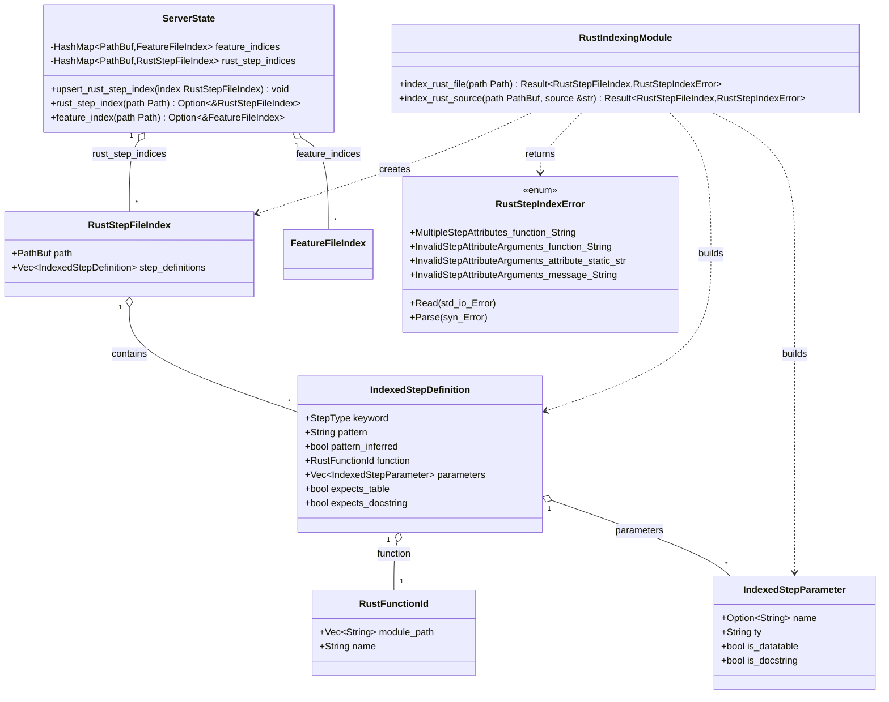

# Design document: `rstest-bdd` language server

## Introduction and goals

`rstest-bdd` is a Behaviour-Driven Development (BDD) framework for Rust,
integrating Gherkin feature files with Rust's `rstest` testing framework
([design goals](rstest-bdd-design.md#121-step-1-the-feature-file)) and a ([step
definition file](rstest-bdd-design.md#122-step-2-the-step-definition-file)).

To enhance developer experience, this document proposes a dedicated language
server (LSP) for `rstest-bdd` (to be implemented as a new crate,
`rstest-bdd-server`). This language server will be editor-agnostic and provide
rich IDE features for working with Gherkin `.feature` files and their
corresponding Rust step definitions. The LSP is built using the asynchronous
LSP framework `async-lsp`, ensuring robust, concurrent handling of language
server protocol requests.

**Key capabilities of the `rstest-bdd` language server:**

- **Go to Definition (Rust -> Feature):** Navigate from a Rust step function
  (annotated with `#[given]`, `#[when]`, or `#[then]`) to its definition in the
  Gherkin feature file[^1].

- **Go to Implementation (Feature -> Rust):** Navigate from a Gherkin step in a
  `.feature` file to the implementing Rust function[^1].

- **Diagnostics and Error Reporting:** Provide real-time (or on-save)
  diagnostics for common BDD consistency issues:

- Unimplemented feature steps (a step in a feature file with no corresponding
  Rust function)

- Unused (undeclared in feature) step functions (a Rust step definition not
  referenced by any feature)

- Signature mismatches between step definition patterns and function parameters

- Data table or scenario outline mismatches (e.g. a Gherkin example table
  column not matched by any test parameter, or a step expecting a data table
  that is missing in the feature)

By offering these features, the language server will make writing and
maintaining BDD tests in Rust more efficient and less error-prone. Developers
can quickly jump between human-readable specifications and code, and be alerted
to inconsistencies early in the development cycle. The server is designed to
work with any editor that supports LSP (initial focus: VS Code, Cursor, Zed,
Neovim), without being tied to a specific IDE – ensuring broad accessibility
and maintainability.

## Language server capabilities

### 1. Go to definition (Rust to feature)

The **Go to Definition** feature allows navigating from a Rust step
implementation to the Gherkin step definition in a `.feature` file. In
practice, when an engineer invokes "Go to Definition" on a Rust function
annotated with `#[given]`, `#[when]`, or `#[then]`, the LSP will open the
corresponding feature file and highlight the step text.

**Design Approach:** Every step definition function in Rust has an associated
*pattern string* (from its attribute) and belongs to one of the Gherkin
keywords Given/When/Then. The language server will maintain an index of all
known step definition patterns and the locations in feature files where those
patterns appear. To implement Go-to-Definition:

- When the user triggers this action on a Rust step function, the server
  retrieves the pattern string from that function's attribute (e.g.
  `"the DuckDuckGo home page is displayed"` in
  `#[given("the DuckDuckGo home page is displayed")]`). It will then look up
  all occurrences of that Gherkin step text in the project's feature files.

- If a match is found, the LSP returns the location(s) in the `.feature`
  file(s) where that step is defined. In most cases, there should be a unique
  match if scenarios are not duplicated; otherwise multiple locations may be
  presented for disambiguation.

- This feature leverages the Gherkin parser to normalize comparison (ignoring
  trivial differences like keyword or casing if needed). For parameterized
  steps, the server will use the same pattern matching logic as the runtime to
  ensure equivalence. For example, a Rust step with pattern
  `I search for "{phrase}"` will be considered a match for a feature step
  `When a user searches for "Rust programming language"`, by recognizing
  `{phrase}` as a placeholder.

**Rationale:** This mirrors the design goal in the roadmap for IDE integration,
where "Go to Definition" from Rust code should jump to the Gherkin
scenario[^2]. By using the same pattern syntax and parser as the `rstest-bdd`
macros, the navigation remains accurate and only triggers when the texts truly
correspond. (Notably, the `rstest-bdd` macros use a shared
`rstest-bdd-patterns` crate to compile step patterns into regexes so that
compile-time and runtime agree on semantics. The LSP will reuse this library to
interpret patterns, ensuring consistency with the test framework.)

### 2. Go to implementation (feature to Rust)

The **Go to Implementation** feature is the inverse navigation: from a step in
a Gherkin `.feature` file, navigate to the Rust function that implements that
step. For example, in a feature file if the user right-clicks "Then the search
results page is displayed" and chooses "Go to Implementation", the LSP should
open the Rust source file and jump to the
`#[then("the search results page is displayed")]` function.

**Design Approach:** The language server will parse feature files and identify
each step's text (and keyword). It will then map these to Rust step definitions
via pattern matching:

- On a "Go to Implementation" request, the server takes the step text under the
  cursor (for example, `Then the search results page is displayed`). It
  determines the Gherkin keyword (Given/When/Then) and the step text (possibly
  including argument placeholders).

- The server looks up the step text in the index of Rust step definitions. If
  the step text exactly matches a registered pattern, or matches via a
  placeholder/regex, the corresponding Rust function location is returned. For
  instance, a feature step
  `Then the results contain "Rust Programming Language"` would match a Rust
  step definition with pattern `#[then("the results contain \"(.*)\"")]` by
  regex matching[^3].

- In case multiple implementations exist for the same step text (which ideally
  should be avoided – duplicates would be flagged as a diagnostic), all
  matching implementations are returned to the client. The user can then choose
  the appropriate one.

- If no implementation is found, the server can respond with no location, and
  ideally also produce a diagnostic warning that this step is unimplemented.

This feature addresses the need for quickly finding where a scenario step is
implemented in code, significantly improving the BDD workflow. It aligns with
the project's plan to support editor features for jumping from `.feature` steps
to code[^1]. Using the exact same pattern matching logic as the test runtime
ensures that "Go to Implementation" only succeeds when the code truly
implements the step, preventing false positives. (The use of the shared pattern
parser ensures placeholders and regex in step definitions are handled
correctly[^4].)

### 3. Diagnostics and error reporting

The language server will continuously validate the consistency between feature
files and Rust step definitions, surfacing any issues as diagnostics (errors or
warnings) in the editor. The following diagnostic checks will be performed:

- **Unimplemented Feature Step:** If a Gherkin step in a `.feature` file has no
  corresponding Rust step function, the server will report a diagnostic on that
  line in the feature file. This mirrors the framework's compile-time check in
  the `#[scenario]` macro (which is supposed to emit a compile error if a step
  is missing an implementation[^5]). For example, if a scenario has a step
  "Given the database is empty", but no function is annotated with
  `#[given("the database is empty")]`, the LSP will highlight that step as an
  error (e.g. "No step implementation found for this step").

- **Undeclared (Unused) Step Function:** If a Rust step definition function
  (e.g. a function annotated with `#[when(...)]` or other step macros) is not
  referenced by any scenario in any feature file, the server will emit a
  warning on that function (or its attribute) indicating it is never used. This
  is similar to a dead code warning and aligns with the planned `cargo bdd`
  tooling to list unused definitions[^6]. It helps developers clean up or
  recognize mismatches (perhaps a typo in the feature text or attribute pattern
  causing the function to never be called).

- **Step Definition Pattern/Signature Mismatch:** If the pattern string in a
  step function's attribute does not align with the function's parameters, an
  error will be reported. For instance, if a step function's attribute contains
  placeholders (e.g. `{count}`), but the function signature has a different
  number of parameters or incompatible types, this is a mismatch. The
  `rstest-bdd` macros themselves enforce many of these conditions at
  compile-time. The language server will replicate these checks:

- **Placeholder count vs parameters:** The number of placeholders in the
  pattern should match the number of function parameters (excluding special
  parameters like fixtures, `datatable`, `docstring`). If they differ, the LSP
  will mark it. For example, `#[when("I do X and Y")] fn step(foo: String) {…}`
  has zero placeholders vs one parameter – a clear mismatch.

- **Type convertibility:** While the LSP cannot fully type-check Rust, it can
  warn if a placeholder has an explicit type (like `{n:i32}` in the pattern),
  but the corresponding parameter in the function is a different type or
  missing. The language server relies on the same parsing logic that
  `rstest-bdd` macros use to interpret placeholders with types[^7]. If the
  macro would fail (e.g. unknown type or no parameter), the LSP should catch
  that too. (This diagnostic is mostly to catch mistakes early; the Rust
  compiler/macros would also error in many such cases.)

- **Data Table and Scenario Outline Mismatches:** `rstest-bdd` supports Gherkin
  data tables and scenario outlines. The language server will validate their
  correct usage:

- If a step in a feature file includes an inline data table but the
  corresponding Rust step function does not accept a `datatable` parameter (or
  vice versa), that's an inconsistency. For example, a feature step:

```gherkin
When the user inputs the following credentials:
  | username | password |
  | alice    | secret   |
```

should map to a Rust step function that expects a data table parameter. If not,
the LSP will report a diagnostic that the data table is not consumed by any
step implementation. Conversely, if a step function is defined with a
`datatable` parameter, but the Gherkin step in scenarios using it have no
table, that function will never be invoked correctly (the runtime would error
as well). The LSP will warn about the missing table for that step usage.
According to the design, a missing table when one is expected triggers a
runtime error[^8], so surfacing it at edit-time is valuable.

- For **Scenario Outlines** (Examples tables): If an outline's example columns
  don't match the test function's parameters, it's an error. For instance, if a
  scenario outline has columns `<username>` and `<password>` but the Rust
  `#[scenario]` test function or its called steps only define a parameter for
  `username`, the second column is unconsumed. The macros aim to emit
  compile-time errors in such cases[^9]. The LSP will similarly flag the
  scenario outline or test definition with a diagnostic like "Column 'password'
  has no matching parameter". This ensures scenario outlines and code stay in
  sync, avoiding runtime surprises.

All diagnostics will update on file save (initial implementation) or on demand.
Catching these issues early provides immediate feedback akin to compiler
errors, but at the BDD level. This extends the robust error checking
`rstest-bdd` already strives for (e.g., compile-time feature parsing and step
existence checks[^10][^5]), into the editing experience.

## Architecture and implementation

### Overall architecture

The `rstest-bdd-server` will be a standalone LSP server binary, implemented in
Rust using **`async-lsp`**. It will run alongside the standard Rust Analyzer
(which handles general Rust language features), focusing specifically on
BDD-specific logic. This design choice aligns with the roadmap's consideration
of either extending rust-analyzer or building a dedicated extension[^2]; by
building a separate LSP, the design remains editor-agnostic and loosely coupled
to Rust Analyzer.

**Key components:**

- **LSP Frontend (async-lsp):** Manages JSON-RPC communication with the editor,
  request/response handling, and concurrency. Handlers will be implemented for
  relevant LSP requests:

- `textDocument/definition` (for Go to Definition)

- `textDocument/implementation` (for Go to Implementation)

- `textDocument/publishDiagnostics` (for pushing diagnostics on file
  changes/saves)

- plus standard initialization, shutdown, etc.

- **Feature File Parser (Gherkin):** The server uses the `gherkin` crate to
  parse `.feature` files into an abstract syntax tree (AST) or data
  structure[^10]. This allows extraction of scenarios, steps (with their text,
  line numbers, and possibly step type), and example tables. The parser handles
  Gherkin syntax (including language variations if needed, though initial focus
  is likely English by default). Each feature file parse yields:

- A list of scenario definitions (with steps, tags, etc).

- For each step: the keyword (Given/When/Then/And), the step text, and any
  attached data (docstring or table).

- **Rust Step Definition Extractor:** To find step definitions in the Rust
  code, the language server will parse the test code files. All `#[given]`,
  `#[when]`, `#[then]` attributes in the crate need to be identified. Strategy
  options include:

- Using the Rust compiler's data (like rust-analyzer's syntax tree) – however,
  integrating deeply with rust-analyzer may be complex.

- **Syn crate or Rust AST parser:** Using `syn` (or the Rust compiler AST via
  `rustc_private`) to parse Rust files and find functions annotated with the
  macros. Since `rstest-bdd` follows a fairly specific pattern (step functions
  are free functions with attributes, likely in test modules), a targeted
  search is feasible. A lightweight parse of each relevant Rust file in the
  project (for example, files in `tests/` directory or any file that
  `use rstest_bdd::{given, when, then}`) is sufficient.

- **Tree-sitter or CodeGraph:** For better incremental performance, leveraging
  a tree-sitter parser for Rust (as used by projects like CodeGraph) is an
  option. Tree-sitter can parse code incrementally as it changes, which would
  help in providing real-time diagnostics. The `codegraph-rust` crate, for
  example, uses tree-sitter to extract code entities[^11][^12]. This can
  maintain an up-to-date index of functions without re-parsing entire files
  from scratch on every edit. Initially, however, the simpler approach (full
  parse on save) may be preferable, with an incremental parser considered once
  the basic functionality is stable.

- **Step Definition Registry (in LSP):** The server will maintain an in-memory
  registry or mapping that correlates Gherkin step texts/patterns with Rust
  step functions. Conceptually, this mirrors the runtime registry that the test
  framework builds via `inventory`[^13], but constructed at analysis time. This
  registry might be represented by two maps:

- Map from **Rust step definition** (function identifier or some stable
  identifier (ID)) to its **pattern string** and source location.

- Map from **step text patterns** to one or more **Rust implementations** and
  **feature occurrences**. This helps answer queries in both directions
  (feature text to code, and code pattern to feature).

- Additionally, the registry stores any **signature metadata** (like parameter
  count, whether it expects a data table or docstring, etc.) to assist in
  diagnostics.

#### Step extraction semantics (implemented)

The first implementation indexes Rust step definitions by parsing saved `.rs`
files with `syn` and extracting free functions annotated with `#[given]`,
`#[when]`, or `#[then]`. The extractor intentionally mirrors the macro rules
documented in `docs/rstest-bdd-design.md`:

- Attribute identification matches the last segment of the attribute path, so
  both `#[when]` and `#[rstest_bdd_macros::when]` are recognized.
- The pattern string is taken from the attribute argument when present.
  Omitting the argument (for example `#[when]` or `#[when()]`) infers the
  pattern by replacing underscores in the function name with spaces. A
  whitespace-only literal (for example `#[when("   ")]`) also infers, while an
  empty string literal (`#[when("")]`) registers an empty pattern.
- The index records the function parameter list (names and tokenized types),
  plus whether the function expects a data table or doc string:
  - `datatable`: detected when the parameter is named `datatable` or has a
    `#[datatable]` parameter attribute.
  - `docstring`: detected when the parameter is named `docstring` and its type
    resolves to `String` (either `String` or `std::string::String`).

Figure: Class diagram of the Rust step indexing data structures and how they
are cached in the language server state.



**Project Structure:** The `rstest-bdd-server` crate will live in the same
workspace as `rstest-bdd`. It can depend on `rstest-bdd` or its sub-crates
(`rstest-bdd-patterns`, etc.) to reuse logic. For example, the server will use
the **`rstest-bdd-patterns`** crate to parse attribute patterns into regexes,
ensuring identical interpretation of placeholders as the macros do[^7]. It will
also use the `gherkin` crate (the same one used by the procedural macro at
compile time[^10]) to parse feature files in the LSP context.

Co-locating the server in the repository ensures it stays in sync with changes
to the `rstest-bdd` macro semantics. If new features (like localised keywords
or new step types) are added, the LSP can be updated simultaneously.

### Maintaining the index and handling file events

The language server will keep its index of steps up-to-date by responding to
LSP file events:

- **Initialization:** On startup (or when a project is opened), the server will
  scan the workspace for all `.feature` files and relevant Rust files. Likely,
  it will:

- Find all `.feature` files (e.g., under a `tests/features/` directory or
  anywhere in the crate) and parse them via the Gherkin parser.

- Find all Rust files in the project (or at least in the `tests/` module and
  possibly the main src if step definitions could live there) and scan/parse
  for step definitions.

- Populate the internal registry mapping step texts <-> code locations.

- This initial scan provides the baseline for answering queries immediately.

- **On File Save (or Change):** Initially, updates are targeted on file save (to
  balance performance). When a feature file is saved:

- Re-parse that feature file with the gherkin parser to update its scenarios
  and steps.

- Update the registry: For each step in that file, check if it matches a known
  step definition. If new steps are added, attempt to match them; if steps were
  removed or modified, adjust any diagnostics or mark previously implemented
  steps as possibly unused.

- Then recalc diagnostics for that feature file (unimplemented steps, etc.) and
  publish them.

- Also, potentially update diagnostics on related Rust files (for example, a
  step function that was previously matched to a now-removed feature step
  becomes "unused").

When a Rust file is saved:

- Parse/scan it for `#[given]/#[when]/#[then]` definitions. The implementation
  can use `syn::parse_file` to get the AST and then walk it to find functions
  with those attributes, extracting the attribute string and function signature.

- Update the registry with any new, removed, or modified step definitions. This
  includes compiling the new pattern into a regex (using `rstest-bdd-patterns`)
  to store for matching.

- Recompute diagnostics for that Rust file (signature mismatches, etc., which
  are internal to that file).

- Also update diagnostics for any feature files: if a step definition was
  removed, any feature referencing it becomes unimplemented; if a new step
  definition was added, check if it matches a feature step (if not, it might be
  unused).

- **On Feature File Open:** Optionally, the server could parse and index a
  feature file as soon as it's opened (even before save) to provide
  diagnostics. To keep initial implementation simpler, the workflow likely
  sticks to on-save. Even on open, if the file was already parsed from a
  previous save (or initial scan), its diagnostics are shown.

- **Performance consideration:** Parsing an entire crate's tests on each save
  could be expensive for large projects. However, given BDD tests are typically
  not extremely large in number, this is a reasonable starting point.
  Performance will be monitored and optimizations introduced as needed:

- Use incremental parsing for Rust via Tree-sitter or a persisted AST between
  edits (to avoid full reparse).

- Only parse the file that changed and minimal related context, rather than
  everything.

- Possibly cache the Gherkin AST of feature files and only re-read if the file
  content changed (which the LSP can track via version).

- The design explicitly considers eventually supporting real-time (on-change)
  diagnostics; evaluation will consider `rusty-ast` or `oak-rs` (if available)
  for Rust incremental ASTs, and the feasibility of keeping the Gherkin parser
  live for continuous parsing. Early focus, however, is correctness and
  completeness on save.

### Implementing "Go to definition" and "Go to implementation"

With the registry in place, handling the LSP requests is straightforward:

- **textDocument/definition (for Rust -> Feature):** The LSP gets the position
  in a Rust file. The handler determines whether the symbol under the cursor is
  a step function (possibly restricting this to when the cursor is on the
  attribute or function name of a step definition). If so, the handler
  retrieves that function's pattern string from the index, then looks up all
  feature file locations that contain a matching step. Because the index maps
  patterns to feature locations (possibly precomputed, or via a quick search
  through parsed feature ASTs), the handler gathers the target locations. The
  response is one or multiple `Location` objects pointing to the `.feature`
  file Uniform Resource Identifier (URI) and range of the step text. If the
  function's pattern is not found in any feature, the response is empty (and
  this situation would likely also trigger an "unused step" warning separately).

- The search for a matching feature step will use the pattern's regex if it
  contains placeholders. For exact literal patterns (no parameters), a direct
  string match is sufficient. For patterns with regex or type placeholders, the
  stored regex runs against each candidate step text (or uses an indexed
  approach if performance requires).

- If multiple scenarios across feature files use the same step text, all are
  returned so the user can pick the relevant one.

- **textDocument/implementation (for Feature -> Rust):** The LSP gets the
  position in a feature file. The handler first ensures the position
  corresponds to a step line in the Gherkin AST (the parser output identifies
  which lines are steps). It retrieves the full step text (without the leading
  keyword, which might be needed or not depending on how patterns were
  normalised). Then the registry is consulted to find any step definition whose
  pattern matches this text:

- Each pattern is likely stored as a compiled regex or a structured pattern.
  Matching attempts run the feature's step text against each pattern of the
  same keyword category. Grouping patterns by keyword (Given/When/Then) helps,
  because a "Then …" step should only match a `#[then]` function, etc., but
  `And` can match the previous step's keyword category.

- If a match is found, the handler returns the `Location` of the Rust function
  (file and line). If multiple matches exist (which could indicate duplicate
  definitions for the same step text), all are returned. If none match, the
  result is empty – and likely the diagnostics system already marked this step
  as unimplemented.

Both requests leverage the *same source of truth* for pattern matching as the
runtime. The design decision to reuse the `rstest-bdd-patterns` and `regex`
logic ensures that if a step text would match a function during test execution,
the LSP will also recognize it, and vice versa. This prevents scenarios where
the LSP might mistakenly link a step to a function that the test framework
would not actually use.

### Diagnostics implementation details

Diagnostics are produced by cross-referencing the feature and code indices:

- **Unimplemented Step (Feature->Code):** After parsing feature files, for each
  step in each scenario, the diagnostic pass tries to find at least one
  matching Rust step definition in the registry. If none is found, a diagnostic
  is recorded on that step's location in the feature file (likely as an error).
  This check runs for all steps, or optimization can mark steps as resolved as
  they are matched. This logic parallels what the `#[scenario]` macro does at
  compile time — reading the feature and ensuring a matching step exists[^5].
  Unlike the macro, the LSP can also catch steps in feature files that *aren't*
  currently bound by any `#[scenario]` macro (for example, if a feature file
  exists but no Rust test references it yet). Those steps would never run, but
  the LSP can still inform the user that "This step is not implemented" so they
  know to write a code function for it or remove it.

- **Unused Step Definition (Code->Feature):** After scanning all feature files,
  the registry indicates which step patterns are actually used. The analyser
  then iterates through all registered Rust step definitions and checks if each
  was matched to at least one feature step. Any that were not matched are
  marked with a warning diagnostic at the function (e.g. on the `#[given]`
  attribute line) indicating it appears to be unused. This is analogous to the
  planned `cargo bdd list-unused` tool[^6], but in real-time. It helps catch
  situations like a typo in the Gherkin text or in the attribute pattern that
  prevents the linkage.

- **Pattern/Signature Mismatch:** When parsing a Rust step function, the server
  will perform checks similar to the macro's checks:

- Count placeholders vs function parameters (excluding fixture parameters and
  special `datatable`/`docstring`). If mismatched, emit an error on the
  attribute or function signature. (The macros ensure that if placeholders
  don't match parameters, a compile error or runtime error will occur; the LSP
  replicates that as an LSP diagnostic for immediate feedback.)

- Verify that if the function expects a `datatable` parameter or `docstring`,
  the pattern should allow those (in Gherkin, a data table or docstring isn't
  part of the step text pattern but an attached structure). The LSP cannot
  infer from the pattern alone, but it can ensure, for example, that at most
  one `datatable` parameter is present and that the feature actually supplies a
  table for steps known to use this function. If a `datatable` parameter is
  present in a step function, and some scenario uses that step text without a
  table, either the feature or the code is flagged. However, this might better
  be flagged as "unimplemented table" at the feature side. Similarly, if a
  feature step always provides a table, but the function signature has no table
  parameter, that is effectively an unimplemented part – the feature step can
  be flagged as having no matching signature (or the code as missing a
  `datatable` parameter).

- For scenario outlines: when the LSP parses a scenario outline with parameters
  `<...>`, it can check the corresponding `#[scenario]` test function (if one
  exists for that feature scenario) to ensure the parameters align. If a
  mismatch is found (extra column or missing column vs test function
  arguments), either the feature file or the test function can be annotated.
  The design suggests the macro emits errors listing available parameters for
  mismatches[^9]; the LSP can do similarly. Since linking a scenario outline to
  its test function requires knowing which test corresponds (the `#[scenario]`
  macro call includes the feature path and an index/name[^14]), the server can
  use that to identify the test function and compare parameters.

All diagnostics computations will be triggered on changes. Initially, this runs
on file save events for performance. This means as a user edits, they might not
see errors until they save the file (or manually trigger a refresh). This is
acceptable for a first iteration, as it mirrors compile-time checks (which
happen on save/compile). However, one design consideration is moving towards
real-time diagnostics. By evaluating tools like `tree-sitter` or a persistent
AST, diagnostics could be updated on each keystroke without re-parsing entire
files, making the feedback truly immediate. Feasibility will be assessed before
integrating such a solution:

- **Rust incremental AST:** Using something like `tree-sitter` (possibly via
  CodeGraph or similar), the server could maintain a parse tree of Rust files
  as they change. The overhead of tree-sitter is low and it can update the
  syntax tree incrementally. That tree could then be queried for nodes that
  represent function definitions with the step attributes, rather than
  re-running `syn::parse_file`. This would bring the implementation closer to
  real-time detection of new or changed step definitions.

- **Gherkin parser performance:** The `gherkin` crate likely does a full parse
  of a file. Gherkin files are usually not extremely large, so parsing on each
  change might be acceptable, but if needed a Gherkin grammar could also be
  integrated into tree-sitter (there are tree-sitter grammars for Gherkin in
  various languages) for incremental parsing. For now, on-save reparse of the
  feature file is sufficient.

In summary, the diagnostics engine ensures that the state of the BDD
specification (feature files) and implementation (Rust code) remains
consistent. Many of these checks are analogous to what the `rstest-bdd` macros
and runtime do (or will do) at compile/run time, but the LSP provides them
earlier in the development flow. This immediate feedback loop will greatly
improve the developer experience (a focus of Phase 5 and 6 in the
roadmap[^15][^2]).

## Editor integration and usage

The `rstest-bdd` language server is an **editor-agnostic** tool conforming to
the Language Server Protocol. This means it can be used in any environment that
supports LSP. Anticipated usage includes:

- **Visual Studio Code:** via a simple extension configuration that launches
  `rstest-bdd-server` for Rust projects that use `rstest-bdd`. The extension
  can activate on detection of `.feature` files or the dependency in
  `Cargo.toml`.

- **Cursor, Zed, Neovim, etc.:** These editors can be configured to start the
  server on opening a Rust workspace. Because the server does not depend on VS
  Code-specific APIs, integration is straightforward.

- **Alongside Rust Analyzer:** Typically, Rust projects will also run
  `rust-analyzer`. The LSP is complementary: rust-analyzer will handle Rust
  compilation, type checking, autocompletion, etc., while `rstest-bdd-server`
  handles cross-references between Gherkin and Rust. Both can run concurrently.
  The implementation aims to keep server operations (parsing, etc.) efficient
  enough to avoid noticeably lagging the editor.

**Project setup:** The server assumes that feature files and step definitions
reside in the same crate (as per the project assumption). It will locate the
crate root (by finding `Cargo.toml` of the opened workspace) to resolve
relative paths. Notably, the `#[scenario]` attribute in code specifies the path
to the feature file relative to crate root[^14]. The server can use this to
double-check it is opening the correct feature file, and even to infer
relationships (e.g., if a scenario macro refers to `features/foo.feature`, the
server knows to link that test function to that file's steps). Ensuring the
crate root is known also helps in reading files (standard Rust file IO or
perhaps `cargo metadata` will be used if needed to get workspace layout).

**Editor Features:** Once running, the language server will provide:

- Navigation: Users can Ctrl+Click (or equivalent) on a step in a feature to
  jump to code, or on a step function in code to jump to the feature.

- Hover or Completion (future considerations): While not in the initial spec,
  the design opens possibilities for hover tooltips (e.g., hovering over a step
  in a feature could show which function implements it, or vice versa), and
  auto-completion (suggesting existing step texts while editing a feature file,
  to avoid duplication or typos). These are considered future enhancements.

- Diagnostics appear in the editor's Problems panel and inline underlines, just
  like compiler errors, making it clear where inconsistencies lie.

## Future work and enhancements

This design document outlines the initial implementation focusing on
go-to-definition, go-to-implementation, and diagnostics. Potential follow-up
features include:

- **Auto-completion of Steps:** As mentioned, when writing a new step in a
  `.feature` file, the LSP could suggest existing step definition texts as the
  user types (especially after typing the keyword). This can prevent duplicate
  step definitions and typos. This requires the LSP to offer completion items
  based on its registry of known patterns.

- **Refactoring Support:** If a step text is changed in a feature file, the
  server could potentially assist in updating the attribute string in the Rust
  code (and vice versa) to keep them in sync. This is more advanced and might
  involve editor-specific actions or a specialized code action.

- **Enhanced Real-time Diagnostics:** Depending on the performance of the
  chosen parsing approach, the roadmap will work toward real-time (on-change)
  diagnostics. This could involve deeper integration with the Rust Analyzer's
  live analysis (perhaps via a rust-analyzer plugin architecture) or continued
  optimization of the parsing approach. The goal is to provide immediate
  feedback without waiting for file saves, if possible.

- **Multi-crate or Workspace Support:** Currently the design assumes one crate.
  In future, if step definitions and features could be split (for example, a
  library crate providing step implementations and a separate test crate with
  features), the LSP might need to handle cross-crate references. This would
  entail reading multiple Cargo targets. The design keeps this in mind by not
  hard-coding assumptions beyond the crate root paths.

- **Leverage `cargo bdd` outputs:** The `cargo bdd` subcommand (if and when
  it's implemented with features like `list-steps`, etc.[^15]) could be
  harnessed by the LSP for double-checking its own index or even populating it.
  For example, running `cargo bdd list-steps --json` might give a ground truth
  of all step definitions registered in a fully compiled test binary. However,
  running that on the fly is heavyweight. Still, for verification or maybe a
  manual command, it might be integrated.

## Implementation status

### Phase 1: Server scaffolding (completed)

The initial implementation delivers the foundational server infrastructure:

**Crate structure:**

- `rstest-bdd-server` library crate with public API for embedding
- `rstest-bdd-lsp` binary that runs the server over stdin/stdout

**Modules implemented:**

- `config` - Environment variable parsing (`RSTEST_BDD_LSP_LOG_LEVEL`,
  `RSTEST_BDD_LSP_DEBOUNCE_MS`) with typed configuration struct
- `error` - Unified error types using `thiserror` for LSP operations
- `logging` - Tracing subscriber setup with configurable log levels
- `discovery` - Workspace discovery via `cargo metadata`, feature file
  enumeration
- `server` - Server state management and capability declarations
- `handlers/lifecycle` - LSP `initialize`, `initialized`, and `shutdown`
  handlers

**Technology choices:**

- **async-lsp** for the LSP protocol implementation with Tower service layers
- **tracing/tracing-subscriber** for structured logging to stderr
- **cargo_metadata** for workspace introspection
- **lsp-types** for LSP type definitions

**Capabilities declared:**

The server advertises `textDocumentSync` so it can receive save notifications
and keep an internal index of `.feature` files up to date. The server also
advertises `definitionProvider` for Rust-to-feature navigation.
`implementationProvider` will be added when feature-to-Rust navigation is
implemented.

**Testing:**

- Unit tests cover configuration parsing, error formatting, workspace
  discovery, and lifecycle handlers
- Unit tests cover the `.feature` indexing pipeline, ensuring steps,
  DocString, data tables, and Examples table header cell offsets are captured
  as byte offsets
- Behavioural tests cover the `textDocument/didSave` workflow, validating that
  saving a `.feature` file updates the in-memory index
- Tests use temporary directories and fixture workspaces to validate discovery
  logic

**Index spans and offsets:**

The indexing pipeline uses `gherkin::Span` as the canonical byte offset model
for step lines and data tables. The upstream `gherkin` AST does not currently
expose spans for DocString blocks or per-cell Examples table header cell
offsets, so the server derives those byte offsets by scanning the raw feature
text:

- DocString: locate the opening fence line (triple quotes or triple
  backticks), then capture the block through the closing fence line.
- Examples table header cells: the server parses the first table-row line
  inside the Examples block and computes spans for each header cell from the
  text between pipe separators.

**Step pattern compilation and registry:**

Rust step patterns are compiled using `rstest-bdd-patterns` so the language
server uses the same placeholder and regex semantics as the runtime and macro
crates. The server stores the resulting compiled regex matchers in an in-memory
registry keyed by the step keyword (`Given`, `When`, `Then`) and updated
incrementally on `textDocument/didSave` for Rust sources:

- When a Rust file is re-indexed, the registry first invalidates the existing
  compiled entries for that file path and then inserts the newly compiled steps.
- Compilation failures are logged, and the failing patterns are skipped, so a
  single invalid pattern does not prevent indexing other steps in the same file.

### Phase 2: Navigation handlers (completed)

**Go to Definition (Rust → Feature):**

The `textDocument/definition` handler enables navigation from Rust step
functions to matching feature steps. When the cursor is on a function annotated
with `#[given]`, `#[when]`, or `#[then]`, the handler returns all matching
feature step locations.

**Implementation approach:**

- The handler receives a position in a Rust file and determines if it
  corresponds to a step function by matching line numbers against the indexed
  step definitions.
- Each `IndexedStepDefinition` now includes a `line` field (0-based) captured
  from the `syn` AST during indexing.
- The `CompiledStepDefinition` in the registry also stores this line number for
  position matching.
- Matching is keyword-aware: a `#[given]` step only matches `Given` steps in
  feature files (the `gherkin` parser resolves `And`/`But` to their contextual
  step type).
- Pattern matching uses the compiled regex from `rstest-bdd-patterns`, ensuring
  consistency with the runtime.

**Span conversion:**

The handler converts `gherkin::Span` (byte offsets) to `lsp_types::Range`
(0-based line/column) by scanning the source text. A utility module
(`handlers/util.rs`) provides `gherkin_span_to_lsp_range()` for this purpose.
The inverse function `lsp_position_to_byte_offset()` converts LSP positions
back to byte offsets for feature file position matching.

**Testing:**

- Unit tests in `handlers/definition.rs` cover position matching and keyword
  filtering.
- Behavioural tests in `tests/definition_navigation.rs` verify end-to-end
  navigation, including parameterized patterns and multiple matches.

**Go to Implementation (Feature → Rust):**

The `textDocument/implementation` handler enables navigation from feature steps
to matching Rust implementations. When the cursor is on a step line in a
`.feature` file, the handler returns all matching Rust function locations.

**Implementation approach:**

- The handler receives a position in a feature file and determines if it
  corresponds to a step by converting the LSP position to a byte offset and
  finding the `IndexedStep` whose span contains that offset.
- The compiled step registry is queried by keyword (Given/When/Then) to find
  candidate implementations.
- Each candidate's compiled regex is tested against the feature step text.
- Matching is keyword-aware: a `Given` step in a feature file only matches
  `#[given]` implementations in Rust.
- If multiple implementations match (duplicate step patterns), all locations
  are returned, allowing the editor to present a choice.

**Testing:**

- Unit tests in `handlers/implementation.rs` cover feature file detection,
  position-to-step resolution, and keyword filtering.
- Behavioural tests in `tests/implementation_navigation.rs` verify end-to-end
  navigation, including parameterized patterns, duplicate implementations, and
  keyword matching.

### Diagnostics (on save)

> Status: Implemented

The language server publishes diagnostics when files are saved, identifying
consistency issues between feature files and Rust step definitions.

**Implementation details:**

- A new `handlers/diagnostics.rs` module provides diagnostic computation and
  publishing functions.
- `ServerState` stores the `ClientSocket` to send `publishDiagnostics`
  notifications.
- After indexing a feature file, diagnostics for unimplemented steps are
  computed and published.
- After indexing a Rust file, diagnostics for all feature files are recomputed
  (since step definition changes may affect which feature steps are
  implemented), and unused step definition diagnostics are computed for the
  saved Rust file.

**Diagnostic types:**

1. **Unimplemented feature steps** (`unimplemented-step`): Warning diagnostic
   on steps in `.feature` files that have no matching Rust implementation. The
   message format is: `No Rust implementation found for Given step: "step text"`

2. **Unused step definitions** (`unused-step-definition`): Warning diagnostic
   on Rust functions annotated with `#[given]`, `#[when]`, or `#[then]` that
   are not matched by any feature step. The message format is:
   `Step definition is not used by any feature file: #[given("pattern")]`

3. **Placeholder count mismatch** (`placeholder-count-mismatch`): Warning
   diagnostic on Rust step definitions where the number of placeholder
   occurrences in the pattern differs from the number of step arguments in the
   function signature. Each placeholder occurrence is counted separately, and
   `datatable`, `docstring`, and fixture parameters are excluded.

4. **Data table expected/not expected** (`table-expected`,
   `table-not-expected`): Warning diagnostics when a step expects a data table,
   but the feature step does not provide one, or when a feature step provides a
   data table, but the implementation does not expect one.

5. **Doc string expected/not expected** (`docstring-expected`,
   `docstring-not-expected`): Warning diagnostics when a step expects a doc
   string, but the feature step does not provide one, or when a feature step
   provides a doc string, but the implementation does not expect one.

6. **Missing Examples column** (`example-column-missing`): Warning diagnostic
   on steps in a Scenario Outline that use a placeholder (e.g., `<count>`) with
   no matching column header in the Examples table. The message includes the
   list of available columns.

7. **Surplus Examples column** (`example-column-surplus`): Warning diagnostic
   on Examples table column headers that are not referenced by any step
   placeholder in the Scenario Outline.

**Matching algorithm:**

- For each feature step, the server queries the registry for compiled step
  definitions with the same keyword (Given/When/Then) and tests whether the
  step text matches any of the compiled regex patterns.
- For each Rust step definition, the server iterates all feature indices and
  checks if any step with the matching keyword is matched by the definition's
  regex.

**Testing:**

- Unit tests in `handlers/diagnostics.rs` cover diagnostic computation,
  keyword matching, parameterized patterns, and message formatting.
- Behavioural tests in `tests/diagnostics.rs` verify end-to-end diagnostic
  generation including multiple feature files and cross-file dependency
  scenarios.

### Phase 7.5: Packaging and editor enablement (completed)

**CLI options:**

The `rstest-bdd-lsp` binary accepts the following command-line flags, which
take precedence over environment variables:

| Flag               | Description                                            | Default |
| ------------------ | ------------------------------------------------------ | ------- |
| `--log-level`      | Logging verbosity (trace, debug, info, warn, error)    | `info`  |
| `--debounce-ms`    | Delay (ms) before processing file changes              | `300`   |
| `--workspace-root` | Override workspace root path; bypasses LSP client root | (auto)  |

Configuration precedence: Default → Environment variables → CLI flags.

The `--workspace-root` flag acts as a hard override: when provided, it replaces
the LSP client's `root_uri` and `workspace_folders` for workspace discovery.
This is useful when the editor sends incorrect paths, during headless testing,
or when the project layout does not match Cargo workspace conventions.

**Zed editor integration:**

Zed uses its extension system to register language servers. The binary can be
configured via Zed's `settings.json`:

```json
{
  "lsp": {
    "rstest-bdd-lsp": {
      "binary": {
        "path": "rstest-bdd-lsp",
        "arguments": ["--log-level", "info"]
      }
    }
  },
  "languages": {
    "Rust": {
      "language_servers": ["rust-analyzer", "rstest-bdd-lsp", "..."]
    }
  }
}
```

Diagnostics and navigation require saving files to trigger indexing.

**Smoke tests:**

End-to-end smoke tests verify the server binary by starting it as a child
process, sending JSON-RPC messages (initialise, `didSave`, definition request),
and asserting correct responses and diagnostics. Three smoke tests validate:

1. Initialise/shutdown lifecycle with capability verification.
2. Definition request returning correct feature file locations.
3. Diagnostic publication for unimplemented feature steps.

These tests run as part of the standard CI pipeline (`make test`) and use
`--debounce-ms 0` to eliminate indexing delay.

### Next phases

The initial diagnostics implementation is now complete. Potential future
enhancements include:

1. **Real-time diagnostics** — Update diagnostics on each keystroke rather than
   only on file save, possibly using Tree-sitter for incremental parsing.
2. **Quick fixes** — Provide code actions to generate missing step definitions
   or add missing Examples columns.

## Conclusion

The `rstest-bdd` language server will significantly improve the developer
experience for BDD-style testing in Rust. By providing cross-navigation between
Gherkin and Rust and early detection of mismatches, it closes the feedback loop
envisioned in the `rstest-bdd` project's design. Implementing it as a
standalone, async LSP server ensures it remains modular and editor-independent,
aligning with modern Rust tooling practices. By building on existing crates
like `gherkin` for parsing and reusing the `rstest-bdd` framework's own pattern
logic[^7], this approach guarantees consistency between what developers see in
their IDE and what happens at compile/test time. This design lays out a clear
path to deliver the three core capabilities, with an eye toward future
enhancements like auto-complete and deeper integration.

Ultimately, the `rstest-bdd-server` will make writing BDD tests in Rust as
seamless as writing regular Rust tests, fulfilling the promise of uniting
high-level feature specs with low-level test code in one unified workflow.

**Sources:**

- [`rstest-bdd` Design Document](rstest-bdd-design.md)
- [`rstest-bdd` Project Roadmap](roadmap.md)

[^1]: <https://github.com/leynos/rstest-bdd/blob/969d40a366c08cb385f108734c9ea42928e9bde2/docs/roadmap.md#L364-L368>
[^2]: <https://github.com/leynos/rstest-bdd/blob/969d40a366c08cb385f108734c9ea42928e9bde2/docs/roadmap.md#L362-L368>
[^3]: <https://github.com/leynos/rstest-bdd/blob/969d40a366c08cb385f108734c9ea42928e9bde2/docs/rstest-bdd-design.md#L142-L150>
[^4]: <https://github.com/leynos/rstest-bdd/blob/969d40a366c08cb385f108734c9ea42928e9bde2/docs/rstest-bdd-design.md#L586-L593>
[^5]: <https://github.com/leynos/rstest-bdd/blob/969d40a366c08cb385f108734c9ea42928e9bde2/docs/roadmap.md#L119-L122>
[^6]: <https://github.com/leynos/rstest-bdd/blob/969d40a366c08cb385f108734c9ea42928e9bde2/docs/roadmap.md#L334-L338>
[^7]: <https://github.com/leynos/rstest-bdd/blob/969d40a366c08cb385f108734c9ea42928e9bde2/docs/rstest-bdd-design.md#L2-L5>
[^8]: <https://github.com/leynos/rstest-bdd/blob/969d40a366c08cb385f108734c9ea42928e9bde2/docs/rstest-bdd-design.md#L564-L572>
[^9]: <https://github.com/leynos/rstest-bdd/blob/969d40a366c08cb385f108734c9ea42928e9bde2/docs/rstest-bdd-design.md#L48-L56>
[^10]: <https://github.com/leynos/rstest-bdd/blob/969d40a366c08cb385f108734c9ea42928e9bde2/docs/roadmap.md#L43-L50>
[^11]: <https://lib.rs/crates/codegraph-rust#:~:text=codegraph,>
[^12]: <https://glama.ai/mcp/servers/@Jakedismo/codegraph-rust/blob/5ecff3e63528ef3931bda96fc510cd11e9287de5/crates/codegraph-parser/src/languages/rust.rs#:~:text=CodeGraph%20CLI%20MCP%20Server%20,derive%28Default%2C%20Clone%29%5D%20struct>
[^13]: <https://github.com/leynos/rstest-bdd/blob/969d40a366c08cb385f108734c9ea42928e9bde2/docs/rstest-bdd-design.md#L554-L562>
[^14]: <https://github.com/leynos/rstest-bdd/blob/969d40a366c08cb385f108734c9ea42928e9bde2/docs/rstest-bdd-design.md#L529-L537>
[^15]: <https://github.com/leynos/rstest-bdd/blob/969d40a366c08cb385f108734c9ea42928e9bde2/docs/roadmap.md#L330-L338>
